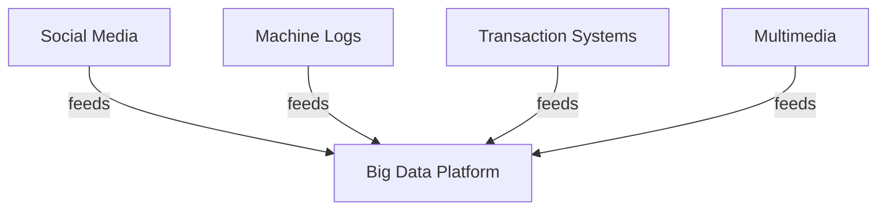
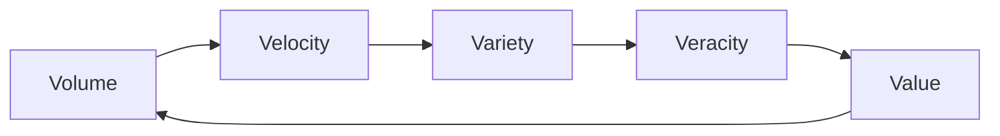
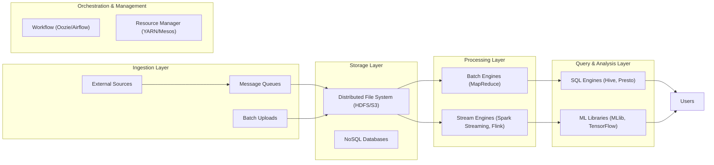
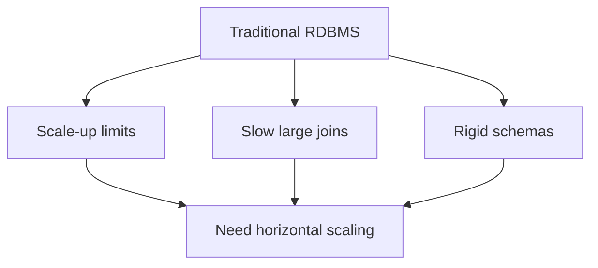
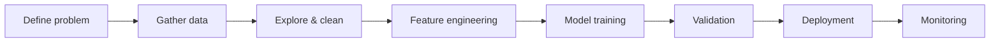
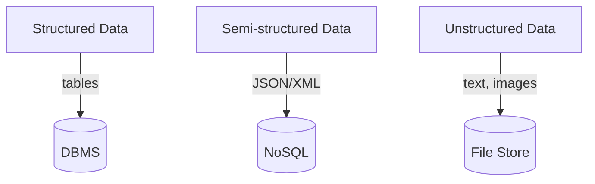
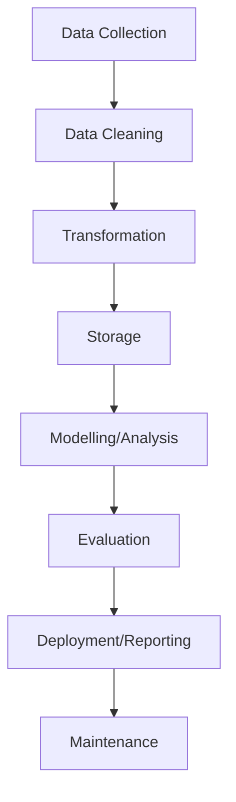
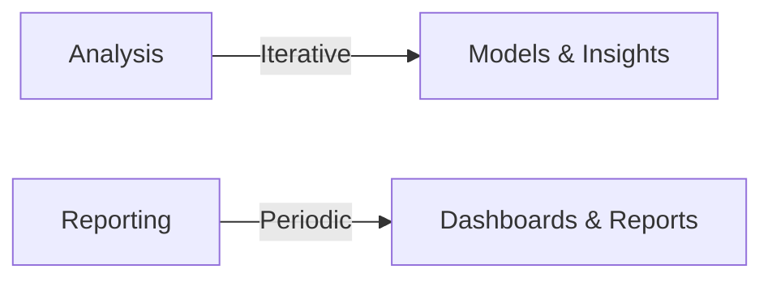

# Unit I: Introduction to Big Data (English)

### Topics
1. [Introduction to Big Data](#1-introduction-to-big-data)
2. [Introduction to Big Data Platform](#2-introduction-to-big-data-platform)
3. [Challenges of Conventional Systems](#3-challenges-of-conventional-systems)
4. [Intelligent Data Analysis](#4-intelligent-data-analysis)
5. [Nature of Data](#5-nature-of-data)
6. [Analytic Processes and Tools](#6-analytic-processes-and-tools)
7. [Analysis vs Reporting](#7-analysis-vs-reporting)

## 1. Introduction to Big Data

Big Data is not just a buzzword; it describes datasets whose size, speed of creation, and structural complexity exceed the capabilities of conventional database systems and analytics tools. The term began to gain traction in the late 2000s when organizations such as Google, Yahoo, and Facebook started collecting petabytes of user behaviour logs, sensor readings, and social interactions. At the core is an acknowledgement that data is now being generated by people, machines and processes at unprecedented rates.

### Why the shift matters

Traditional relational database management systems (RDBMS) were designed for transactional applications with clearly defined schemas and moderate volumes of data. They assume that data fits neatly into tables of rows and columns and that transactions can be completed on a single machine within milliseconds. With the explosion of web traffic, mobile sensors, multimedia and connected devices, organisations quickly ran into problems – single servers became bottlenecks, schema modifications were painful, and storage costs skyrocketed.

A genome sequencing project, for instance, may generate dozens of terabytes of raw reads in a single experiment. A high-energy physics experiment like those at CERN produces petabytes per day. Processing this magnitude of information for analytics, search or machine learning requires new architectural patterns that distribute both storage and computation.

### Data sources and examples

- **Social media** – Platforms such as Twitter, Facebook and Instagram generate millions of posts, comments, likes and shares every minute. Sentiment analysis, trend detection and targeted advertising rely on ingesting this fire‑hose of text and media.
- **Machine‑generated logs** – Web servers record every HTTP request, IoT sensors stream temperature and pressure readings, and mobile applications emit usage metrics. A typical e‑commerce site might produce tens of gigabytes of clickstream data each hour.
- **Transaction systems** – Retail point‑of‑sale terminals, ATM networks, and online payment gateways handle millions of transactions daily. Fraud detection systems often evaluate each transaction in real time against historical patterns stored in big data systems.
- **Multimedia** – Surveillance cameras, smartphone videos, and medical imaging devices generate vast quantities of images and video. A single 4K movie can exceed 100 GB; streaming services store metadata for every frame to support search and personalised recommendations.

### Characteristics (The 5 Vs)

1. **Volume** – Data is measured in terabytes, petabytes, exabytes and beyond. For example, Walmart’s database processes over 2.5 petabytes of data every hour. Scientific facilities like the Large Hadron Collider record several petabytes of data per year.

2. **Velocity** – New data arrives quickly and sometimes must be acted upon instantaneously. Credit‑card processors evaluate transactions in milliseconds to block fraudulent charges. Sensor networks in smart cities stream readings every second to monitor traffic, air quality and utilities.

3. **Variety** – Data comes in many forms:
   - *Structured*: Fixed‑schema tables such as CSV or SQL databases.
   - *Semi‑structured*: JSON, XML, or log files where records may have different fields.
   - *Unstructured*: Text documents, emails, images, audio, and video.

   A modern data lake often contains all three. For instance, an online retailer might store customer profiles in a relational database, activity logs in JSON, and product images and videos on an object store.

4. **Veracity** – Data quality is uneven. Sensor drift, duplicate entries, malicious inputs and spam all contribute to uncertainty. Poor veracity can lead to wrong conclusions; therefore, data validation, cleansing and provenance tracking are critical.

5. **Value** – The ultimate goal is to derive business value from data, whether through cost savings, revenue generation, risk reduction or user engagement. Value is only realized when raw data is transformed into actionable insight.

> **Illustrative example:** Twitter produces over 500 million tweets daily (volume) at rates of tens of thousands per second (velocity). Each tweet may contain text, images, or video (variety), and spam or bot posts reduce data veracity. Companies analyse this stream to identify trending topics and tailor advertising (value).

## 2. Introduction to Big Data Platform

To manage and analyse Big Data efficiently, organisations build platforms composed of multiple interoperating layers. A single-node database would collapse under the volume, so platforms employ clusters of inexpensive commodity servers with distributed storage and processing.

### Core layers and components

- **Distributed Storage**: Data is partitioned into blocks or objects and replicated across multiple nodes for fault tolerance and throughput. HDFS (Hadoop Distributed File System) stores data in 128 MB blocks; if a node fails, another replica serves the data. In cloud environments, object stores like Amazon S3 or Google Cloud Storage provide similar scaling and durability without managing the underlying hardware.

- **Processing Frameworks**:
  - *MapReduce* was the pioneering model, breaking jobs into map and reduce phases. Each phase runs parallel tasks across the cluster, writing intermediate results to disk.
  - *Spark* introduced in‑memory computation, drastically reducing runtime for iterative algorithms. It supports multiple abstractions: RDDs, DataFrames, Datasets and GraphX for graph processing. Spark’s streaming API and structured streaming allow near‑real‑time processing.
  - *Flink* and *Storm* focus on low-latency stream processing with event time semantics.

- **Data Ingestion Tools**:
  - *Kafka* is a distributed, partitioned log that retains messages for configurable periods. Producers write events to topics and consumers read them asynchronously.
  - *Flume* specialises in high‑throughput log collection with built‑in sinks for HDFS or HBase.
  - *NiFi* provides a GUI‑based dataflow engine with features for routing, transformation and back‑pressure management.

- **Query Engines**:
  - *Hive* translates SQL queries into MapReduce, Tez or Spark jobs, making it easier for analysts familiar with SQL to query big datasets.
  - *Presto* (now Trino) and *Impala* are MPP (massively parallel processing) engines offering faster ad‑hoc query performance by keeping data in memory and bypassing the Hadoop stack.

- **Workflow Orchestration**:
  - *Oozie* originally targeted Hadoop jobs with XML‑based workflows.
  - *Airflow* uses Python DAGs (directed acyclic graphs) and has become popular due to its extensibility and rich user interface.

- **Resource Management**:
  - *YARN* (Yet Another Resource Negotiator) schedules containers for various frameworks on Hadoop clusters.
  - *Mesos* and *Kubernetes* provide more general-purpose resource orchestration, enabling multi‑tenant clusters.

> **Real‑World Scenario:** An online retailer operates a Kafka cluster that ingests clickstream events from every page visit. These events are written in hourly partitions to HDFS. A nightly Spark batch job aggregates customer sessions, computes metrics such as average time on page and conversion rate, and writes the results to a Hive table. A data scientist accesses that table from a Jupyter notebook to train a collaborative filtering recommendation model. Once validated, the model is exported to a serving layer, which personalizes each user’s homepage during their next session.

## 3. Challenges of Conventional Systems

Relational database management systems (RDBMS) such as Oracle, MySQL or SQL Server were designed with ACID (Atomicity, Consistency, Isolation, Durability) guarantees and normalized schemas. While excellent for transactional workloads, they face several obstacles in big data contexts.

- **Scalability** – RDBMS scale vertically: add more CPU cores, RAM or faster disks to one machine until hardware limits are reached. In contrast, big data workloads require horizontal scaling across thousands of machines. Distributed file systems and processing engines handle node failures and rebalancing, but migrating legacy applications is non‑trivial.

- **Performance** – Complex analytical queries involving joins and aggregates on multi‑terabyte tables can take hours on a single server. Columnar storage, partitioning and indexing help, but the IO demands often exceed what a single machine can deliver. By distributing computation, frameworks like Spark reduce query time dramatically, though they incur network overhead.

- **Schema Rigidity** – Traditional databases demand a fixed schema defined before data insertion. Altering a schema (e.g., adding a column) may require an expensive table rewrite. Big data sources, such as logs or JSON feeds, frequently evolve; new fields appear and old ones disappear. Schema‑on‑read systems allow storing raw data and applying schemas when reading.

- **Cost** – Licensing fees for enterprise RDBMS are significant. Coupled with the need for high‑end servers, total cost of ownership scales poorly. Commodity hardware clusters running open‑source big data software offer a lower cost point for petabyte‑scale storage and processing.

- **Data Variety** – Relational tables excel at structured data but struggle with unstructured content. Images, videos, audio, PDFs and JSON documents either need to be stored as BLOBs or handled separately, creating integration challenges.

- **Latency** – Traditional ETL workflows batch data overnight. For use cases like recommender systems, fraud detection, or operational dashboards that require fresh data, this delay is unacceptable. Stream processing and incremental updates are necessary.

> **Example:** A bank uses an RDBMS to store customer records and transaction history. When the fraud team attempts to correlate millions of transaction logs with customer profiles to detect anomalies, query runtimes explode and the operational database becomes sluggish. The data must be migrated to a Hadoop cluster or a cloud-based data lake where specialized analytics can run without impacting the core banking system.

## 4. Intelligent Data Analysis

Intelligent data analysis involves extracting insights from data using statistical methods, machine learning algorithms and domain expertise. It is the bridge between raw data and decision‑making.

### Categories of analysis

- **Descriptive** – Focuses on summarizing past data. Techniques include summary statistics, histograms and dashboards. For example, a telecommunications company might report monthly churn rates and average revenue per user.

- **Diagnostic** – Aims to understand causes. Analysts drill down into data to identify patterns or anomalies. For instance, investigating why a marketing campaign underperformed might reveal that certain customer segments were oversaturated with emails.

- **Predictive** – Uses historical data to forecast future events. Regression models, decision trees, and neural networks fall into this category. A retailer predicting next‑week demand for each product is a predictive problem.

- **Prescriptive** – Recommends actions based on predictions. It often involves optimization algorithms or reinforcement learning. A supply‑chain system deciding reorder quantities to minimize cost and avoid stockouts exemplifies prescriptive analytics.

### Common techniques

- **Data mining** – Automated discovery of patterns such as association rules (e.g., customers who buy bread often buy butter) or frequent itemsets.
- **Classification** – Supervised learning where the goal is to assign labels. Email spam filters, credit scoring models and medical diagnosis systems all rely on classification algorithms like Naive Bayes, support vector machines (SVM), or gradient boosting.
- **Regression** – Predicting numeric values. Linear regression might estimate housing prices based on square footage and location; time‑series regression forecasts stock prices.
- **Clustering** – Unsupervised grouping of data points. Retailers cluster customers by purchasing behaviour to identify segments for targeted offers. Popular algorithms include k‑means, DBSCAN, and hierarchical clustering.
- **Dimensionality reduction** – Simplify data with many features. Principal Component Analysis (PCA) reduces noise and makes visualization possible; t‑SNE is used to plot high‑dimensional data in two or three dimensions.
- **Deep learning** – Neural networks with multiple layers excel at tasks involving images, audio and text. Convolutional neural networks (CNNs) power image recognition, while recurrent neural networks (RNNs) and transformers handle natural language processing.

### Typical workflow

1. **Define problem** – Translate business questions into data science objectives and choose appropriate evaluation metrics (e.g., accuracy, F1 score, cost savings).
2. **Gather data** – Locate and access relevant datasets; this may involve joining tables, querying data lakes, or consuming streams.
3. **Explore and clean** – Perform exploratory data analysis (EDA) to understand distributions, correlations and outliers. Cleanse data by removing duplicates, imputing missing values, and correcting errors.
4. **Feature engineering** – Derive new variables that capture underlying phenomena (e.g., recency-frequency-monetary features for customer value).
5. **Model selection and training** – Compare different algorithms and tune hyperparameters. Use cross‑validation to prevent overfitting.
6. **Validation** – Evaluate models on hold‑out sets or using k‑fold cross‑validation. Check for bias, variance and fairness.
7. **Deployment** – Package the model for production via REST APIs, batch scoring pipelines or embedded code. Ensure versioning and reproducibility.
8. **Monitoring** – Track model performance in production, watch for concept drift, and retrain as needed. Logging and alerting are essential.

> **Example:** A ride‑sharing company wants to predict demand in each city zone for the upcoming hour. They merge GPS logs (structured) with weather forecasts (semi‑structured) and historic demand. After cleaning and feature engineering (e.g., time of day, holiday flag), they train a gradient boosting machine. The model runs every 15 minutes, and its outputs are fed to a dispatch algorithm that adjusts driver incentives dynamically.

## 5. Nature of Data

Different kinds of data dictate different storage, processing and analytical strategies. Recognizing the nature of the data helps architects choose suitable systems.

### Types of data

- **Structured** – Fixed schema, easily queried with SQL. Examples include relational tables, spreadsheets, and time series with uniform columns. Both rows and columns are defined in advance.
- **Semi‑structured** – Contains tags or markers to separate elements, but fields may vary from record to record. JSON and XML fit this category. Many NoSQL databases (e.g., MongoDB, Couchbase) are designed for such data. A weblog where different events have different attributes (click, purchase, search) is semi‑structured.
- **Unstructured** – Lacks any predefined structure. Typical examples:
  - Text documents such as articles, emails, or social-media posts. Natural language processing (NLP) techniques are required to extract meaning.
  - Multimedia content like photos, videos, and audio, which require feature extraction or deep learning to analyse.
  - Binary files such as PDFs and proprietary formats.

### Implications

- **Storage choice** – Structured data benefits from relational databases or columnar stores (Snowflake, Redshift). Semi‑structured and unstructured data often reside in data lakes (HDFS, S3) or object stores where the raw format is preserved.
- **Processing requirements** – Unstructured data typically demands preprocessing steps such as tokenization for text or feature extraction for images. Speech recognition may convert audio to text before analysis.
- **Schema management** – Schema‑on‑write (traditional) versus schema‑on‑read (data lake) strategies. Schema‑on‑read allows flexibility when dealing with evolving semi‑structured feeds.
- **Integration challenges** – Joining heterogeneous datasets may involve transformation pipelines or metadata catalogs. Tools like Apache Hive’s external tables or AWS Glue’s Data Catalog help manage metadata.

## 6. Analytic Processes and Tools

A complete analytics workflow comprises multiple stages from ingestion to decision making. Each stage has best practices and specific toolsets.

1. **Data Collection** – Capture data via REST APIs, SDKs, sensors or file transfers. Ensure proper time‑stamping and provenance. For streaming applications, technologies like Kafka, Kinesis or Pulsar provide back‑pressure handling and durably persist events.

2. **Data Cleaning** – This tedious but crucial step involves handling missing values (deletion, mean/mode imputation, or predictive models), removing duplicates, standardizing formats (dates, currencies) and correcting anomalies. Tools like OpenRefine, Trifacta, or Spark’s `DataFrame` API help automate repetitive cleaning tasks.

3. **Data Transformation** – Apply business logic to raw data: parse nested JSON, flatten arrays, normalise text (lowercase, remove punctuation), compute aggregates, and join disparate sources. Transformation frameworks include Apache NiFi, AWS Glue, dbt, and Spark SQL.

4. **Data Storage** – Choose appropriate systems based on query patterns and data types:
   - **Data warehouse** (e.g., Snowflake, Redshift, BigQuery) for structured, curated data optimized for fast SQL queries.
   - **Data lake** (e.g., S3, ADLS, HDFS) for raw, heterogeneous data.
   Many organisations adopt a **lakehouse** architecture (Databricks, Delta Lake) that blends aspects of both.

5. **Modelling/Analysis** – Data scientists use languages such as Python, R, Scala or Julia. Libraries include Pandas for data manipulation, Scikit‑Learn for classical ML, TensorFlow/PyTorch for deep learning, and Spark MLlib for distributed modelling. Notebooks (Jupyter, Zeppelin) enable interactive exploration and documentation.

6. **Evaluation** – Assess models using appropriate metrics (accuracy, precision, recall, AUC for classification; RMSE, MAE for regression). Use visualization libraries (Matplotlib, Seaborn, Plotly) or BI tools (Power BI, Tableau) to interpret results. A/B testing and experimental design ensure conclusions are statistically sound.

7. **Deployment/Reporting** – Models may be deployed as microservices behind RESTful APIs, as UDFs (user-defined functions) within query engines, or as scheduled batch jobs. Reports range from static PDFs to interactive dashboards refreshed in real time. Tools such as Apache Superset, Looker, or PowerPoint with embedded charts are common.

8. **Maintenance** – Monitor data pipelines with tools like Prometheus, Grafana, or cloud-native monitors. Implement alerts for schema changes, failed jobs or dropped messages. Track model performance over time; when accuracy degrades (model drift), trigger retraining workflows. Data versioning (e.g., using DVC or Delta Lake time travel) and lineage capture (e.g., with Apache Atlas) support reproducibility and compliance.

### Tools overview

| Category | Examples | Purpose |
|----------|----------|---------|
| Storage | HDFS, S3, Google Cloud Storage | Durable, scalable storage for big files |
| Compute | Hadoop MapReduce, Spark, Flink | Parallel data processing |
| Databases | Hive, Impala, Cassandra, HBase | Queryable storage with various models |
| Messaging | Kafka, RabbitMQ | High‑throughput ingestion and buffering |
| Workflow | Airflow, Oozie, Luigi | Scheduling and orchestration |
| ML libraries | Scikit‑Learn, TensorFlow, PyTorch | Model building and training |
| BI/Visualization | Tableau, Power BI, Looker | Dashboards and reports |
| Languages | Python, R, Scala, Java | Authoring pipelines and models |

> **Example Pipeline:** A telecom operator collects call detail records (CDRs) through Flume into HDFS. Periodic Spark jobs aggregate usage by customer and feed a Hive table. Analysts query the table from a Jupyter notebook, build churn prediction models, and upload the results to a dashboard used by the customer retention team.

## 7. Analysis vs Reporting

Although analysis and reporting both involve data, they serve very different functions in an organisation.

**Analysis**

- Primary focus: exploration and hypothesis testing.
- Working with raw or minimally processed data, often using code or advanced query languages.
- Outcomes include statistical models, segmentation algorithms, or prescriptive recommendations.
- The process is iterative: analysts refine queries, test new features, and validate assumptions.
- Example tools: Python/R scripts, SQL queries, and notebooks.

**Reporting**

- Primary focus: communication and monitoring of established metrics.
- Works with cleaned, aggregated data prepared by analysts or ETL pipelines.
- Reports are typically scheduled (daily, weekly, monthly) and disseminated to a broad audience.
- Emphasis on clear visualisation, consistency and ease of access. Little to no code is required by end users.
- Example tools: Tableau, Power BI, Excel dashboards, or automated email summaries.

| Aspect | Analysis | Reporting |
|--------|----------|-----------|
| Goal | Understand causes, predict outcomes | Communicate status, monitor KPIs |
| Data | Detailed, unaggregated | Aggregated, cleaned |
| Users | Data scientists, analysts | Business users, decision makers |
| Frequency | Ad‑hoc, exploratory | Regular, scheduled |
| Tools | Python/R, SQL, ML libraries | Tableau, Power BI, Excel |

> **Example Scenario:** A marketing team wonders “Which customer segments respond best to our email campaign?” Data scientists perform clustering on purchase history and design A/B experiments to test messaging (analysis). Once the optimal segments and message variants are identified, an automated weekly report summarises campaign performance metrics and is sent to the marketing manager (reporting).

### Summary

Big Data represents the convergence of massive volume, rapid velocity, varied formats and uncertain quality. Handling it requires distributed platforms built on commodity clusters and a suite of specialized tools. Conventional relational databases fall short due to scalability, rigidity and cost. Intelligent data analysis transforms raw data into predictions and prescriptions, while analytics pipelines ensure data flows smoothly from collection to insight. Understanding the nature of data and the distinction between analysis and reporting equips practitioners to ask the right questions and choose appropriate technologies. Effective big data work combines deep technical knowledge with attention to business context, ensuring that the value of data is fully realised.