# 🚀 Unit I: Introduction to Big Data — The Fun Way!

> *"Data is the new oil. But unlike oil, it doesn't run out — it multiplies every second."*

Welcome to the world of **Big Data** — where numbers are so massive they'd make your calculator cry, and where understanding data could literally change how the world works. Let's dive in! 🎉

---

## 📚 What You'll Learn (Table of Contents)

1. [🌊 Introduction to Big Data](#1--introduction-to-big-data)
2. [🏗️ Introduction to Big Data Platform](#2-️-introduction-to-big-data-platform)
3. [😤 Challenges of Conventional Systems](#3--challenges-of-conventional-systems)
4. [🧠 Intelligent Data Analysis](#4--intelligent-data-analysis)
5. [🧬 Nature of Data](#5--nature-of-data)
6. [🔧 Analytic Processes and Tools](#6--analytic-processes-and-tools)
7. [🆚 Analysis vs Reporting](#7--analysis-vs-reporting)

---

## 1. 🌊 Introduction to Big Data

### First things first — What exactly IS Big Data?

Imagine you're collecting cards. You have 10 cards → easy to manage in a shoebox. You have 10,000 cards → maybe need a bigger box and some labels. You have **10 billion cards** that are all different shapes, sizes, and arriving every millisecond? 

**That's Big Data. 🃏💥**

> **Simple Definition:** Big Data refers to datasets so enormous, fast-moving, and complex that traditional tools (your typical Excel spreadsheet, your old MySQL database) simply can't handle them.

The term exploded in the late 2000s when companies like **Google, Yahoo, and Facebook** realized they were drowning in petabytes of user behaviour clicks, likes, shares, and sensor data — and they needed a smarter way to swim.

---

### 🤔 Why Did This Suddenly Become a Problem?

Think of an old-school library 📚. It works great for a few thousand books — you've got shelves, a catalog, a librarian. Now imagine every human on Earth adds a new book *every second*. The librarian quits, the shelves collapse, the catalog is useless.

**That old library = Traditional RDBMS (like MySQL, Oracle)**

Traditional databases were built for:
- ✅ Neat, organized data that fits in rows & columns
- ✅ A moderate amount of data
- ✅ Running on a single machine

They were **NOT** built for:
- ❌ Millions of users posting simultaneously
- ❌ IoT sensors streaming temperature readings every second
- ❌ Petabytes of video content
- ❌ Unstructured stuff like tweets, selfies, or voice recordings

---

### 🌍 Where Is All This Data Coming From?

#### 🐦 Social Media
Every minute on the internet (as of recent years):
- **500 million** tweets posted per day on Twitter/X
- **100,000+** photos uploaded to Instagram every minute
- **500 hours** of video uploaded to YouTube every minute

All this text, image, and video data needs to be stored and analyzed!

#### 🤖 Machine-Generated Logs
Your phone is a spy — but a legal one. Every app you use logs your clicks, scrolls, crashes, and timings. A single e-commerce website can generate **tens of GBs of clickstream logs every hour**.

> 🏭 **Factory Example:** In a smart factory, machines have thousands of IoT sensors that record temperature, pressure, vibration, and speed — every single millisecond. One factory can produce more data in a day than a human could read in a lifetime.

#### 💳 Transaction Systems
Every ATM withdrawal, every online purchase, every tap of your card — these are all data points. Banks process **millions of transactions per day** and must check each one in real time for fraud.

> 🕵️ **Fraud Detection Analogy:** Imagine a security guard checking every single person entering a city of 10 million people simultaneously. That's basically what Big Data fraud systems do — in milliseconds!

#### 🎬 Multimedia
- A single 4K movie: **100+ GB**
- Netflix stores metadata (captions, thumbnails, scene markers) for every frame of every video
- Medical MRI scans create massive image files that doctors + AI need to analyze

---

### 🖐️ The 5 V's — Big Data's Personality Traits

Think of Big Data as a person with 5 very strong personality traits:

```mermaid
graph TD
    BD[🌟 Big Data] --> V1[📦 Volume]
    BD --> V2[⚡ Velocity]
    BD --> V3[🎨 Variety]
    BD --> V4[🔍 Veracity]
    BD --> V5[💰 Value]
    V1 --> V1D["How MUCH data"]
    V2 --> V2D["How FAST it arrives"]
    V3 --> V3D["What TYPES of data"]
    V4 --> V4D["How ACCURATE/TRUSTWORTHY it is"]
    V5 --> V5D["What BENEFIT we get from it"]
```



---

#### 📦 1. VOLUME — It's HUGE

We're not talking gigabytes. We're talking:

| Unit | Size | Example |
|------|------|---------|
| Gigabyte (GB) | 1,000 MB | A movie |
| Terabyte (TB) | 1,000 GB | 200,000 songs |
| Petabyte (PB) | 1,000 TB | 500 billion pages of text |
| Exabyte (EB) | 1,000 PB | All internet traffic in a month |
| Zettabyte (ZB) | 1,000 EB | All data generated in a year worldwide |

> 🏪 **Walmart Fact:** Walmart's database processes **over 2.5 petabytes of data every HOUR**. That's like storing 2.5 million HD movies worth of data in one hour — just for a grocery store!

> 🔬 **CERN Fact:** The Large Hadron Collider (the particle smasher in Switzerland) generates **several petabytes per day**. Scientists are literally drowning in physics!

---

#### ⚡ 2. VELOCITY — It's FAST

Data doesn't wait for you. It arrives at superhuman speeds.

> 💳 **Credit Card analogy:** When you swipe your card at Starbucks, within **milliseconds**, the bank checks: Is this your usual location? Is this your usual spending pattern? Has the card been reported stolen? — ALL in the time it takes you to sign the receipt.

Real-time examples:
- 🚗 Self-driving cars process camera + LIDAR data **10-100 times per second**
- 📈 Stock markets process millions of trades **per second**
- 🌡️ Smart city sensors stream air quality readings **every second** to manage traffic

---

#### 🎨 3. VARIETY — It's MIXED

Data comes in three flavours:

```
📋 STRUCTURED         📄 SEMI-STRUCTURED        🖼️ UNSTRUCTURED
─────────────────    ──────────────────────    ────────────────────
Like a spreadsheet   Like a receipt with        Like a selfie
                     some info missing          or a voice note

SQL Tables           JSON / XML / Logs          Images, Videos,
CSV Files            MongoDB Documents          Text, Audio, PDFs

"Neat and tidy"      "Mostly organized"         "Wild and free"
```

> 🛒 **Real Example (Amazon):**
> - Your profile info → **Structured** (name, email, address in a table)
> - Your browsing activity → **Semi-structured** (JSON logs with different fields per event)
> - Product images and customer review videos → **Unstructured** (raw files)
> 
> Amazon has to deal with ALL THREE at once!

---

#### 🔍 4. VERACITY — Can We Trust It?

Not all data is good data. Think about it:
- 🤖 Twitter bots posting fake content
- 💤 Temperature sensors that drift out of calibration
- 👥 Duplicate customer records (same person registered twice with a typo)
- 🎭 Spam emails inflating engagement metrics

> **Garbage In, Garbage Out (GIGO)** — If you train an AI on bad data, your AI will make bad decisions. If a hospital's model was trained on incorrectly labeled patient data, it could misdiagnose diseases. 😱

That's why data cleaning and validation are SO important — we'll cover this later!

---

#### 💰 5. VALUE — What's the Point?

The whole reason we deal with the chaos of Volumes, Velocity, Variety, and Veracity is to extract **VALUE**.

| Raw Data | → | Value Extracted |
|----------|---|-----------------|
| Millions of purchase records | → | "Customers who buy X also buy Y" recommendations |
| Billions of GPS pings | → | "Take this route to avoid traffic" |
| Years of patient records | → | "This person has a 78% chance of developing diabetes" |
| Social media sentiment | → | "Our product launch is going viral — spin up more servers!" |

> 💡 **Key Insight:** Data sitting in a warehouse doing nothing = 0 value. Data that's analyzed and actioned = potentially millions in savings or revenue.

---

### 🎯 Quick Recap — 5 Vs Mnemonic

**"Very Victorious Vikings Verify Values"**
- **V**olume = Size
- **V**elocity = Speed
- **V**ariety = Types
- **V**eracity = Trust
- **V**alue = Outcome

---

### 🌐 Where Does the Data Flow?


---

## 2. 🏗️ Introduction to Big Data Platform

### The Kitchen Analogy 🍳

Think of a Big Data Platform like a **massive, industrial restaurant kitchen**:
- 🚚 Ingredients arrive from many suppliers (**Ingestion Layer**)
- 🏪 Ingredients are stored in cold rooms & shelves (**Storage Layer**)
- 👨‍🍳 Chefs cook different dishes simultaneously (**Processing Layer**)
- 👩‍💼 Managers check quality and approve dishes (**Query & Analysis Layer**)
- 📋 Operations coordinators manage scheduling (**Orchestration**)

No single person (or machine) can do everything. It's a team operation!

---

### 🗺️ The Full Platform Blueprint

```mermaid
flowchart LR
    subgraph Ingestion["🚀 Ingestion Layer"]
        A["External Sources\n(websites, sensors, apps)"]
        B["Message Queues\n(Kafka, Kinesis)"]
        C["Batch Uploads\n(daily file drops)"]
    end
    subgraph Storage["🗄️ Storage Layer"]
        D["Distributed File System\n(HDFS / S3)"]
        E["NoSQL Databases\n(MongoDB, HBase, Cassandra)"]
    end
    subgraph Processing["⚙️ Processing Layer"]
        F["Batch Engines\n(MapReduce, Hive)"]
        G["Stream Engines\n(Spark Streaming, Flink)"]
    end
    subgraph Analysis["📊 Query & Analysis Layer"]
        H["SQL Engines\n(Hive, Presto, Spark SQL)"]
        I["ML Libraries\n(MLlib, TensorFlow, Scikit-Learn)"]
    end
    subgraph Orchestration["📋 Orchestration"]
        J["Workflow Tools\n(Airflow, Oozie)"]
        K["Resource Managers\n(YARN, Kubernetes)"]
    end

    A --> B --> D
    C --> D
    D --> F --> H
    D --> G --> I
    H --> Users["👤 Data Users\n(analysts, scientists, business)"]
    I --> Users
```



---

### 🔑 Key Components — Explained Simply

---

#### 🗄️ Distributed Storage — Don't Put All Eggs in One Basket

Old way: Store everything on ONE huge server. Problem? If that server fails → everything is gone. 😱

Big Data way: Split data across **hundreds or thousands of machines**, and make **multiple copies**.

> **HDFS (Hadoop Distributed File System)** breaks files into **128 MB blocks** and stores each block on 3 different machines. Even if 2 machines explode, your data is safe on the third!

> 🏦 **Bank vault analogy:** HDFS is like storing your money in 3 different bank branches. If one branch burns down, you still have access at the other two.

| Storage System | Where | Best For |
|---|---|---|
| HDFS | On-premise clusters | Large files, batch processing |
| Amazon S3 | AWS Cloud | Scalable object storage, anything |
| Google Cloud Storage | GCP Cloud | Same as S3 but Google's version |
| Azure Data Lake Storage | Azure Cloud | Big enterprise | 

---

#### ⚙️ Processing Frameworks — The Workhorses

##### 🐘 MapReduce — The Pioneer (But Slow)
*Created by Google, made famous by Hadoop*

The idea is brilliantly simple:
1. **MAP**: Divide the problem into small chunks and solve each chunk separately
2. **REDUCE**: Combine all the small answers into one big answer

> 📚 **Word Count Analogy:** Imagine counting how many times each word appears in 1,000 books.
> - **Map phase**: Each helper takes 10 books and counts words in THOSE books
> - **Reduce phase**: All helpers report their counts → combine into final answer
> 
> Instead of 1 person reading 1,000 books, 100 people read 10 books each. **10x faster!**

**Downside:** MapReduce writes everything to disk between steps. It's like doing homework, erasing your work from the whiteboard after every problem, and rewriting from scratch for the next one. 🐢

---

##### ✨ Apache Spark — The Speed Demon

Spark said *"What if we kept the intermediate results in RAM (memory) instead of writing to disk?"*

Result: **10x to 100x faster** than MapReduce for most tasks!

Spark is like MapReduce's cool younger sibling who's faster, smarter, and can multitask:

```
Apache Spark Can Do:
🗃️ Batch Processing    → Process yesterday's data in bulk  
📡 Stream Processing   → Process data as it arrives RIGHT NOW
🤖 Machine Learning    → Train models distributed across the cluster
🕸️ Graph Processing    → Analyze social networks, relationships
🗄️ SQL Queries         → Query data with familiar SQL syntax
```

---

##### 🏃 Apache Flink & Storm — The Speed Freaks
When you need results in **milliseconds** (not seconds), Flink and Storm are the go-to. Used for stock trading systems, real-time fraud detection, and live sports score updates.

---

#### 📨 Data Ingestion — Getting Data INTO the Platform

> 🚢 **Analogy:** Ingestion tools are like the **cargo ships** that bring raw materials to the factory (the big data platform).

| Tool | What It Does | Analogy |
|------|--------------|---------|
| **Apache Kafka** | High-throughput message queue for real-time event streaming | Post Office that never loses mail |
| **Apache Flume** | Specialized for collecting log files from servers | Log vacuum cleaner 🧹 |
| **Apache NiFi** | Drag-and-drop dataflow tool with GUI | LEGO for data pipelines 🧱 |
| **AWS Kinesis** | Amazon's Kafka equivalent in the cloud | Kafka but on AWS |

> 📬 **Kafka Deep Dive:** 
> - You write events to **Topics** (like email folders)
> - **Producers** write messages (your app, IoT device)
> - **Consumers** read messages (your analytics job)
> - Messages are kept for days/weeks so late consumers can catch up!

---

#### 🔍 Query Engines — Asking Questions About Your Data

| Tool | Analogy | Speed | Use Case |
|------|---------|-------|----------|
| **Apache Hive** | Translator: speaks SQL, whispers to Hadoop | Slow ☕ | ETL, data warehousing |
| **Presto/Trino** | Formula 1 race car 🏎️ | Fast ⚡ | Ad-hoc queries, dashboards |
| **Apache Impala** | Presto's cousin | Fast ⚡ | Cloudera ecosystems |
| **Spark SQL** | Jack of all trades | Medium-Fast | When you're already using Spark |

---

#### 📋 Workflow Orchestration — Being the Boss of Your Pipelines

Big data pipelines are like factory assembly lines — Step B can't start until Step A finishes.

> 🎬 **Movie Production Analogy:** You can't do post-production until filming is done. You can't do marketing until the trailer is ready. **Airflow** is the production manager who knows all the dependencies and schedules everything.

- **Apache Airflow** — Write pipelines as Python code (DAGs). Has a beautiful UI. Most popular today.
- **Apache Oozie** — The old-school XML-based scheduler. Still used in legacy Hadoop setups.

---

#### 🎛️ Resource Management — The Traffic Controller

With hundreds of jobs running on a cluster, who decides which job gets how many CPU cores?

- **YARN** (Yet Another Resource Negotiator) — The Hadoop cluster's built-in resource manager
- **Kubernetes** — The modern, cloud-native container orchestrator. Flexible, powerful, everywhere.
- **Mesos** — Another option; used at Twitter and Apple at scale

---

### 🛒 Real-World Story: An Online Retailer's Big Data Journey

> *Let's follow Shopify (hypothetically) to see how everything fits together:*

1. **You visit the website** → Your click is recorded as a Kafka event ⚡
2. **Kafka streams your event** → Stored in HDFS in hourly partitions 🗄️
3. **Nightly Spark batch job** → Aggregates all sessions, computes "pages viewed per customer" 📊
4. **Results stored in Hive** → Data scientist opens Jupyter notebook and queries it 💻
5. **Recommendation model trained** → Collaborative filtering on purchase history 🤖
6. **Model deployed** → Next time you visit, homepage shows YOU personalized products ✨

**That's the full Big Data lifecycle in one story!**

---

## 3. 😤 Challenges of Conventional Systems

### The "Why Can't We Just Use Excel?" Problem

Let's be real — SQL databases like MySQL and Oracle are *fantastic* tools. But they were designed for a different era. Expecting them to handle Big Data is like asking a Honda Civic to race in Formula 1. 🏎️ vs 🚗

---

### 🏋️ Challenge 1: Scalability — You Can Only Make One Machine So Big

Traditional databases **scale up** (buy a bigger, beefier server). Big Data systems **scale out** (add more servers).

```
SCALE UP (Traditional)          SCALE OUT (Big Data)
─────────────────────          ──────────────────────
       💪 BIG SERVER                🖥️🖥️🖥️🖥️🖥️🖥️
       
Add more RAM ✓                 Add more machines ✓
Add faster CPU ✓               Add even more machines ✓
Add bigger disk ✓              Keep adding forever ✓
                               
Hit hardware ceiling 😭        No ceiling! 🚀
```

> 💡 Google doesn't have one super computer. It has **millions of ordinary computers** working together.

---

### 🐌 Challenge 2: Performance — Big Queries on Big Data = Big Wait

> 👴 **Analogy:** Asking a single librarian to read through 10 million books to find every mention of "elephant" would take forever. But 10,000 librarians each checking 1,000 books? Done in the same time!

Running a `SELECT ... JOIN ... GROUP BY` query on a billions-of-rows table on a single machine:
- Could take **hours** or even **days**
- Taxes the machine so much that other operations slow down
- Ultimately becomes impractical

Distributed processing splits the query across hundreds of workers = minutes or seconds.

---

### 📐 Challenge 3: Schema Rigidity — Data Doesn't Like Rules

Traditional databases demand a **schema upfront**:
```sql
CREATE TABLE users (
    id INT,
    name VARCHAR(50),
    email VARCHAR(100)
);
```

What if you want to add a `phone_number` column later? You need an `ALTER TABLE` operation on potentially billions of rows. On a big table, this can **LOCK the table for hours!**

Big Data feeds evolve constantly:
- Today's JSON log: `{"event": "click", "page": "/home"}`
- Tomorrow's JSON log: `{"event": "click", "page": "/home", "device": "mobile", "session_id": "abc123"}`

New fields appear without warning! **Schema-on-read** systems handle this gracefully — you decide the schema only when you READ the data, not when you write it.

---

### 💸 Challenge 4: Cost — Enterprise Databases Are Expensive

| Cost Factor | Traditional RDBMS | Big Data (Open Source) |
|-------------|-------------------|----------------------|
| Licensing | $100,000s/year (Oracle) | Free (Hadoop, Spark) |
| Hardware | Expensive servers | Commodity machines |
| Scaling cost | Exponential (server upgrades) | Linear (add more cheap nodes) |
| Cloud migration | Complex, licensing costs | Native cloud support |

> 🏦 **Story:** A large bank was paying $5 million per year in Oracle licenses. By migrating analytics workloads to a Hadoop + Spark cluster on commodity hardware, they reduced the analytics infrastructure cost by 70%.

---

### 🌀 Challenge 5: Data Variety — SQL Tables Don't Like Chaos

Relational tables are fundamentally about **rows and columns**. But the world generates:
- 📸 Images (can't store a photo in a VARCHAR column properly)
- 🎵 Audio files (same problem)
- 📝 Free-form text (you CAN store it, but you can't easily analyze it)
- 🌐 Nested JSON (awkward to flatten into rows & columns)

Storing images as BLOBs (Binary Large Objects) in a database works for small scale, but it's like storing furniture in your oven. Technically possible, but deeply wrong. 😅

---

### ⏰ Challenge 6: Latency — Overnight ETL Isn't Good Enough Anymore

Traditional ETL (Extract, Transform, Load):
1. Extract data at **midnight** from source systems
2. Transform it (clean, aggregate, join) — takes several hours
3. Load into the data warehouse by **6 AM**
4. Analysts start work at **9 AM**
5. Data is already **9+ hours stale**!

For fraud detection, recommendation systems, or real-time dashboards, 9-hour-old data is **useless**.

> 🚨 **Scenario:** Your credit card was stolen at 8 PM. The fraud model runs at midnight. The bank doesn't notice until 6 AM. In those 10 hours, the thief could make hundreds of purchases. **Real-time processing would have blocked the first suspicious transaction.**

---

### 📊 The Complete Challenges Summary

```mermaid
flowchart TB
    RDBMS["😰 Traditional RDBMS\nunder Big Data pressure"]
    
    RDBMS --> S["🏋️ Scalability\nHits hardware ceiling"]
    RDBMS --> P["🐌 Performance\nSlow complex queries"]
    RDBMS --> SC["📐 Schema Rigidity\nExpensive alterations"]
    RDBMS --> C["💸 Cost\nExpensive licensing"]
    RDBMS --> V["🌀 Variety\nStruggles with unstructured data"]
    RDBMS --> L["⏰ Latency\nOvernight ETL is too slow"]
    
    S --> BD["🚀 Need for\nBig Data Systems"]
    P --> BD
    SC --> BD
    C --> BD
    V --> BD
    L --> BD
```



---

## 4. 🧠 Intelligent Data Analysis

### Data is Useless Without Analysis

Imagine you have a warehouse with **1 billion customer receipts**. Raw receipts = no value. Analyzing them = treasure!

> 🕵️ **Detective Analogy:** Data scientists are detectives. The data is the crime scene. Analysis is the investigation. The insight is solving the case.

---

### 🔎 The 4 Types of Analysis — From "What?" to "Do What?"


---

#### 👀 Descriptive Analytics — "What Happened?"

**The rearview mirror of analytics.** We look at the past.

Examples:
- Monthly sales report: "We sold 50,000 units in January"
- Website analytics: "Our bounce rate was 65% last week"
- Telecom: "1,000 customers churned in Q3"

Tools: Excel, Tableau, Power BI, SQL queries

> 🔑 **Key Insight:** Most reports you see in a business meeting are descriptive analytics!

---

#### 🔬 Diagnostic Analytics — "Why Did It Happen?"

**The autopsy of analytics.** We drill down to find causes.

Example:
- "Sales dropped 30% in March" → Why?
- Drill down by region → "Only in the Northeast"
- Drill down by product → "Specifically Product X"
- Drill down by channel → "Only online, not in-store"
- Root cause: "Our competitor launched a flash sale and our website was slow that week"

> 🎯 **Fun mental model:** Think of diagnostic analytics as peeling an onion. Each layer reveals something deeper, and sometimes it makes you cry (when you find the real problem).

---

#### 🔮 Predictive Analytics — "What WILL Happen?"

**The crystal ball of analytics.** We use history to predict future.

Techniques:
- **Regression**: Predict a number (e.g., next month's sales = X)
- **Classification**: Predict a category (e.g., Will this customer churn? Yes/No)
- **Time Series Forecasting**: Predict future values based on past patterns (e.g., stock prices, demand)

Examples:
- 🛒 Amazon predicts what you'll buy next (before you even know!)
- ✈️ Airlines predict no-shows and oversell flights accordingly
- 💊 Hospitals predict patient readmission risk
- 🎵 Spotify predicts which song you'll want to skip

> 🏈 **Sports Analogy:** NFL coaches study past game footage to predict opponent plays. Predictive analytics does the same but with data instead of video!

---

#### 💡 Prescriptive Analytics — "What SHOULD We Do?"

**The GPS of analytics.** Not just telling you where you are, but giving you turn-by-turn directions.

Examples:
- 🚕 Uber surge pricing: Predicts high demand + prescribes higher prices to attract more drivers
- 📦 Amazon warehouse robots: Prescribes optimal picking routes
- 🏥 Drug dosage optimization: Given patient vitals, prescribes exact medication dose
- 📺 Netflix autoplay: "You'll like this next episode — START PLAYING"

> 🧠 **Highest level of analytics!** Most companies are stuck at Descriptive. The ones doing Prescriptive analytics at scale have a massive competitive advantage.

---

### 🧰 Common ML Techniques — Explained Without the Math Panic

#### 📧 Classification — "Which Bucket Does This Go In?"

> **Email spam filter**: Is this email spam or not spam? That's classification!

The model learns from thousands of past emails labeled "spam" or "not spam" and learns patterns. Then for any new email, it classifies it.

**Real examples:**
- Medical diagnosis: Tumor is malignant or benign?
- Credit scoring: Loan applicant is high risk or low risk?
- Image recognition: Cat or dog?

**Popular algorithms**: Decision Trees, Random Forest, SVM, Neural Networks, Naive Bayes

---

#### 📈 Regression — "What's the Number?"

> **House price predictor**: Given size, location, and age of a house → predict the price.

Instead of predicting a category, regression predicts a continuous number.

**Real examples:**
- Demand forecasting
- Energy consumption prediction
- Employee salary estimation

---

#### 🫧 Clustering — "Find Groups Without Labels"

> **Customer segmentation**: You have 10 million customers. You don't know their "type" — but the algorithm finds natural groups.

Imagine pouring thousands of different-colored marbles onto the floor. Clustering helps you find natural groupings without anyone telling you how many groups there are!

**Real examples:**
- Market segmentation: "Budget shoppers", "Luxury buyers", "Impulse buyers"
- Document categorization: Grouping similar news articles
- Anomaly detection: Find fraudulent transactions that don't fit any cluster

**Popular algorithms**: K-Means, DBSCAN, Hierarchical Clustering

---

#### 🔢 Dimensionality Reduction — "Simplify Without Losing Meaning"

> **Imagine a 100-feature dataset.** 100 dimensions are impossible to visualize. PCA can reduce it to 2 or 3 while retaining 95% of the information.

It's like summarizing a 1,000-page book into a 10-page executive summary. You lose some detail but keep the essence!

**When used:**
- Visualization of high-dimensional data
- Removing noise from data
- Speeding up machine learning algorithms

---

#### 🧠 Deep Learning — The Brain-Inspired Powerhouse

Neural networks with **many layers** (hence "deep") that can learn incredibly complex patterns.

```
                  INPUT         HIDDEN LAYERS       OUTPUT
                  
Image Pixels  → [Neuron] → [Neuron] → [Neuron] → "Cat" or "Dog"
              → [Neuron] → [Neuron] → [Neuron] → 
              → [Neuron] → [Neuron] → [Neuron] → 
```

- **CNNs** (Convolutional Neural Networks): Images & videos (face recognition, self-driving cars)
- **RNNs/LSTMs**: Sequential data, text, audio (language translation, speech recognition)
- **Transformers**: The magic behind ChatGPT, BERT, and modern AI assistants

> 🤯 **Mind-blowing fact:** GPT-4 has over 1 trillion parameters. Training it required processing more text than a human could read in thousands of lifetimes!

---

### 🗺️ The Data Science Workflow — Step by Step

```mermaid
flowchart LR
    A["🎯 1. Define\nProblem"] --> B["📥 2. Gather\nData"]
    B --> C["🔍 3. Explore\n& Clean"]
    C --> D["⚗️ 4. Feature\nEngineering"]
    D --> E["🤖 5. Model\nTraining"]
    E --> F["📊 6. Validation\n& Evaluation"]
    F --> G["🚀 7. Deployment"]
    G --> H["📡 8. Monitoring"]
    H -->|"Data drift? Retrain!"| E
```



| Step | What Happens | Real Example |
|------|--------------|-------------|
| 🎯 Define Problem | Turn business question into ML task | "Predict which customers will cancel subscription" |
| 📥 Gather Data | Collect relevant datasets | Pull 3 years of user activity logs |
| 🔍 Explore & Clean | EDA, fix nulls, remove duplicates | Found 5% null values, imputed with median |
| ⚗️ Feature Engineering | Create new useful features | "Days since last login", "Number of complaints" |
| 🤖 Model Training | Train and compare algorithms | Tested Logistic Regression, XGBoost, Neural Net |
| 📊 Validation | Evaluate on test data | XGBoost: 89% accuracy, best model! |
| 🚀 Deployment | Put model into production | REST API that scores customers nightly |
| 📡 Monitoring | Watch for degradation | Accuracy drops 6 months later → retrain! |

---

### 🚖 Real Story: Ride-Sharing Demand Prediction

> A company like Ola/Uber wants to know: *"How many rides will be requested in South Delhi in the next hour?"*

1. **Data merged**: GPS logs (structured) + weather API (semi-structured) + event calendars (structured) + historical demand (structured)
2. **Features created**: Time of day, day of week, temperature, is_weekend, is_holiday, nearby_events
3. **Model trained**: Gradient Boosting Machine (why? It handles mixed data types and non-linear relationships well)
4. **Runs every 15 minutes**: Feeds a dispatch algorithm
5. **Result**: Surge pricing adjusts, drivers are incentivized to be in high-demand areas

🎉 **This is intelligent data analysis in the real world!**

---

## 5. 🧬 Nature of Data

### Data Comes in Many "Personalities"

Just like people, data comes in different forms — and you need to talk to each type differently!

---

### 📊 Structured Data — The Neat Freak

> **Personality:** Organized, predictable, loves spreadsheets

- Has a fixed schema (rows + columns predetermined)
- Easy to query with SQL
- Lives in RDBMS or columnar databases

**Examples:**
- Bank transaction records
- Employee payroll data
- Product inventory table
- Student grade books

```
| StudentID | Name    | Grade | GPA  |
|-----------|---------|-------|------|
| 001       | Priya   | 12th  | 3.9  |
| 002       | Rahul   | 11th  | 3.5  |
```

**Tools**: MySQL, PostgreSQL, Snowflake, Redshift, Google BigQuery

---

### 📄 Semi-Structured Data — The Flexible Friend

> **Personality:** Has some structure, but loves to improvise. "I have fields, but not always the same ones!"

- Tags or markers present (like XML attributes or JSON keys)
- Schema can vary from record to record
- More flexible than structured, more organized than unstructured

**Examples:**

```json
// Event 1 (page click)
{"type": "click", "page": "/home", "user": "u001", "timestamp": "2024-01-01T10:00:00"}

// Event 2 (purchase - has MORE fields)
{"type": "purchase", "user": "u001", "product_id": "p123", 
 "amount": 499, "currency": "INR", "timestamp": "2024-01-01T10:05:00"}
```

Notice how the purchase event has fields that the click event doesn't? That's semi-structured! ✨

**Tools**: MongoDB, DynamoDB, Couchbase, Apache Avro, Parquet

---

### 🌊 Unstructured Data — The Wild Card

> **Personality:** Free-spirited, creative, refuses to be confined to rows and columns. MOST data in the world is unstructured!

- No predefined schema
- Can't be queried with simple SQL
- Requires specialized processing techniques

**Types and what you need to analyze them:**

| Data Type | Examples | How to Analyze |
|-----------|---------|----------------|
| 📝 Text | Tweets, emails, articles | NLP, sentiment analysis, word vectors |
| 🖼️ Images | Photos, x-rays, satellite images | CNN, computer vision |
| 🎵 Audio | Calls, music, podcasts | Speech-to-text, audio feature extraction |
| 🎬 Video | Surveillance, TikToks, movies | Frame extraction + image analysis |
| 📄 PDF/Word | Legal docs, contracts, reports | OCR, document parsing |

> 📊 **Shocking Stat:** Around **80-90% of all enterprise data is unstructured**. Most companies are sitting on a gold mine they can't access without the right tools!

---

### 🗄️ The Storage Decision Tree

```mermaid
flowchart TB
    Q["❓ What type of data?"]
    Q -->|"Fixed schema, SQL queries"| S["✅ Structured"]
    Q -->|"JSON/XML, flexible schema"| SS["✅ Semi-Structured"]
    Q -->|"Images, text, audio"| US["✅ Unstructured"]
    
    S --> SD["📊 Relational DB\nPostgreSQL, MySQL\nSnowflake, Redshift"]
    SS --> SSD["📦 NoSQL DB\nMongoDB, HBase\nDynamoDB"]
    US --> USD["🌊 Data Lake / Object Store\nHDFS, S3, Azure ADLS"]
```



---

### 🔄 Schema-on-Write vs Schema-on-Read

This is a fundamental design decision in Big Data architecture!

| | Schema-on-Write | Schema-on-Read |
|--|-----------------|----------------|
| **When** | Define schema BEFORE writing data | Define schema WHEN reading data |
| **Traditional?** | ✅ Yes (RDBMS) | ❌ No (Data Lakes) |
| **Flexibility** | Low — changes are painful | High — raw data preserved |
| **Query Speed** | Fast (data already structured) | Can be slower (parsing at read time) |
| **Analogy** | Like filling a form before submitting | Like dumping papers in a box and sorting later |

> 🤔 **When do you choose what?**
> - Building a transactional banking system → **Schema-on-Write** (consistency is critical)
> - Building a data lake for exploration → **Schema-on-Read** (flexibility is more important)

---

### 🔗 Integration Challenges — When Different Data Types Need to Talk

Joining a structured customer database with unstructured customer support call transcripts is... messy. You need:

- **Metadata catalogs** (like a museum catalog, but for data): Tools like **AWS Glue Data Catalog**, **Apache Atlas**, **Apache Hive Metastore**
- **ETL/ELT Pipelines**: Transform data into compatible formats
- **Unique keys**: Something to join on (like a customer_id that appears in both systems)

---

## 6. 🔧 Analytic Processes and Tools

### The Full Journey — From Raw Data to Business Value

Think of this as a factory assembly line 🏭 where raw materials (raw data) get progressively refined into a finished product (actionable insight).

```mermaid
flowchart TB
    A["🚛 1. Data Collection"] --> B["🧹 2. Data Cleaning"]
    B --> C["🔄 3. Data Transformation"]
    C --> D["🗄️ 4. Data Storage"]
    D --> E["🤖 5. Modelling & Analysis"]
    E --> F["📊 6. Evaluation"]
    F --> G["🚀 7. Deployment & Reporting"]
    G --> H["📡 8. Maintenance & Monitoring"]
    H -->|"Feedback loop"| A
```



---

### 🚛 Stage 1: Data Collection

Getting data into your system is the first challenge. Data comes from:
- REST APIs (call an API, get JSON back)
- IoT sensors (MQTT protocol streaming)
- Database replication (sync from existing DBs)
- File drops (CSV, Parquet files uploaded to S3)
- Event streaming (Kafka, Kinesis, Pulsar)

**Key concern**: Don't lose data! Use tools with guaranteed delivery like Kafka (messages stored for days, consumers can replay).

> 🎓 **Cool Tech**: Apache Pulsar is a newer alternative to Kafka that supports both queuing AND streaming in one system. Think of it as Kafka + RabbitMQ combined!

---

### 🧹 Stage 2: Data Cleaning

The most unglamorous but critically important step. Data scientists famously spend **60-80% of their time** just cleaning data!

**Common problems and fixes:**

| Problem | Example | Fix |
|---------|---------|-----|
| Missing values | Age field is NULL | Delete row, or impute with mean/median/mode |
| Duplicates | Same transaction recorded twice | Deduplication using unique IDs |
| Wrong types | Age stored as "twenty-five" | Type casting, validation |
| Outliers | Salary of $999,999,999 | Flag and investigate, cap at reasonable value |
| Inconsistent formats | Date as "01/01/24" and "January 1, 2024" | Standardize to ISO 8601 format |
| Encoding issues | Special characters broken | UTF-8 encoding throughout |

> 😤 **Relatable meme:** You spend 3 months collecting data, 1 week analyzing it, and 6 months explaining why the data wasn't clean enough to get good results.

---

### 🔄 Stage 3: Data Transformation

Raw data → business-ready data.

**Common transformations:**
- **Parsing**: Extract fields from nested JSON/XML
- **Normalization**: Standardize text (lowercase, remove punctuation)
- **Aggregation**: Compute totals, averages, counts
- **Joining**: Combine data from multiple sources
- **Encoding**: Convert categorical variables (Male/Female → 0/1)
- **Scaling**: Normalize numeric features (0 to 1 range)

**Transformation Tools:**

| Tool | When to Use | Style |
|------|-------------|-------|
| Apache Spark | Huge datasets, distributed | Code (Python, Scala) |
| dbt | Transform data in warehouses | SQL |
| Apache NiFi | Visual drag-and-drop flows | GUI |
| AWS Glue | Cloud-native ETL on AWS | Serverless |
| Pandas | Small to medium datasets | Python code |

---

### 🗄️ Stage 4: Data Storage

Choose the **right storage** for your use case:

```
                     FAST QUERIES              FLEXIBILITY
                          ↑                        ↑
            Data Warehouse │                Data Lake │
           (Snowflake,      │               (S3, HDFS,│
            BigQuery,       │                ADLS)    │
            Redshift)       │                         │
                            │                         │
    ←──────────────[STRUCTURE]────────────────────────→
    More Structured                         Less Structured
```

The new trend: **Lakehouse Architecture** 🏠
- Combines the raw storage of a data lake with the query performance of a data warehouse
- **Tools**: Databricks (Delta Lake), Apache Iceberg, Apache Hudi

> 💡 **Think of it as:** A data lake is a messy garage. A data warehouse is a neat showroom. A lakehouse is a neat garage — organized, but you can still store everything!

---

### 🤖 Stage 5: Modelling & Analysis

The fun part! This is where data scientists live.

**Languages:**
- 🐍 **Python**: Most popular. Libraries: Pandas, NumPy, Scikit-Learn, TensorFlow, PyTorch
- 📊 **R**: Popular in academia and statistics. Great for visualization.
- ⚡ **Scala**: Native to Spark. Fast for distributed computing.
- 🔢 **SQL**: Still king for data querying and transformation

**Notebooks for Interactive Analysis:**
- 📓 **Jupyter Notebook**: The most popular. Cells of code + markdown. Perfect for exploration.
- 📔 **Apache Zeppelin**: Jupyter alternative with Spark integration
- 🌐 **Google Colab**: Free GPU notebooks in the cloud (students love this!)
- 🧱 **Databricks Notebooks**: Best for collaborative big data work

---

### 📊 Stage 6: Evaluation

**How do we know if our model is any good?**

For Classification:
- **Accuracy**: Out of 100 predictions, how many were right?
- **Precision**: Of all "spam" predictions, how many were actually spam?
- **Recall**: Of all actual spam emails, how many did we catch?
- **F1 Score**: Balanced score of precision and recall
- **AUC-ROC**: How well can the model distinguish between classes?

For Regression:
- **RMSE (Root Mean Squared Error)**: Average prediction error
- **MAE (Mean Absolute Error)**: Average absolute prediction error
- **R²**: How much variance does the model explain?

> 🎯 **Classic mistake**: Only optimizing for accuracy. A model that predicts "not cancer" for everyone would have 99% accuracy on a dataset where only 1% have cancer. But it would be catastrophically useless!

---

### 🚀 Stage 7: Deployment & Reporting

Getting models + insights into the hands of decision makers:

**Model Deployment Options:**
| Method | When | Example |
|--------|------|---------|
| REST API | Real-time predictions | Call API with features, get prediction back |
| Batch scoring | Overnight runs | Score all customers nightly for churn risk |
| Embedded UDF | Inside SQL queries | Run ML model directly in Hive query |
| Edge deployment | On-device inference | Face ID on your iPhone |

**Reporting Tools:**
| Tool | Best For | Coding Required? |
|------|----------|-----------------|
| Tableau | Beautiful visual dashboards | No |
| Power BI | Microsoft ecosystem | No |
| Apache Superset | Open-source, developers love it | Minimal |
| Looker | Data platform teams | Some (LookML) |
| Grafana | Technical monitoring dashboards | Minimal |

---

### 📡 Stage 8: Maintenance & Monitoring

Your model is deployed. Job done? **Absolutely not!**

🌊 **Model Drift** — The model that worked perfectly 6 months ago may now be making terrible predictions. Why?
- Customer behavior changed
- Economy changed
- New products launched
- Seasonal patterns shifted

> 🎓 **Example:** A COVID model trained in 2019 would have been catastrophically wrong in 2020. Real-world changes break models!

**What to monitor:**
- Data pipeline health (are all jobs completing?)
- Model accuracy (is it still performing?)
- Input data distribution (is the data still looking normal?)
- Infrastructure (CPU, memory, queue depths)

**Monitoring Tools:** Prometheus + Grafana (infrastructure), MLflow (model performance), Apache Atlas (data lineage)

---

### 🛠️ Complete Tools Reference Table

| Category | Tools | Why It Matters |
|----------|-------|---------------|
| 🗄️ Storage | HDFS, S3, GCS, ADLS | Where data lives at scale |
| ⚙️ Compute | Hadoop MapReduce, Spark, Flink | How data is processed in parallel |
| 💾 Databases | Hive, Impala, Cassandra, HBase, Snowflake | How data is queried |
| 📨 Messaging | Kafka, Kinesis, Pulsar, RabbitMQ | How data moves between systems |
| 📋 Workflow | Airflow, Oozie, Luigi, Prefect | How pipelines are scheduled |
| 🤖 ML Libraries | Scikit-Learn, TensorFlow, PyTorch, MLlib | How models are built |
| 📊 Visualization | Tableau, Power BI, Superset, Plotly | How insights are communicated |
| 💻 Languages | Python, R, Scala, Java, SQL | The "human-readable" layer |

---

## 7. 🆚 Analysis vs Reporting

### The Most Common Confusion in Data Careers

Many people use "analysis" and "reporting" interchangeably. They are **very different things**.

> 🔍 **One sentence each:**
> - **Reporting**: "Here's what happened." (Looks backward, communicates facts)
> - **Analysis**: "Here's why it happened and what will happen next." (Looks forward, drives decisions)

---

### 📊 Reporting — The Communicator

**Reporting** is about taking well-understood, established metrics and presenting them clearly and consistently.

Characteristics:
- 📅 **Scheduled**: Monthly sales report, weekly website stats
- 👥 **Broad audience**: CEOs, managers, stakeholders
- 📈 **Pre-defined metrics**: Revenue, DAU, conversion rate
- 🎨 **Emphasis on clarity**: Charts, color coding, executive summaries
- 🔄 **Repeatable**: Same report, new data, every period

> **Think of it as:** A weather forecast on TV. The meteorologist doesn't explore new scientific theories — they present today's weather in a clear, standard format everyone understands.

---

### 🔬 Analysis — The Explorer

**Analysis** is investigative. Analysts dig into data to answer specific questions, often ones that haven't been asked before.

Characteristics:
- 🎲 **Ad-hoc**: Question first, data second
- 👩‍🔬 **Specialized audience**: Other analysts, product managers, data scientists
- ❓ **Open-ended questions**: "Why did conversion drop?" "What drives retention?"
- 💻 **Code-heavy**: Python, R, SQL — sometimes very complex
- 🔄 **Iterative**: One answer leads to more questions

> **Think of it as:** A doctor doing a diagnosis. They're not presenting known facts — they're investigating symptoms, running tests, forming hypotheses, and testing them.

---

### 📋 Side-By-Side Comparison

| Dimension | 📊 Reporting | 🔬 Analysis |
|-----------|-------------|-------------|
| **Primary Goal** | Communicate status & KPIs | Understand causes & predict outcomes |
| **Data Used** | Aggregated, cleaned, curated | Raw, detailed, sometimes messy |
| **Who Does It** | BI developers, data analysts | Data scientists, senior analysts |
| **Who Sees It** | Business users, executives | Data teams, product managers |
| **Frequency** | Regular (daily/weekly/monthly) | Ad-hoc, project-based |
| **Output** | Dashboard, PDF report, chart | Model, insight, recommendation |
| **Coding Level** | Low (drag-and-drop tools) | High (Python, R, SQL) |
| **Primary Tools** | Tableau, Power BI, Excel | Python, Jupyter, Spark, SQL |
| **Example Question** | "How many users last month?" | "Which users are likely to churn?" |

---

### 🎯 Real Story: The Email Campaign

> **Marketing team** runs an email campaign in December.

**Reporting side** (done by BI team every week):
- Total emails sent: 2,000,000
- Open rate: 24% (industry avg: 21%) ✅
- Click-through rate: 3.2%
- Revenue attributed: ₹4.2 crore
- → Published in the weekly marketing dashboard

**Analysis side** (done by data scientist when team asks "how can we do better?"):
1. Why was click-through only 3.2% when open rate was 24%? (Diagnostic)
2. Which customer segments had the best response? (Clustering)
3. What subject lines performed best? (NLP analysis)
4. If we personalize content by segment, how much could CTR improve? (Predictive)
5. Recommendation: A/B test 3 new email templates next campaign (Prescriptive)

**Same data. Two completely different activities.**

---

### 🌊 The Analytics Maturity Ladder

Most organizations climb this ladder over time:

```
Level 5: 🔮 Cognitive Analytics
         AI making autonomous decisions
                   ↑
Level 4: 💡 Prescriptive Analytics
         What should we do?
                   ↑
Level 3: 🔮 Predictive Analytics
         What will happen?
                   ↑
Level 2: 🔬 Diagnostic Analytics
         Why did it happen?
                   ↑
Level 1: 📊 Descriptive Analytics / Reporting
         What happened?
```

> 🎯 **Where are most companies?** Honestly, most are still stuck between Level 1 and Level 2. Companies that reach Level 4+ have MASSIVE competitive advantages!

---

## 🎓 Unit Summary — Key Takeaways

Let's tie it all together with our **Big Data Story**:

```mermaid
flowchart TB
    subgraph "🌍 The World Generates Data"
        S["Social Media"]
        M["Machines & IoT"]
        T["Transactions"]
        MM["Multimedia"]
    end
    
    subgraph "💾 Big Data Has 5 Vs"
        V1["📦 Volume — Huge size"]
        V2["⚡ Velocity — Fast arrival"]
        V3["🎨 Variety — Mixed types"]
        V4["🔍 Veracity — Trust issues"]
        V5["💰 Value — Ultimate goal"]
    end
    
    subgraph "😤 Old Systems Struggle With"
        C1["Scalability limits"]
        C2["Rigid schemas"]
        C3["High cost"]
        C4["Too slow"]
    end
    
    subgraph "🏗️ Big Data Platforms Solve This"
        P1["Distributed Storage"]
        P2["Parallel Processing"]
        P3["Flexible Schemas"]
        P4["Stream + Batch Processing"]
    end
    
    subgraph "🧠 We Then Analyze Data"
        A1["Descriptive → What happened"]
        A2["Diagnostic → Why happened"]
        A3["Predictive → What will happen"]
        A4["Prescriptive → What to do"]
    end
    
    subgraph "📊 And Communicate Results"
        R1["Analysis → Data Scientists"]
        R2["Reporting → Business Users"]
    end
    
    S & M & T & MM --> V1
    V1 & V2 & V3 & V4 & V5 --> C1
    C1 & C2 & C3 & C4 --> P1
    P1 & P2 & P3 & P4 --> A1
    A1 & A2 & A3 & A4 --> R1 & R2
```



---

## 🧪 Test Your Knowledge — Quick Quiz!

> *Try answering these before looking at the answers!*

**Q1.** A company stores 10 million customer records. The marketing team wants to send personalized emails. Which of the 5 Vs is MOST relevant here?
<details>
<summary>Click to reveal answer 👆</summary>

**Value** and **Volume**. The Volume is 10M records, and the Value is the personalization that increases conversion.
</details>

---

**Q2.** Twitter produces 500M tweets/day but 30% are from bots. Which V is this a problem for?
<details>
<summary>Click to reveal answer 👆</summary>

**Veracity** — Data trustworthiness is compromised by bots and spam.
</details>

---

**Q3.** A data scientist is building a model to predict customer churn. Is this Descriptive, Diagnostic, Predictive, or Prescriptive analytics?
<details>
<summary>Click to reveal answer 👆</summary>

**Predictive** analytics — using historical data to forecast who will churn in the future.
</details>

---

**Q4.** Your company receives JSON logs where different events have different fields. What type of data is this, and which storage would you recommend?
<details>
<summary>Click to reveal answer 👆</summary>

**Semi-structured data** (JSON). Recommended storage: **NoSQL database like MongoDB or DynamoDB**, or a Data Lake (S3/HDFS) if you want to run analytics on it with Spark.
</details>

---

**Q5.** A team produces a weekly PDF sent to the CEO showing monthly revenue, user growth, and churn rate. Is this Analysis or Reporting?
<details>
<summary>Click to reveal answer 👆</summary>

**Reporting** — scheduled, pre-defined metrics, communicated to a business executive.
</details>

---

## 🧠 Mnemonics to Remember

| Concept | Mnemonic |
|---------|----------|
| **5 Vs of Big Data** | **"Very Valuable Verifiable Versatile Volumes"** |
| **4 Types of Analytics** | **"Doctors Don't Prefer Postponing"** (Descriptive, Diagnostic, Predictive, Prescriptive) |
| **Data Types** | **"Super Samosas Unify"** (Structured, Semi-structured, Unstructured) |
| **Analysis Workflow** | **"Don't Get Excited For Model Validation. Deploy Monitoring."** (Define, Gather, Explore, Feature, Model, Validate, Deploy, Monitor) |
| **RDBMS Challenges** | **"Some People Should Consider Latest Versions"** (Scalability, Performance, Schema, Cost, Latency, Variety) |

---

## 📚 Further Reading & Resources

| Resource | What It Covers |
|----------|---------------|
| 📖 *Designing Data-Intensive Applications* by Martin Kleppmann | Deep dive into distributed systems |
| 📖 *The Art of Statistics* by David Spiegelhalter | Statistics for data analysis |
| 🌐 Kafka Documentation (kafka.apache.org) | Everything about event streaming |
| 🌐 Spark Documentation (spark.apache.org) | The #1 big data compute engine |
| 🎥 Google's MapReduce Paper (original 2004) | The paper that started it all |
| 🎥 Hadoop: The Definitive Guide (O'Reilly) | Comprehensive Hadoop reference |

---

*Made with ❤️ for Big Data learners everywhere. Remember: every expert was once a beginner staring at an error message they didn't understand!*

---
