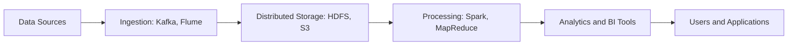

# Unit I: Big Data ke Notes (Hinglish)

### Topics
1. [Introduction to Big Data](#1-introduction-to-big-data)
2. [Big Data Platform ka Introduction](#2-big-data-platform-ka-introduction)
3. [Challenges of Conventional Systems](#3-challenges-of-conventional-systems)
4. [Intelligent Data Analysis](#4-intelligent-data-analysis)
5. [Nature of Data](#5-nature-of-data)
6. [Analytic Processes and Tools](#6-analytic-processes-and-tools)
7. [Analysis vs Reporting](#7-analysis-vs-reporting)

## 1. Introduction to Big Data

Big Data ka matlab hai bahut bade aur complex data sets jo normal database systems se handle nahi ho pate. Yeh data social media, sensors, transactions, aur logs se aata hai.

### Characteristics (5 Vs)
- **Volume** – Data ka amount bahut zyada hota hai (terabytes se zettabytes).
- **Velocity** – Data fast aata hai (real-time ya near real-time).
- **Variety** – Structured, semi-structured, aur unstructured data.
- **Veracity** – Data ki quality aur trustworthiness.
- **Value** – Useful information nikal kar decision lene ka kaam.

> **Example:** Twitter par roz millions of tweets aate hain (high velocity and volume). Video streaming apps petabytes data generate karte hain (volume aur variety).

## 2. Big Data Platform ka Introduction

Big Data platform wo environment hai jahan data store, manage aur analyze kiya jata hai. Key components:

- **Distributed Storage** (HDFS, S3): Data ko kayi machines par divide karte.
- **Processing Frameworks** (MapReduce, Spark): Parallel processing.
- **Data Ingestion Tools** (Flume, Kafka): Data ko system me le aana.
- **Query Engines** (Hive, Impala): SQL jaisa interface.
- **Workflow Orchestration** (Oozie, Airflow).

> **Real World Use:** Netflix apne user activity logs ko HDFS me store karta aur Spark se process karke movies recommend karta.

## 3. Challenges of Conventional Systems

Traditional RDBMS Big Data ke saath problem face karte kyunki:

- **Scalability**: Vertical scaling (CPU/RAM badhana) mehenga padta.
- **Performance**: Jab tables bahut bade ho jate hain to joins aur transactions slow ho jate.
- **Data Variety**: Schema rigid hota; unstructured data ko handle karna mushkil.
- **Cost**: License aur hardware ka kharcha tez badhta.

> **Example:** Bank ka RDBMS customer records theek se handle karta, lekin jab ATM, mobile app aur fraud sensors se pucca data aane lage toh system struggle karta.

## 4. Intelligent Data Analysis

Yeh process hai jisme data se insights, patterns ya predictions nikaale jate hain using statistics aur machine learning.

- **Descriptive Analysis**: Kya hua? (e.g., sales report)
- **Predictive Analysis**: Kya hoga? (e.g., demand forecast)
- **Prescriptive Analysis**: Kya karna chahiye? (e.g., suggestions for action)

**Techniques**: data mining, classification, clustering, regression, deep learning.

> **Example:** E-commerce sites pichle purchase dekh ke agle product predict karte hain (predictive). Fraud detection systems transactions ko legit ya fraud classify karte hain.

## 5. Nature of Data

### Types
- **Structured**: Fixed schema wala data (tables, CSV). Example: bank transactions.
- **Semi-structured**: Kuch tags ya markers hote, schema tight nahi (JSON, XML). Example: log files.
- **Unstructured**: Koi format nahi (text, images, videos). Example: customer reviews.

Data type samajhna zaroori hota taaki storage aur tools sahi choose karein.

## 6. Analytic Processes and Tools

Analytics pipeline ke steps:

1. **Data Collection**: Sources se data uthana.
2. **Data Cleaning**: Errors hataana, missing values fill karna.
3. **Data Transformation**: Data ko usable format me laana.
4. **Modeling/Analysis**: Statistical ya ML models lagana.
5. **Evaluation**: Model results check karna.
6. **Deployment/Reporting**: Results dashboards ya reports me share karna.

### Common Tools
- **Hadoop Ecosystem**: HDFS, MapReduce, Hive, Pig.
- **Apache Spark**: Fast in-memory processing.
- **NoSQL DBs**: MongoDB, Cassandra (flexible schemas).
- **BI Tools**: Tableau, Power BI.
- **Programming**: Python, R.

> **Real-world pipeline:** Retail company POS data collect karke clean karte, HDFS me load karte, Spark jobs chalate daily sales trends dekne ke liye, aur Tableau me visualize karte.

## 7. Analysis vs Reporting

| Cheez | Analysis | Reporting |
|-------|----------|-----------|
| Purpose | Insights nikaalna, hypotheses test karna | Past events ko summarize karna
| Data | Raw, detailed data | Aggregated data
| Tools | Statistical/ML tools | BI/reporting software
| Output | Models, patterns, predictions | Tables, charts, dashboards

> **Example:** Analyst Spark use karke customer segments nikalta (analysis). Marketing team ko dashboard milta monthly sales by region ka (reporting).

### Summary
Big Data bahut bada, tez aur varied data hota jo conventional systems handle nahi kar paate. Distributed storage aur processing wala platform data ko analyze karne mein madad karta, jisse raw data se useful knowledge milti hai. Data ke types aur analytic process ko samajhna zaroori hai. Analysis reporting se aage jaata hai kyunki woh naye patterns aur predictions dhoondta hai.
