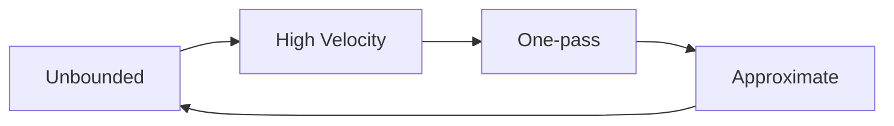
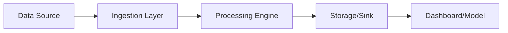
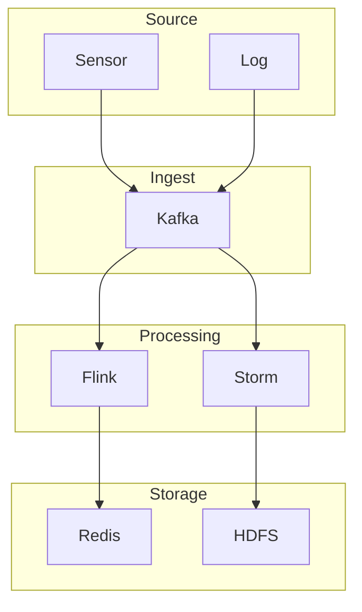
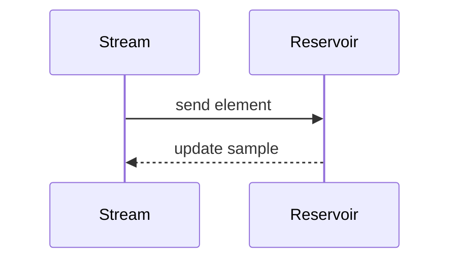
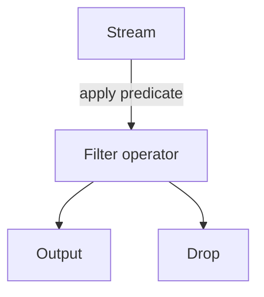
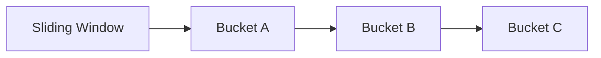
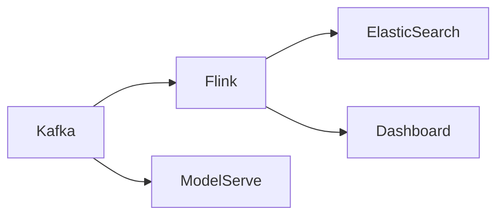

# Unit II: Mining Data Streams (English Detailed)

### Topics
1. [Introduction to Stream Concepts](#1-introduction-to-stream-concepts)
2. [Stream Data Model and Architecture](#2-stream-data-model-and-architecture)
3. [Stream Computing](#3-stream-computing)
4. [Sampling Data in a Stream](#4-sampling-data-in-a-stream)
5. [Filtering Streams](#5-filtering-streams)
6. [Counting Distinct Elements in a Stream](#6-counting-distinct-elements-in-a-stream)
7. [Estimating Moments](#7-estimating-moments)
8. [Counting Oneness in a Window](#8-counting-oneness-in-a-window)
9. [Decaying Window](#9-decaying-window)
10. [Real Time Analytics Platform (RTAP) Applications](#10-real-time-analytics-platform-rtap-applications)
11. [Case Studies](#11-case-studies)
 - [Real Time Sentiment Analysis](#real-time-sentiment-analysis)
 - [Stock Market Predictions](#stock-market-predictions)

---

## 1. Introduction to Stream Concepts

Data streams refer to continuous, rapid, time-varying sequences of data items produced by sources such as sensors, user interactions, network traffic or financial transactions. Unlike traditional static datasets, streams cannot be stored entirely before processing; algorithms must operate in an online fashion, handling each element as it arrives and using limited memory.

Key characteristics:

- **Unboundedness**: Streams potentially never end. Measurements are produced indefinitely; systems are designed with back-pressure and retention policies because disk space is finite.
- **High velocity**: Elements arrive at a high rate, often thousands or millions per second. Throughput is typically measured in MB/s or tuples/sec and determines the choice of serialization formats and network protocols.
- **One-pass constraints**: Each item is examined only once (or few times) due to time/memory constraints. Algorithms therefore rely on incremental updates and compact data structures (e.g., sketches) instead of full scans.
- **Approximate answers**: Exact computation is impossible in general; schemes produce approximate results with probabilistic guarantees. Trade-offs between accuracy, memory and latency are a central design consideration.

Understanding these qualities is essential for mining data streams effectively. Real-world systems like Twitter’s fire‑hose or financial tick feeds embody all of these characteristics, driving the need for specialized processing frameworks.

> **Illustrative example:** A network monitoring system generates a stream of packet headers. An intrusion detection operator filters suspicious IPs (filtering), maintains counts of distinct sources (distinct counting), and triggers an alert if a high‑volume anomaly is detected.

## 2. Stream Data Model and Architecture

The stream data model formalizes a stream as a sequence \(a_1, a_2, a_3,\ldots\) of elements from a domain. Each element may be a scalar, tuple, or complex object with timestamp, key, and payload.

### Architecture

A typical stream processing architecture consists of:

- **Sources/Producers**: Sensors, logs, click trackers, financial feeds. These may push data to brokers or expose REST endpoints.
- **Ingestion layer**: Systems like Kafka, Flume, or Kinesis buffer and batch the incoming events. They provide durability and allow multiple consumers to subscribe independently.
- **Processing engines**: Frameworks such as Apache Storm, Spark Streaming, Flink execute user-defined computations. They may support APIs in Java, Scala, Python or SQL.
- **Storage**: Frequently results are written to fast stores (Redis, Cassandra) for low-latency access or to long-term storage (HDFS, S3) for historical analysis.
- **Output/Sinks**: Dashboards, alerts, machine learning models or external services that consume processed outputs.

The architecture is often implemented as a directed acyclic graph (DAG) of operators, where each operator performs transformations on the flow of tuples. Operators can be composed to implement patterns such as map-reduce, windowed aggregations or joins across streams.

## 3. Stream Computing

Stream computing refers to the paradigm of processing data as it flows through the system. Operators are defined to perform transformations such as filtering, aggregation, joining, and pattern detection. A few concepts:

- **Stateless operators**: Each output depends only on the current input (e.g., map, filter).
- **Stateful operators**: Maintain an internal state across multiple inputs (e.g., counts, windows).
- **Windowing**: Grouping of stream elements based on time or count for aggregation.
- **Fault tolerance**: Systems checkpoint state and replay data on failures.

Stream computing frameworks prioritize low latency (milliseconds to seconds) and high throughput.

## 4. Sampling Data in a Stream

Sampling enables approximate analytics when processing every element is infeasible. Common techniques:

- **Reservoir sampling**: Maintains a random sample of size \(k\) from a stream of unknown length using constant memory. Algorithm R replaces items with decreasing probability; the probability that the i-th element remains in the reservoir after seeing \(n\) items is \(k/n\).
- **Poisson sampling**: Each element is included with fixed probability \(p\); the sample size is random but expected to be \(pn\). It is simple to implement in parallel and supports dynamic re-weighting.
- **Stratified sampling**: Maintains separate reservoirs per key or category to ensure representation across groups.
- **Gray code and skewed sampling**: Variations adapt to weighted streams or sliding windows, using techniques like Algorithm L (for weighted reservoir) or time-biased sampling.

Sampling is often used for exploratory analysis, building sketches, or reducing input to complex algorithms. For example, when training a learning-to-rank model on clickstream data, a random sample of user sessions may be sufficient to tune hyperparameters efficiently.

> **Example:** To estimate the average transaction amount on a busy e‑commerce site, reservoir sampling can maintain a small fixed-size subset of recent purchases from millions of orders per hour.

## 5. Filtering Streams

Filtering removes unwanted elements based on a predicate. It is the simplest transformation but critical in high-volume streams to reduce workload. A predicate could check for:

- Value thresholds (e.g., temperature > 50°C)
- Specific keys or categories
- Patterns in text (e.g., containing profanity)

Filtering can be pushed to the source (e.g., sensor firmware) or executed in the processing layer. Efficient implementations rely on simple boolean tests and early dropping; frameworks may support SQL `WHERE` clauses for ease of use. Filters may also be stateful (e.g., only pass records when a condition holds for several successive events).

> **Example:** A stock ticker stream may filter out trades below a configurable minimum size to reduce noise before further analysis. In Flink, this might be implemented with a `KeyedProcessFunction` that keeps track of market open/close status.

> **Example:** A stock ticker stream may filter out trades below a configurable minimum size to reduce noise before further analysis.

## 6. Counting Distinct Elements in a Stream

Determining the number of unique items in a stream is a classic problem. With enormous streams, maintaining a hash set is impractical.

### Algorithms

- **Flajolet–Martin (FM) sketch**: Uses hash functions to estimate cardinality via position of least significant 1-bit in hashed values. Multiple hash functions averaged yield an estimate with variance control.
- **HyperLogLog**: Improvement over FM that uses multiple registers and harmonic mean to achieve low memory footprint (a few kilobytes for billions of elements).
- **Linear counting**: Tracks a bit array and estimates distinct count from number of zero bits.

These probabilistic algorithms provide approximate counts with error bounds (e.g., ±2% with 1 KB of memory). The error typically decreases as \(O(1/\sqrt{m})\) where \(m\) is the number of registers or hash functions used. Choosing the right hash family (e.g., pairwise independent) is important for correctness.

> **Example:** A web analytics pipeline might use HyperLogLog to estimate the number of unique visitors in the last 24 hours, merging sketches from each server and storing the result in Redis for quick dashboard updates.

## 7. Estimating Moments

Moments such as mean, variance, skewness are global statistics of the distribution. For streams, algorithms compute moments using one-pass formulas or sketches. Often the goal is to estimate the \(k\)-th moment \(F_k = \sum_i f_i^k\) where \(f_i\) is the frequency of item \(i\).

- **Count (0th moment)**: total number of elements; simply increment a counter.
- **Sum (1st moment)**: running total maintained easily, possibly with overflow handling.
- **Second moment**: related to the sum of squares; the AMS (Alon–Matias–Szegedy) sketch estimates it using random sign functions and counters. Specifically, maintain \(Z=\sum_{i=1}^n r_i a_i\) where \(r_i\) is a random ±1; then \(E[Z^2]=F_2\).
- **Higher moments**: use higher-order stable distributions (e.g., stable sampling for \(F_p\) with \(p>2\)).

These sketches can be merged across parallel tasks by adding their counters, enabling distributed computation.

- **Count (0th moment)**: Total number of elements.
- **Sum (1st moment)**: Running total maintained easily.
- **Second moment**: Related to the sum of squares; the AMS (Alon–Matias–Szegedy) sketch estimates it using random sign functions and counters.

Higher-order moments require more sophisticated sketches like the stable distribution-based estimators.

## 8. Counting Oneness in a Window

Often, analyses are restricted to a recent window of data (time-based or count-based). Counting occurrences (e.g., number of 1s) within a sliding window can be done with:

- **Exact methods**: Maintain a queue of timestamps and remove expired elements; memory grows with window size.
- **Approximate methods**: The landmark technique uses hierarchical buckets (Datar–Gionis–Indyk–Motwani algorithm) to estimate with logarithmic memory and additive error.

For binary streams, these methods allow efficient tracking of recent activity.

> **Example:** A smart meter emitting on/off signals uses a decaying window to weight recent usage more heavily when forecasting demand.

## 9. Decaying Window

In some applications, recent elements are more important. A decaying window applies weights that diminish over time (exponential decay). Algorithms maintain weighted aggregates by scaling old contributions.

Example: Use a decay factor \(\lambda\) so that an element seen \(t\) seconds ago contributes \(e^{-\lambda t}\). This supports infinite streams while emphasizing recent data. Implementation often uses techniques like ``exponential histograms`` or ``time decay sketches``. In practice, 

- When receiving a new element at time \(T\), scale existing aggregates by \(e^{-\lambda (T - T_{last})}\) before adding the new value.
- Periodic re-scaling ensures numerical stability.

> **Use case:** A social media sentiment tracker might weigh tweets by recency so that yesterday's complaint has less effect than a post from five minutes ago.

## 10. Real Time Analytics Platform (RTAP) Applications

RTAPs are architectures designed for low-latency, high-throughput analytics on streaming data. Common use cases include:

- **Fraud detection**: Real-time scoring of transactions using pre-trained models. Models may be served via TensorFlow Serving or ONNX and executed within the stream processor.
- **Anomaly detection**: Monitoring server logs or sensor data for outliers. Techniques include z‑score thresholds or unsupervised learning algorithms like streaming k‑means.
- **Social media monitoring**: Tracking hashtags, sentiment, trending topics. These systems often use NLP libraries (`spaCy`, `NLTK`) inside the stream engine.
- **IoT telemetry**: Aggregating sensor readings and sending alerts. MQTT is a common protocol for such devices.

Platforms often combine a messaging layer (Kafka), a computation engine (Flink/Storm), and a storage/query layer (Elasticsearch, Druid). Container orchestration (Kubernetes) and service meshes improve scalability and reliability.

## 11. Case Studies

### Real Time Sentiment Analysis

Social platforms emit millions of messages per minute. A sentiment analysis pipeline might:

1. Ingest tweets via Kafka.
2. Filter English-language tweets and remove spam.
3. Use a pre-trained NLP model to assign polarity scores.
4. Aggregate scores in sliding windows by topic or region.
5. Visualize on a dashboard and trigger alerts when negative spikes occur.

This enables brands to respond immediately to crises or monitor campaign reception.

### Stock Market Predictions

Financial tick data streams are extremely high velocity. A typical workflow:

1. Subscribe to market data feeds (NASDAQ, Bloomberg).
2. Compute real-time indicators (moving averages, RSI) in windows of seconds.
3. Feed features into a streaming machine learning model (e.g., an online logistic regression) that predicts price direction.
4. Execute trades via an automated system if confidence exceeds a threshold.

Latency is critical; end-to-end systems aim for sub-10ms decision times.

---

## Additional Topics

### Window types
- **Tumbling windows**: Non-overlapping, fixed-size windows. Each event belongs to exactly one window. Useful for time-based aggregations (e.g., hourly averages).
- **Sliding windows**: Overlapping windows defined by size and slide interval. Each event may appear in multiple windows. Useful for moving averages.
- **Session windows**: Windows triggered by periods of inactivity; they group events belonging to the same user session.

### State management
Managing state in a distributed stream engine requires checkpointing and backup. Frameworks like Flink provide exactly-once semantics by writing state to a durable store (e.g., HDFS) and replaying input on failure.

### Backpressure and flow control
When downstream operators are slower, backpressure mechanisms (e.g., Kafka consumer pause) prevent buffer overflow. Designing for elasticity is key in production systems.

### Security and compliance
Streams often contain sensitive data. Encryption in transit (TLS), access control, and anonymization (masking PII) must be integrated.

These extensions provide a fuller picture aligning with the depth of Unit I content.

---

### Summary

Mining data streams involves designing algorithms that cope with unbounded, high-speed data. Techniques such as sampling, filtering, sketching and windowing are fundamental. Real-time analytics platforms put these ideas into practice for applications ranging from social sentiment analysis to financial trading. Understanding stream characteristics, windowing strategies, state management, backpressure, and security considerations equips practitioners to build robust, scalable systems. The value of streaming data is realized when it is transformed into timely insights and actions.

### Window types
- **Tumbling windows**: Non-overlapping, fixed-size windows. Each event belongs to exactly one window. Useful for time-based aggregations (e.g., hourly averages).
- **Sliding windows**: Overlapping windows defined by size and slide interval. Each event may appear in multiple windows. Useful for moving averages.
- **Session windows**: Windows triggered by periods of inactivity; they group events belonging to the same user session.

### State management
Managing state in a distributed stream engine requires checkpointing and backup. Frameworks like Flink provide exactly-once semantics by writing state to a durable store (e.g., HDFS) and replaying input on failure.

### Backpressure and flow control
When downstream operators are slower, backpressure mechanisms (e.g., Kafka consumer pause) prevent buffer overflow. Designing for elasticity is key in production systems.

### Security and compliance
Streams often contain sensitive data. Encryption in transit (TLS), access control, and anonymization (masking PII) must be integrated.

These extensions provide a fuller picture aligning with the depth of Unit I content.