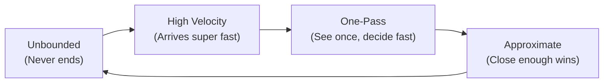
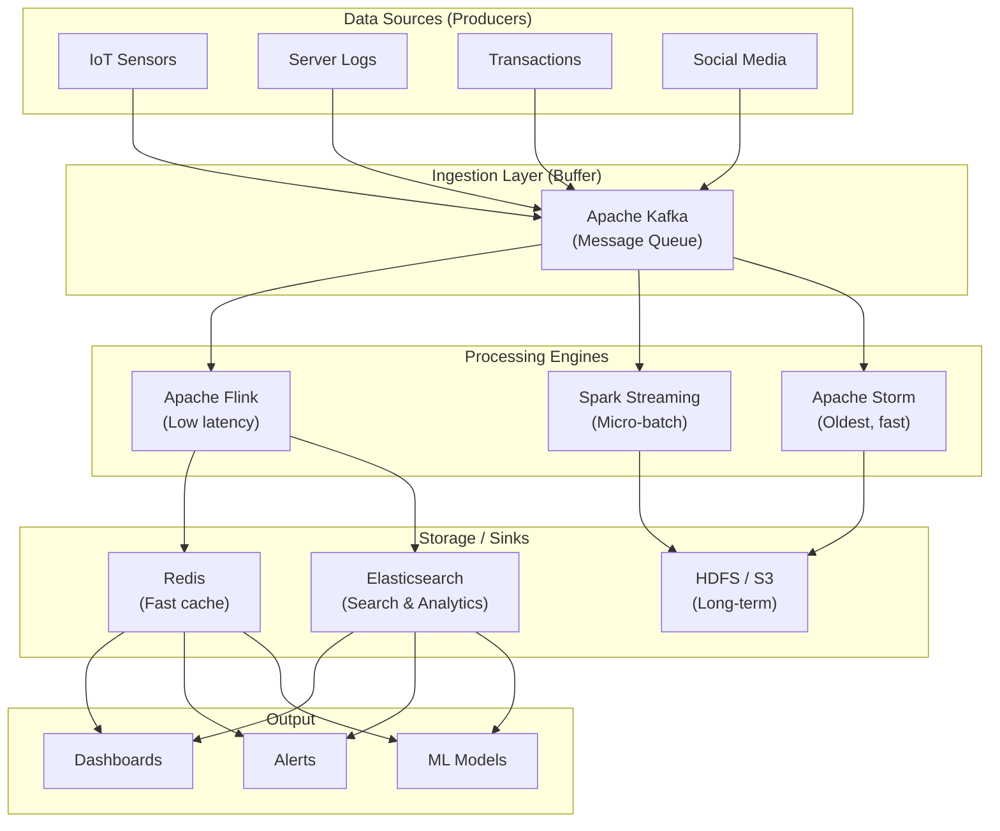
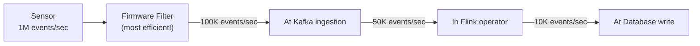
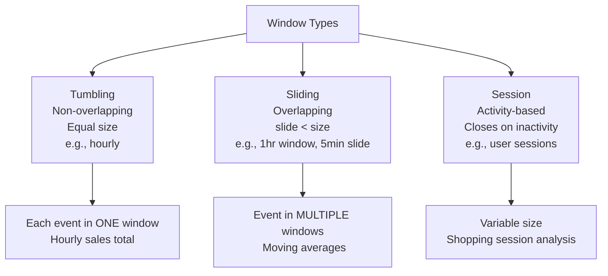
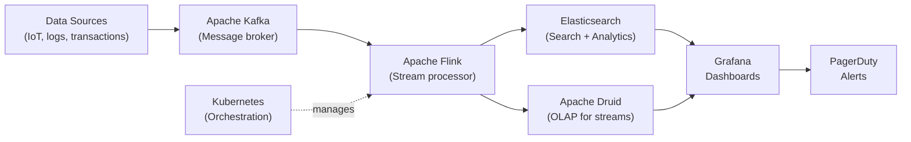
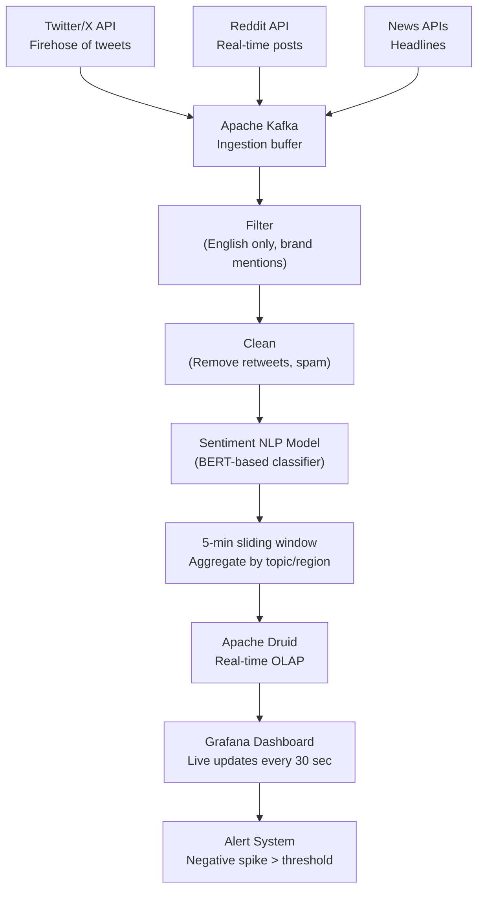
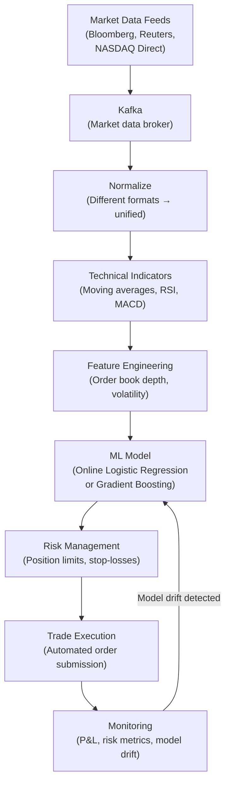
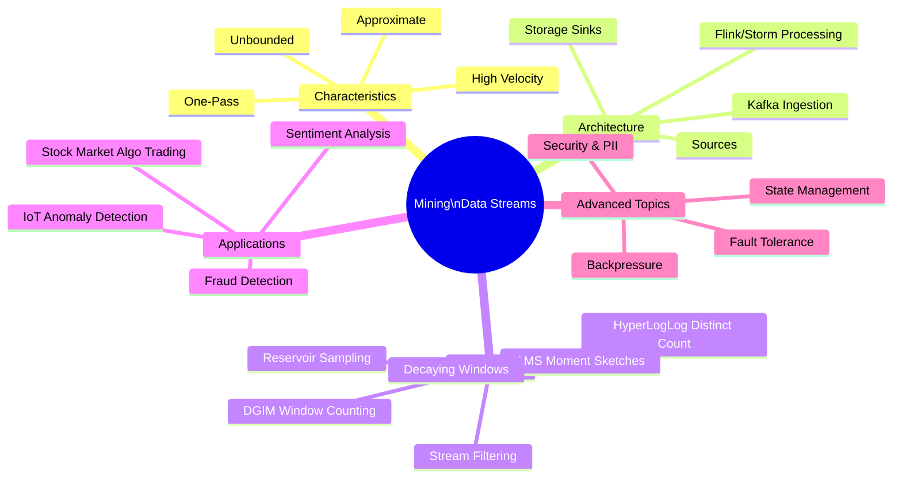

# Unit II: Mining Data Streams — The Fun Way!

> *"A stream of data is like a river — you can't step in the same river twice, and you definitely can't store the whole river in a bucket."*

Welcome to **Unit II** — where we stop talking about stored data and start dealing with data that **never stops arriving**. This is the world of real-time analytics, clever math tricks, and systems that think at the speed of light! 

---

## What You'll Learn (Table of Contents)

1. [ Introduction to Stream Concepts](#1--introduction-to-stream-concepts)
2. [ Stream Data Model and Architecture](#2--stream-data-model-and-architecture)
3. [ Stream Computing](#3--stream-computing)
4. [ Sampling Data in a Stream](#4--sampling-data-in-a-stream)
5. [ Filtering Streams](#5--filtering-streams)
6. [ Counting Distinct Elements in a Stream](#6--counting-distinct-elements-in-a-stream)
7. [ Estimating Moments](#7--estimating-moments)
8. [ Counting Oneness in a Window](#8--counting-oneness-in-a-window)
9. [ Decaying Window](#9--decaying-window)
10. [ Real Time Analytics Platform (RTAP) Applications](#10--real-time-analytics-platform-rtap-applications)
11. [ Case Studies](#11--case-studies)
 - [ Real Time Sentiment Analysis](#-real-time-sentiment-analysis)
 - [ Stock Market Predictions](#-stock-market-predictions)

---

## 1. Introduction to Stream Concepts

### Data Streams: The River That Never Stops

Imagine you're standing next to Niagara Falls with a tiny teacup trying to collect and analyze all the water. That's roughly what it feels like trying to process a data stream with traditional tools! 

> **Simple Definition:** A **data stream** is a continuous, never-ending flow of data items arriving in real-time — from things like sensors, user clicks, financial trades, or social media posts.

**The key difference from regular data:**

| Regular (Batch) Data | Stream Data |
|---------------------|------------|
| Finite, stored collection | Never-ending flow |
| "Process it later" | "Process it NOW or lose it" |
| Can scan multiple times | Usually seen only ONCE |
| Exact answers | Approximate answers (usually enough!) |

---

### 4 Key Characteristics of Streams

Think of data streams as having a **personality** — and it's a *very intense* personality:



---

#### 1. Unboundedness — "Are We There Yet?" (No, Never)

Streams potentially **never end**. A temperature sensor installed in a factory will keep sending readings every second for years. You can't say "let me wait until all the data arrives" — it never will!

> **Analogy:** It's like trying to take a shower but the water never turns off. You can enjoy it, but you have to keep choosing what to do with the water *now*.

**Practical implication:** Systems need **retention policies** — "Keep only last 7 days of data in Kafka." Otherwise you'd need infinite disk space!

---

#### 2. High Velocity — It Arrives FAST

We're talking:
- **Thousands to millions** of events per second
- Twitter: ~6,000 tweets/second on an average day, spikes to 150,000/second during major events
- NASDAQ stock exchange: millions of price ticks per second during trading hours
- A modern car's ECU: 25,000+ sensor readings per second

> **Formula 1 Analogy:** A Formula 1 car has ~300 sensors sending 1,500 data points per second. The team's engineers are doing real-time stream analytics on live race data to advise the driver. If they used batch processing, the race would be over before they finished analyzing Lap 1!

---

#### 3. One-Pass Constraints — You Get ONE Look

Due to memory and time limitations, each stream element is typically processed **only once** as it arrives. There's no going back to re-read it (well, unless you stored it somewhere, but that costs memory/disk).

This completely changes HOW you design algorithms:

 **Old world thinking:** "Let me load all data into memory and run my algorithm." 
 **Stream world thinking:** "I need to update my estimate with each new element I see."

> **Live TV Analogy:** Watching a live cricket match vs. watching a recording. During the live match, you can't rewind. You process what you see, when you see it!

---

#### 4. Approximate Answers — "Close Enough" is a Feature, Not a Bug

Here's a mind-bending idea: **exact answers are often not worth getting**.

Why? Because:
- Exact calculations on massive streams require too much memory
- If exact answer takes 10 seconds and approximate answer takes 10ms, the approximate answer is 1,000x more useful in real-time systems
- For most business decisions, "~50,000 unique visitors" is as actionable as "50,247 unique visitors"

> **Weather Analogy:** When you check a weather app and it says "29°C", it's actually 28.7°C. The rounding is an approximation. Do you need more precision to decide whether to wear a jacket? No! The approximate answer is perfectly useful.

---

### Real-World Stream Examples

| Source | Data Type | Rate | Why Streamed |
|--------|-----------|------|--------------|
| Twitter | Tweets (text) | ~6,000/sec | Trend detection, sentiment |
| Visa/Mastercard | Transactions | ~24,000/sec | Fraud detection |
| Factory IoT sensors | Temperature, pressure | Millions/sec | Predictive maintenance |
| Web server logs | HTTP requests | Varies | Traffic monitoring |
| Network packets | Network traffic | Terabits/sec | Intrusion detection |
| Autonomous vehicles | Camera, LIDAR | 40GB/sec per car | Real-time navigation |

> **Illustrative Example:** A network monitoring system receives a stream of packet headers. It:
> - **Filters** suspicious IPs (filtering) 
> - **Counts** distinct source addresses (distinct counting) 
> - **Alerts** when an unusual spike occurs (anomaly detection) 
> 
> ALL of this happens in milliseconds, on data it can never fully store!

---

## 2. Stream Data Model and Architecture

### The "Conveyor Belt Factory" Model

Think of stream architecture like a **food factory assembly line** :

```
 Raw Ingredients → Loading Dock → Processing → Packaging → Shelves
 (Data Sources) (Kafka/Kinesis) (Flink/Storm) (Storage) (Dashboard)
```

Each station adds value, and the conveyor belt keeps moving — if any station falls behind, you get a backlog (backpressure)!

---

### The Full Architecture Blueprint



---

### Each Layer Explained

#### Sources / Producers — The Origin of Everything

These are the systems that **generate** the data:
- IoT devices: Temperature sensors, smart meters, GPS trackers
- Applications: Your app sending click events, page views, errors
- External feeds: Stock price APIs, weather feeds, social media APIs

> The producer's job: *Keep generating data as fast as possible and hand it off.*

---

#### Ingestion Layer — The Post Office

**Kafka** is the king here. It's a distributed message queue that:
- Accepts data from producers
- Stores messages durably for a configurable time (hours, days, weeks)
- Allows multiple consumers to read independently at their own pace
- **Guarantees messages aren't lost** even if downstream systems are slow

> **Analogy:** Kafka is like a **post office with a filing cabinet**. The postman (producer) drops letters. Different departments (consumers) collect their own copies at their own pace. The filing cabinet holds letters for 7 days before discarding them.

| Without Kafka | With Kafka |
|---------------|-----------|
| Producer must slow down if consumer is slow | Producer delivers to Kafka, moves on |
| Data lost if consumer crashes | Data replayed from Kafka after recovery |
| Only one consumer can read the data | Multiple consumers, each with its own offset |

---

#### Processing Engines — The Brains

This is where the actual computation happens:

| Engine | Personality | Latency | Best For |
|--------|-------------|---------|----------|
| **Apache Flink** | The Perfectionist | Milliseconds | Exactly-once, event-time processing |
| **Apache Storm** | The Speed Freak | Sub-millisecond | Ultra-low latency, simple topologies |
| **Spark Streaming** | The Pragmatist | Seconds (micro-batch) | Teams already using Spark |
| **Apache Samza** | The LinkedIn Special | Milliseconds | Kafka-native, stateful |

> **Flink vs Storm:** Storm is faster but Flink is smarter. Storm processes one event at a time (true streaming). Flink has richer windowing, exactly-once semantics, and better state management. For most new projects, **choose Flink**!

---

#### Storage / Sinks — Where Results Land

After processing, results go somewhere:
- **Redis** → For fast, real-time lookups (e.g., "Is this user online?", fraud scores)
- **Cassandra** → For time-series data requiring high write throughput
- **Elasticsearch** → For searchable analytics and log analysis
- **HDFS/S3** → For archival and batch processing later

---

### The Stream as a Math Sequence

Formally, a stream is modeled as:
$$a_1, a_2, a_3, a_4, \ldots$$

Where each $a_i$ can be a tuple like:
```
(timestamp: 2024-01-01T10:00:00, user_id: u001, event: "click", page: "/home")
```

The stream is processed as a **Directed Acyclic Graph (DAG)** of operators — each operator transforms the data flowing through it:

```
STREAM → [FILTER operator] → [AGGREGATE operator] → [ALERT operator] → OUTPUT
```

---

## 3. Stream Computing

### Two Types of Stream Operators

Stream computing is built on **operators** — functions applied to the data as it flows:

---

#### Stateless Operators — "No Memory, No Problem"

These operators look at each event **independently**. They don't remember anything from the past.

| Operator | What It Does | Example |
|----------|--------------|---------|
| **Map** | Transform each element | Convert Celsius to Fahrenheit |
| **Filter** | Keep or discard based on condition | Only keep transactions > ₹1000 |
| **FlatMap** | One element → multiple elements | Split a tweet into individual words |
| **Project** | Select specific fields | Keep only user_id and timestamp |

> **Analogy:** A stateless operator is like a rubber stamp — every letter gets the same treatment, regardless of what came before.

---

#### Stateful Operators — "I Remember Everything"

These operators maintain **state** across multiple events — they build up knowledge over time.

| Operator | State Maintained | Example |
|----------|-----------------|---------|
| **Count** | Running total | Total clicks so far |
| **Sum** | Running sum | Total revenue today |
| **Window Aggregate** | Events in time window | Avg temperature last 5 minutes |
| **Join** | State of both streams | Match orders with payments |

> **Memory Analogy:** A stateful operator is like a bank teller who remembers your account balance from previous transactions, not just your current request.

---

### Windowing — The Key Concept in Stream Computing

Since streams are infinite, we need to **carve out finite chunks** to calculate aggregates (averages, counts, sums). That's what **windows** do.

#### 3 Types of Windows:

```
━━━━━━━━━━━━━━━━━━━━━━━━━━━━━━━━━━━━━━━━━━━━━━━━━━━━━━━━━━━━ TIME →

 TUMBLING WINDOW (fixed, non-overlapping):
 [──────10min──────][──────10min──────][──────10min──────]
 Window 1 Window 2 Window 3
 Each event in EXACTLY one window.

 SLIDING WINDOW (overlapping):
 [────10min────]
 [────10min────]
 [────10min────]
 Slide every 5 min. Events appear in MULTIPLE windows.

 SESSION WINDOW (activity-based):
 [──activity──] gap [─────activity─────] gap [─act─]
 Window closes after X minutes of inactivity.
```

| Window Type | Analogy | Use Case |
|-------------|---------|----------|
| **Tumbling** | Work shifts (9-5, 5-1, 1-9) | Hourly sales totals |
| **Sliding** | Moving average in stock charts | 5-min rolling avg temperature |
| **Session** | A user's browsing session | User journey analysis |

---

### Fault Tolerance — "What if a Server Dies Mid-Stream?"

Stream systems handle failures through **checkpointing**:

1. Periodically save the current state to durable storage (HDFS, S3)
2. If a node crashes, restore from last checkpoint
3. Replay events that arrived after the checkpoint (Kafka holds them!)

> **Analogy:** Checkpointing is like the "Save Game" feature. If your game crashes, you restart from the last save point, not from the very beginning!

**Flink's guarantee levels:**
- **At-least-once**: Every event is processed, but some may be processed twice (duplicates possible)
- **Exactly-once**: Every event is processed exactly once, even after failures (Flink's superpower! )

---

## 4. Sampling Data in a Stream

### The "Why Not Process Everything?" Problem

With 1 million events per second, even simple operations become expensive. **Sampling** gives us a representative subset to work with:

> **Analogy:** A chef doesn't eat the entire pot of soup to check if it's tasty — they taste one spoonful. If the sample is representative, it tells you about the whole pot!

---

### Reservoir Sampling — The Classic Algorithm

**Problem:** Sample exactly $k$ random items from a stream of unknown length $n$. Each item must have equal probability $k/n$ of being in the final sample.

**Why is this tricky?** When you see item #1, you don't know if $n$ = 10 or $n$ = 10 billion!

**Algorithm R (Vitter's Reservoir Sampling):**

```
Step 1: Fill the reservoir with the first k items.
Step 2: For item i (where i > k):
 - Generate random number j between 1 and i
 - If j ≤ k: replace reservoir[j] with item i
 - Else: discard item i
Step 3: Repeat until stream ends.
```

> **Casino Analogy:** Imagine a raffle where each new ticket buyer has a chance to replace a previously selected winner. As more people enter, the replacement probability drops — but everyone has a FAIR chance overall!

**Mathematical guarantee:** After seeing $n$ items, the probability that item $i$ is in the reservoir is exactly $\frac{k}{n}$.

**Memory used:** Fixed at $k$ items, regardless of how large $n$ gets! 

---

### Poisson Sampling — The Simple Alternative

**Idea:** Include each element with a fixed probability $p$, independently.

```python
for each element in stream:
 if random() < p:
 include in sample
 else:
 skip
```

**Properties:**
- Super simple to implement
- Parallelizable (each worker samples independently)
- Sample size is random (expected $p \cdot n$, but varies)
- Good for distributed systems where exact sample size isn't critical

---

### Stratified Sampling — Fair Representation

**Problem with random sampling:** Small groups might be completely missed!

> **Poll Analogy:** If you're surveying 1000 people about politics, random sampling might give you 950 from one city and 50 from everywhere else. Stratified sampling ensures all regions are proportionally represented.

**Solution:** Maintain **separate reservoirs** per key/category.

| Category | Reservoir Size |
|----------|----------------|
| Mobile users | k=500 |
| Desktop users | k=500 |
| Tablet users | k=100 |

Even if 99% of traffic comes from mobile, tablet users still get represented!

---

### Real Example: E-Commerce Transaction Sampling

> An e-commerce site processes 2 million orders per hour. The data science team needs a sample to train a fraud detection model quickly.

1. Use **reservoir sampling** with $k = 50,000$
2. Result: Statistically valid sample from all 2 million orders
3. Train the fraud model on the sample (faster!)
4. Deploy the model to score ALL 2 million orders in real-time

 **Benefit:** Model training is 40x faster. Statistical validity is maintained.

---

## 5. Filtering Streams

### The Bouncer at the Club 

Filtering is the **simplest but most impactful** stream operation. It acts like a bouncer who only lets certain events through.

> **Core Idea:** Apply a predicate (condition) to each element. If `TRUE` → keep it. If `FALSE` → drop it.

---

### Why Filtering Matters — The Numbers

Imagine a stream generating 1 million events/second. Only 1% are relevant to your analysis:
- **Without filtering early:** Your expensive ML model processes 1,000,000 events/sec 
- **With filtering:** Your ML model processes 10,000 events/sec (100x less work!)

> **Factory Analogy:** A quality control inspector at the START of the assembly line catches and discards defective parts early. This prevents expensive downstream processing on bad parts. Same idea!

---

### Types of Filters

#### Simple (Stateless) Filters:
```sql
-- SQL-style filter (Flink SQL)
WHERE temperature > 50.0 -- Value threshold
WHERE country = 'IN' -- Specific key
WHERE message LIKE '%error%' -- Pattern match
WHERE transaction_amount > 1000 -- Business rule
```

#### Stateful Filters (More Powerful!):
```
Only pass events WHERE the condition has been TRUE for 3 consecutive readings
```
> **Example:** Alert only if temperature > 50°C for 3 consecutive readings (not just a single spike). This prevents false alarms from noisy sensors!

---

### Where to Filter — Push It as Early as Possible!



**Golden Rule:** Filter as early and as close to the source as possible!

---

### Real Example: Stock Ticker Filtering

> The NYSE emits every trade (millions per day). An analyst only cares about **large trades** (block trades > 10,000 shares) for market impact analysis.

```
Filter rule: trade.volume > 10,000 AND trade.exchange = 'NYSE'
```

Result: 99% of the stream is discarded. Only the relevant 1% flows to expensive analytics!

**In Apache Flink:**
```java
DataStream<Trade> largeTrades = allTrades
 .filter(trade -> trade.getVolume() > 10_000 
 && trade.getExchange().equals("NYSE"));
```

---

## 6. Counting Distinct Elements in a Stream

### The Impossible-But-Essential Problem

**Question:** How many **unique** users visited our website today?

**Naive solution:** Keep a HashSet of all user IDs.
- 10M unique users × 8 bytes per ID = **80 MB of memory**
- With 1 billion users: **8 GB just for one counter!** 

**Stream solution:** Use a **probabilistic sketch** that uses kilobytes but gives you a ±2% accurate answer!

---

### Flajolet-Martin (FM) Sketch — The Magic of Bit Tricks

> **The Trick:** Hash each element and look at how many trailing zeros appear in the binary representation of the hash. The more zeros, the rarer it is — and the rarity tells us the total count!

**Intuition:**
- About 50% of hashes end with at least 1 trailing zero
- About 25% end with at least 2 trailing zeros
- About 12.5% end with at least 3 trailing zeros
- If the MAXIMUM trailing zeros you've ever seen is $r$, then roughly $2^r$ unique elements exist!

```
Element "Alice" → hash = 10110100 → trailing zeros = 2 → 2^2 = 4
Element "Bob" → hash = 11001000 → trailing zeros = 3 → 2^3 = 8
Element "Carol" → hash = 10100110 → trailing zeros = 1 → 2^1 = 2
Element "Dave" → hash = 01110000 → trailing zeros = 4 → 2^4 = 16

Max trailing zeros seen = 4 → Estimate = 2^4 = 16 unique elements
(Actual = 4, but we'd average multiple hash functions for better accuracy)
```

**Better with multiple hash functions:** Use $k$ hash functions, take average of estimates → reduces variance dramatically.

---

### HyperLogLog — The Industry Standard

HyperLogLog is the **upgraded, battle-tested version** of FM sketches. Used by:
- **Redis** (built-in `PFADD`, `PFCOUNT` commands)
- **Google BigQuery** (APPROX_COUNT_DISTINCT)
- **Amazon Redshift, Snowflake** (approximate count functions)

**How it works (simplified):**
1. Hash each element
2. Divide into $m$ registers (buckets) based on first few bits
3. Track the maximum trailing zeros seen in each register
4. Use the **harmonic mean** of $2^{\text{max\_zeros}}$ across all registers as your estimate

**Memory vs Accuracy:**
| Memory Used | Error Rate | Unique Elements Supported |
|-------------|------------|--------------------------|
| 1 KB | ±3.25% | Billions |
| 4 KB | ±1.6% | Billions |
| 16 KB | ±0.8% | Billions |

> **Mind-blowing fact:** HyperLogLog can estimate cardinality of 1 BILLION unique elements with just **1.5 KB of memory** and ±2% error. The naïve approach needs 8 GB!

---

### Mergeability — The Superpower of Sketches

The best property of HyperLogLog: **sketches can be merged!**

```
Server 1: Processed events 1-100,000 → HLL sketch A
Server 2: Processed events 100,001-200,000 → HLL sketch B

Merged sketch = MERGE(A, B) → Estimates unique elements across ALL 200,000 events!
```

> This allows **distributed counting** without a central coordinator!

---

## 7. Estimating Moments

### What's a "Moment" and Why Do We Care?

In statistics, the **$k$-th moment** tells us about the distribution of data. For streams, $F_k = \sum_i f_i^k$ where $f_i$ is how many times element $i$ appears.

**Why estimate moments?** They reveal the "shape" of your data distribution without storing the full dataset!

| Moment | Formula | What It Tells You |
|--------|---------|------------------|
| **0th moment** ($F_0$) | Count of distinct items | How many unique elements? |
| **1st moment** ($F_1$) | $\sum f_i$ | Total count of all items |
| **2nd moment** ($F_2$) | $\sum f_i^2$ | Are items evenly distributed or concentrated? |
| **$k$-th moment** ($F_k$) | $\sum f_i^k$ | Higher = more skewed distribution |

---

### 0th Moment — Count of Distinct Elements

That's exactly what we covered with HyperLogLog! 

---

### 1st Moment — Easy Running Sum

The simplest of all moments:
```python
total = 0
for element in stream:
 total += element.value # or total += 1 for count
```

Memory used: **1 counter**. Trivial. Moving on! 

---

### 2nd Moment — The AMS Sketch

**Why is $F_2$ useful?** It measures how "uneven" a distribution is.

- $F_2$ is **low** when all items appear roughly equally often (uniform)
- $F_2$ is **high** when a few items dominate (skewed)

> **Real application:** Detecting "heavy hitters" in network traffic. If a few IP addresses are generating disproportionate traffic, $F_2$ will be large → potential DDoS attack!

**AMS (Alon-Matias-Szegedy) Sketch:**

This is clever math! For each element $a_i$ in the stream:

$$Z = \sum_{i=1}^{n} r_i \cdot a_i \quad \text{where } r_i \in \{-1, +1\} \text{ (random sign)}$$

**The magic:** 
$$E[Z^2] = F_2$$

The **expected value** of $Z^2$ equals the second moment! Store multiple $(r_i, Z)$ pairs and average $Z^2$ to reduce variance.

> **Analogy:** Imagine randomly assigning +1 or -1 to each person's "score" and summing. Most scores cancel out, but the dominant contributors (people with very high scores) survive the averaging — and that tells you about the distribution.

---

### Visual: How Moments Reveal Distribution

```
Low F₂ (Uniform — everyone contributes equally):
████████████████████████████████████
Each item: ████ ████ ████ ████ ████

High F₂ (Skewed — a few items dominate):
████████████████████████████████████████████████
One item: ████████████████████████████████████████████████
Others: ██ █ ██ █ ██
```

A high $F_2$ relative to $F_1^2$ tells you there are **heavy hitters** in your data.

---

## 8. Counting Oneness in a Window

### "How Many 1s in the Last 60 Seconds?"

**The Problem:** In a binary stream (0s and 1s), how many 1s appeared in the **last $N$ elements** or **last $T$ seconds**?

> **Why binary streams?** Many real signals are binary:
> - Did a user click? (1) or not? (0)
> - Did a transaction get flagged? (1) or not? (0)
> - Did the sensor trigger an alert? (1) or not? (0)

---

### Exact Method — The Simple Queue

**Approach:** Maintain a queue with timestamps of all 1s in the current window. Expire old ones.

```python
window = deque() # holds timestamps of 1s
for item, timestamp in stream:
 if item == 1:
 window.append(timestamp)
 # Remove expired entries
 while window and timestamp - window[0] > window_size:
 window.popleft()
 count_of_ones = len(window)
```

**Problem:** Memory grows with window size. For a 24-hour window on a high-velocity stream, this could be millions of entries! 

---

### The DGIM Algorithm — Approximate with Logarithmic Memory

The **Datar-Gionis-Indyk-Motwani (DGIM) algorithm** is the clever solution. Key idea: **use exponentially-sized buckets**.

**The structure:**
- Divide the stream into "buckets"
- Each bucket has a size that's a **power of 2**: 1, 2, 4, 8, 16, ...
- Keep at most **2 buckets of each size**
- When you get 3 buckets of the same size, **merge them** into one bucket of double size

```
Stream: 1 0 1 1 0 1 0 0 1 1 0 1 ...
 ↑ current time

Buckets (size, timestamp_of_most_recent_1):
 [1, t=12] [1, t=11] [2, t=9] [4, t=6] [8, t=2]
```

**Memory used:** $O(\log^2 N)$ — logarithmic! Vs the exact method's $O(N)$.

**Error guarantee:** Never more than 50% error on the count. Often much less!

> **Analogy:** Instead of remembering every single 1 you've seen, you remember "groups" of 1s using less and less precise timestamps for older groups — like how you remember "I had coffee sometime last week" but precisely remember "I had coffee at 9:15 AM today."

---

### Window Types Revisited — Now With More Depth



---

## 9. Decaying Window

### "Recent News Matters More Than Old News"

**The Core Idea:** Not all historical data should be treated equally. Events from 1 second ago are more relevant than events from 1 hour ago for real-time systems.

> **News Analogy:** A tweet about a product crash posted 5 minutes ago should influence sentiment scores WAY more than a tweet from 6 months ago. A **decaying window** naturally handles this!

---

### The Math Behind Decay

Use an **exponential decay factor** $\lambda$ (lambda):

An event that occurred $t$ seconds ago contributes:
$$\text{contribution} = \text{value} \times e^{-\lambda t}$$

Where:
- $\lambda$ is the decay rate (larger $\lambda$ = faster decay = shorter "memory")
- $e^{-\lambda t}$ approaches 0 as $t$ grows

```
λ = 0.1 (slow decay, long memory):
 10 seconds ago: e^(-0.1×10) = 0.37 (still 37% weight)
 60 seconds ago: e^(-0.1×60) = 0.002 (almost gone)

λ = 1.0 (fast decay, short memory):
 5 seconds ago: e^(-1.0×5) = 0.007 (almost gone!)
 10 seconds ago: e^(-1.0×10) = 0.00005 (essentially 0)
```

---

### Implementation — The Elegant Trick

You don't need to store ALL past events and recompute! Just update an **aggregate value** every time a new event arrives:

```python
aggregate = 0
last_time = 0
λ = 0.1

for value, current_time in stream:
 # Decay the existing aggregate
 time_delta = current_time - last_time
 aggregate = aggregate * math.exp(-λ * time_delta)

 # Add new value
 aggregate += value
 last_time = current_time

 print(f"Decaying aggregate: {aggregate:.3f}")
```

**Memory used:** Just 2 variables (`aggregate` and `last_time`)! Regardless of stream length! 

---

### Choosing the Right Decay Rate

| Use Case | λ (Decay Rate) | "Half-life" |
|----------|---------------|------------|
| Stock price sentiment | HIGH (λ = 1.0) | ~0.7 seconds |
| Social media trends | MEDIUM (λ = 0.01) | ~70 seconds |
| Monthly sales patterns | LOW (λ = 0.0001) | ~2 hours |
| Annual seasonality | VERY LOW | Days |

> **Analogy:** Think of $\lambda$ as the "memory slider" on a mixing board. All the way up = only care about RIGHT NOW. All the way down = treat all history equally (basically no decay).

---

### Real Application: Social Media Sentiment Tracker

```
Negative tweet at t=0: contribution = -1.0 × e^(-0.01×0) = -1.0
Positive tweet at t=30s: contribution = +1.0 × e^(-0.01×30) = +0.74
Negative tweet at t=31s: contribution = -1.0 × e^(-0.01×31) = -0.73
Positive tweet at t=120s: contribution = +1.0 × e^(-0.01×120) = +0.30

Current decaying sentiment = -1.0 + 0.74 - 0.73 + 0.30 = -0.69 → Mostly negative!
```

The 2-minute-old positive tweet barely matters. The recent negative tweet dominates. **This is exactly what we want for real-time sentiment!**

---

## 10. Real Time Analytics Platform (RTAP) Applications

### When "Later is Too Late"

RTAP = systems where the value of information **degrades rapidly** if not acted upon immediately.

> **Emergency Room Analogy:** In an ER, triage must happen within seconds. A doctor who reviews patient symptoms "sometime this afternoon" is useless if the patient arrived 3 hours earlier. RTAPs are the ER triage of data systems!

---

### The RTAP Stack



---

### Application 1: Fraud Detection

**The Story:** Every time you pay with a credit card, your bank runs a real-time fraud score!

```
Your card is swiped in Mumbai at 2 PM
 ↓
Kafka event: {card: "4532...", amount: ₹5000, merchant: "Electronics Store", lat: 19.07, lon: 72.87, time: "14:00:00"}
 ↓
Flink stream processor receives event in <1ms
 ↓
Feature extraction:
 - Last 7 days spending average: ₹1200
 - This transaction is 4.2x above average 
 - Location matches home city 
 - Device fingerprint matches 
 - Merchant category: NORMAL 
 ↓
ML model score: 0.23 (threshold 0.80 for block)
 ↓
Decision: APPROVE (but log as slightly suspicious)
```

End-to-end latency: **< 100 milliseconds!** 

**Tools used:** Kafka → Flink → Redis (feature store) → TensorFlow Serving / ONNX

---

### Application 2: IoT Anomaly Detection

**The Story:** Monitoring 10,000 machines in a factory for early warning of equipment failure.

**Traditional approach (batch):**
- Collect data → Wait for daily batch job → Report broken machines the next morning
- Problem: Machine already failed at 3 AM, caused 8 hours of downtime!

**RTAP approach (streaming):**
```
Sensor stream: temperature, vibration, pressure readings every 100ms
 ↓
Sliding window (5 minutes): compute mean and standard deviation
 ↓
Z-score = (current_value - mean) / std_dev
If Z-score > 3σ → ANOMALY DETECTED 
 ↓
Alert sent to maintenance team in < 2 seconds!
```

> **Result:** Instead of 8 hours of downtime, maintenance crew arrives within 10 minutes of anomaly detection. Savings: potentially hundreds of thousands of rupees per incident!

---

### Application 3: Social Media Monitoring

**The Story:** A brand launches a new product and needs to catch PR disasters INSTANTLY.

```
Incoming tweet stream filtered for brand mentions
 ↓
NLP model assigns sentiment: positive / neutral / negative
(using spaCy or BERT-based model inside Flink)
 ↓
Sliding 5-minute window: count negative mentions
 ↓
If negative_count > 500 in 5 minutes → SPIKE ALERT! 
 ↓
Marketing team notified via Slack + PagerDuty
```

> **Without RTAP:** Brand discovers the PR disaster 24 hours later in a morning report. Already viral, stock price dropped 2%!
> 
> **With RTAP:** Marketing team responds within 10 minutes. Crisis contained!

---

### Application 4: IoT Smart City Dashboard

**Real-time data from:**
- Traffic sensors at 10,000 intersections
- Air quality monitors at 500 stations
- Smart meters for electricity usage
- GPS on 2,000 public transport vehicles

All streaming into Kafka → Flink → Druid → Live city dashboard

> **Result:** City officials can reroute traffic, adjust traffic light timing, and send pollution alerts in real-time — not based on yesterday's batch report!

---

## 11. Case Studies

### Case Study 1: Real-Time Sentiment Analysis

#### The Problem
A large consumer brand (imagine Coca-Cola, Amazon, or Zomato) wants to know: *"What are people saying about us RIGHT NOW?"*

Not last night's summary. Not this morning's report. **Right now.** 

#### The Architecture



#### Step-by-Step Pipeline

**Step 1: Ingest** 
- Twitter Firehose: up to 500M tweets/day
- Filtered to brand mentions: ~50,000/day (99% dropped at source!)
- Kafka buffers these with guaranteed delivery

**Step 2: Filter & Clean** 
```
Rules:
- Language = English 
- Contains brand keyword 
- NOT a retweet 
- Account age > 30 days (spam filter) 
- Not duplicate tweet ID 
```
Result: 50,000 → ~35,000 quality tweets/day

**Step 3: Sentiment NLP** 
- Pre-trained BERT model fine-tuned on product reviews
- Runs inside Flink as a UDF (user-defined function)
- Output: `{tweet_id, sentiment: "positive/neutral/negative", score: 0.92, topic: "product_quality"}`
- Latency per tweet: ~15ms

**Step 4: Windowed Aggregation** 
```
Sliding window: 5 minutes, slide: 1 minute
Compute:
 - Average sentiment score
 - Count by sentiment category
 - Count by topic
 - Count by region
```

**Step 5: Alert Triggers** 
```
IF negative_count_5min > 200 AND avg_sentiment < -0.6:
 TRIGGER: "Sentiment Spike Alert"
 → Notify: PR team (Slack)
 → Notify: Customer service (PagerDuty)
 → Create: Incident ticket (Jira)
```

#### Why This Matters

| Without RTAP | With RTAP |
|---|---|
| Morning email: "Yesterday was bad" | Real-time Slack: "Spike happening NOW" |
| Crisis discovered 8-12 hours late | Response within 5-10 minutes |
| Viral, widespread damage | Contained, managed response |
| Stock impact: Potentially -2% | Minimal stock impact |

> **Real example:** When United Airlines faced a viral PR crisis (passenger removed forcibly, 2017), the story spread throughout the night before their PR team responded. Estimated stock market damage: **$1 billion in market cap** the next day. RTAP could have enabled faster crisis management.

---

### Case Study 2: Stock Market Predictions

#### The Environment

Stock markets are the **most extreme example** of high-velocity, time-critical stream processing:
- NYSE processes ~1 billion transactions/day
- Each tick: milliseconds apart
- Competition uses algorithms, not humans
- 1 millisecond advantage = millions in profits (or losses prevented)

> **"Latency arms race":** Some firms spend millions co-locating their servers in the same building as exchange servers — just to save 1 millisecond of network latency!

#### The Pipeline



#### Key Technical Features

**1. Technical Indicators (computed in streaming windows)**

```
Simple Moving Average (SMA) — Tumbling window:
 SMA_20 = average price over last 20 candles (20 min window)

Exponential Moving Average (EMA) — Decaying window:
 EMA gives more weight to recent prices (λ parameter tuned per asset)

Relative Strength Index (RSI) — Sliding window:
 RSI = 100 - (100 / (1 + avg_gain_14 / avg_loss_14))
 RSI > 70 = overbought, RSI < 30 = oversold

Bollinger Bands:
 Upper band = SMA + 2 × standard_deviation
 Lower band = SMA - 2 × standard_deviation
```

**2. The Machine Learning Model**

For streaming prediction, **online learning** algorithms that update with each new data point are preferred:

| Algorithm | Update Method | Good For |
|-----------|---------------|---------|
| Online Logistic Regression | SGD with each new trade | Binary up/down prediction |
| Online Gradient Boosting | Incremental tree updates | Complex patterns |
| Recurrent Neural Networks | BPTT on recent window | Sequential patterns |

**3. Risk Management — The Emergency Brake **

Even if the model predicts a great trade, risk management rules can block it:
```
RULES:
- Position size ≤ 2% of total portfolio
- Stop-loss at 0.5% loss per trade
- Max drawdown today ≤ 5%
- Halt all trading if confidence < 60%
```

#### The Latency Challenge

```
Target: Decision in < 10 milliseconds end-to-end!

Timeline breakdown:
 Market feed to Kafka: ~0.5ms (network)
 Kafka to Flink: ~0.5ms (disk + network)
 Feature computation: ~2ms (CPU)
 Model inference: ~3ms (CPU/GPU)
 Risk check: ~1ms (Redis lookup)
 Order submission: ~2ms (network to exchange)
 ─────────────────────────
 Total: ~9ms 
```

> **For context:** Human reaction time is ~200ms. Algorithmic trading at 9ms is **22x faster than a human blink!**

---

## Appendix: Advanced Stream Topics

### Backpressure and Flow Control

**The Problem:** What if your Flink processing job is slower than Kafka is producing data?

Without handling: Buffer overflows → data loss! 

```
Kafka: ████████████████████ producing at 1M events/sec
Flink: ████████ processing at 500K events/sec
Gap: ████████ 500K events/sec backing up!
```

**Solutions:**
1. **Kafka consumer pause**: Flink tells Kafka "slow down!" when buffers fill up
2. **Auto-scaling**: Add more Flink workers (Kubernetes horizontal pod autoscaling)
3. **Load shedding**: Drop low-priority events during overload (last resort!)

> **Plumbing Analogy:** Backpressure is like the pressure relief valve on a water heater. When pressure gets too high (buffer full), it releases some (pauses consumption) to prevent an explosion (data loss).

---

### Security & Compliance in Streams

Streams often contain **very sensitive data**:
- PII (names, emails, phone numbers)
- Financial data (card numbers, transaction amounts)
- Health data (vitals, diagnoses)

**Security requirements:**
| Requirement | Implementation |
|-------------|----------------|
| **Encryption in transit** | TLS/SSL on Kafka connections |
| **Encryption at rest** | Encrypted disk/S3 buckets |
| **Access control** | Kafka ACLs, IAM policies |
| **PII masking** | Hash or tokenize sensitive fields |
| **Audit logging** | Log all data access |
| **GDPR compliance** | Right-to-erasure in stream history |

> **Example:** A fintech company streams transaction data through Kafka. Before hitting analytics, a Flink operator **tokenizes** card numbers: `4532xxxxxxx → TKN-a7f3b2c1`. Analytics sees tokens, never real card numbers. Even if someone intercepts the stream, they get useless tokens!

---

### State Management in Distributed Streams

**The Hard Part:** When your stream processing is distributed across 10 machines, state must be consistent!

**Flink's Approach — Savepoints & Checkpoints:**

```
Every 10 seconds:
 1. Pause processing momentarily (milliseconds!)
 2. Write current state to HDFS/S3 as "checkpoint"
 3. Resume processing

If Machine #3 crashes:
 1. Restore its state from last checkpoint
 2. Replay Kafka messages from the checkpoint offset
 3. Back online! (Exactly-once semantics preserved)
```

**State backends in Flink:**
| Backend | Speed | Capacity | Best For |
|---------|-------|---------|---------|
| RocksDB | Medium | Large (disk-backed) | Large state, production |
| In-memory | Fast | Limited (RAM only) | Small state, dev/test |

---

## Unit Summary

Let's map the entire unit:



---

## Test Your Knowledge — Quick Quiz!

**Q1.** A smart factory has 10,000 sensors streaming data at 10 readings/second each. That's 100,000 readings/second. You need to estimate the average temperature reading. Is exact computation or approximate computation more practical here?
<details>
<summary>Click to reveal answer </summary>

**Approximate** using **reservoir sampling**. Maintaining an exact running average is technically possible here (just increment a sum and count), but for more complex statistics, reservoir sampling allows you to work with a manageable sample while maintaining statistical validity. The key insight is that 100% precision often isn't needed for operational decisions.
</details>

---

**Q2.** What's the difference between a tumbling window and a sliding window? Give a real-world use case for each.
<details>
<summary>Click to reveal answer </summary>

**Tumbling window**: Non-overlapping, fixed intervals. Use case: **Hourly sales report** — each sale belongs to exactly one hour.

**Sliding window**: Overlapping, defined by (size, slide). Use case: **Moving average stock price** — 10-minute window, sliding every 1 minute gives a smooth trend line.
</details>

---

**Q3.** HyperLogLog uses 1.5 KB to estimate 1 billion unique users with ±2% error. A HashSet approach would use ~8 GB. Why would you EVER choose the HashSet approach?
<details>
<summary>Click to reveal answer </summary>

When you need **exact counts** and the dataset is small enough to fit in memory. For example:
- A small business with 10,000 users — 80 KB is fine
- When you need to know if a **specific user** appeared, not just the count
- When 2% error is unacceptable (billing systems, legal compliance)

HyperLogLog is perfect for analytics; counting exact user IDs for access control requires a HashMap/HashSet.
</details>

---

**Q4.** A social media sentiment tracker shows a big spike in negative sentiment at 3 PM. With a DECAYING window (λ = 0.01), how would the tracker behave at 3:01 PM vs 4:00 PM?
<details>
<summary>Click to reveal answer </summary>

- **3:01 PM (60 sec later):** The 3 PM spike still contributes $e^{-0.01 \times 60} \approx 0.55$ of its original weight. Still quite visible.
- **4:00 PM (3600 sec later):** The 3 PM spike contributes $e^{-0.01 \times 3600} \approx 0.000000015$ — essentially **zero**. The tracker has completely "forgotten" the 3 PM spike.

This is exactly the desired behavior — recent events dominate, old events fade away.
</details>

---

**Q5.** A Flink job crashes mid-computation. Thanks to checkpointing, what exactly happens to ensure no data is lost or double-processed?
<details>
<summary>Click to reveal answer </summary>

1. The last **checkpoint** saved the state at time $T$
2. Kafka **retains messages** from before $T$ (replay capability)
3. Flink **restores state** from the checkpoint
4. Flink **replays** all Kafka messages from offset at time $T$ onwards
5. With **exactly-once semantics**, idempotent writes ensure no duplicates reach the sink

Result: System behaves as if the crash never happened! 
</details>

---

## Mnemonics to Remember

| Concept | Mnemonic |
|---------|----------|
| **4 Stream Characteristics** | **"Undercover Heroes Often Approximate"** (Unbounded, High velocity, One-pass, Approximate) |
| **4 Types of Windows** | **"Tigers Stalk Sessions Silently"** (Tumbling, Sliding, Session) |
| **RTAP Use Cases** | **"Friendly Astronauts Should Investigate"** (Fraud, Anomaly, Sentiment, IoT) |
| **Stream Architecture Layers** | **"Smart Industrious People Stay Optimized"** (Sources, Ingestion, Processing, Storage, Output) |
| **Moment Types** | **"Zeroes Sum Squared, Kth"** (0th=count distinct, 1st=sum, 2nd=AMS sketch, kth=higher) |

---

## Further Reading & Resources

| Resource | What It Covers |
|----------|---------------|
| *Mining of Massive Datasets* (free online) - Leskovec, Rajaraman, Ullman | The textbook for stream algorithms — Chapter 4 specifically |
| Flink Documentation (flink.apache.org) | Windowing, state, fault tolerance |
| *HyperLogLog: the analysis of a near-optimal cardinality estimation* — Flajolet et al. | The original HyperLogLog paper |
| *Maintaining Stream Statistics over Sliding Windows* — DGIM paper | The math behind Section 8 |
| Data Engineering Podcast | Stream processing in industry |
| Confluent Blog (confluent.io/blog) | Kafka + stream processing tutorials |

---

*Made with for Big Data learners everywhere. Streams never stop, and neither should your curiosity!*

---
