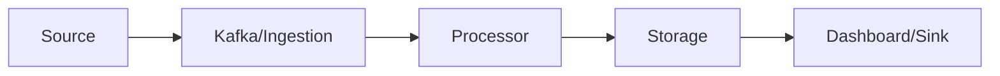

# Unit II: Mining Data Streams (English Summary)

### Topics
1. [Introduction to Stream Concepts](#1-introduction-to-stream-concepts)
2. [Stream Data Model and Architecture](#2-stream-data-model-and-architecture)
3. [Stream Computing](#3-stream-computing)
4. [Sampling Data in a Stream](#4-sampling-data-in-a-stream)
5. [Filtering Streams](#5-filtering-streams)
6. [Counting Distinct Elements in a Stream](#6-counting-distinct-elements-in-a-stream)
7. [Estimating Moments](#7-estimating-moments)
8. [Counting Oneness in a Window](#8-counting-oneness-in-a-window)
9. [Decaying Window](#9-decaying-window)
10. [RTAP Applications](#10-rtap-applications)
11. [Case Studies](#11-case-studies)

---

### 1. Introduction to Stream Concepts
Continuous flows of data (unbounded, high‑velocity) require one‑pass, approximate algorithms. Streams are produced by sensors, user actions, logs, or markets and may never stop, so systems must process elements on the fly and discard or compress old values.

> **Example:** A factory floor sensor network emits temperature and vibration readings thousands of times per second; to detect a failing motor the system computes moving averages in real time without storing every reading.

### 2. Stream Data Model and Architecture
Streams are sequences of elements. Architectures include sources, ingestion (Kafka), processors (Storm, Flink), storage and sinks.

### 3. Stream Computing
Operators act on data in real time; stateful and stateless components support transformations and windowing. Stateless operators (map, filter) process each record independently, while stateful operators maintain counts, sums or more complex state across many records.

> **Example:** A stateless filter drops invalid GPS coordinates, then a stateful window aggregates positions per user to compute average speed.

### 4. Sampling Data in a Stream
Techniques such as reservoir or Poisson sampling allow small random samples from large streams. These samples are useful when full processing is too costly but a representative subset will do.

> **Example:** An online retailer samples 10,000 purchase events per hour from millions to A/B test different recommendation strategies.

### 5. Filtering Streams
Drop unwanted tuples early by applying predicate tests. Filtering reduces load on downstream operators by eliminating noise or irrelevant data.

> **Example:** A social feed filter removes posts containing banned words before sentiment analysis.

### 6. Counting Distinct Elements in a Stream
Probabilistic sketches (FM, HyperLogLog) estimate cardinality using limited memory. They trade off tiny error margins for massive memory savings compared to exact sets.

> **Example:** A news site uses HyperLogLog to estimate unique visitors per day by merging sketches from each web server.

### 7. Estimating Moments
Moments (counts, sums, second moment) are approximated with sketches like AMS. These statistics characterize distribution shape and are useful for variance or entropy estimation.

> **Example:** A network monitoring service tracks the second moment of packet sizes to detect widening variance that may indicate an attack.

### 8. Counting Oneness in a Window
Track the number of 1s in a sliding window with exact queues or approximate bucket algorithms. Windowing restricts analysis to recent data and supports aggregations over finite subsets of the stream.

> **Example:** An energy meter reports on/off events; a sliding-window counter estimates current active devices for load balancing.

### 9. Decaying Window
Apply exponential weights so older data contributes less; useful for infinite streams. This emphasizes recency, which is critical for trends or anomaly detection.

> **Example:** A news sentiment tracker decreases the influence of tweets older than an hour to keep the scoreboard fresh.

### 10. RTAP Applications
Real‑time analytics platforms power fraud detection, anomaly monitoring, social listening, IoT. They combine messaging, computation and storage layers to deliver actionable insights within milliseconds.

> **Example:** A credit card processor scores each transaction in-flight and blocks those exceeding a fraud threshold.

### 11. Case Studies
- **Sentiment analysis**: ingest tweets, score sentiment, aggregate by window.
- **Stock predictions**: compute indicators, run online model, trigger trades in sub-10ms latencies.

Real-time stream processing enables businesses to react instantly to events, making it invaluable across industries from finance to manufacturing.