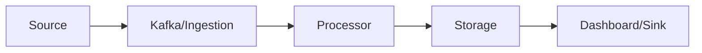

# Unit II: Mining Data Streams ke Notes (Hinglish)

### Topics
1. [Stream Concepts ka Parichay](#1-stream-concepts-ka-parichay)
2. [Stream Data Model aur Architecture](#2-stream-data-model-aur-architecture)
3. [Stream Computing](#3-stream-computing)
4. [Sampling Data in a Stream](#4-sampling-data-in-a-stream)
5. [Filtering Streams](#5-filtering-streams)
6. [Counting Distinct Elements in a Stream](#6-counting-distinct-elements-in-a-stream)
7. [Estimating Moments](#7-estimating-moments)
8. [Counting Oneness in a Window](#8-counting-oneness-in-a-window)
9. [Decaying Window](#9-decaying-window)
10. [RTAP Applications](#10-rtap-applications)
11. [Case Studies](#11-case-studies)
   - [Sentiment Analysis](#sentiment-analysis)
   - [Stock Market Predictions](#stock-market-predictions)

---

## 1. Stream Concepts ka Parichay
Continuous data flows (sensors, tweets) jo rukte nahi; ekbaar padh ke process karna padta hai aur adhiktar approximate nateeje milte hain. Stream ka matlab hai data ki aisi dhaar jo kabhi khatam na ho – jaise factory ke sensors ya stock ticker.

> **Example:** Ek factory mein har second temperature sensor data bhejta hai; system ko current avg nikalna hota hai bina sab records store kiye.

## 2. Stream Data Model aur Architecture
Stream ko sequence maana jata hai. Sources -> ingestion (Kafka) -> processors (Storm/Flink) -> storage -> sinks.

## 3. Stream Computing
Real-time mein tuple par kaam karna; stateful (count, window) aur stateless (filter, map) operators. Stateful component records ka combination rakhte hain, stateless har record alag process karte hain.

> **Example:** GPS coordinates filter karne ke baad per-user speed average nikalne wala windowing operator.

## 4. Sampling Data in a Stream
Reservoir ya Poisson sampling se chhota random sample lena. Ye tab istemal hota jab saara stream process karna mehenga ya waqt khaye.

> **Example:** E‑commerce site har ghante 10,000 orders ka sample le kar recommendation system tune kare.

## 5. Filtering Streams
Predicate ke aadhar par anavashyak tuples hata dena. Isse next stages par load kam padta hai.

> **Example:** Social feed se banned words vale posts hatana sentiment analysis se pehle.

## 6. Counting Distinct Elements in a Stream
FM, HyperLogLog jaise sketch algorithms limited memory mein unique count ka estimate dete. Ye exact set store karne se bahut kam memory lete hain.

> **Example:** News site roj ke unique visitors ka andaaza HyperLogLog se lagaya jata hai.

## 7. Estimating Moments
Moments (count, sum, second moment) ko sketches jaise AMS se andaza lagate. Ye distribution ke shape samajhne mein madad karte hain.

> **Example:** Network packet size ka variance track karne ke liye second moment use hota hai.

## 8. Counting Oneness in a Window
Sliding window mein 1s ki ganana exact queue ya bucket algorithm se. Window mein sirf recent events counted hote hain.

> **Example:** Energy meter ke on/off events ko dekhkar current active devices ka estimation.

## 9. Decaying Window
Exponential weight apply karke purana data kam mahatva pakde; infinite stream ke liye upyogi. Purana record ke contribution time ke saath ghatega.

> **Example:** News sentiment tracker mein ek ghante se purana tweet ka impact kam kar diya jata hai.

## 10. RTAP Applications
Real-time analytics platforms fraud detection, anomaly monitoring, social media listening, IoT telemetry ke liye. Ye messaging, compute aur storage ko jodte hain jisse decisions seconds mein liye ja sakte hain.

> **Example:** Credit card processor har transaction ko score kar ke fraud threshold par rook deta hai.

## 11. Case Studies
### Sentiment Analysis
Twitter se tweets lene, sentiment score karna, window mein aggregate karna aur dashboard par dikhana.

### Stock Market Predictions
Market feed se indicators nikalna, online model chalana, aur threshold par trade execute karna, aksar sub-10ms latency mein.

Real-time stream processing se companies turant events par react kar sakti hain, finance se lekar manufacturing tak sab mein yeh important hai.