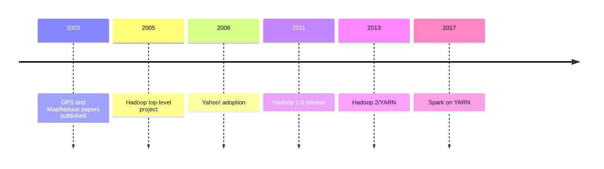
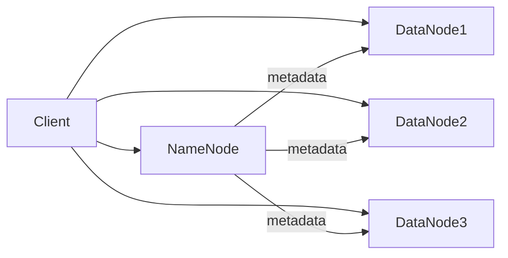
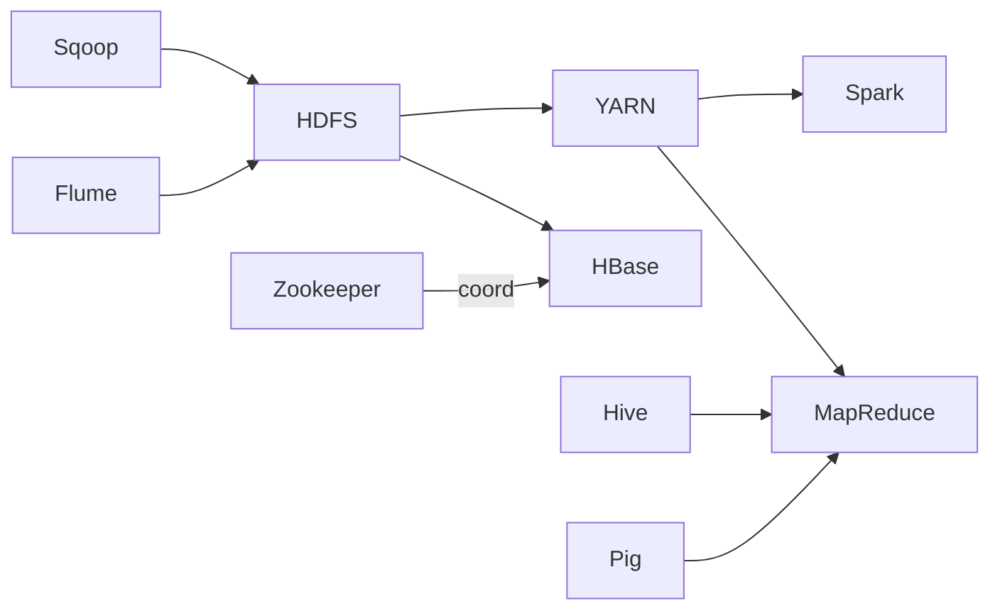
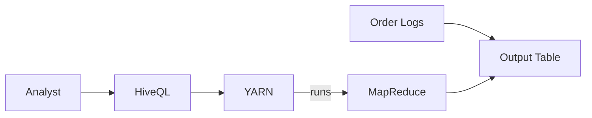
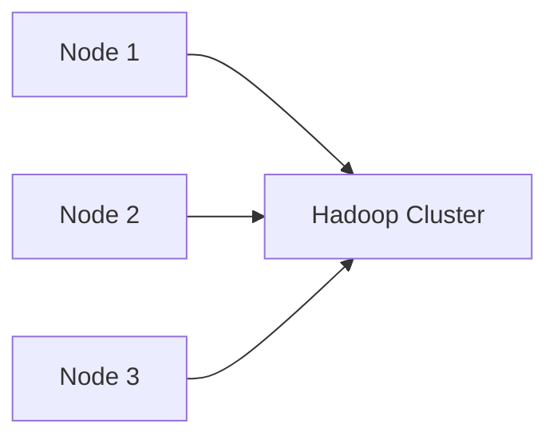
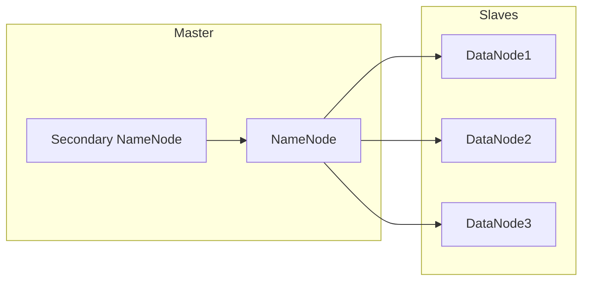
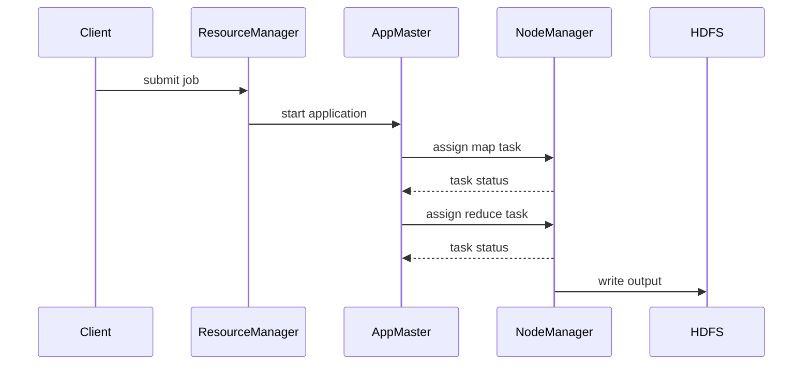
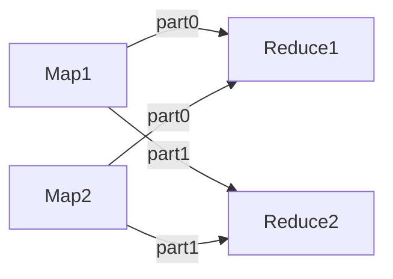

# Unit III: Hadoop (English Detailed)

### Topics

1. [History of Hadoop](#1-history-of-hadoop)
2. [Hadoop Distributed File System (HDFS)](#2-hadoop-distributed-file-system-hdfs)
3. [Components of Hadoop](#3-components-of-hadoop)
4. [Analyzing Data with Hadoop](#4-analyzing-data-with-hadoop)
5. [Scaling Out](#5-scaling-out)
6. [Hadoop Streaming](#6-hadoop-streaming)
7. [Design of HDFS](#7-design-of-hdfs)
8. [Java Interfaces to HDFS Basics](#8-java-interfaces-to-hdfs-basics)
9. [Developing a MapReduce Application](#9-developing-a-mapreduce-application)
10. [How MapReduce Works](#10-how-mapreduce-works)
11. [Anatomy of a MapReduce Job Run](#11-anatomy-of-a-mapreduce-job-run)
12. [Failures](#12-failures)
13. [Job Scheduling](#13-job-scheduling)
14. [Shuffle and Sort](#14-shuffle-and-sort)
15. [Task Execution](#15-task-execution)
16. [MapReduce Types and Formats](#16-mapreduce-types-and-formats)
17. [MapReduce Features](#17-mapreduce-features)
18. [Hadoop Environment](#18-hadoop-environment)

---

## 1. History of Hadoop

Hadoop originated from two papers published by Google in 2003: the GFS (Google File System) paper and the MapReduce paper. Doug Cutting and Mike Cafarella created an open-source project called Nutch, a search engine, which needed a distributed storage and processing platform. Inspired by Google's designs, they separated storage (HDFS) and computation (MapReduce) into a framework called Hadoop, named after Cutting's son's toy elephant.

- 2005: Hadoop becomes a top-level Apache project.
- 2006: Hadoop wins the Yahoo! grid prize and is adopted by Yahoo! for web indexing.
- 2008-2010: HDFS and MapReduce evolve; Hive, Pig, and other ecosystem components appear.
- 2011: Hadoop 1.0 released. 
- 2013-2015: Hadoop 2 introduces YARN and HDFS federation.
- 2017+: Hadoop becomes part of the bigger Big Data ecosystem, with projects like Spark running on YARN.



## 2. Hadoop Distributed File System (HDFS)

HDFS is a distributed, scalable, fault-tolerant file system modeled after GFS. It stores large files across multiple machines in blocks (default 128MB) and replicates each block (typically three copies) across different nodes for reliability. The design accepts that hardware failures are common; software must tolerate them.

Files are split into blocks and written sequentially. When a client wants to read a file, it contacts the NameNode to retrieve a list of DataNode locations containing the blocks, and then streams data directly from those DataNodes.

Key features:

- **Write-once-read-many** semantics: once a file is written, it cannot be modified, only appended. This simplifies consistency and caching.
- **Large block size** reduces seek overhead and improves throughput for large files typical in analytics workloads.
- **Data locality**: computation is moved to where data resides (map tasks run on nodes storing relevant blocks) to minimize network traffic.
- **Failure detection and recovery**: the NameNode tracks metadata; DataNodes send heartbeats and block reports. When a DataNode fails, the NameNode re-replicates its blocks on other nodes to maintain the replication factor.

Additional aspects:

- **Rack awareness**: the NameNode ensures that replicas are placed on different racks to tolerate rack-level failures and optimize network bandwidth.
- **Namespace and block pool separation** (HDFS Federation): allows multiple NameNodes managing separate namespaces sharing the same set of DataNodes.



> **Example:** A 1 TB file will be split into ~8192 blocks (assuming 128 MB). With a replication factor of 3, 24 TB of storage is consumed across the cluster. If a DataNode storing some blocks crashes, the NameNode automatically schedules new replicas on other healthy nodes.

## 3. Components of Hadoop

The core components are:

- **HDFS**: the storage layer providing distributed, replicated file storage.
- **MapReduce**: a batch processing engine that implements the map and reduce programming model.
- **YARN**: (Yet Another Resource Negotiator) the resource manager introduced in Hadoop 2; it decouples resource management and scheduling from data processing, enabling multiple frameworks (e.g., Spark, Tez) to run on a single cluster.
- **Common utilities**: shared libraries and configuration tools that support both HDFS and YARN.

Beyond these, a rich ecosystem has grown around Hadoop:

- **Hive**: a data warehouse infrastructure offering SQL-like queries (HiveQL) that compile to MapReduce, Tez or Spark jobs.
- **Pig**: a scripting language (Pig Latin) for expressing data flows.
- **HBase**: a NoSQL wide-column store providing random, real-time read/write access on top of HDFS.
- **Sqoop**: imports and exports data between HDFS and relational databases.
- **Flume**: a distributed, reliable service for collecting and moving large amounts of log data.
- **Zookeeper**: a coordination service for configuration, naming, and synchronization used by many Hadoop components.


## 4. Analyzing Data with Hadoop

Hadoop allows analysts and developers to process massive datasets by writing MapReduce jobs or using higher-level declarative languages such as HiveQL, Pig Latin, or Spark SQL. The typical workflow is:

1. **Load data** into HDFS (e.g., from logs, databases, or S3) using tools like `hdfs dfs -put`, Sqoop, or Flume.
2. **Define a job**: write a Mapper and Reducer (or use Hive/Pig) and configure the job with input/output paths, formats and parameters.
3. **Submit job** to YARN or the JobTracker. The input files are automatically split into logical `InputSplit`s corresponding to HDFS blocks. Each split is processed by a map task; intermediate key/value pairs are generated.
4. **Reduce phase** aggregates intermediate values by key; results are written back to HDFS.

The emphasis is on **throughput and scalability**: jobs may take minutes or hours, but they can operate on petabytes of data.

> **Example:** An e-commerce company uses Hadoop to compute daily sales totals per product. Map tasks process each order record, emitting `<productID, amount>`. Reducers sum amounts by product. A Hive table is created on the output, enabling analysts to query totals with SQL.


## 5. Scaling Out

Hadoop exemplifies a **scale-out** architecture: instead of buying one powerful machine (scale-up), you add many inexpensive commodity servers to the cluster. Each additional node brings CPU, memory, network and local storage, enabling both capacity and parallel processing to grow linearly. Key benefits:

- **Cost efficiency**: commodity hardware is cheaper per terabyte than enterprise servers.
- **Fault tolerance**: any individual machine failure affects only a portion of data; the system continues operating.
- **Incremental growth**: clusters can expand one node at a time to meet rising demand.

Performance tends to scale until another bottleneck appears (e.g., network bandwidth or NameNode metadata limits). Hadoop users often build clusters with hundreds or thousands of nodes.

> **Example:** Netflix runs Hadoop clusters with over 7,000 nodes to process user activity logs. The clusters grow as the user base expands, and they use auto-scaling to add capacity during peak hours.


## 6. Hadoop Streaming

Hadoop Streaming enables non-Java developers to write MapReduce programs in any language (Python, Perl, Ruby, Bash, etc.) capable of reading from `stdin` and writing to `stdout`. The Hadoop framework provides a streaming wrapper that pipes data to and from the user program, converting Hadoop’s key/value pairs to plain text (or configurable delimiters).

Usage example:

```bash
hadoop jar /path/to/hadoop-streaming.jar \
 -input /logs/* \
 -output /output \
 -mapper "python mapper.py" \
 -reducer "python reducer.py"
```

The `mapper.py` script reads lines of input, processes them, and emits `key\tvalue` pairs. `reducer.py` reads sorted key/value pairs and performs aggregation. Streaming is useful for rapid prototyping or when existing codebases in other languages need to be leveraged.

> **Example:** A log-processing pipeline uses a Python script to parse Apache access logs, extracting the request URL and response code. The reducer counts occurrences per URL.

## 7. Design of HDFS

HDFS design centers on a **master/slave architecture**:

- **NameNode**: the master server that maintains the filesystem namespace (directories, file metadata) and the map from files to blocks and blocks to DataNodes. It keeps this metadata in RAM for fast access and writes updates to a persistent edit log.
- **DataNodes**: worker nodes that store blocks on local disk. They serve read/write requests from clients and periodically send heartbeats and block reports to the NameNode.
- **Secondary NameNode**: not a standby but a helper that periodically downloads the NameNode’s metadata and edit logs, merges them into a new image, and uploads it back. This prevents the edit log from growing indefinitely.

The master is a single point of failure in Hadoop 1; Hadoop 2 introduced high-availability NameNodes using a pair of active/standby nodes with Zookeeper for failover.


## 8. Java Interfaces to HDFS Basics

The Hadoop API exposes HDFS functionality through the abstract `FileSystem` class. Common operations include:

```java
Configuration conf = new Configuration();
FileSystem fs = FileSystem.get(conf);

// create a file and write data
FSDataOutputStream out = fs.create(new Path("/user/data/file.txt"));
out.writeUTF("Hello HDFS");
out.close();

// read a file
FSDataInputStream in = fs.open(new Path("/user/data/file.txt"));
String s = in.readUTF();
in.close();

// list directory
FileStatus[] statuses = fs.listStatus(new Path("/user/data"));
for (FileStatus status : statuses) {
 System.out.println(status.getPath());
}
```

The `FileSystem` object is a client-side handle; calls are forwarded to the NameNode/DataNodes as needed. Developers can also use `DistributedFileSystem` class which extends `FileSystem` and provides HDFS-specific extensions.

## 9. Developing a MapReduce Application

A basic MapReduce program in Java comprises three components:

- **Mapper**: extends `Mapper<KEYIN,VALUEIN,KEYOUT,VALUEOUT>` and overrides the `map()` method. It processes each input record and emits zero or more intermediate key/value pairs.
- **Reducer**: extends `Reducer<KEYIN,VALUEIN,KEYOUT,VALUEOUT>` and overrides the `reduce()` method. It receives a key and an iterable of values and emits final output pairs.
- **Driver (Job configuration)**: sets up the job, specifying input/output paths, mapper/reducer classes, output key/value types, and additional parameters.

The full WordCount example earlier illustrates this structure. Additional features often used:

- **Combiner**: set using `job.setCombinerClass()` to perform local aggregation on map output before shuffle.
- **Partitioner**: custom `Partitioner` can control which reducer a key is sent to (e.g., hash-based, range-based).
- **Counters**: `context.getCounter()` allows tracking custom events.
- **Distributed cache**: use `job.addCacheFile()` to distribute read-only files (e.g., side data) to tasks.

Testing MapReduce jobs locally can be done using the `LocalJobRunner` by setting `conf.set("mapreduce.framework.name","local")`.

```java
public class WordCount {
 public static class TokenizerMapper
 extends Mapper<Object, Text, Text, IntWritable>{
 private final static IntWritable one = new IntWritable(1);
 private Text word = new Text();
 public void map(Object key, Text value, Context context
 ) throws IOException, InterruptedException {
 StringTokenizer itr = new StringTokenizer(value.toString());
 while (itr.hasMoreTokens()) {
 word.set(itr.nextToken());
 context.write(word, one);
 }
 }
 }

 public static class IntSumReducer
 extends Reducer<Text,IntWritable,Text,IntWritable> {
 private IntWritable result = new IntWritable();
 public void reduce(Text key, Iterable<IntWritable> values,
 Context context
 ) throws IOException, InterruptedException {
 int sum = 0;
 for (IntWritable val : values) {
 sum += val.get();
 }
 result.set(sum);
 context.write(key, result);
 }
 }

 public static void main(String[] args) throws Exception {
 Configuration conf = new Configuration();
 Job job = Job.getInstance(conf, "word count");
 job.setJarByClass(WordCount.class);
 job.setMapperClass(TokenizerMapper.class);
 job.setCombinerClass(IntSumReducer.class);
 job.setReducerClass(IntSumReducer.class);
 job.setOutputKeyClass(Text.class);
 job.setOutputValueClass(IntWritable.class);
 FileInputFormat.addInputPath(job, new Path(args[0]));
 FileOutputFormat.setOutputPath(job, new Path(args[1]));
 System.exit(job.waitForCompletion(true) ? 0 : 1);
 }
}
```

## 10. How MapReduce Works

MapReduce jobs proceed through several stages:

1. **Input splitting**: the InputFormat (e.g., `TextInputFormat`) divides the input files into `InputSplit`s, typically corresponding to HDFS blocks. Each split is processed by one map task.
2. **Mapping**: map tasks read records from their split, execute the user-defined `map()` function, and write intermediate key/value pairs to an in-memory buffer. When the buffer is full, it spills sorted data to local disk.
3. **Partitioning**: intermediate pairs are partitioned by a `Partitioner` to ensure all values for the same key go to the same reducer.
4. **Shuffle**: reduce tasks fetch (pull) the appropriate partitions from all map outputs across the cluster. Data is transferred over the network.
5. **Sort**: the fetched data is sorted by key; if map outputs were spilled multiple times, they are merged during sorting.
6. **Reducing**: the `reduce()` method is called for each key and its iterator of values. The reducer emits final results to HDFS via its `OutputFormat`.

Throughout the process, the framework tracks task progress and handles failures by re-executing tasks on other nodes. Combiner functions may be applied between the map and shuffle phases to reduce network traffic.

## 11. Anatomy of a MapReduce Job Run

A MapReduce job passes through the following stages:

- **Job submission**: the client constructs a `Job` object, sets configurations, and calls `job.submit()` or `job.waitForCompletion()`. Under YARN, an **ApplicationMaster** is launched for the job.
- **Input split**: the InputFormat divides input files into splits; these are advertised to the scheduler.
- **Task assignment**: the scheduler (JobTracker in Hadoop 1 or YARN ResourceManager) assigns map tasks to NodeManagers, preferring nodes containing the data (data locality). It also allocates reduce tasks based on available slots.
- **Map phase**: map tasks run, process records, and periodically spill intermediate data to disk. Progress is reported via heartbeats.
- **Shuffle and sort**: reducers pull map outputs corresponding to their partition. Data is sorted by key; a merge-sort algorithm merges multiple spills.
- **Reduce phase**: reducers process sorted keys, call the user `reduce()` method, and write results to HDFS.



## 12. Failures

Hadoop anticipates and tolerates failures at multiple levels:

- **Task failures**: if a map or reduce task throws an exception or its JVM crashes, the framework will restart the task on another node up to a configurable number of attempts (default 4).
- **Node failures**: when a NodeManager or TaskTracker stops sending heartbeats, the scheduler marks it as lost and reassigns its tasks.
- **Speculative execution**: slow-running tasks (``stragglers``) are redundantly executed on other nodes; the first attempt to finish is accepted, and the others are killed.
- **DataNode failures**: HDFS maintains multiple replicas; the NameNode schedules replication of under-replicated blocks when it detects a lost DataNode.
- **NameNode failures** (Hadoop 1): a single point of failure mitigated by regular checkpoints by the Secondary NameNode. Hadoop 2+ supports HA NameNode pairs with automatic failover.

These mechanisms allow a Hadoop cluster to run large jobs for days without human intervention.

## 13. Job Scheduling

Schedulers control how resources (CPU, memory) are allocated to jobs. In YARN, the ResourceManager uses a pluggable scheduler. Common options:

- **FIFO**: jobs run in submission order; simple but can starve later jobs.
- **Fair scheduler**: attempts to give every job, on average, an equal share of resources over time. It supports pools/queues with minimum shares.
- **Capacity scheduler**: organizes jobs into queues that have guaranteed capacity percentages. Good for multi-tenant clusters where different teams have reserved resources.

Schedulers can also enforce **preemption** (taking resources from long-running jobs to satisfy higher-priority ones). Users can configure the number of map/reduce slots or set container memory limits to avoid resource contention.

## 14. Shuffle and Sort

The **shuffle** is the phase between map and reduce where intermediate data is transferred across the network:

1. Map tasks partition output by reducer using the configured `Partitioner` (default is hash-based) and spill sorted data to disk in files named `part-m-xxxxx`.
2. Reduce tasks pull these files over HTTP from each map node. Each reducer fetches only the partitions it needs.
3. As data arrives, the reduce task merges sorted runs. The final result is a single sorted stream of `<key, list<values>>` pairs.

This phase is often the most expensive due to network IO; optimizations include compressing map outputs and using combiners to reduce data size before shuffle.


## 15. Task Execution

Each map or reduce task runs in its own JVM process to isolate crashes and memory leaks. When a task starts, the NodeManager launches a container with specific resources (memory, vcores). The task reports progress periodically via heartbeats. If no heartbeat is received within the timeout, the task is considered failed.

Logs produced by the task (stdout, stderr, syslog) are kept in the node’s local filesystem and can be accessed through the JobHistory or ResourceManager web UI. These logs are critical for debugging failing tasks.

Tasks also have **task counters** (bytes read, records written, etc.) that are aggregated and shown in the job’s summary.

## 16. MapReduce Types and Formats

MapReduce uses **InputFormat** and **OutputFormat** classes to define how data is read from and written to storage. Common input formats:

- `TextInputFormat`: default; interprets each line as a record; key is byte offset, value is line text.
- `KeyValueTextInputFormat`: splits each line into key and value on a tab (or configurable separator).
- `SequenceFileInputFormat`: reads Hadoop `SequenceFile`s containing binary key/value pairs; useful for intermediate data.
- `NLineInputFormat`: splits the input so that each split contains N lines, useful for controlling map task granularity.

Output formats similarly define how reducers write data (e.g., `TextOutputFormat`, `SequenceFileOutputFormat`, `MultipleOutputs`).

**Writable** types are Hadoop’s serializable data types; they must implement the `Writable` interface. Examples include `IntWritable`, `LongWritable`, `Text`, and `ArrayWritable`. Custom writables can be created for complex objects.

## 17. MapReduce Features

Several language-level features enhance MapReduce:

- **Combiner**: a mini-reducer that runs on map output to perform local aggregation before the shuffle. It can dramatically reduce network I/O for associative, commutative functions (e.g., sum).
- **Partitioner**: by default, `HashPartitioner` assigns keys to reducers based on their hash. Custom partitioners (e.g., `TotalOrderPartitioner`) can enforce a global sort or route keys to particular reducers.
- **Counters**: built-in and user-defined metrics (e.g., `context.getCounter(MyCounters.MY_COUNTER).increment(1)`) that track quantities and appear in job reports.
- **Distributed cache**: allows files or archives to be cached on each node before tasks start. Useful for lookup tables, jars, or configuration files.
- **Serialization options**: Hadoop uses `Writable` but supports other serialization frameworks like Avro, Protocol Buffers, or Thrift via `WritableComparable` and SerDe classes.

> **Example:** In a join job, small reference data can be added to the distributed cache and loaded into memory by each mapper for fast lookups.

## 18. Hadoop Environment

Hadoop is written in Java; therefore, a Java Runtime Environment (JRE) must be installed on every node. The cluster is configured via XML files located in `$HADOOP_HOME/etc/hadoop`:

- `core-site.xml` – general configuration (e.g., default filesystem URI `fs.defaultFS`).
- `hdfs-site.xml` – HDFS-specific properties (replication factor, NameNode directories).
- `mapred-site.xml` – MapReduce settings (framework name, job history directory).
- `yarn-site.xml` – YARN resource manager and node manager settings.

To start a Hadoop cluster in pseudo-distributed mode (single node) run `start-dfs.sh` and `start-yarn.sh`. In production, you typically deploy a NameNode (or HA pair), a ResourceManager, and many DataNode/NodeManager worker nodes. Logs are stored under `$HADOOP_LOG_DIR` and can be monitored via web UIs (`http://<namenode>:9870`, `http://<resourcemanager>:8088`).

Security can be enabled using Kerberos authentication, access control lists (ACLs), and encryption at rest/in transit.

---

### Summary

Hadoop provides a scalable storage and processing platform for big data using commodity hardware. Its architecture separates storage (HDFS) from computation (MapReduce/YARN) while supporting fault tolerance, data locality, and extensibility through an ecosystem of tools. Understanding Hadoop's components, job lifecycle, failure handling, and programming model enables developers to build efficient data processing pipelines. Detailed knowledge of configuration, scheduling, and common pitfalls (e.g., stragglers, NameNode limitations) helps in operating clusters effectively.