# 🐘 Unit III: Hadoop — The Fun Way!

> *"Hadoop is named after a toy elephant. It solves elephant-sized data problems. Coincidence? We think not."*

Welcome to **Unit III** — where we meet the granddaddy of Big Data: **Apache Hadoop**. This is the framework that started a revolution, allowed companies to process petabytes of data on cheap hardware, and gave data engineers job security for over a decade. 🎉

---

## 📚 What You'll Learn (Table of Contents)

1. [📜 History of Hadoop](#1--history-of-hadoop)
2. [🗄️ Hadoop Distributed File System (HDFS)](#2-️-hadoop-distributed-file-system-hdfs)
3. [🧩 Components of Hadoop](#3--components-of-hadoop)
4. [🔍 Analyzing Data with Hadoop](#4--analyzing-data-with-hadoop)
5. [📈 Scaling Out](#5--scaling-out)
6. [🌊 Hadoop Streaming](#6--hadoop-streaming)
7. [🏗️ Design of HDFS](#7-️-design-of-hdfs)
8. [☕ Java Interfaces to HDFS Basics](#8--java-interfaces-to-hdfs-basics)
9. [👨‍💻 Developing a MapReduce Application](#9--developing-a-mapreduce-application)
10. [⚙️ How MapReduce Works](#10-️-how-mapreduce-works)
11. [🔬 Anatomy of a MapReduce Job Run](#11--anatomy-of-a-mapreduce-job-run)
12. [💥 Failures](#12--failures)
13. [📋 Job Scheduling](#13--job-scheduling)
14. [🔀 Shuffle and Sort](#14--shuffle-and-sort)
15. [🏃 Task Execution](#15--task-execution)
16. [📦 MapReduce Types and Formats](#16--mapreduce-types-and-formats)
17. [✨ MapReduce Features](#17--mapreduce-features)
18. [🌍 Hadoop Environment](#18--hadoop-environment)

---

## 1. 📜 History of Hadoop

### The Origin Story — A Toy Elephant That Changed the World 🐘

Every great superhero has an origin story. Hadoop's is surprisingly humble — it started as a **search engine side project** and ended up revolutionizing how the entire world handles data.

---

### 🕰️ It All Started With Two Google Papers

In 2003 and 2004, Google published two research papers that changed everything:

1. **"The Google File System" (GFS)** — *"Here's how we store petabytes of data across thousands of cheap servers reliably."*
2. **"MapReduce: Simplified Data Processing on Large Clusters"** — *"Here's how we process those petabytes in parallel without writing complex distributed code."*

Google kept their actual implementation proprietary. But the papers were public. And two engineers at the Apache Nutch project read them very carefully... 👀

---

### 👨‍💻 Doug Cutting & Mike Cafarella — The Founding Fathers

**Doug Cutting** and **Mike Cafarella** were building **Nutch** — an open-source web search engine. To index the web, they needed to crawl billions of pages (massive data!) and process them efficiently. Their existing architecture couldn't scale.

After reading Google's papers, they thought: *"What if we implemented GFS and MapReduce ourselves, open-source?"*

So they did. And they named it **Hadoop** — after Doug Cutting's son's **yellow toy stuffed elephant**. 🐘

> 🎉 **Fun fact:** Hadoop's name was chosen because it was easy to say, easy to spell, and unique enough to Google (pun intended). The yellow elephant became the iconic logo you still see everywhere today!

---

### 📅 The Hadoop Timeline


---

### 🏆 Why Yahoo! Mattered

When **Yahoo!** adopted Hadoop in 2006 for web indexing, it was a massive validation:
- Yahoo! was one of the biggest websites on the internet
- They ran Hadoop on **thousands of machines**
- The performance results were incredible — tasks that took days now took hours
- Doug Cutting himself joined Yahoo! to accelerate development

> 💡 **Yahoo!'s bet:** Yahoo! needed to process billions of web pages to build their search index. Traditional approaches couldn't scale. Hadoop solved the problem for a fraction of the cost of proprietary solutions.

This adoption proved Hadoop worked at "internet scale" — and the rest of the industry took notice. Facebook, Twitter, LinkedIn — they all followed.

---

### 🔑 Key Insight: Why Was Hadoop Revolutionary?

Before Hadoop, to process massive data you had two bad options:

| Option | Problem |
|--------|---------|
| Buy a supercomputer | Costs millions, single point of failure |
| Write custom distributed code | Takes years, error-prone, fragile |

Hadoop offered a **third option**:
- Use **commodity servers** (cheap, off-the-shelf hardware)
- Let the **framework** handle distribution, failures, and scaling
- Write **simple Map and Reduce functions** — the framework does the rest

> 🏗️ **Building analogy:** Before Hadoop, building a distributed data system was like building a skyscraper by hand. Hadoop was the invention of **pre-fabricated construction** — standardized components that anyone could assemble!

---

## 2. 🗄️ Hadoop Distributed File System (HDFS)

### The Problem With Storing a Petabyte

Imagine you need to store 1 petabyte (1,000 terabytes) of data. Options:

1. **One giant hard drive**: Doesn't exist. Max consumer drives are ~20TB.
2. **One giant server with many drives**: Possible but extremely expensive, and if the server dies... everything is gone 😱
3. **Many cheap servers, spread the data**: This is HDFS! ✅

---

### 🌟 The Core HDFS Idea — Blocks + Replication

HDFS does two clever things:

**1. Split files into fixed-size blocks (128 MB by default)**

```
Your 1 TB log file:
┌─────────────────────────────────────────────────────┐
│                     1 TB File                        │
└─────────────────────────────────────────────────────┘
                          ↓ Split into blocks
┌───────┐ ┌───────┐ ┌───────┐ ┌───────┐  ... ┌───────┐
│Block 1│ │Block 2│ │Block 3│ │Block 4│       │Block N│
│128 MB │ │128 MB │ │128 MB │ │128 MB │       │128 MB │
└───────┘ └───────┘ └───────┘ └───────┘       └───────┘
  ~8,192 blocks for a 1 TB file
```

**2. Replicate each block across 3 different machines**

```
Block 1 copy 1 → Node A (Rack 1)
Block 1 copy 2 → Node B (Rack 1)   ← Different nodes, ideally different racks!
Block 1 copy 3 → Node C (Rack 2)
```

> 🧱 **LEGO analogy:** Imagine a giant LEGO castle (your file). Instead of keeping all LEGOs in one box, you split them into numbered bags (blocks) and make 3 copies of each bag, stored in different rooms (nodes). Even if one room floods, you have 2 more copies elsewhere!

---

### 📐 The Math: Storage Cost of Replication

> **Example:** A 1 TB file with replication factor 3:
> - Blocks: 1,024 GB / 128 MB = **8,192 blocks**
> - Storage consumed: 1 TB × 3 replicas = **3 TB total disk space**
> - If one DataNode fails: NameNode detects missing replicas and **automatically creates new copies** on healthy nodes

**Worth the cost?** Absolutely! You get:
- ✅ Fault tolerance (survive node failures)
- ✅ Read performance (multiple copies = load balancing reads)
- ✅ Data locality (place computation near data)

---

### 🔑 Key HDFS Design Principles

#### ✍️ Write-Once-Read-Many (WORM)

HDFS files are **immutable** — once written, they can't be modified (only appended to).

> **Why?** It dramatically simplifies the distributed consistency problem. Imagine 3 copies of a file being modified simultaneously — which version is "correct"? By forbidding edits, the problem disappears!

> 💿 **Analogy:** Like a burned CD. Once you write to it, you can't erase and rewrite. You just read it many times. Hadoop workloads are analytical (read-heavy), so this tradeoff is almost always acceptable.

---

#### 📍 Data Locality — Move Computation, Not Data!

In traditional computing: **Move data → Compute on it**

In Hadoop: **Move computation (program) → Where data is!**

```
Traditional:
  💾 [Data in Server A] ──────────────────→ ⚙️ [Compute Server B]
  (Huge data transfer over network!)

Hadoop (Data Locality):
  💾 [Data in Node A] + ⚙️ [MapTask runs ON Node A]
  (No network transfer — computation happens locally!)
```

> 🍕 **Pizza analogy:** Don't ship the ingredients to the chef 1,000 miles away. Send the recipe to the chef who's standing next to the ingredients!

This is why Hadoop is so fast — it minimizes the most expensive operation in distributed computing: **network I/O**.

---

#### 🏗️ Rack Awareness — Surviving More Than Just Node Failures

HDFS doesn't just place replicas on random nodes — it's smart about **rack placement**:

```
Replica 1 → Node on Rack 1  (local access)
Replica 2 → Different Node on Rack 1  (same rack, faster)
Replica 3 → Node on Rack 2  (different rack — survives rack failure!)
```

> 🏢 **Office building analogy:** Keep one copy of your important report on your desk (Replica 1), one copy in the filing cabinet on your floor (Replica 2), and one in a different floor's storage room (Replica 3). Even if your entire floor floods, the third floor's copy survives!

---

### 🗺️ HDFS Architecture — The Full Picture

```mermaid
flowchart TB
    Client["👤 HDFS Client"]

    subgraph Master["🧠 Master Node"]
        NN["NameNode\n(The Traffic Director)\n• File → Block mapping\n• Block → DataNode mapping\n• Metadata in RAM"]
        SNN["Secondary NameNode\n(The Checkpointer)\n• Merges edit logs\n• NOT a hot standby!"]
    end

    subgraph Rack1["🗄️ Rack 1"]
        DN1["DataNode 1\n• Stores blocks\n• Sends heartbeats\n• Block reports"]
        DN2["DataNode 2\n• Stores blocks\n• Stores replicas"]
    end

    subgraph Rack2["🗄️ Rack 2"]
        DN3["DataNode 3\n• Stores blocks\n• Cross-rack replica"]
        DN4["DataNode 4\n• Stores blocks"]
    end

    Client -->|"1. Where is file X?"| NN
    NN -->|"2. Blocks are on DN1, DN2, DN3"| Client
    Client -->|"3. Read block directly!"| DN1
    Client -->|"3. Read block directly!"| DN2
    NN -->|"Heartbeat monitoring"| DN1 & DN2 & DN3 & DN4
    SNN -->|"Periodic checkpoint"| NN
```



---

### 🤔 Wait — What Does the NameNode Actually Know?

The NameNode maintains a **massive in-RAM metadata table**:

```
File: /logs/2024/jan/access.log
  → Block 1 (offset 0 to 128MB)
      → Replica A: DataNode 7 (192.168.1.7)
      → Replica B: DataNode 12 (192.168.1.12)
      → Replica C: DataNode 31 (192.168.1.31)
  → Block 2 (offset 128MB to 256MB)
      → Replica A: DataNode 3
      → Replica B: DataNode 19
      → Replica C: DataNode 25
  ... (8190 more blocks)
```

Everything in RAM for fast access. Written to an **edit log** on disk for durability.

> ⚠️ **NameNode = Single Point of Failure in Hadoop 1!**  
> If the NameNode dies, you lose all metadata → can't access ANY files, even if the data is still safely on DataNodes!
> 
> Hadoop 2 solved this with **High Availability (HA) NameNodes** — an Active + Standby pair. If the Active dies, the Standby takes over automatically (via Zookeeper coordination).

---

## 3. 🧩 Components of Hadoop

### The Hadoop Family — More than just HDFS + MapReduce

Hadoop is an **ecosystem**, not just one tool. Think of it as a city 🏙️ — HDFS is the roads, MapReduce is the original transportation system, and YARN is the traffic control authority that lets multiple types of vehicles (Spark, Flink, etc.) use the same roads!

---

### 🏛️ The 4 Core Components

```mermaid
graph TB
    HDFS["🗄️ HDFS\nDistributed Storage\n(The Roads)"]
    YARN["🎛️ YARN\nResource Manager\n(The Traffic Authority)"]
    MR["⚙️ MapReduce\nBatch Processing\n(The Original Vehicle)"]
    Common["🔧 Common Utilities\nShared Libraries\n(The Infrastructure)"]

    HDFS <--> YARN
    YARN --> MR
    Common --> HDFS
    Common --> YARN
    Common --> MR
```



| Component | Role | Analogy |
|-----------|------|---------|
| **HDFS** | Store data persistently across nodes | City roads + warehouses |
| **MapReduce** | Process data in parallel batch jobs | The original bus system |
| **YARN** | Allocate cluster resources to any framework | Federal transportation authority |
| **Common** | Shared utilities, config, serialization | Infrastructure (electricity, water) |

---

### 🎛️ YARN — The Game Changer in Hadoop 2

Before YARN (Hadoop 1), MapReduce hogged all cluster resources. Want to run Spark? Start a separate cluster.

YARN decoupled **resource management** from **the processing framework**:

```
HADOOP 1:
  Cluster → MapReduce ONLY
  (Want Spark? Build another cluster 💸)

HADOOP 2 (with YARN):
  Cluster → YARN (Resource Manager)
              ├── MapReduce jobs
              ├── Apache Spark jobs  
              ├── Apache Flink jobs
              ├── Apache Storm jobs
              └── Any other YARN-compatible framework
```

> 🏙️ **City analogy:** YARN is like a city planning authority that manages the roads. The authority doesn't care if you drive a car, a bus, or a truck (MapReduce, Spark, Flink) — it just allocates road space (CPU, memory) fairly!

---

### 🌿 The Hadoop Ecosystem — The Full Zoo

Beyond the core 4, an entire ecosystem grew to handle different needs:

```mermaid
graph LR
    HDFS["🗄️ HDFS\nStorage"]
    YARN["🎛️ YARN\nResources"]

    Hive["🐝 Hive\nSQL queries\non big data"]
    Pig["🐷 Pig\nData flow\nscripting"]
    HBase["📊 HBase\nNoSQL\nreal-time DB"]
    Sqoop["🔄 Sqoop\nDB ↔ HDFS\nimport/export"]
    Flume["🌊 Flume\nLog collection"]
    ZK["🦓 ZooKeeper\nCoordination\nservice"]
    Spark["⚡ Spark\nFast processing"]
    Oozie["📅 Oozie\nWorkflow\nscheduler"]

    Flume -->|"brings logs into"| HDFS
    Sqoop -->|"transfers data to/from"| HDFS
    HDFS --> YARN
    YARN --> Hive
    YARN --> Pig
    YARN --> Spark
    HDFS --> HBase
    ZK -->|"coordinates"| HBase
    ZK -->|"coordinates"| YARN
    Oozie -->|"schedules jobs in"| YARN
```



| Tool | What It Does | Analogy |
|------|--------------|---------|
| 🐝 **Hive** | SQL-like queries → MapReduce/Spark | SQL translator for Hadoop |
| 🐷 **Pig** | High-level data flow language | Scripting language for data pipelines |
| 📊 **HBase** | Random-access NoSQL on top of HDFS | HDFS + real-time lookups |
| 🔄 **Sqoop** | Import/export data between RDBMS and HDFS | Bridge between old and new world |
| 🌊 **Flume** | High-throughput log collection | Log vacuum cleaner |
| 🦓 **ZooKeeper** | Distributed coordination & configuration | The traffic rules + synchronization |
| 📅 **Oozie** | Workflow scheduling for Hadoop jobs | Cron, but for Big Data pipelines |

---

## 4. 🔍 Analyzing Data with Hadoop

### From "I Have Petabytes" to "I Have Answers"

So you've stored your data in HDFS. Now what? Let's see the full analysis workflow:

---

### 🗺️ The Typical Hadoop Analysis Workflow


---

### 📊 Real Example: E-Commerce Daily Sales

> **Scenario:** An e-commerce company wants to compute **total daily sales per product** from millions of order records.

**The Data (in HDFS):** `/orders/2024-01-01.txt`
```
order_001, product_A, 299.00
order_002, product_B, 150.00
order_003, product_A, 299.00
order_004, product_C, 499.00
order_005, product_A, 299.00
... (10 million more rows)
```

**MapReduce Approach:**

```
MAP phase (runs on each block in parallel):
  Each mapper reads its portion of orders and emits:
  (product_A, 299.00)
  (product_B, 150.00)
  (product_A, 299.00)  ← Same product from different orders
  ...

REDUCE phase (one reducer per product):
  Reducer for "product_A" receives: [299.00, 299.00, 299.00, ...]
  Sums them: total = ₹8,97,00,000 for the day
  Outputs: (product_A, 8970000.00)
```

**HiveQL Alternative (much simpler to write!):**
```sql
SELECT product_id, SUM(amount) AS daily_total
FROM orders
WHERE date = '2024-01-01'
GROUP BY product_id
ORDER BY daily_total DESC;
```
*Hive compiles this SQL into MapReduce jobs automatically!*

---

## 5. 📈 Scaling Out

### The Philosophy: Many Small Over One Big

```
TRADITIONAL SCALE-UP:            HADOOP SCALE-OUT:
───────────────────────           ───────────────────────────────────
📦 Need more capacity?            📦 Need more capacity?
   Buy a BIGGER server               Add MORE servers

💰 Cost: Exponential                💰 Cost: Linear
   (bigger = much more expensive)      (add $5K servers, not $500K ones)

🔧 Limit: Hardware ceiling          🔧 Limit: Almost none!
   (can't add infinite RAM)            (Google has millions of nodes)

💀 Failure: Catastrophic            💀 Failure: Graceful
   (1 server dies = everything gone)   (1 of 10,000 dies = 0.01% impact)
```

---

### 📊 The Numbers That Made Hadoop Famous

| Company | Cluster Size | Data Processed |
|---------|-------------|----------------|
| Yahoo! | 4,000+ nodes | 100+ PB indexed web data |
| Facebook | 2,000+ nodes | 60+ PB user activity data (early years) |
| Netflix | 7,000+ nodes | User viewing behavior logs |
| LinkedIn | 3,000+ nodes | Connection graphs, activity feeds |

> 🤯 **Mind-blowing math:** If you tried to process Netflix's data on a single machine at, say, 100 MB/s read speed — scanning 1 PB would take **115 days**. Hadoop on 7,000 nodes? Done in **~24 minutes**.

---

### 📈 Linear Scaling Demonstration

```
1 node  → process 1 TB in 10 hours
2 nodes → process 1 TB in 5 hours  (2x faster, 2x cheaper per TB)
10 nodes → process 1 TB in 1 hour  (10x faster)
100 nodes → process 1 TB in 6 min  (100x faster)
1,000 nodes → process 1 TB in 36 sec (1,000x faster!)
```

This is **embarrassingly parallel** problem solving — each node works independently on its data slice. No coordination needed until the reduce phase!

---

## 6. 🌊 Hadoop Streaming

### "But I Don't Know Java!" — No Problem!

Hadoop was originally written in Java. MapReduce jobs = Java code. But many data engineers prefer Python, Perl, Ruby, or even Bash.

**Hadoop Streaming** solves this: it uses Unix pipes (`stdin`/`stdout`) to connect ANY program to the MapReduce framework!

---

### 🔧 How Streaming Works

```
The Hadoop Streaming Contract:
  Mapper program reads lines from stdin    → emits "key\tvalue\n" to stdout
  Reducer program reads "key\tvalue" lines → emits "resultkey\tresultvalue\n" to stdout

Hadoop handles everything else:
  • Splitting input files
  • Sorting intermediate key/value pairs
  • Routing sorted pairs to the right reducer
  • Writing output to HDFS
```

---

### 🐍 Python MapReduce Example — Word Count

**mapper.py:**
```python
#!/usr/bin/env python3
import sys

for line in sys.stdin:                    # Read from stdin
    line = line.strip()
    words = line.split()
    for word in words:
        print(f"{word}\t1")               # Emit word → 1 to stdout
```

**reducer.py:**
```python
#!/usr/bin/env python3
import sys

current_word = None
current_count = 0

for line in sys.stdin:                    # Read sorted key-value pairs
    line = line.strip()
    word, count = line.split('\t', 1)
    count = int(count)
    
    if current_word == word:
        current_count += count
    else:
        if current_word:
            print(f"{current_word}\t{current_count}")   # Emit final count
        current_word = word
        current_count = count

if current_word:
    print(f"{current_word}\t{current_count}")
```

**Run on Hadoop Cluster:**
```bash
hadoop jar $HADOOP_HOME/tools/lib/hadoop-streaming-*.jar \
  -input  /data/books/*.txt \
  -output /output/wordcount \
  -mapper  "python3 mapper.py" \
  -reducer "python3 reducer.py" \
  -file    mapper.py \
  -file    reducer.py
```

> 🎉 **That's it!** Your Python scripts just processed terabytes of text across hundreds of machines. No Java required!

---

### ✅ When to Use Streaming

| Situation | Use Streaming? |
|-----------|---------------|
| Quick prototype/experiment | ✅ Yes — fast to write |
| Existing Python/Perl scripts to leverage | ✅ Yes |
| Performance-critical production job | ⚠️ Maybe — Java/Scala is faster |
| Complex joins or custom serialization | ❌ Prefer Java API |
| Data scientists who prefer Python | ✅ Yes — comfort wins |

---

## 7. 🏗️ Design of HDFS

### Anatomy of an HDFS Cluster — Deep Dive

---

### 🧠 The NameNode — The Brain of HDFS

**What it stores (ALL in RAM for speed!):**
- Filesystem namespace: directory tree, file names, permissions
- File-to-block mapping: which blocks belong to which file
- Block-to-DataNode mapping: which DataNodes hold each replica

**What it does:**
- Answers client questions: "Where are the blocks for file X?"
- Monitors DataNode health via heartbeats (every 3 seconds by default)
- Detects failed DataNodes and triggers re-replication
- Enforces quotas and permissions

**What it writes to disk:**
- **FsImage**: snapshot of the namespace (like a database checkpoint)
- **EditLog**: journal of all changes since last FsImage

> 🧠 **Brain analogy:** The NameNode is like a hospital's central records system — it knows where every patient's chart (file's blocks) is stored, but it doesn't store the actual charts (the data). The actual charts are in the filing rooms (DataNodes).

---

### 💾 DataNodes — The Workers

**What each DataNode does:**
- Stores actual block data on local disk
- Serves read/write requests directly from clients
- Sends **heartbeats** every 3 seconds (proof of life!)
- Sends **block reports** every 6 hours (full inventory of stored blocks)

When a DataNode **misses heartbeats**, the NameNode:
1. Marks it as dead after 10 minutes (configurable)
2. Identifies all blocks that lost a replica
3. Schedules re-replication on other healthy nodes

---

### 🔄 Secondary NameNode — The Misleadingly Named Helper

> ⚠️ **Common Misconception:** The Secondary NameNode is NOT a backup or standby for the NameNode. It won't save you if the NameNode dies!

**What it actually does:** It's a **checkpoint helper/merge service**:

```
Problem: EditLog grows forever as you make file system changes
         FsImage snapshot gets staler and staler

Secondary NameNode (periodically):
  1. Downloads the current FsImage + EditLog from NameNode
  2. Merges them into a new up-to-date FsImage
  3. Uploads the fresh FsImage back to the NameNode
  4. NameNode now starts a fresh (small) EditLog
  
Result: EditLog stays small, FsImage stays fresh!
```

> 🗂️ **Office analogy:** The Secondary NameNode is like an office assistant who periodically takes all the loose notes (EditLog) and staples them into the master binder (FsImage). They're not the boss — they just keep the paperwork organized!

---

### 🔴 HA NameNode (Hadoop 2+) — The Real Backup

Since a failed NameNode = entire cluster inaccessible, Hadoop 2 introduced **HA (High Availability) mode**:

```
        ┌─────────────────┐       ┌──────────────────┐
        │  NameNode 1     │       │   NameNode 2     │
        │  (ACTIVE) 🟢    │  ←→   │   (STANDBY) 🟡   │
        │  Serving clients│       │  Warm backup     │
        └─────────────────┘       └──────────────────┘
                ↑                           ↑
                └───────────────────────────┘
                         ZooKeeper
                    (Detects failure,
                     triggers failover)

If NameNode 1 fails:
  ZooKeeper detects → promotes NameNode 2 to ACTIVE
  Failover time: ~30-60 seconds (or faster with ZKFC)
```

**Shared Edit Log:** Both NameNodes must see the same edits. Options:
- **Quorum Journal Manager (QJM)**: A cluster of Journal Nodes stores edits. Both NameNodes read from it.
- **NFS shared storage**: Shared file system (simpler but a single point of failure)

---

## 8. ☕ Java Interfaces to HDFS Basics

### Talking to HDFS From Your Code

HDFS exposes a `FileSystem` API that abstracts over different storage backends. The same code can work with HDFS, local files, Amazon S3, and others — just change the URI!

---

### 🛠️ Core Operations

```java
// ─── Setup ───────────────────────────────────────────────────────
Configuration conf = new Configuration();
// conf.set("fs.defaultFS", "hdfs://namenode:8020");  // for real cluster
FileSystem fs = FileSystem.get(conf);

// ─── Write a file ────────────────────────────────────────────────
Path outputPath = new Path("/user/nitish/hello.txt");
FSDataOutputStream out = fs.create(outputPath);
out.writeUTF("Hello HDFS! 🐘");
out.close();
System.out.println("File written to HDFS successfully!");

// ─── Read a file ─────────────────────────────────────────────────
FSDataInputStream in = fs.open(outputPath);
String content = in.readUTF();
in.close();
System.out.println("Read from HDFS: " + content);

// ─── List directory contents ─────────────────────────────────────
FileStatus[] files = fs.listStatus(new Path("/user/nitish/"));
for (FileStatus file : files) {
    System.out.printf("%-10s %s%n",
        file.isDirectory() ? "[DIR]" : "[FILE]",
        file.getPath().getName()
    );
}

// ─── Check if path exists ────────────────────────────────────────
if (fs.exists(outputPath)) {
    System.out.println("File exists!");
}

// ─── Delete a file ───────────────────────────────────────────────
fs.delete(outputPath, false);  // false = don't delete recursively
```

---

### 🔗 URI Schemes — Same API, Different Storage

```java
// Local filesystem
FileSystem local = FileSystem.get(URI.create("file:///"), conf);

// HDFS
FileSystem hdfs = FileSystem.get(URI.create("hdfs://namenode:8020/"), conf);

// Amazon S3
FileSystem s3 = FileSystem.get(URI.create("s3a://my-bucket/"), conf);

// All use the same FileSystem API! ✨
```

> 🔌 **Power socket analogy:** Just like a power socket has a standard interface (you plug in a phone, laptop, or hair dryer), the `FileSystem` API has a standard interface. The underlying storage can be HDFS, S3, or local — your code stays the same!

---

## 9. 👨‍💻 Developing a MapReduce Application

### The Classic: Word Count — Understanding Every Line

Word Count is the "Hello World" of MapReduce. Let's understand exactly what every piece does:

---

### 🗺️ The Big Picture First

```
INPUT: Books stored in HDFS (War and Peace, Harry Potter, etc.)

QUESTION: "How many times does each word appear?"

→ MAP:    Read lines → emit (word, 1) for each word
→ SHUFFLE: Group all (word, 1) pairs by word
→ REDUCE: Sum all 1s for each word → emit (word, total_count)

OUTPUT: (the, 8543), (and, 5212), (dragon, 127), ...
```

---

### ☕ The Full Java Implementation

```java
import java.io.IOException;
import java.util.StringTokenizer;
import org.apache.hadoop.conf.Configuration;
import org.apache.hadoop.fs.Path;
import org.apache.hadoop.io.*;
import org.apache.hadoop.mapreduce.*;
import org.apache.hadoop.mapreduce.lib.input.FileInputFormat;
import org.apache.hadoop.mapreduce.lib.output.FileOutputFormat;

public class WordCount {

  // ─── MAPPER ───────────────────────────────────────────────────
  // Input:  (byte_offset, "To be or not to be")
  // Output: (word, 1) pairs for each word found
  public static class TokenizerMapper
      extends Mapper<Object, Text, Text, IntWritable> {
    
    private final static IntWritable one = new IntWritable(1); // Reused
    private Text word = new Text();                             // Reused
    
    @Override
    public void map(Object key, Text value, Context context)
        throws IOException, InterruptedException {
      
      StringTokenizer itr = new StringTokenizer(value.toString());
      while (itr.hasMoreTokens()) {
        word.set(itr.nextToken().toLowerCase()); // lowercase for consistency
        context.write(word, one);                // Emit (word, 1)
      }
    }
  }

  // ─── REDUCER ──────────────────────────────────────────────────
  // Input:  ("the", [1, 1, 1, 1, 1, ...])  — all 1s for "the"
  // Output: ("the", 8543)
  public static class IntSumReducer
      extends Reducer<Text, IntWritable, Text, IntWritable> {
    
    private IntWritable result = new IntWritable();
    
    @Override
    public void reduce(Text key, Iterable<IntWritable> values, Context context)
        throws IOException, InterruptedException {
      
      int sum = 0;
      for (IntWritable val : values) {
        sum += val.get();  // Add up all the 1s
      }
      result.set(sum);
      context.write(key, result);  // Emit (word, total_count)
    }
  }

  // ─── DRIVER ───────────────────────────────────────────────────
  public static void main(String[] args) throws Exception {
    Configuration conf = new Configuration();
    Job job = Job.getInstance(conf, "word count");
    
    job.setJarByClass(WordCount.class);         // Which JAR to send to cluster
    job.setMapperClass(TokenizerMapper.class);  // Our mapper
    job.setCombinerClass(IntSumReducer.class);  // Local pre-aggregation (optimization!)
    job.setReducerClass(IntSumReducer.class);   // Our reducer
    
    job.setOutputKeyClass(Text.class);          // Output key type: String
    job.setOutputValueClass(IntWritable.class); // Output value type: Integer
    
    FileInputFormat.addInputPath(job, new Path(args[0]));   // Input: /data/books/
    FileOutputFormat.setOutputPath(job, new Path(args[1])); // Output: /output/wordcount/
    
    System.exit(job.waitForCompletion(true) ? 0 : 1); // Wait and report success/failure
  }
}
```

---

### 🔧 The Combiner — The Hidden Optimization

Notice `job.setCombinerClass(IntSumReducer.class)` in the driver?

A **Combiner** is a "mini-reducer" that runs on each mapper's output **before** sending data over the network:

```
WITHOUT Combiner:
  Mapper on Node A processes 1,000 lines of text
  → Emits 5,000 (word, 1) pairs
  → Sends ALL 5,000 pairs over network to reducers

  The word "the" appears 400 times in this mapper's chunk
  → Sends 400 × ("the", 1) over network = 400 messages!

WITH Combiner:
  Mapper on Node A processes 1,000 lines of text
  → Emits 5,000 (word, 1) pairs
  → Combiner runs locally: ("the", [1,1,1,...400 times...]) → ("the", 400)
  → Sends 1 message instead of 400!

Network savings: ~400x reduction for this word!
```

> ⚠️ Combiners only work for **commutative and associative** operations (sum, min, max, count — YES. Average — NO, because (3+5)/2 ≠ 3/2 + 5/2).

---

### 🏃 Run it!

```bash
# Compile
javac -classpath $(hadoop classpath) WordCount.java
jar cf wordcount.jar WordCount*.class

# Run on cluster
hadoop jar wordcount.jar WordCount /data/books/ /output/wordcount/

# View results
hdfs dfs -cat /output/wordcount/part-r-00000 | sort -k2 -nr | head -20
```

Example output:
```
the     8543
and     5212
to      4891
of      4212
a       3876
...
dragon  127
```

---

## 10. ⚙️ How MapReduce Works

### The Full Pipeline — From Input File to Output

```mermaid
flowchart TB
    Input["📄 Input Files in HDFS\n/data/books/"]

    subgraph Split["✂️ Step 1: Input Splitting"]
        IS["InputSplits\n(One per HDFS block = 128 MB)\nLogical, not physical split"]
    end

    subgraph Map["🗺️ Step 2: Map Phase\n(Runs in parallel on each node)"]
        M1["MapTask 1\n→ (word,1) pairs\n→ Spill to disk when buffer full"]
        M2["MapTask 2\n→ (word,1) pairs"]
        M3["MapTask 3\n→ (word,1) pairs"]
    end

    subgraph Partition["🔀 Step 3: Partition"]
        P["Partitioner\n(Hash of key → which Reducer)\nhash('the') % 3 = Reducer 2"]
    end

    subgraph Shuffle["🌐 Step 4: Shuffle\n(Network transfer — most expensive!)"]
        SH["All map outputs for partition 2\ntransferred to Reducer 2's node"]
    end

    subgraph Sort["📊 Step 5: Sort"]
        SO["Merge-sort all received data\nnow: ('the', [1,1,1,1,...])"]
    end

    subgraph Reduce["⚙️ Step 6: Reduce Phase"]
        R1["Reducer 1\n(words a-h)"]
        R2["Reducer 2\n(words i-r)"]
        R3["Reducer 3\n(words s-z)"]
    end

    Output["💾 Output in HDFS\n/output/wordcount/part-r-00000, 00001, 00002"]

    Input --> Split --> Map --> Partition --> Shuffle --> Sort --> Reduce --> Output
```



---

### 📝 Step-by-Step With Examples

#### ✂️ Step 1: Input Splitting
```
File: /data/books/warandpeace.txt (512 MB)
→ Split into 4 InputSplits of 128 MB each
→ 4 MapTasks will be created (one per split)
→ Each MapTask is assigned to a node where that block lives! (data locality)
```

#### 🗺️ Step 2: Map Phase
```
MapTask 1 reads its 128 MB chunk line by line:
  Line: "To be or not to be that is the question"
  Emits: (to,1) (be,1) (or,1) (not,1) (to,1) (be,1) (that,1) (is,1) (the,1) (question,1)
  
  Line: "The dragon flew over the mountains"
  Emits: (the,1) (dragon,1) (flew,1) (over,1) (the,1) (mountains,1)
  
  ... continues for all lines in its 128MB chunk
```

The map output is written to a **circular in-memory buffer** (default 100 MB). When buffer reaches 80% full → **SPILL** (sort + write to local disk).

#### 🔀 Step 3: Partition
```
Default HashPartitioner:
  "the" → hash("the") = 12345 → 12345 % 3 (reducers) = 0 → goes to Reducer 0
  "dragon" → hash("dragon") = 67890 → 67890 % 3 = 1 → goes to Reducer 1
  "and" → hash("and") = 55555 → 55555 % 3 = 2 → goes to Reducer 2
```

**Guarantee:** ALL occurrences of "the" from ALL mappers go to the SAME reducer!

#### 🌐 Step 4: Shuffle (The Expensive Part!)
```
Reducer 0 says: "Give me all partition-0 data from ALL mappers"
→ Fetches from MapTask 1 (on Node A): [("the", 400 tuples)]
→ Fetches from MapTask 2 (on Node B): [("the", 350 tuples)]
→ Fetches from MapTask 3 (on Node C): [("the", 280 tuples)]
→ Fetches from MapTask 4 (on Node D): [("the", 313 tuples)]
```

This network transfer is why **compressing map output** can dramatically improve performance!

#### 📊 Step 5: Sort
```
All data for Reducer 0, now on one node:
  Unsorted: (the,400) (and,200) (that,150) (the,350) (and,250) ...
  Sort by key: (and,200) (and,250) (that,150) (the,400) (the,350) ...
  Group: (and, [200, 250]) (that, [150]) (the, [400, 350]) ...
```

#### ⚙️ Step 6: Reduce
```
reduce("the", [400, 350, 280, 313]) → sum = 1343 → output: ("the", 1343)
reduce("and", [200, 250, ...])      → sum = ...   → output: ("and", total)
```

---

## 11. 🔬 Anatomy of a MapReduce Job Run

### Who Talks to Whom — The Behind-the-Scenes Choreography

```mermaid
sequenceDiagram
    participant C as 👤 Client
    participant RM as 🎛️ YARN ResourceManager
    participant AM as 🤖 Application Master
    participant NM as 🖥️ NodeManager(s)
    participant NN as 🧠 HDFS NameNode
    participant DN as 💾 HDFS DataNode(s)

    C->>NN: Calculate InputSplits (which blocks?)
    NN-->>C: Block locations for input files
    C->>RM: Submit job (JAR + config + input splits)
    RM->>NM: Launch Application Master container
    AM->>RM: Request containers for Map tasks
    RM-->>AM: Allocate containers (preferring data-local nodes)
    AM->>NM: Launch Map task containers
    NM->>DN: Read input blocks (local = fast!)
    NM-->>AM: Report task progress (heartbeats)
    AM->>RM: Request containers for Reduce tasks
    AM->>NM: Launch Reduce task containers
    NM->>NM: Shuffle: pull map outputs over network
    NM->>DN: Write final output to HDFS
    NM-->>AM: Reduce tasks complete!
    AM-->>RM: Job complete!
    AM-->>C: Job done! ✅ Exit code: 0
```



---

### 🎭 The Key Players Explained

| Player | Role | Analogy |
|--------|------|---------|
| **Client** | Submits the job, monitors progress | Project manager who assigns work |
| **ResourceManager** | Manages all cluster resources | The HR/staffing department |
| **Application Master** | Manages ONE specific job | The team lead for one project |
| **NodeManager** | Runs tasks on one machine | The individual worker |
| **HDFS NameNode** | Tells AM where data lives | The filing cabinet directory |

> 🏢 **Office building analogy:**
> - You (Client) go to HR (ResourceManager) and say "I have a big project"
> - HR assigns you a team lead (Application Master) and gives them an office
> - The team lead asks HR for workers (containers)
> - HR creates job listings, workers (NodeManagers) apply
> - The team lead assigns tasks directly to workers
> - Workers report progress back to team lead
> - Team lead reports completion back to you!

---

## 12. 💥 Failures

### "Assume Everything Will Break" — The Hadoop Philosophy

Hadoop was designed from day one under the assumption that **hardware will fail**. On a 1,000-node cluster, statistically you'll have a failed disk or machine almost every day!

---

### 🔧 Types of Failures and How Hadoop Handles Them

#### 1. Task Failure (Map or Reduce task crashes)

```
Scenario: MapTask on Node 7 throws OutOfMemoryError

Hadoop response:
  1. NodeManager reports task failure to ApplicationMaster
  2. AM marks the attempt as failed
  3. AM requests a new container for a fresh attempt (elsewhere)
  4. New MapTask re-reads the SAME InputSplit from HDFS (using another replica)
  5. Job continues!

Default: Up to 4 attempts before the job fails entirely
```

#### 2. Node Failure (Entire machine goes down)

```
Scenario: NodeManager on Node 15 stops responding

Hadoop response:
  1. ApplicationMaster notices missing heartbeats (after timeout)
  2. AM marks Node 15 as lost
  3. All tasks running on Node 15 are re-assigned to other nodes
  4. If Node 15 had map outputs needed for reduce phase:
     → Those map tasks are RE-RUN on other nodes!
  
HDFS response (separate):
  1. NameNode notices missing DataNode heartbeats
  2. Identifies all blocks that lost a replica
  3. Schedules re-replication on surviving nodes
  4. Replication factor restored automatically!
```

#### 3. Speculative Execution — The "Straggler" Problem

```
Scenario: Job has 100 map tasks. 99 finish in 5 minutes.
          MapTask 73 on Node 42 is only 60% done after 10 minutes.
          
          Why? Node 42 might have: slower disk, network issues,
               background processes stealing CPU, or just bad luck.

Without speculative execution:
  Entire job waits for slow MapTask 73! ⏰ Wastes everyone's time.

With speculative execution:
  1. Framework detects MapTask 73 is "significantly behind average"
  2. Launches a DUPLICATE attempt on a different, free node
  3. Whichever finishes first → its output is used ✅
  4. The loser is killed
  
Result: Job completes nearly as fast as the fastest 99 tasks!
```

> 🏃 **Race analogy:** Speculative execution is like having two sprinters run the same race. The first to reach the finish line wins; the other stops. You don't wait for the slow runner!

---

### 📊 Failure Tolerance Summary

```mermaid
flowchart TB
    F["💥 Failure Types"]

    F --> TF["🔧 Task Failure\nRetry up to 4 times\non different nodes"]
    F --> NF["🖥️ Node Failure\nTasks reassigned\nHDFS re-replicates"]
    F --> SF["🐢 Slow Task\nSpeculative execution\n(launch duplicate)"]
    F --> DNF["💾 DataNode Failure\nNameNode detects\nAuto re-replication"]
    F --> NNF["🧠 NameNode Failure\n(Hadoop 2+) HA Standby\nZookeeper failover"]
```



---

## 13. 📋 Job Scheduling

### The Traffic Controller — Who Gets Resources When?

With dozens of teams running hundreds of jobs on a shared cluster, **fair resource allocation** is critical.

---

### 📊 The 3 YARN Schedulers

#### 🐌 FIFO Scheduler — First Come, First Served
```
Job Queue: [Big Job A (needs 80% cluster) → Small Job B → Small Job C]

Timeline:
  t=0:   Job A starts. Uses 80% of cluster.
  t=5h:  Job A finishes. 
  t=5h:  Job B starts (waited 5 hours! 😱)
  t=5h+: Job C starts after B

Problem: One huge job blocks everyone else!
```

**Use case:** Development clusters, single-team environments with no contention.

---

#### ⚖️ Fair Scheduler — Everyone Gets a Fair Share

```
Queue: [Long Job A, Short Job B, Short Job C] submitted simultaneously

Fair Scheduler behavior:
  t=0:   All 3 jobs get 33% of cluster resources each
  t=10m: Job B finishes early! Resources freed.
  t=10m: Jobs A and C now each get 50% 
  t=20m: Job C finishes! Resources freed.
  t=20m: Job A gets 100% — finishes faster!

Result: No job starves. Short jobs complete quickly!
```

**Use case:** Multi-team environments where fairness matters.

---

#### 🏢 Capacity Scheduler — Guaranteed Shares Per Team

```
Configuration:
  Engineering team: 60% of cluster
  Marketing team:   30% of cluster
  Shared pool:      10% of cluster

Behavior:
  If Marketing has no jobs running → their 30% can be borrowed by others
  When Marketing submits a job → they get their 30% back (preemption)
  Engineering is ALWAYS guaranteed their 60%, no matter what!
```

**Use case:** Enterprise multi-tenant clusters with SLA commitments per team.

---

### 🔢 Resource Allocation Details

YARN allocates resources in **containers** with specific CPU + memory:

```
NodeManager on each machine reports:
  "I have 64 GB RAM and 16 CPU cores available"

Resource requests:
  MapTask: 1 core, 2 GB RAM (typical)
  ReduceTask: 1 core, 4 GB RAM (typical, needs more for merging)
  
So this NodeManager can run:
  Up to 16 map tasks simultaneously (CPU limited)
  Or up to 32 map tasks (if 2GB each, RAM limited at 64GB)
```

---

## 14. 🔀 Shuffle and Sort

### The Most Expensive Phase — Understanding Every Millisecond

The Shuffle is the **most complex and expensive phase** of MapReduce. Optimizing it can make a 10x difference in job runtime.

---

### 🔄 The Full Shuffle and Sort Details

```mermaid
graph TB
    subgraph MapSide["🗺️ Map Side (Each Mapper)"]
        MB["In-Memory Buffer\n(100 MB default)"]
        Spill["Spill to Disk\n(at 80% full = 80MB)"]
        Merge["Final Merge\n(Merge all spill files)"]
        Compress["Optional: Compress output\n(LZ4, Snappy, Gzip)"]
    end

    subgraph Network["🌐 Network Transfer"]
        HTTP["HTTP fetch\nReducer pulls partitions\nfrom all mappers"]
    end

    subgraph ReduceSide["⚙️ Reduce Side"]
        Copy["Copy Phase\n(Fetch from mappers)"]
        MergeR["Merge Phase\n(Merge-sort received files)"]
        ReduceF["Reduce Function\n(User code runs here)"]
    end

    MB -->|"80% full"| Spill
    Spill -->|"sort + partition"| Merge
    Merge --> Compress
    Compress --> HTTP
    HTTP --> Copy
    Copy --> MergeR
    MergeR --> ReduceF
```



---

### ⚙️ Map-Side Details

**The In-Memory Circular Buffer:**
```
[──────────────────────────────────────────────────]
 ↑ spill point (80%)                  ↑ fill point
 
 Map output is written to this circular buffer.
 When 80% full → spill thread sorts + writes to disk in background.
 Map task continues writing to the remaining 20%.
```

**Spill files:** Sorted by key within each partition. A map task may create multiple spill files.

**Final merge:** Before the map task completes, all spill files are merged into one sorted file per partition — ready for reducers to fetch.

---

### 🌐 Reduce-Side: The Three Sub-Phases

**1. Copy Phase:**
```
Reducer 0 needs partition 0 data from ALL 1,000 map tasks.
It opens HTTP connections to all 1,000 NodeManagers simultaneously
and pulls its partition data. (This is where network is saturated!)
```

**2. Merge Phase:**
```
AS data arrives from mappers, it's merged with previously arrived data.
Final result: One big sorted file with all keys for this reducer.
(the, [1,1,1,...8543 times...])
(dragon, [1,1,...127 times...])
```

**3. Reduce Phase:**
```
User's reduce() method is finally called.
It receives one (key, Iterable<values>) at a time.
Output written to HDFS!
```

---

### 🚀 Optimizing Shuffle — Production Tips

| Optimization | How | Impact |
|---|---|---|
| **Compress map output** | `mapreduce.map.output.compress=true` | 30-80% less network traffic |
| **Use Combiners** | `job.setCombinerClass(...)` | Reduce map output size drastically |
| **Increase buffer size** | `mapreduce.task.io.sort.mb=200` | Fewer spills to disk |
| **More reducers** | `job.setNumReduceTasks(N)` | More parallelism in reduce phase |
| **Use Snappy** | Fast compression codec | Low CPU overhead + good compression ratio |

> 💡 **Rule of thumb:** If your shuffle is slow, first try enabling map output compression. This single change can reduce shuffle time by 50%+ with minimal CPU overhead using Snappy or LZ4.

---

## 15. 🏃 Task Execution

### The Lifecycle of a Single Task — What Happens Inside a Container

When YARN launches a container to run a task:

```
1. 📦 Container started by NodeManager (its own JVM process!)
           ↓
2. 🗃️ Task receives its InputSplit info (or reducer partition info)
           ↓
3. 📖 Map task: reads records from InputFormat (line by line for TextInputFormat)
   🔄 OR Reduce task: pulls shuffle data from mappers
           ↓
4. ⚙️ User's map()/reduce() code executes
           ↓
5. 💾 Output written (to buffer/disk for maps, to HDFS for reduces)
           ↓
6. 📡 Heartbeats sent to ApplicationMaster every few seconds:
   "I'm 45% done. Still alive! ✅"
           ↓
7. ✅ Task completes → container released back to YARN pool
```

---

### 📊 Task Counters — Built-in Metrics

Every task automatically tracks metrics:

```
Map-Reduce Framework
  Map input records=10000000      ← How many records were processed
  Map output records=45823912     ← How many (k,v) pairs emitted
  Map output bytes=366591296      ← Size of map output
  Map output materialized bytes=  ← After compression
  Input split bytes=128000000     ← Size of this task's input
  Combine input records=          ← Records fed to combiner
  Combine output records=         ← Records output from combiner
  Reduce input records=           ← Records fed to reducer
  Reduce shuffle bytes=           ← Bytes transferred in shuffle
  ...
```

These appear in the job's history server and are invaluable for **debugging and optimization**.

---

### 📝 Task Logs — Your Debugging Best Friend

Each task writes to:
- **stdout**: `System.out.println()` statements
- **stderr**: `System.err.println()` and logged exceptions
- **syslog**: Framework messages

Access via:
```
ResourceManager Web UI: http://<rm-host>:8088
  → Click on your Application ID
  → Click on a finished/failed task
  → Click "logs"

Or via command line:
yarn logs -applicationId application_12345_0001
```

> 🔍 **Debugging tip:** When a task fails, the first thing to check is the task's **stderr log**. It usually contains the Java stack trace showing exactly what went wrong!

---

## 16. 📦 MapReduce Types and Formats

### How Hadoop Reads and Writes Data

---

### 📥 InputFormats — "How Should I Read This Data?"


| Format | Use When |
|--------|----------|
| **TextInputFormat** | Plain text files, CSV, TSV — the default |
| **KeyValueTextInputFormat** | Files already have tab-separated key-value structure |
| **SequenceFileInputFormat** | Reading output of a previous MapReduce job |
| **NLineInputFormat** | You want exactly N lines per mapper (test jobs) |
| **DBInputFormat** | Reading from a relational database |

---

### 📤 OutputFormats — "How Should I Write Results?"

```java
// TextOutputFormat (default): writes "key\tvalue\n"
job.setOutputFormatClass(TextOutputFormat.class);

// SequenceFileOutputFormat: writes binary (for chaining jobs)
job.setOutputFormatClass(SequenceFileOutputFormat.class);

// Multiple output files based on condition
MultipleOutputs<Text, IntWritable> mos = new MultipleOutputs<>(context);
mos.write("highValue", key, value, "high-value-products");
mos.write("lowValue", key, value, "low-value-products");
```

---

### ✍️ Writable Types — Hadoop's Serialization

Hadoop has its own serializable data types (implementing the `Writable` interface). Why not use Java's built-in serialization? **Performance!** Java serialization is 10x slower and bulkier.

| Writable Type | Java Equivalent | Use For |
|---------------|-----------------|---------|
| `IntWritable` | `int` | Integer counts, IDs |
| `LongWritable` | `long` | File offsets, large numbers |
| `FloatWritable` | `float` | Decimal numbers |
| `DoubleWritable` | `double` | Precise decimals |
| `Text` | `String` | Text, most keys/values |
| `BooleanWritable` | `boolean` | Flags |
| `ArrayWritable` | Array | Lists of values |
| `MapWritable` | HashMap | Key-value maps |

**Custom Writable:**
```java
public class SalesRecord implements Writable {
    private Text productId = new Text();
    private DoubleWritable amount = new DoubleWritable();
    
    @Override
    public void write(DataOutput out) throws IOException {
        productId.write(out);
        amount.write(out);
    }
    
    @Override
    public void readFields(DataInput in) throws IOException {
        productId.readFields(in);
        amount.readFields(in);
    }
}
```

---

## 17. ✨ MapReduce Features

### The Power-Ups — Making Jobs Faster and Smarter

---

### 🎯 Combiner — The Network Saver

Already covered in the Word Count section! Quick recap:

```
Rule: Combiner = Mini-Reducer that runs LOCALLY on each map node
Works for: SUM, MIN, MAX, COUNT (associative + commutative ops)
Does NOT work for: AVERAGE, MEDIAN (order/grouping dependent)

Example where combiner fails:
  Average temperature across all cities:
  ❌ Combiner computes local averages → reducer averages those averages
     = WRONG (unequal sample sizes)
  ✅ Instead: combiner sums totals + counts separately → reducer divides
```

---

### 🔀 Custom Partitioner — Control Who Goes Where

By default, `HashPartitioner` distributes keys randomly (but consistently). Sometimes you need more control:

```java
// TotalOrderPartitioner: ensures output is globally sorted
// Example: sort all sales records by amount in total order
job.setPartitionerClass(TotalOrderPartitioner.class);

// CustomPartitioner: route specific keys to specific reducers
public class RegionPartitioner extends Partitioner<Text, IntWritable> {
    @Override
    public int getPartition(Text key, IntWritable value, int numPartitions) {
        String region = key.toString().split("_")[0];
        if (region.equals("NORTH")) return 0;
        if (region.equals("SOUTH")) return 1;
        return 2;  // EAST, WEST, etc.
    }
}
```

**Use cases:**
- Route all data for a specific customer to the same reducer (for joins)
- Ensure globally sorted output (for range-based analysis)
- Load balancing when some keys are much more frequent (hot keys)

---

### 📊 Custom Counters — Track Business Metrics

```java
// Define an enum for your counters
public enum MyCounters {
    RECORDS_PROCESSED,
    NULL_VALUES_FOUND,
    SUSPICIOUS_TRANSACTIONS,
    HIGH_VALUE_ORDERS
}

// In your Mapper:
public void map(Object key, Text value, Context context) {
    context.getCounter(MyCounters.RECORDS_PROCESSED).increment(1);
    
    String amount = value.toString().split(",")[2];
    if (amount == null || amount.isEmpty()) {
        context.getCounter(MyCounters.NULL_VALUES_FOUND).increment(1);
        return; // skip this record
    }
    
    if (Double.parseDouble(amount) > 100000) {
        context.getCounter(MyCounters.HIGH_VALUE_ORDERS).increment(1);
    }
    
    // ... continue processing
}
```

After job completion:
```
Counters: 5
    MyCounters
        HIGH_VALUE_ORDERS=1247
        NULL_VALUES_FOUND=32
        RECORDS_PROCESSED=10000000
        SUSPICIOUS_TRANSACTIONS=89
```

> 💡 **Practical use:** Counters are the fastest way to do **data quality checks** in MapReduce. Check how many nulls, how many skipped records, how many boundary cases — all without a separate job!

---

### 📦 Distributed Cache — Share Static Data With All Tasks

**Problem:** Your mapper needs to look up customer names from a reference table. 2 million customers = 200 MB. You can't read from HDFS inside every map operation (too slow).

**Solution:** Distribute the file to every node's local disk BEFORE tasks start!

```java
// In your Driver:
job.addCacheFile(new URI("hdfs:///reference/customer_names.txt"));

// In your Mapper's setup() method (runs once per task, not once per record):
@Override
protected void setup(Context context) throws IOException {
    URI[] cacheFiles = context.getCacheFiles();
    BufferedReader reader = new BufferedReader(
        new FileReader(new File(cacheFiles[0].getPath()))
    );
    String line;
    while ((line = reader.readLine()) != null) {
        String[] parts = line.split(",");
        customerNames.put(parts[0], parts[1]);  // Load into HashMap
    }
}

// In your map() method:
public void map(Object key, Text value, Context context) {
    String customerId = extractCustomerId(value);
    String name = customerNames.get(customerId);  // Fast in-memory lookup!
    // ...
}
```

> 🚀 **Performance tip:** For a 1,000-node cluster, instead of 1,000 tasks each reading a 200MB file from HDFS (200 GB total network traffic!), Distributed Cache transfers the file to each node ONCE = 200 MB × 1,000 nodes = still 200 GB but cached locally = much faster!

---

## 18. 🌍 Hadoop Environment

### Setting Up and Running Hadoop

---

### 📁 Configuration Files — The 4 Key XML Files

All Hadoop configuration lives in XML files in `$HADOOP_HOME/etc/hadoop/`:

```xml
<!-- core-site.xml: Basic cluster settings -->
<configuration>
    <property>
        <name>fs.defaultFS</name>
        <value>hdfs://namenode:8020</value>
        <!-- This tells clients where the NameNode is -->
    </property>
    <property>
        <name>hadoop.tmp.dir</name>
        <value>/data/hadoop/tmp</value>
    </property>
</configuration>
```

```xml
<!-- hdfs-site.xml: HDFS-specific settings -->
<configuration>
    <property>
        <name>dfs.replication</name>
        <value>3</value>  <!-- Default replication factor -->
    </property>
    <property>
        <name>dfs.blocksize</name>
        <value>134217728</value>  <!-- 128 MB in bytes -->
    </property>
    <property>
        <name>dfs.namenode.name.dir</name>
        <value>/data/hdfs/namenode</value>  <!-- Where NameNode stores metadata -->
    </property>
    <property>
        <name>dfs.datanode.data.dir</name>
        <value>/data/hdfs/datanode</value>  <!-- Where DataNodes store blocks -->
    </property>
</configuration>
```

```xml
<!-- mapred-site.xml: MapReduce settings -->
<configuration>
    <property>
        <name>mapreduce.framework.name</name>
        <value>yarn</value>  <!-- Use YARN for resource management -->
    </property>
    <property>
        <name>mapreduce.map.memory.mb</name>
        <value>2048</value>  <!-- 2 GB per map task -->
    </property>
    <property>
        <name>mapreduce.reduce.memory.mb</name>
        <value>4096</value>  <!-- 4 GB per reduce task -->
    </property>
</configuration>
```

```xml
<!-- yarn-site.xml: YARN resource manager settings -->
<configuration>
    <property>
        <name>yarn.resourcemanager.hostname</name>
        <value>resourcemanager</value>
    </property>
    <property>
        <name>yarn.nodemanager.resource.memory-mb</name>
        <value>65536</value>  <!-- 64 GB RAM per NodeManager -->
    </property>
    <property>
        <name>yarn.nodemanager.resource.cpu-vcores</name>
        <value>16</value>  <!-- 16 cores per NodeManager -->
    </property>
</configuration>
```

---

### 🚀 Starting Hadoop (Pseudo-Distributed Mode)

Pseudo-distributed mode runs the FULL Hadoop stack on ONE machine using separate JVM processes. Perfect for development!

```bash
# Format the NameNode (ONLY do this once when setting up fresh!)
hdfs namenode -format

# Start HDFS (NameNode + DataNode)
start-dfs.sh

# Start YARN (ResourceManager + NodeManager)
start-yarn.sh

# Verify everything is running
jps
# Should show:
# 12345 NameNode
# 12789 DataNode
# 13456 SecondaryNameNode
# 14123 ResourceManager
# 14567 NodeManager
```

**Web UIs to check:**
```
HDFS Status:      http://localhost:9870   (Browse files, check health)
YARN Jobs:        http://localhost:8088   (Running jobs, queue status)
Job History:      http://localhost:19888  (Completed job details and logs)
```

---

### 🔒 Security — Kerberos for Production

In production, you definitely want to enable Kerberos authentication:

```
Without security: Any user can read/write any HDFS path! 😱
With Kerberos:
  - Every user and service must authenticate with a Kerberos ticket
  - HDFS enforces Unix-style permissions (owner, group, others)
  - All data transfers can be encrypted (transparent)
  
Additional security layers:
  - HDFS encryption zones: Data encrypted on disk 🔐
  - SSL/TLS: Data encrypted in transit 🔒
  - Ranger: Fine-grained access control (table-level, column-level!)
  - Atlas: Data lineage and governance
```

---

### 🛠️ Essential HDFS Commands Cheat Sheet

```bash
# File Operations
hdfs dfs -ls /user/nitish/              # List directory
hdfs dfs -put localfile.txt /hdfs/path/ # Upload to HDFS
hdfs dfs -get /hdfs/path/ ./local/      # Download from HDFS
hdfs dfs -cat /hdfs/file.txt            # Print file contents
hdfs dfs -mkdir /new/directory          # Create directory
hdfs dfs -rm /hdfs/file.txt             # Delete file
hdfs dfs -rm -r /hdfs/directory/        # Delete directory recursively
hdfs dfs -mv /old/path /new/path        # Move file
hdfs dfs -cp /source /destination       # Copy file

# Information
hdfs dfs -du -h /user/                  # Disk usage (human readable)
hdfs dfs -df -h                         # HDFS free/used space
hdfs fsck /                             # Filesystem health check
hdfs dfs -stat %r /path                 # Replication factor of a file

# YARN Commands
yarn application -list                  # All running applications
yarn application -kill application_ID   # Kill a job
yarn logs -applicationId app_ID         # View job logs
```

---

## 🎓 Unit Summary

```mermaid
mindmap
  root((🐘 Hadoop))
    History
      2003 Google GFS + MapReduce papers
      2006 Yahoo! adoption
      2013 Hadoop 2 + YARN
    HDFS
      Blocks 128MB + 3x replication
      NameNode metadata in RAM
      DataNode workers store blocks
      HA NameNode pair in Hadoop 2
      Write-Once Read-Many semantics
      Data Locality key innovation
    YARN
      ResourceManager allocates resources
      NodeManager runs containers
      ApplicationMaster per-job
      Supports Spark, Flink, MR
    MapReduce
      Map emits key-value pairs
      Shuffle groups by key
      Sort orders within key
      Reduce aggregates per key
      Combiner optimizes network
      Partitioner controls routing
    Ecosystem
      🐝 Hive SQL queries
      📊 HBase NoSQL
      🔄 Sqoop DB transfer
      🌊 Flume log collection
      🦓 ZooKeeper coordination
    Configuration
      core-site.xml
      hdfs-site.xml
      mapred-site.xml
      yarn-site.xml
```



---

## 🧪 Test Your Knowledge — Quick Quiz!

**Q1.** A 512 MB file is stored in HDFS with default block size (128 MB) and replication factor 3. How many total blocks are stored across the cluster?
<details>
<summary>Click to reveal answer 👆</summary>

**12 blocks** total.
- 512 MB ÷ 128 MB = **4 blocks** in the file
- 4 blocks × **3 replicas** = **12 block copies** stored

Total disk space consumed: 512 MB × 3 = **1.5 GB**
</details>

---

**Q2.** What is "data locality" in Hadoop, and why is it important?
<details>
<summary>Click to reveal answer 👆</summary>

Data locality means **running computation on the same node where the data lives**, rather than transferring data to a compute node.

**Why important:** Moving data is expensive (network bandwidth, latency). In a 1,000-node cluster processing petabytes, moving all data to one machine would take hours. By sending the program (KB) to the data (GB/TB), you eliminate the biggest bottleneck.

YARN's ApplicationMaster prefers to assign map tasks to nodes that contain the InputSplit's block.
</details>

---

**Q3.** What's the difference between the Secondary NameNode and a Standby NameNode?
<details>
<summary>Click to reveal answer 👆</summary>

- **Secondary NameNode**: NOT a backup! It's a **checkpoint helper** that periodically merges the FsImage + EditLog and uploads a fresh FsImage to the NameNode. It does NOT take over if the NameNode dies!

- **Standby NameNode** (Hadoop 2 HA): A **real hot backup**. Synchronized with the Active NameNode via shared Journal Nodes. If the Active dies, ZooKeeper triggers failover and the Standby becomes Active automatically within ~30-60 seconds.
</details>

---

**Q4.** A MapReduce job is computing the average price of products. Can you use a Combiner? Why or why not?
<details>
<summary>Click to reveal answer 👆</summary>

**Not directly!** Average is NOT associative/commutative — averaging local averages gives wrong results.

**Correct approach:** Instead of emitting (product, price), emit **(product, (sum, count))** as a pair. The Combiner sums both numerator and denominator: (product, (local_sum, local_count)). The Reducer then computes final_average = total_sum / total_count.

This way you CAN use a Combiner-equivalent with correct math!
</details>

---

**Q5.** What happens when a map task produces too much output for its 100MB in-memory buffer?
<details>
<summary>Click to reveal answer 👆</summary>

When the buffer reaches **80% full** (80MB), a background **spill thread** kicks in:
1. Sorts the buffer contents by (partition, key)
2. Writes sorted data to a temporary file on local disk
3. The map task continues writing to the remaining 20%

When the map task finishes, all spill files are **merged** into a single sorted file per partition using a merge-sort algorithm. This merged file is what reducers fetch during the shuffle phase.
</details>

---

## 🧠 Mnemonics to Remember

| Concept | Mnemonic |
|---------|----------|
| **HDFS key properties** | **"Write Once, Read Many, Blocks Big, Replicas Triple"** |
| **MapReduce phases** | **"Inputs Split, Mappers Emit, Partitioners Sort, Shufflers Route, Reducers Sum"** → **IS MEPSRS** |
| **Hadoop core components** | **"YMCH"** — Yesterday's Machines Can't Handle it → **YARN, MapReduce, Common, HDFS** |
| **Failure handling** | **"Tasks Retry, Nodes Reassign, Stragglers Speculate"** |
| **4 config files** | **"Could Hadoop Map YARN?"** → **core, hdfs, mapred, yarn** |
| **HDFS Architecture** | **"Name Directs, Data Stores, Secondary Checkpoints"** |

---

## 📚 Further Reading & Resources

| Resource | What It Covers |
|----------|---------------|
| 📖 *Hadoop: The Definitive Guide* — Tom White (O'Reilly) | The bible of Hadoop |
| 🌐 Apache Hadoop Docs (hadoop.apache.org) | Official configuration reference |
| 📄 *The Google File System* (GFS paper, 2003) | The inspiration for HDFS |
| 📄 *MapReduce: Simplified Data Processing* (Google, 2004) | The original MapReduce paper |
| 🎥 Cloudera/Hortonworks tutorials | Practical Hadoop setup guides |
| 🌐 Apache Hive documentation | SQL-on-Hadoop reference |

---

*Made with ❤️ for Big Data learners everywhere. Hadoop may not be the flashiest tech anymore, but understanding it is the foundation of everything that came after.*

---
*Unit III Complete ✅ → Proceed to Unit IV*
