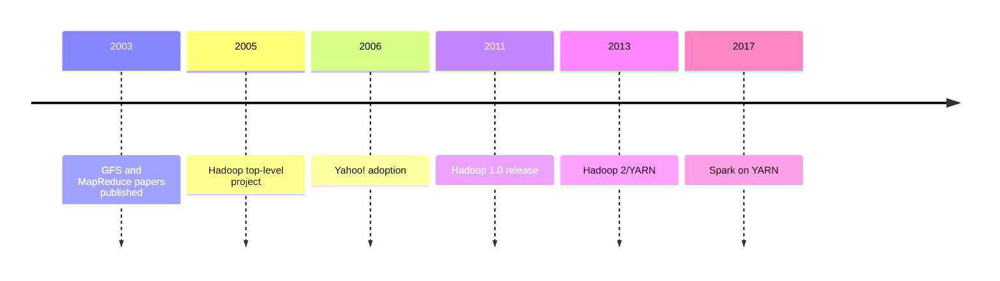
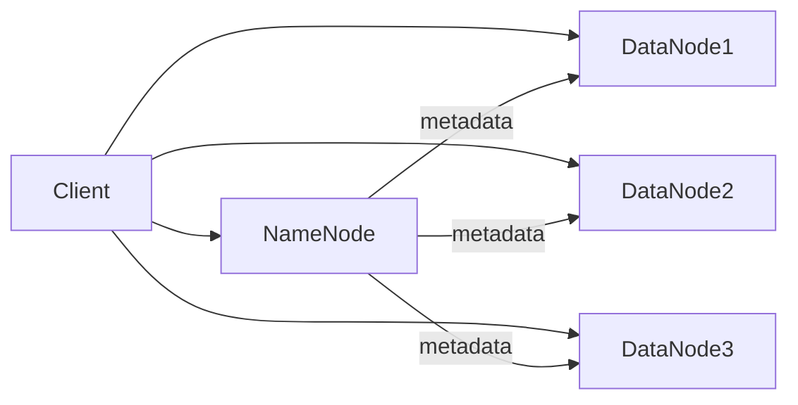
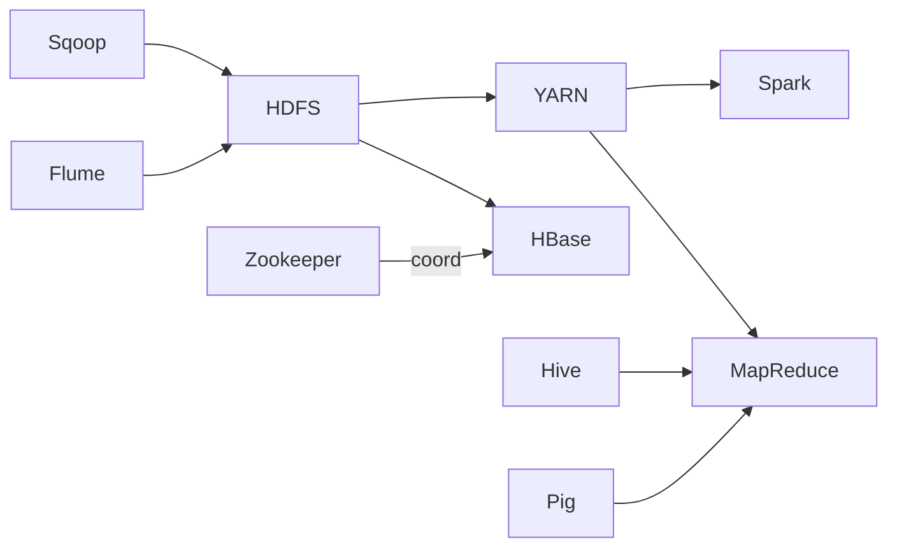
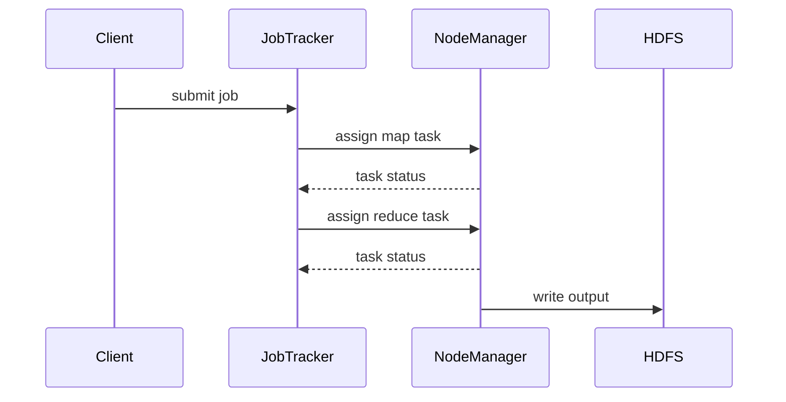

# Unit III: Hadoop (English Detailed)

### Topics
1. [History of Hadoop](#1-history-of-hadoop)
2. [Hadoop Distributed File System (HDFS)](#2-hadoop-distributed-file-system-hdfs)
3. [Components of Hadoop](#3-components-of-hadoop)
4. [Analyzing Data with Hadoop](#4-analyzing-data-with-hadoop)
5. [Scaling Out](#5-scaling-out)
6. [Hadoop Streaming](#6-hadoop-streaming)
7. [Design of HDFS](#7-design-of-hdfs)
8. [Java Interfaces to HDFS Basics](#8-java-interfaces-to-hdfs-basics)
9. [Developing a MapReduce Application](#9-developing-a-mapreduce-application)
10. [How MapReduce Works](#10-how-mapreduce-works)
11. [Anatomy of a MapReduce Job Run](#11-anatomy-of-a-mapreduce-job-run)
12. [Failures](#12-failures)
13. [Job Scheduling](#13-job-scheduling)
14. [Shuffle and Sort](#14-shuffle-and-sort)
15. [Task Execution](#15-task-execution)
16. [MapReduce Types and Formats](#16-mapreduce-types-and-formats)
17. [MapReduce Features](#17-mapreduce-features)
18. [Hadoop Environment](#18-hadoop-environment)

---

## 1. History of Hadoop

Hadoop originated from two papers published by Google in 2003: the GFS (Google File System) paper and the MapReduce paper. Doug Cutting and Mike Cafarella created an open-source project called Nutch, a search engine, which needed a distributed storage and processing platform. Inspired by Google's designs, they separated storage (HDFS) and computation (MapReduce) into a framework called Hadoop, named after Cutting's son's toy elephant.

- 2005: Hadoop becomes a top-level Apache project.
- 2006: Hadoop wins the Yahoo! grid prize and is adopted by Yahoo! for web indexing.
- 2008-2010: HDFS and MapReduce evolve; Hive, Pig, and other ecosystem components appear.
- 2011: Hadoop 1.0 released. 
- 2013-2015: Hadoop 2 introduces YARN and HDFS federation.
- 2017+: Hadoop becomes part of the bigger Big Data ecosystem, with projects like Spark running on YARN.



## 2. Hadoop Distributed File System (HDFS)

HDFS is a distributed, scalable, fault-tolerant file system modeled after GFS. It stores large files across multiple machines in blocks (default 128MB) and replicates each block (typically three copies) across different nodes for reliability. The design accepts that hardware failures are common; software must tolerate them.

Files are split into blocks and written sequentially. When a client wants to read a file, it contacts the NameNode to retrieve a list of DataNode locations containing the blocks, and then streams data directly from those DataNodes.

Key features:

- **Write-once-read-many** semantics: once a file is written, it cannot be modified, only appended. This simplifies consistency and caching.
- **Large block size** reduces seek overhead and improves throughput for large files typical in analytics workloads.
- **Data locality**: computation is moved to where data resides (map tasks run on nodes storing relevant blocks) to minimize network traffic.
- **Failure detection and recovery**: the NameNode tracks metadata; DataNodes send heartbeats and block reports. When a DataNode fails, the NameNode re-replicates its blocks on other nodes to maintain the replication factor.

Additional aspects:

- **Rack awareness**: the NameNode ensures that replicas are placed on different racks to tolerate rack-level failures and optimize network bandwidth.
- **Namespace and block pool separation** (HDFS Federation): allows multiple NameNodes managing separate namespaces sharing the same set of DataNodes.



> **Example:** A 1 TB file will be split into ~8192 blocks (assuming 128 MB). With a replication factor of 3, 24 TB of storage is consumed across the cluster. If a DataNode storing some blocks crashes, the NameNode automatically schedules new replicas on other healthy nodes.

## 3. Components of Hadoop

The core components are:

- **HDFS**: the storage layer providing distributed, replicated file storage.
- **MapReduce**: a batch processing engine that implements the map and reduce programming model.
- **YARN**: (Yet Another Resource Negotiator) the resource manager introduced in Hadoop 2; it decouples resource management and scheduling from data processing, enabling multiple frameworks (e.g., Spark, Tez) to run on a single cluster.
- **Common utilities**: shared libraries and configuration tools that support both HDFS and YARN.

Beyond these, a rich ecosystem has grown around Hadoop:

- **Hive**: a data warehouse infrastructure offering SQL-like queries (HiveQL) that compile to MapReduce, Tez or Spark jobs.
- **Pig**: a scripting language (Pig Latin) for expressing data flows.
- **HBase**: a NoSQL wide-column store providing random, real-time read/write access on top of HDFS.
- **Sqoop**: imports and exports data between HDFS and relational databases.
- **Flume**: a distributed, reliable service for collecting and moving large amounts of log data.
- **Zookeeper**: a coordination service for configuration, naming, and synchronization used by many Hadoop components.


## 4. Analyzing Data with Hadoop

Hadoop allows analysts to write MapReduce jobs (or higher-level languages like HiveQL) that process terabytes or petabytes of data stored in HDFS. Data is divided into splits, each processed by a map task; reducers aggregate results. The emphasis is on scalability, not low latency.

## 5. Scaling Out

Hadoop shows "scale-out" by adding commodity servers instead of scaling up a single machine. An 8-node cluster can store and process more data than a single high-end server, with linear performance improvements (up to network limits). This economics is a driving force behind Hadoop adoption.

## 6. Hadoop Streaming

Hadoop Streaming allows developers to write map and reduce functions in any language that can read from standard input and write to standard output (e.g., Python, Perl, Bash). The streaming wrapper handles serialization of key/value pairs.

## 7. Design of HDFS

HDFS design centers on a master/slave architecture. The NameNode stores namespace tree and metadata, while DataNodes store actual blocks. There is also a Secondary NameNode (misleadingly named) that periodically merges edit logs into a checkpoint to prevent NameNode overload.

## 8. Java Interfaces to HDFS Basics

The `FileSystem` class provides methods like `open()`, `create()`, `listStatus()`. Developers instantiate a `Configuration` object and call `FileSystem.get(conf)` to obtain a handle. Reading and writing use `FSDataInputStream` and `FSDataOutputStream`.

## 9. Developing a MapReduce Application

A basic MapReduce program in Java comprises a `Mapper` class, a `Reducer` class, and a `Driver` that configures the job. The mapper processes input key/value pairs and emits intermediate pairs; the reducer receives grouped values for a key and produces final output.

```java
public class WordCount {
 public static class TokenizerMapper
 extends Mapper<Object, Text, Text, IntWritable>{
 private final static IntWritable one = new IntWritable(1);
 private Text word = new Text();
 public void map(Object key, Text value, Context context
 ) throws IOException, InterruptedException {
 StringTokenizer itr = new StringTokenizer(value.toString());
 while (itr.hasMoreTokens()) {
 word.set(itr.nextToken());
 context.write(word, one);
 }
 }
 }

 public static class IntSumReducer
 extends Reducer<Text,IntWritable,Text,IntWritable> {
 private IntWritable result = new IntWritable();
 public void reduce(Text key, Iterable<IntWritable> values,
 Context context
 ) throws IOException, InterruptedException {
 int sum = 0;
 for (IntWritable val : values) {
 sum += val.get();
 }
 result.set(sum);
 context.write(key, result);
 }
 }

 public static void main(String[] args) throws Exception {
 Configuration conf = new Configuration();
 Job job = Job.getInstance(conf, "word count");
 job.setJarByClass(WordCount.class);
 job.setMapperClass(TokenizerMapper.class);
 job.setCombinerClass(IntSumReducer.class);
 job.setReducerClass(IntSumReducer.class);
 job.setOutputKeyClass(Text.class);
 job.setOutputValueClass(IntWritable.class);
 FileInputFormat.addInputPath(job, new Path(args[0]));
 FileOutputFormat.setOutputPath(job, new Path(args[1]));
 System.exit(job.waitForCompletion(true) ? 0 : 1);
 }
}
```

## 10. How MapReduce Works

MapReduce jobs are split into map and reduce phases. Each map task processes a chunk of input (usually a HDFS block) and produces intermediate key/value pairs. The framework groups these pairs by key, and reduce tasks process each key’s list.

## 11. Anatomy of a MapReduce Job Run

- **Job submission**: client submits job to JobTracker (Hadoop 1) or ApplicationMaster (YARN).
- **Input split**: input files are divided.
- **Task assignment**: tasks are scheduled on nodes with data locality.
- **Map phase**: map tasks run and spill intermediate data to local disk.
- **Shuffle/sort**: data is transferred to reducers, sorted by key.
- **Reduce phase**: reduce tasks aggregate and write results to HDFS.



## 12. Failures

MapReduce is designed to handle failures. If a task node fails, the job tracker reschedules the task on another node. Speculative execution runs duplicates of slow tasks to mitigate "stragglers." HDFS replicates blocks so data is still available when a DataNode dies.

## 13. Job Scheduling

Schedulers decide which tasks to run when resources are limited. Common schedulers:

- **FIFO** (default, simple queue)
- **Fair scheduler** (shares resources equally among jobs)
- **Capacity scheduler** (allocates resources to queues with defined capacities)

## 14. Shuffle and Sort

The shuffle phase moves data from mappers to reducers. Each map task partitions its output by reducer and writes it to local disk. The reduce tasks fetch this data, sort it by key, and merge if multiple map outputs exist.

## 15. Task Execution

Tasks run in separate JVMs to isolate failures. Each task has a status reported back to the tracker. Heartbeats keep track of liveness. Task logs are stored locally and can be viewed via web UI.

## 16. MapReduce Types and Formats

Input and output formats determine how data is read/written. Examples:

- `TextInputFormat` (default, treats each line as a record)
- `KeyValueInputFormat` (splits on tab)
- `SequenceFileInputFormat` (binary key/value pairs)

Writable types (e.g., `IntWritable`, `Text`) are Hadoop's serializable data types.

## 17. MapReduce Features

- **Combiner**: pre-aggregates map output to reduce network traffic.
- **Partitioner**: controls which reducer receives a key.
- **Counters**: track events in job execution.
- **Distributed cache**: share read-only data files (e.g., lookup tables) with tasks.

## 18. Hadoop Environment

Hadoop requires Java; configuration is in XML files (`core-site.xml`, `hdfs-site.xml`, `mapred-site.xml`, `yarn-site.xml`). A typical deployment has a single NameNode (or HA pair), multiple DataNodes, and ResourceManager/NodeManagers for YARN. Security may use Kerberos.

---

### Summary

Hadoop provides a scalable storage and processing platform for big data using commodity hardware. Its architecture separates storage (HDFS) from computation (MapReduce/YARN) while supporting fault tolerance, data locality, and extensibility through an ecosystem of tools. Understanding Hadoop's components, job lifecycle, failure handling, and programming model enables developers to build efficient data processing pipelines.