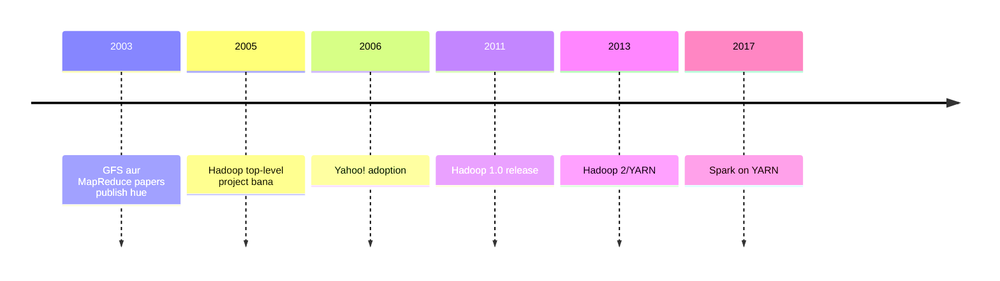
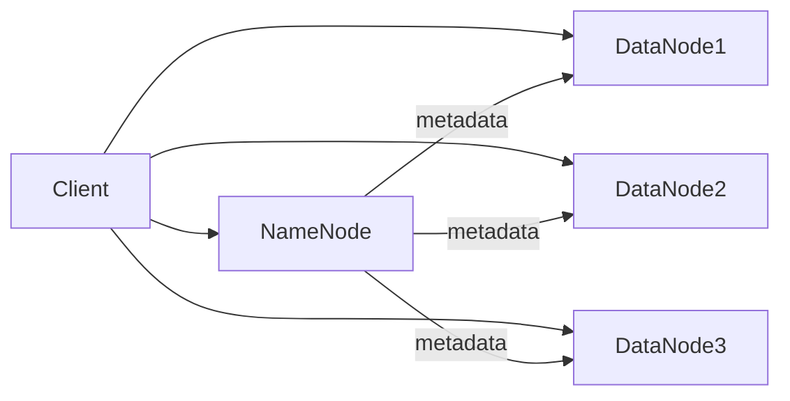
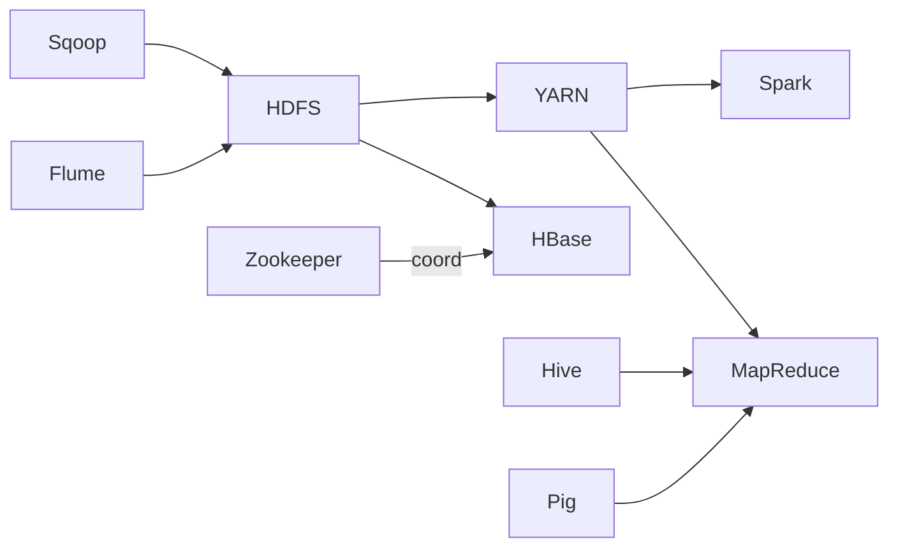
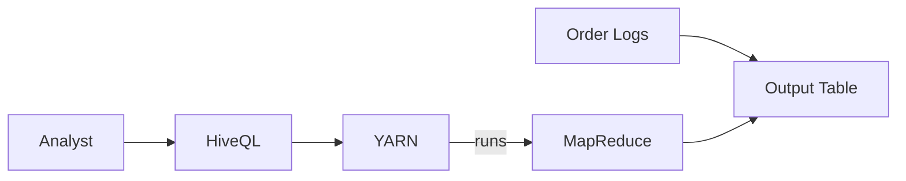
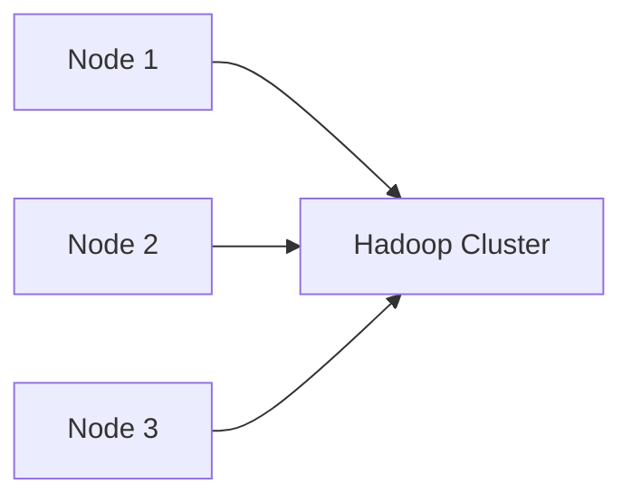
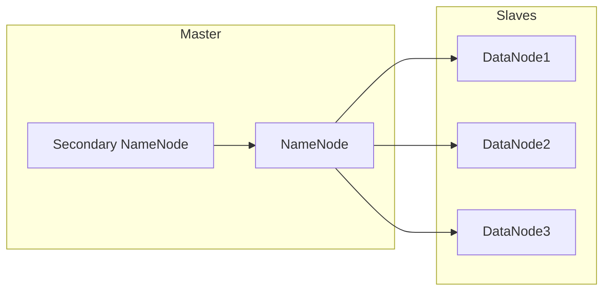
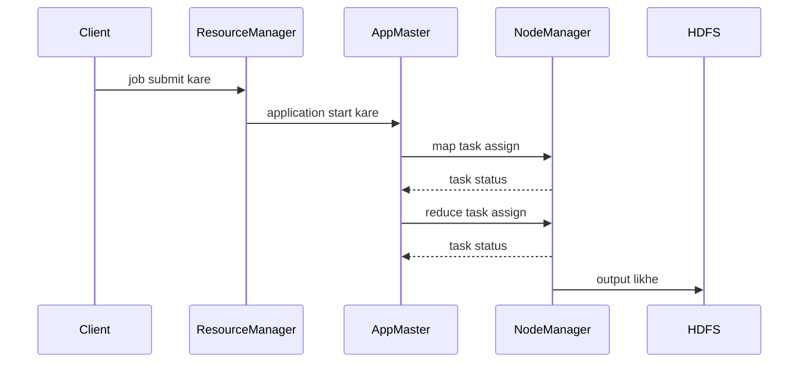
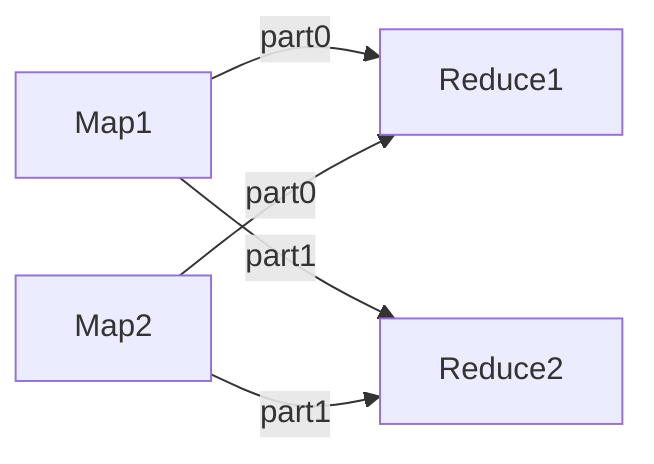

# Unit III: Hadoop ke Notes (Hinglish)

### Topics
1. [Hadoop ka Itihas](#1-hadoop-ka-itihas)
2. [Hadoop Distributed File System (HDFS)](#2-hadoop-distributed-file-system-hdfs)
3. [Components of Hadoop](#3-components-of-hadoop)
4. [Data ka Vishleshan Hadoop se](#4-data-ka-vishleshan-hadoop-se)
5. [Scaling Out](#5-scaling-out)
6. [Hadoop Streaming](#6-hadoop-streaming)
7. [HDFS ka Design](#7-hdfs-ka-design)
8. [Java Interfaces to HDFS Basics](#8-java-interfaces-to-hdfs-basics)
9. [MapReduce Application Banana](#9-mapreduce-application-banana)
10. [MapReduce Kaise Kaam Karta Hai](#10-mapreduce-kaise-kaam-karta-hai)
11. [MapReduce Job Run Ka Anatomy](#11-mapreduce-job-run-ka-anatomy)
12. [Failures](#12-failures)
13. [Job Scheduling](#13-job-scheduling)
14. [Shuffle and Sort](#14-shuffle-and-sort)
15. [Task Execution](#15-task-execution)
16. [MapReduce Types and Formats](#16-mapreduce-types-and-formats)
17. [MapReduce Features](#17-mapreduce-features)
18. [Hadoop Environment](#18-hadoop-environment)

---

## 1. Hadoop ka Itihas

Hadoop ki shuruat Google ke 2003 wale GFS (Google File System) aur MapReduce papers se hui thi. Doug Cutting aur Mike Cafarella ne ek open-source search engine Nutch banaya jise distributed storage aur processing chahiye thi. Google ke design se inspire hokar unhone storage (HDFS) aur computation (MapReduce) alag karke Hadoop naam ka framework banaya – jo Cutting ke bete ke khilone ke haathi ka naam tha.

- 2005: Hadoop Apache ka top-level project bana.
- 2006: Yahoo! ne Hadoop ko apnaaya aur web indexing ke liye use kiya.
- 2008-2010: HDFS aur MapReduce ka evolution hua; Hive, Pig jaise ecosystem components aaye.
- 2011: Hadoop 1.0 release hua.
- 2013-2015: Hadoop 2 mein YARN aur HDFS federation aaye.
- 2017 aage: Hadoop Big Data ecosystem ka ek hissa ban gaya, Spark jaise projects YARN par chalne lage.



## 2. Hadoop Distributed File System (HDFS)

HDFS ek distributed, scalable aur fault-tolerant file system hai jo GFS par modeled hai. Ye bade files ko multiple machines par blocks (by default 128MB) mein store karta hai aur har block ko alag nodes par replicate karta hai (typically 3 copies) reliability ke liye. Design assume karta hai ki hardware failures common hain, isliye software unhe tolerate karta hai.

Files blocks mein split hoti hain aur sequentially likhi jaati hain. Jab client file read karta hai, wo NameNode se blocks ki locations manga leta hai aur fir DataNodes se direct data stream karta hai.

Key features:

- **Write-once-read-many** semantics: file likhne ke baad modify nahi ki ja sakti, sirf append ho sakta hai. Isse consistency aur caching simple ho jaati hai.
- **Large block size**: seek overhead kam aur throughput high hota hai, jo analytics workloads mein useful hai.
- **Data locality**: computation ko data ke paas hi shift kiya jata hai (map tasks usi node par chalte hain jahan block hai) taaki network traffic kam ho.
- **Failure detection/recovery**: NameNode metadata track karta hai; DataNodes heartbeats aur block reports bhejte hain. Agar koi DataNode fail ho jata hai to NameNode uske blocks ki nayi replicas schedule karta hai.

Additional aspects:

- **Rack awareness**: replicas alag racks par ensure kiye jaate hain taaki rack-level failure aur network optimization dono ho.
- **Namespace aur block pool separation** (HDFS Federation): multiple NameNodes alag namespace manage kar sakte hain ek hi set of DataNodes use karke.



> **Example:** 1 TB file ko agar 128 MB block size se split karein to ~8192 blocks milenge. 3 replication factor lene par cluster mein 24 TB storage lagta hai. Agar koi DataNode crash ho jaye jisme kuch blocks hain, NameNode automatically healthy nodes par naye replicas banata hai.

## 3. Components of Hadoop

Core components:

- **HDFS**: storage layer jo distributed, replicated file storage deti hai.
- **MapReduce**: batch processing engine jo map-reduce programming model implement karta hai.
- **YARN**: (Yet Another Resource Negotiator) Hadoop 2 mein aaya resource manager; ye resource management aur scheduling ko data processing se alag karta hai, jisse multiple frameworks (Spark, Tez) ek hi cluster par chal sakte hain.
- **Common utilities**: shared libraries aur tools jo HDFS aur YARN dono use karte hain.

Ecosystem:

- **Hive**: SQL-like queries (HiveQL) data warehouse infrastructure jo jobs ko MapReduce, Tez ya Spark par chalata hai.
- **Pig**: Pig Latin scripting language data flows express karne ke liye.
- **HBase**: NoSQL wide-column store jo HDFS par real-time random read/write provide karta hai.
- **Sqoop**: HDFS aur relational databases ke beech data import/export.
- **Flume**: distributed reliable service logs collect aur move karne ke liye.
- **Zookeeper**: configuration, naming aur synchronization ke liye coordination service jo bohat components use karte hain.



## 4. Data ka Vishleshan Hadoop se

Hadoop analysts aur developers ko massive datasets process karne deta hai MapReduce jobs likh kar ya higher-level languages jaise HiveQL, Pig Latin, ya Spark SQL use karke. Workflow:

1. Data ko HDFS mein load karo (`hdfs dfs -put`, Sqoop, Flume).
2. Job define karo: Mapper aur Reducer likho (ya Hive/Pig use karo) aur input/output paths, formats configure karo.
3. Job YARN/JobTracker par submit karo. Input files automatic `InputSplit` mein divide hote hain (HDFS blocks ke hisab se). Har split ek map task process karta; intermediate key/value pairs generate hote.
4. Reduce phase mein intermediate values key se aggregate kar ke result HDFS mein likh diya jaata.

Zyada focus **throughput aur scalability** par hota hai; jobs ki running time minutes se hours ho sakti hai, lekin petabytes data handle kar sakte hain.

> **Example:** E-commerce company Hadoop use kar ke daily sales totals per product calculate karti hai. Map tasks har order record process karte, `<productID, amount>` emit karte. Reducers product by product amounts sum karte. Output par Hive table banayi jati jisse analysts SQL se query kar saken.



## 5. Scaling Out

Hadoop ek **scale-out** architecture ka udaharan hai: ek powerful server lene ke bajaye bohat se cheap commodity servers cluster mein add karo. Har naya node CPU, memory, network aur local storage add karta hai, capacity aur parallel processing linear tarike se badh jati hai. Key benefits:

- **Cost efficiency**: commodity hardware per terabyte sasta padta hai.
- **Fault tolerance**: ek machine fail ho, cluster chalna jaari rahta.
- **Incremental growth**: cluster ko ek-ek node karke expand kiya ja sakta.

Network bandwidth ya NameNode metadata limits ke aane tak performance scale hoti. Hadoop clusters kai sau ya hazaar nodes wale bante hain.

> **Example:** Netflix ke Hadoop clusters 7000+ nodes tak pahunch gaye hain user activity logs process karne ke liye. Cluster demand ke mutabik badhta hai, peak hours mein auto-scaling use hota hai.



## 6. Hadoop Streaming

Hadoop Streaming non-Java developers ko MapReduce programs kisi bhi language (Python, Perl, Ruby, Bash, etc.) mein likhne deta hai jo `stdin` se padh sake aur `stdout` par likh sake. Hadoop wrapper data ko user program tak pipe karta aur key/value pairs ko text mein convert karta.

Usage:

```bash
hadoop jar /path/to/hadoop-streaming.jar \
 -input /logs/* \
 -output /output \
 -mapper "python mapper.py" \
 -reducer "python reducer.py"
```

Mapper script input lines padh ke `key\tvalue` pairs emit karta, reducer sorted pairs aggregate karta. Rapid prototyping ya existing code reuse ke liye streaming useful hai.

> **Example:** Ek log-pipeline Python script use karta hai Apache access logs parse karne ke liye, request URL aur response code nikalta. Reducer URL ke occurrences count karta.

## 7. HDFS ka Design

HDFS ek **master/slave architecture** par chalta:

- **NameNode**: master server, filesystem namespace (directories, file metadata) aur file-to-block, block-to-DataNode map maintain karta. Metadata RAM mein rakhta aur edit log mein persist karta.
- **DataNodes**: worker nodes, blocks local disk par store karte. Client read/write requests serve karte aur heartbeats/block reports NameNode ko bhejte.
- **Secondary NameNode**: actual standby nahi, balki helper jo NameNode metadata aur edit logs ko periodically download kar ke merge karke new image banata aur upload karta. Isse edit log bht bada nahi hota.

Hadoop 1 mein master single point of failure tha; Hadoop 2+ mein HA NameNode pairs aur Zookeeper failover support deta.



## 8. Java Interfaces to HDFS Basics

Hadoop API HDFS functions `FileSystem` abstract class ke through expose karta hai. Common operations:

```java
Configuration conf = new Configuration();
FileSystem fs = FileSystem.get(conf);

// file create aur write
FSDataOutputStream out = fs.create(new Path("/user/data/file.txt"));
out.writeUTF("Hello HDFS");
out.close();

// file read
FSDataInputStream in = fs.open(new Path("/user/data/file.txt"));
String s = in.readUTF();
in.close();

// directory list
FileStatus[] statuses = fs.listStatus(new Path("/user/data"));
for (FileStatus status : statuses) {
 System.out.println(status.getPath());
}
```

`FileSystem` object client-side handle hai; calls NameNode/DataNodes tak forward hote hain. `DistributedFileSystem` class HDFS-specific extensions provide karti hai.

## 9. MapReduce Application Banana

MapReduce program ke teen hisse:

- **Mapper**: `Mapper<KEYIN,VALUEIN,KEYOUT,VALUEOUT>` extend karta aur `map()` method override karta; har input record process karta aur intermediate pairs emit karta.
- **Reducer**: `Reducer<KEYIN,VALUEIN,KEYOUT,VALUEOUT>` extend aur `reduce()` override karta; key aur values iterator leta aur final output emit karta.
- **Driver (Job config)**: job setup karta, input/output paths, mapper/reducer classes, key/value types, aur params set karta.

WordCount example upar diya gaya. Additional features:

- **Combiner**: `job.setCombinerClass()` local aggregation ke liye.
- **Partitioner**: custom partitioner se keys ko specific reducers bheja ja sakta.
- **Counters**: `context.getCounter()` se custom metrics track honge.
- **Distributed cache**: `job.addCacheFile()` se read-only files tasks ko distribute.

Local testing `LocalJobRunner` se hoti (`conf.set("mapreduce.framework.name","local")`).

## 10. MapReduce Kaise Kaam Karta Hai

MapReduce jobs neeche diye gaye stages se guzarte hain:

1. **Input splitting**: InputFormat (jaise `TextInputFormat`) input files ko `InputSplit`s mein divide karta, aam taur par HDFS blocks ke hisaab se. Har split ek map task lelega.
2. **Mapping**: map tasks split se records padhte, user `map()` function chalate aur intermediate key/value pairs memory buffer mein likhte. Buffer bharne par sorted data local disk par spill hota.
3. **Partitioning**: intermediate pairs `Partitioner` ke zariye partition kiye jate taa ki same key wale sab reducer tak pahunch jaye.
4. **Shuffle**: reduce tasks cluster ke sab map outputs se apne partitions ko pull karte. Data network through transfer hota.
5. **Sort**: fetched data key se sort hota; agar spills multiple bar hue to merge sort karte.
6. **Reducing**: `reduce()` method har key aur uske values iterator par call hota; reducer final results HDFS mein likhta.

Framework task progress track karta aur failures hue to tasks ko dobara chalata. Combiner functions map aur shuffle ke beech lag sakte hain network kam karne ke liye.

## 11. MapReduce Job Run Ka Anatomy

Job ke stages:

- **Job submission**: client `Job` object banata, configs set karta, aur `job.submit()` ya `job.waitForCompletion()` call karta. YARN mein ek **ApplicationMaster** launch hota.
- **Input split**: InputFormat input files split karta aur splits scheduler ko batata.
- **Task assignment**: scheduler (Hadoop1 JobTracker ya YARN ResourceManager) map tasks NodeManagers par assign karta, data locality ko prefer karte. Reduce tasks available slots ke basis par allocate hote.
- **Map phase**: map tasks chalte, records process karte, intermediate data disk par spill karte. Progress heartbeats ke through bheje.
- **Shuffle and sort**: reducers apne partitions ka map output pull karte. Data key se sort hota; multiple spills merge sort kiye jate.
- **Reduce phase**: reducers sorted keys process karte, user `reduce()` method call karte, aur results HDFS par likhte.



## 12. Failures

Hadoop in levels par failures ko tolerate karta:

- **Task failures**: agar map ya reduce task exception throw kare ya JVM crash ho, framework us task ko kisi aur node par restart karta, default 4 attempts tak.
- **Node failures**: jab NodeManager ya TaskTracker ka heartbeat nahi aata, scheduler usse lost mark karta aur uske tasks reassign karta.
- **Speculative execution**: slow-running tasks ("stragglers") dusre nodes par duplicate chalaye jate; pehli attempt jo finish ho use accept kiya jata aur baaki kill ho jate.
- **DataNode failures**: HDFS multiple replicas maintain karta; NameNode under-replicated blocks ko detect karke naye replicas schedule karta.
- **NameNode failures** (Hadoop 1): single point of failure, Secondary NameNode regular checkpoints se mitigate.

Ye mechanisms ensure karte hain ki Hadoop cluster dinon tak human intervention ke bina jobs chala sake.

## 13. Job Scheduling

Schedulers resources (CPU, memory) ko jobs mein allocate karte hain. YARN mein ResourceManager ek pluggable scheduler use karta. Common options:

- **FIFO**: jobs submission order mein chalti hain; simple hai lekin aage wali jobs starve ho sakti hain.
- **Fair scheduler**: har job ko average mein equal resource share dene ki koshish karta. Ye pools/queues support karta hai jinmein minimum shares defined ho sakte.
- **Capacity scheduler**: jobs ko queues mein organize karta jinke paas guaranteed capacity percentages hoti hain. Multi-tenant clusters ke liye achha jahan different teams ke paas reserved resources hote.

Schedulers **preemption** bhi enforce kar sakte hain (long-running jobs se resources le kar high-priority jobs ko dena). Users maps/reduce slots ya container memory limits configure kar sakte hain resource contention avoid karne ke liye.

## 14. Shuffle and Sort

**Shuffle** map aur reduce ke beech ka phase hai jahan intermediate data network se transfer hota:

1. Map tasks apne output ko reducer ke hisab se partition karte (default `HashPartitioner`) aur sorted data local disk par spill karte files `part-m-xxxxx` mein.
2. Reduce tasks HTTP ke zariye ye files sab map nodes se pull karte. Har reducer sirf apne partitions fetch karta.
3. Data aate hi reduce task sorted runs merge karta. Final result <key, list<values>> ka sorted stream hota.

Network IO ke wajah se ye phase expensive hota; optimizations mein map outputs compress karna aur combiners use karke data size kam karna shamil hai.



## 15. Task Execution

Har map ya reduce task apne JVM process mein chalti hai taaki crashes aur memory leaks isolate ho. Jab task start hota, NodeManager ek container launch karta specific resources (memory, vcores) ke saath. Task progress heartbeats se report karta; agar timeout ke andar heartbeat na mile, task failed maan liya jata.

Task ke logs (stdout, stderr, syslog) node ke local filesystem mein rakhe jaate aur JobHistory ya ResourceManager web UI se access kiye ja sakte hain. Ye logs tasks debug karne mein critical hote.

Tasks ke paas **task counters** bhi hote (bytes read, records written, etc.) jo aggregate hoke job summary mein dikhte.

## 16. MapReduce Types and Formats

MapReduce **InputFormat** aur **OutputFormat** classes se data read/write kaise hota define hota. Common input formats:

- `TextInputFormat`: default; har line ko record maana jata; key byte offset, value line text.
- `KeyValueTextInputFormat`: har line ko tab (ya custom separator) se key aur value mein split karta.
- `SequenceFileInputFormat`: Hadoop `SequenceFile` padhte jo binary key/value pairs contain karta; intermediate data ke liye useful.
- `NLineInputFormat`: input ko splits mein divide karta jisme N lines hoti; map task granularity control karne ke liye.

Output formats reducers ke output likhne ka tareeka define karte (e.g., `TextOutputFormat`, `SequenceFileOutputFormat`, `MultipleOutputs`).

**Writable** types Hadoop ke serializable data types hain; inhe `Writable` interface implement karna padta. Examples: `IntWritable`, `LongWritable`, `Text`, `ArrayWritable`. Complex objects ke liye custom writables banaye ja sakte hain.

## 17. MapReduce Features

MapReduce ko kuch language-level features milte hain:

- **Combiner**: mini-reducer jo map output par local aggregation karta shuffle se pehle. Associative, commutative functions (jaise sum) ke liye network I/O kam kar sakta.
- **Partitioner**: default `HashPartitioner` keys ko reducers ko hash ke through assign karta. Custom partitioners (jaise `TotalOrderPartitioner`) global sort ya specific reducer routing enforce kar sakte.
- **Counters**: built-in aur user-defined metrics (`context.getCounter(MyCounters.MY_COUNTER).increment(1)`) jo quantities track karte aur job reports mein aate.
- **Distributed cache**: files ya archives tasks ke start se pehle har node par cache karna allow karta. Lookup tables, jars, config files ke liye useful.
- **Serialization options**: Hadoop `Writable` use karta lekin Avro, Protocol Buffers, Thrift jaise frameworks ko bhi support karta `WritableComparable` aur SerDe classes ke through.

> **Example:** join job mein chhoti reference data distributed cache mein add ki ja sakti aur har mapper memory mein load kar sakta for fast lookups.

## 18. Hadoop Environment

Hadoop Java mein likha hai; isliye har node par Java Runtime Environment (JRE) installed hona chahiye. Cluster XML files se configure hota hain `$HADOOP_HOME/etc/hadoop` mein:

- `core-site.xml` – general configuration (e.g., default filesystem URI `fs.defaultFS`).
- `hdfs-site.xml` – HDFS-specific properties (replication factor, NameNode directories).
- `mapred-site.xml` – MapReduce settings (framework name, job history directory).
- `yarn-site.xml` – YARN resource manager aur node manager settings.

Pseudo-distributed mode (single node) start karne ke liye `start-dfs.sh` aur `start-yarn.sh` chalayein. Production mein aam taur par ek NameNode (ya HA pair), ek ResourceManager, aur bohot saare DataNode/NodeManager worker nodes deploy kiye jaate hain. Logs `$HADOOP_LOG_DIR` mein store hote aur web UIs (`http://<namenode>:9870`, `http://<resourcemanager>:8088`) se monitor kiye ja sakte hain.

Security enable karne ke liye Kerberos authentication, access control lists (ACLs), aur data encryption (at rest/in transit) use ki ja sakti hai.

---

### Summary

Hadoop ek scalable storage aur processing platform provide karta hai big data ke liye commodity hardware use karke. Iska architecture storage (HDFS) ko computation (MapReduce/YARN) se alag karta hai aur fault tolerance, data locality aur ek ecosystem of tools ke through extensibility support karta hai. Hadoop ke components, job lifecycle, failure handling aur programming model ka samajh developers ko efficient data pipelines banane mein madad karta hai. Configuration, scheduling, aur common pitfalls (jaise stragglers, NameNode limits) ki detailed knowledge clusters chalane mein effective banati hai.

