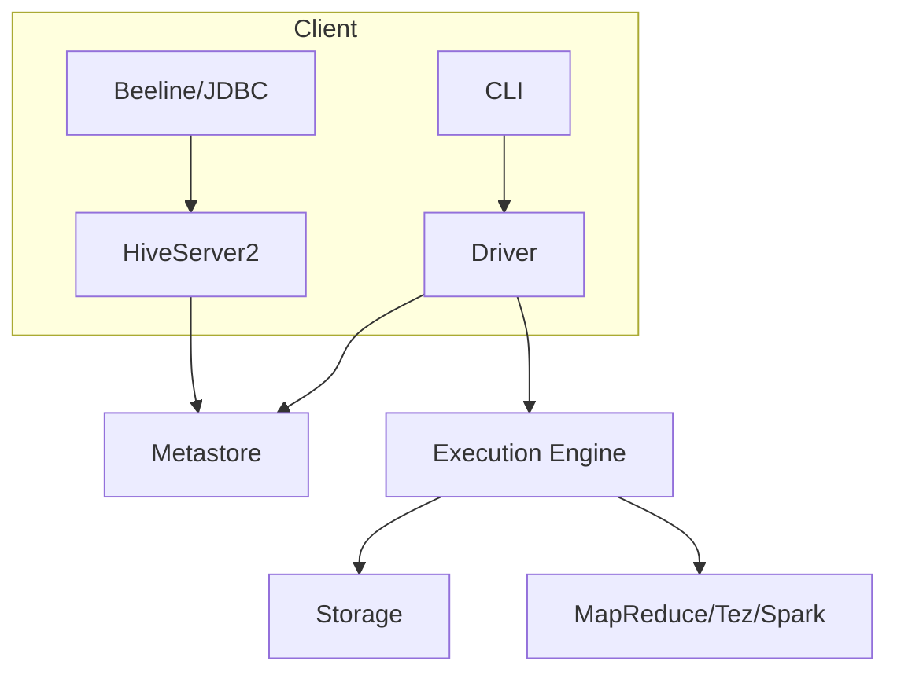
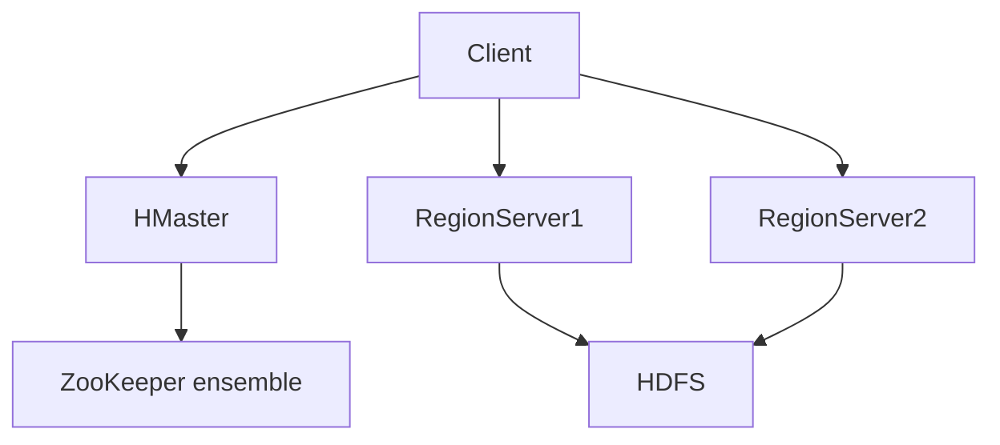
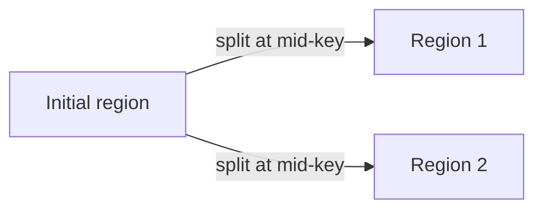
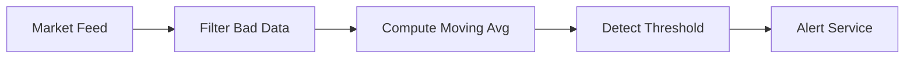

# Unit IV: Big Data Frameworks (English)

### Topics
1. [Applications on Big Data Using Pig and Hive](#1-applications-on-big-data-using-pig-and-hive)
2. [Data processing operators in Pig](#2-data-processing-operators-in-pig)
3. [Hive services](#3-hive-services)
4. [HiveQL – Querying Data in Hive](#4-hiveql--querying-data-in-hive)
5. [Fundamentals of HBase and Zookeeper](#5-fundamentals-of-hbase-and-zookeeper)
6. [IBM Infosphere BigInsights and Streams](#6-ibm-infosphere-bigginsights-and-streams)


## 1. Applications on Big Data Using Pig and Hive

Apache Pig and Apache Hive are high-level platforms built on top of Hadoop that simplify data processing. They allow developers and analysts to write scripts or SQL‑like queries instead of low‑level MapReduce code.

- **Pig** uses a scripting language called Pig Latin. It is procedural and well suited for pipeline-style transformations and ETL workflows. Pig scripts are executed by the Pig engine, which translates them into one or more MapReduce (or Tez/Spark) jobs. The interactive Grunt shell helps with experimentation, and UDFs written in Java, Python, or JavaScript can extend functionality.
- **Hive** provides a data warehouse infrastructure and a declarative query language (HiveQL) resembling SQL. It is aimed at analysts familiar with relational databases. Hive stores metadata in a metastore and supports tables on top of HDFS; queries are compiled to execution plans and executed via MapReduce, Tez, or Spark. Hive can integrate with tools such as Impala and Presto for low-latency access.

Both systems were introduced as part of early Facebook and Yahoo deployments to make Hadoop accessible to non-programmers. While Pig shines in complex data transformations, Hive is often preferred for reporting and ad-hoc analytics.

### Example use cases

- **Log analysis:** parse, filter, aggregate web server logs with Pig scripts and store results in Hive tables for reporting. For example, a Pig pipeline may read raw `access.log`, extract `(ip, url, status)` tuples, filter 5xx errors and count occurrences per host.

```pig
logs = LOAD '/logs/access.log' USING TextLoader() AS (line:chararray);
parsed = FOREACH logs GENERATE
tokens(0) AS ip,
tokens(6) AS url,
tokens(8) AS status;
errors = FILTER parsed BY status == '500';
counts = FOREACH (GROUP errors BY ip) GENERATE group, COUNT(errors);
STORE counts INTO '/analytics/500_errors' USING PigStorage('|');
```

- **ETL jobs:** load heterogeneous data from HDFS into Hive, perform joins and partitions, and export summarized results to relational systems. A sample HiveQL job can transform raw JSON events into a partitioned table:

```sql
CREATE EXTERNAL TABLE events_raw(line STRING)
LOCATION '/data/events';

CREATE TABLE events(
 userid STRING,
 ts BIGINT,
 action STRING
)
PARTITIONED BY (dt STRING)
ROW FORMAT SERDE 'org.apache.hive.hcatalog.data.JsonSerDe';

INSERT INTO events PARTITION(dt='20260226')
SELECT get_json_object(line,'$.user'),
 get_json_object(line,'$.timestamp'),
 get_json_object(line,'$.action')
FROM events_raw
WHERE get_json_object(line,'$.dt')='20260226';
```

- **Data exploration:** ad‑hoc queries over terabytes of customer or sensor data. Analysts may create temporary tables in Hive and run multiple `SELECT`s without touching raw data.

- **Machine learning data preparation:** use Pig to clean and feature-engineer training datasets; then export to Hive or HDFS for model training in Spark.
- **Sandbox environments:** developers prototype transformations in Pig, then productionize them as Hive queries when datasets stabilise.

> **Real scenario:** A telecom company writes a Pig script to compute daily call-duration averages per subscriber, then loads the output into Hive for business-intelligence dashboards. Later, the same dataset is joined with customer demographics in Hive to segment churn risk.

#### Pig dataflow diagram


The diagram illustrates how a simple Pig script is translated into a sequence of map and reduce tasks. Pig’s optimizer can combine steps like FILTER and GROUP if possible.


## 2. Data processing operators in Pig

Pig Latin provides a rich set of operators for manipulating bags (collections of tuples) and relations. Its syntax is terse yet expressive, making it easier to describe dataflows than raw MapReduce code. Common operators include:

- **LOAD** – read data from HDFS into a relation, specifying a schema and loader (e.g., `PigStorage` for CSV, `JsonLoader` for JSON). Schemas can be defined on load or inferred later.
- **FILTER** – retain tuples that satisfy a condition (`age > 30`). Supports logical operators, regex matching, and user-defined predicates.
- **FOREACH ... GENERATE** – project or transform fields. Supports arithmetic, string functions, date manipulation, and user-defined functions (UDFs) for custom logic.
- **GROUP** – aggregate tuples by key; results in a relation of groups. Data can be grouped by multiple fields or by expressions.
- **JOIN** – perform relational joins (inner, outer, skewed) between relations on specified keys. Pig automatically chooses the join strategy (replicated, skewed) based on data sizes.
- **CROSS** – compute cartesian product of two relations. Useful for generating combinations but expensive at scale.
- **ORDER** – sort tuples by one or more fields, optionally in descending order.
- **LIMIT** – restrict the number of output tuples, helpful during debugging.
- **UNION, DISTINCT** – combine or deduplicate relations. `UNION` is not deduping; use `DISTINCT` for that purpose.
- **COGROUP** – similar to GROUP but retains relations from all side inputs; helpful for multi-way joins.
- **SPLIT** – branch a relation into multiple relations based on conditional expressions.
- **FOREACH` …` GENERATE flatten()** – flatten nested bags to simplify processing.
- **STORE** – write relation back to HDFS with a specified storage format (Text, Avro, Parquet) and optional compression.

```pig
A = LOAD 'logs/*' AS (user:chararray, ts:long, url:chararray);
B = FILTER A BY url MATCHES '/product/.*';
C = GROUP B BY user;
D = FOREACH C GENERATE group AS user, COUNT(B) AS views;
STORE D INTO '/user/analytics/page_views' USING PigStorage(',');
```

Operators may be chained to construct complex dataflows that the Pig engine translates into MapReduce jobs. The `EXPLAIN` command shows the execution plan, and the Grunt shell provides interactive debugging. UDFs let developers write custom functions in Java, Python (via Jython), or even Ruby; examples include `TfIdf` calculation, data cleansing routines, and geospatial transformations.

Pig’s execution is lazy – transformations are only computed when a `DUMP` or `STORE` is encountered, allowing the optimizer to combine steps and reduce intermediate data movement.


## 3. Hive services

Hive runs as a set of services on top of Hadoop. Key components include both server-side daemons and client libraries.

- **Hive Metastore** – a Thrift service that stores metadata about databases, tables, partitions and schemas. It can use an embedded Derby database for single-user setups or an external RDBMS (MySQL, PostgreSQL, Oracle) for production clusters. The metastore also holds statistics used by the query optimizer (e.g., number of rows, file sizes).
- **HiveServer2** – provides a JDBC/ODBC interface for clients to execute HiveQL statements. It handles session management, authentication (Kerberos, LDAP, custom), and result streaming. Multiple sessions can run concurrently; HiveServer2 can be load-balanced via HAProxy or Ranger.
- **Driver** – the component that parses and compiles HiveQL into an execution plan comprising MapReduce, Tez or Spark jobs; it interacts with the metastore to resolve table schemas and partitions.
- **Execution Engine** – orchestrates the actual job execution on YARN, tracking task progress and handling retries. The engine abstracts the underlying framework so that queries can run in MapReduce, Tez, or Spark without changes.
- **Web UI** – monitors past queries, sessions, and resource usage. Administrators use it for performance tuning and troubleshooting.
- **CLI/Beeline** – command-line tools for submitting queries; Beeline connects to HiveServer2 over JDBC, while the older CLI connects directly to the metastore. The Hive shell also provides `EXPLAIN` and `SET` commands for debugging and configuration.



Services can be secured with Kerberos, and the metastore can be shared among multiple Hive instances or other tools such as Spark, Impala, Presto, Flink, and Hadoop MapReduce. External tools query the same metadata, ensuring consistency across the ecosystem. Backups of the metastore are critical for disaster recovery; snapshotting the underlying RDBMS and HDFS files keeps Hive healthy.

> **Note:** running `SHOW TABLES;` in Beeline queries HiveServer2, which in turn reads the list from the metastore. This illustrates the architecture in action.


## 4. HiveQL – Querying Data in Hive

HiveQL is a dialect of SQL supporting typical data‑warehouse operations and extensions needed for big data:

- **DDL statements** – `CREATE DATABASE`, `CREATE TABLE`, `ALTER TABLE`, `DROP TABLE`, `CREATE VIEW`. External tables reference data outside Hive’s control (e.g., existing HDFS files), while managed tables have data lifecycle tied to Hive.
- **DML statements** – `SELECT`, `INSERT` (into or overwrite), `LOAD DATA`, `EXPORT`, `IMPORT`. `INSERT` can also populate tables via `SELECT` from other tables or subqueries.
- **Partitioning** – tables can be partitioned by one or more columns to improve query performance and manageability. Partition pruning avoids scanning irrelevant directories.
- **Bucketing** – data within a partition can be bucketed on a hash of a column to facilitate joins and sampling; bucketed tables can be joined more efficiently when the same number of buckets is used.
- **Serde support** – custom serialization/deserialization libraries allow reading JSON, Avro, ORC, Parquet, etc. Hive’s built-in SerDes include `RegexSerDe`, `JSONSerDe`, `AvroSerDe`, and more.
- **User-defined functions** – developers can write UDFs, UDAFs (aggregate functions), and UDTFs (table-generating functions) in Java to extend HiveQL.
- **Windowing and analytics** – functions such as `ROW_NUMBER()`, `LAG()`, `LEAD()`, and cumulative aggregates support complex analytics.
- **Transactions and ACID** – Hive supports ACID operations on ORC tables with `INSERT`, `UPDATE`, `DELETE`, and `MERGE` provided `transactional=true` tables and `HiveConf` settings are enabled.

```sql
CREATE TABLE sales (
 id BIGINT,
 date STRING,
 amount DOUBLE
)
PARTITIONED BY (country STRING)
CLUSTERED BY (id) INTO 32 BUCKETS
STORED AS ORC
TBLPROPERTIES ('transactional'='true');

INSERT INTO sales PARTITION(country='US')
SELECT id, date, amount FROM staging_sales WHERE country='US';

SELECT country, SUM(amount) FROM sales GROUP BY country;

-- a window function example
SELECT country, date,
 SUM(amount) OVER (PARTITION BY country ORDER BY date ROWS BETWEEN 3 PRECEDING AND CURRENT ROW) AS rolling_4_day
FROM sales;
```

HiveQL queries are translated into execution plans; simple `SELECT` statements may run as a single MapReduce job, while complex joins or window functions might use Tez or Spark for better performance. The `EXPLAIN` command shows the operator tree. Optimizations like cost-based optimization (CBO), join reordering, and vectorized execution improve speed on large datasets.


## 5. Fundamentals of HBase and Zookeeper

**HBase** is a distributed, scalable NoSQL database modeled after Google’s Bigtable. It provides random, real‑time read/write access to large tables and is often used for applications requiring low-latency lookups on massive datasets. The following diagram shows HBase architecture:



### Example: row key design

Choosing an effective row key is critical for performance. For example, storing time-series data by timestamp alone can cause hotspotting. A common pattern is to prepend a hash prefix:

| Original key | Prefixed key |
|---------------------|----------------------|
| `20260226:device123` | `ab:20260226:device123` |

This spreads writes across multiple regions.

### Region splitting diagram



When a region grows past a threshold (HBase default 10 GB), the HMaster instructs it to split, redistributing load.

**Zookeeper** is a distributed coordination service used by HBase (and many other big data components) to maintain configuration information, naming, and provide synchronization.

- Maintains a hierarchy of znodes (similar to a filesystem) where clients can create, read, update, and watch nodes. znodes are ephemeral or persistent; ephemeral znodes disappear when the session ends.
- Ensures consistency through a leader election algorithm; typical HBase deployment uses Zookeeper for electing the active HMaster and tracking live RegionServers. HBase writes the location of each region in znodes, enabling clients to discover the correct RegionServer.
- Zookeeper ensembles require an odd number of nodes (3,5,7) to achieve quorum. It provides session timeouts, watches for event notification, and guarantees linearizability and ordered writes.

Together HBase+Zookeeper form the backbone of many real‑time systems such as time‑series stores, recommendation engines, and metadata registries. Other systems like Kafka, Hive, and Spark also rely on Zookeeper for leader election and configuration, making it a critical component of the Hadoop ecosystem.

- Data is stored in **tables** with rows identified by a row key. Columns are grouped into **column families**; qualifiers within families store actual values. Each cell may have multiple versions indexed by timestamp. Wide tables with sparse columns are common.
- Tables are horizontally partitioned into **regions** which are served by **RegionServers**. Regions are split automatically when they grow beyond a threshold. A **HMaster** coordinates region assignments, schema changes, and balancing.
- HBase relies on Hadoop’s HDFS for underlying storage and uses a write-ahead **commit log (HLog)** and **HFile** for persistence. Writes go to the WAL and an in-memory MemStore; when the MemStore fills, it flushes to an HFile. Periodic **major compactions** merge HFiles and remove deleted cells or expired versions.
- It supports strong consistency, automatic failover, and can handle billions of rows and millions of columns. Clients interact via the Java API, Thrift or REST gateways. Coprocessors allow custom code to run on RegionServers for server-side filtering or aggregation.
- Example use case: storing time-series metrics from IoT devices, keyed by device ID and timestamp, with column families for different sensors. Scans over a range of row keys return recent readings at millisecond latency.

**Zookeeper** is a distributed coordination service used by HBase (and many other big data components) to maintain configuration information, naming, and provide synchronization.

- Maintains a hierarchy of znodes (similar to a filesystem) where clients can create, read, update, and watch nodes. znodes are ephemeral or persistent; ephemeral znodes disappear when the session ends.
- Ensures consistency through a leader election algorithm; typical HBase deployment uses Zookeeper for electing the active HMaster and tracking live RegionServers. HBase writes the location of each region in znodes, enabling clients to discover the correct RegionServer.
- Zookeeper ensembles require an odd number of nodes (3,5,7) to achieve quorum. It provides session timeouts, watches for event notification, and guarantees linearizability and ordered writes.

Together HBase+Zookeeper form the backbone of many real‑time systems such as time‑series stores, recommendation engines, and metadata registries. Other systems like Kafka, Hive, and Spark also rely on Zookeeper for leader election and configuration, making it a critical component of the Hadoop ecosystem.


## 6. IBM Infosphere BigInsights and Streams

IBM’s BigInsights is a commercial distribution of Hadoop with enterprise features and additional analytics modules:

- Provides a GUI-based workbench (BigSheets), preconfigured analytics functions, and integrated Hadoop components (HDFS, MapReduce, Hive, Pig). BigSheets offers spreadsheet-like interaction with big data and can generate charts directly from clusters.
- Includes text analytics, pattern recognition, geospatial capabilities, sentiment analysis, and security enhancements (LDAP/Kerberos integration). It bundles IBM’s enterprise search and text analytics engines to extract insights from unstructured data.
- Offers connectors to IBM DB2, Netezza, and other databases, plus integration with SPSS Statistics and Cognos for advanced analytics and reporting. The platform also supports energy-efficient hardware from IBM PureData and is certified for compliance standards.
- Under the hood, BigInsights may use Hortonworks or Apache distributions; IBM adds management tools, patches, and customer support.

**IBM Streams** (formerly InfoSphere Streams) is a platform for processing high‑volume, high‑velocity streaming data in real time.

- Applications are built with the Streams Processing Language (SPL) or Java/C++ operators and deployed on a distributed runtime. The runtime schedules operators on processing elements (PEs) which may span multiple machines.
- Optimised for low latency (<5 ms per event) and can ingest data from sensors, social feeds, network taps, or message systems like Kafka. Streams supports backpressure, dynamic reconfiguration, and stateful operators.
- Operators perform filtering, transformation, aggregation, join, windowing, and complex event processing on tuples as they flow through a topology. The toolkit includes libraries for financial analytics, anomaly detection, and natural-language processing.

### SPL example

```spl
stream<rstring symbol, float price> Market = ReadFromSocket("")
 -> Filter(price > 0.0)
 -> AggregateWindow(timeBatch(1 sec), avg(price) as avgPrice)
 -> WriteToKafka(topic: "avgPrices");
```

> **Use case:** A stock trading firm uses Streams to analyse market feeds and issue alerts when price thresholds are crossed, while BigInsights stores historical tick data for backtesting. Another example is a telecom provider analysing call detail records in real time to detect fraud and route high-priority alerts.

A simple Streams topology might look like:



BigInsights and Streams together illustrate how IBM addresses both batch and real-time analytics within the Hadoop ecosystem.


---

## Summary

- **Pig & Hive** simplify Hadoop by providing high-level scripting and SQL-like query capabilities, ideal for ETL, analytics, and data exploration.
- **Pig operators** offer a rich toolbox for transforming and aggregating large datasets using a procedural dataflow language.
- **Hive services** (Metastore, HiveServer2, Driver, Execution Engine) form the backbone of a data warehouse, enabling SQL-style querying over HDFS.
- **HiveQL** extends SQL with partitioning, bucketing, custom SerDes, and ACID support, translating queries into efficient execution plans.
- **HBase & Zookeeper** provide real-time, scalable NoSQL storage with strong consistency and distributed coordination for many ecosystem components.
- **IBM BigInsights & Streams** demonstrate commercial enhancements for batch and streaming analytics, combining enterprise tools with Hadoop’s scalability.

This unit covered both batch and real-time frameworks that enable big data processing across diverse use cases.
