# 🛠️ Unit IV: Big Data Frameworks — The Fun Way!

> *"If Hadoop is the engine, then Pig, Hive, HBase, and ZooKeeper are the steering wheel, dashboard, fuel tank, and GPS. You need all of them to go anywhere useful."*

Welcome to **Unit IV** — where we stop writing raw MapReduce code and start using **high-level frameworks** that make life as a data engineer/analyst actually enjoyable! 🎉

---

## 📚 What You'll Learn (Table of Contents)

1. [🐷🐝 Applications on Big Data Using Pig and Hive](#1--applications-on-big-data-using-pig-and-hive)
2. [🔧 Data Processing Operators in Pig](#2--data-processing-operators-in-pig)
3. [🏛️ Hive Services](#3-️-hive-services)
4. [🗣️ HiveQL — Querying Data in Hive](#4-️-hiveql--querying-data-in-hive)
5. [📊 Fundamentals of HBase and ZooKeeper](#5--fundamentals-of-hbase-and-zookeeper)
6. [🏢 IBM InfoSphere BigInsights and Streams](#6--ibm-infosphere-biginsights-and-streams)

---

## 1. 🐷🐝 Applications on Big Data Using Pig and Hive

### The Problem: MapReduce is Powerful but Painful

Remember writing MapReduce Java code from Unit III? A Word Count program was 60+ lines of Java just to count words. Now imagine writing that for complex ETL pipelines, multi-table joins, and aggregations. 😩

That's where **Apache Pig** and **Apache Hive** come in — they're the "power tools" that make Hadoop accessible to everyone.

---

### 🐷 Apache Pig — The Data Pipeline Scripter

> **Origin:** Born at **Yahoo!** in 2006. Engineers were tired of writing MapReduce for every data transformation. They created a scripting language that translates high-level scripts into MapReduce jobs automatically.

**Pig Latin** is the language Pig uses. It's **procedural** — you describe HOW to transform data step by step. Think of it like a recipe:

```
1. Get ingredients from fridge (LOAD from HDFS)
2. Cut the vegetables (FILTER/FOREACH)
3. Mix everything together (JOIN/GROUP)
4. Cook it (execution on MapReduce)
5. Serve the dish (STORE back to HDFS)
```

> 👨‍🍳 **Chef analogy:** Writing MapReduce is like describing cooking at the chemical level — "mix H₂O molecules with NaCl ions and apply thermal energy to protein chains." Writing Pig Latin is like a normal recipe — "add salt to water, boil, cook pasta." Same result, much easier to express!

---

### 🐝 Apache Hive — The SQL-Speaking Analyst

> **Origin:** Born at **Facebook** in 2007. Facebook's data analysts knew SQL. They didn't want to learn Java MapReduce. So they built an engine that let you write SQL-like queries on Hadoop data.

**HiveQL** is Hive's query language. It's **declarative** — you describe WHAT you want, not HOW to get it:

```sql
SELECT product_id, SUM(revenue) as total
FROM sales
WHERE country = 'India'
GROUP BY product_id
ORDER BY total DESC
LIMIT 10;
```

↑ This gets compiled into MapReduce/Spark jobs automatically — no Java required!

---

### ⚖️ Pig vs Hive — When to Use Which?

```
                    🐷 PIG                   🐝 HIVE
────────────────────────────────────────────────────────────
Language:       Pig Latin (procedural)   HiveQL (SQL-like)
Abstraction:    DataFlow pipeline        Relational tables
Best for:       ETL, transformations     Reporting, analytics
User type:      Data Engineers           Data Analysts / SQL users
Schema:         Schema on load           Schema in metastore
Execution:      MapReduce / Tez / Spark  MapReduce / Tez / Spark
Debugging:      Grunt shell (DUMP)       Beeline CLI (SELECT)
Flexibility:    Very high (code logic)   Medium (SQL constraints)
```

> 🎭 **Theater analogy:**
> - **Pig** is a **playwright** — you write step-by-step how each scene plays out
> - **Hive** is the **director** — you just say "I want a romantic ending" and the system figures out how to get there!

---

### 🎯 Real-World Use Cases

#### 🌐 Log Analysis Pipeline

> **Scenario:** A website generates 100 GB of Apache access logs daily. The ops team wants to know which pages trigger the most 500 errors.

**Pig approach (ETL step):**
```pig
-- Load raw logs from HDFS
logs = LOAD '/logs/access.log' USING TextLoader() AS (line:chararray);

-- Parse each log line (mapper step essentially)
parsed = FOREACH logs GENERATE
    STRSPLIT(line, ' ') AS tokens;

-- Extract fields we care about
extracted = FOREACH parsed GENERATE
    tokens.$0 AS ip,
    tokens.$6 AS url,
    tokens.$8 AS status;

-- Filter only 500 errors
errors = FILTER extracted BY status == '500';

-- Count errors per IP address  
grouped = GROUP errors BY ip;
counts  = FOREACH grouped GENERATE group AS ip, COUNT(errors) AS error_count;

-- Sort by count descending
sorted = ORDER counts BY error_count DESC;

-- Store results back to HDFS
STORE sorted INTO '/analytics/500_errors' USING PigStorage('|');
```

**Result in HDFS:** `/analytics/500_errors/part-r-00000`
```
192.168.1.100|52
10.0.0.25|38
172.16.0.8|21
...
```

**Hive step (reporting):** Create a table on top of this result
```sql
CREATE EXTERNAL TABLE error_counts (ip STRING, error_count INT)
ROW FORMAT DELIMITED FIELDS TERMINATED BY '|'
LOCATION '/analytics/500_errors';

-- Now analysts can query with SQL!
SELECT ip, error_count
FROM error_counts
WHERE error_count > 20
ORDER BY error_count DESC;
```

#### 🔄 ETL: JSON Events → Partitioned Table

```sql
-- Step 1: External table pointing to raw JSON events in HDFS
CREATE EXTERNAL TABLE events_raw (line STRING)
LOCATION '/data/events/raw/';

-- Step 2: Structured table partitioned by date
CREATE TABLE events (
    userid  STRING,
    ts      BIGINT,
    action  STRING
)
PARTITIONED BY (dt STRING)
ROW FORMAT SERDE 'org.apache.hive.hcatalog.data.JsonSerDe'
STORED AS ORC;

-- Step 3: Transform and load for a specific date
INSERT INTO events PARTITION(dt='20260226')
SELECT
    get_json_object(line, '$.user')      AS userid,
    get_json_object(line, '$.timestamp') AS ts,
    get_json_object(line, '$.action')    AS action
FROM events_raw
WHERE get_json_object(line, '$.dt') = '20260226';
```

> 🗂️ **Folder analogy:** Partitioning by `dt` is like organizing your email into monthly folders. When you search for emails from January, you only open the January folder — not every email you've ever received!

---

### 🌊 The Full Pig Dataflow


> 🔑 **Key insight:** Each arrow in the diagram = a potential MapReduce boundary. Pig's optimizer is smart enough to combine multiple steps into fewer MapReduce jobs when possible!

---

## 2. 🔧 Data Processing Operators in Pig

### Pig Latin's Toolkit — The Full Swiss Army Knife

Pig Latin operates on **relations** (like database tables) and **bags** (collections of tuples). Here's every important operator with real examples:

---

### 📥 LOAD — The S tarting Point

```pig
-- Load CSV data
sales = LOAD '/data/sales.csv'
        USING PigStorage(',')
        AS (id:int, date:chararray, product:chararray, amount:float, country:chararray);

-- Load JSON data
events = LOAD '/data/events/'
         USING JsonLoader()
         AS (user:chararray, action:chararray, ts:long);

-- Load without schema (schema-on-read style)
raw_data = LOAD '/data/mystery.txt' AS (line:chararray);
```

---

### 🚿 FILTER — The Bouncer

```pig
-- Simple condition
big_sales = FILTER sales BY amount > 10000.0;

-- Multiple conditions
india_high_value = FILTER sales BY country == 'India' AND amount > 5000.0;

-- Regex matching
product_pages = FILTER events BY action MATCHES '/product/.*';

-- Null check
clean_data = FILTER sales BY date IS NOT NULL;
```

> 🎯 **Performance tip:** Put your FILTER as early as possible in the pipeline! If you filter out 90% of records upfront, everything downstream runs 10x faster.

---

### 🔄 FOREACH ... GENERATE — The Transformer

This is Pig's most versatile operator. Transform, project, or calculate new fields:

```pig
-- Select only specific columns (projection)
slim = FOREACH sales GENERATE id, amount;

-- Calculate a new column
with_tax = FOREACH sales GENERATE
           id,
           amount,
           amount * 0.18 AS tax,
           amount * 1.18 AS total_with_tax;

-- String manipulation
upper_country = FOREACH sales GENERATE
                id,
                UPPER(country) AS country_upper,
                SUBSTRING(date, 0, 4) AS year;

-- Using a UDF (User-Defined Function)
enriched = FOREACH sales GENERATE
           id,
           mypackage.MyUDF(product) AS category;
```

---

### 📦 GROUP — The Aggregator Setup

GROUP alone doesn't aggregate — it just organizes data into groups for aggregation with FOREACH:

```pig
-- Group by one field
by_country = GROUP sales BY country;

-- Group by multiple fields
by_country_year = GROUP sales BY (country, SUBSTRING(date, 0, 4));

-- Group ALL into one bag (for grand totals)
all_together = GROUP sales ALL;

-- Then aggregate with FOREACH:
country_totals = FOREACH by_country GENERATE
                 group                AS country,     -- the group key
                 COUNT(sales)         AS num_orders,
                 SUM(sales.amount)    AS total_revenue,
                 AVG(sales.amount)    AS avg_order_value,
                 MAX(sales.amount)    AS biggest_order;
```

> 🛒 **Supermarket analogy:** GROUP is like organizing all products onto shelves by category. FOREACH...GENERATE then counts how many items are on each shelf and calculates the total price!

---

### 🤝 JOIN — The Relationship Builder

```pig
customers = LOAD '/data/customers.csv' AS (cid:int, name:chararray, email:chararray);
orders    = LOAD '/data/orders.csv'    AS (oid:int, cid:int, amount:float);

-- Inner join: only customers WITH orders
cust_orders = JOIN customers BY cid, orders BY cid;

-- Left outer join: all customers, even those without orders
all_cust = JOIN customers BY cid LEFT OUTER, orders BY cid;

-- Result fields: customers::cid, customers::name, orders::oid, orders::amount
rich_data = FOREACH cust_orders GENERATE
            customers::name AS customer_name,
            orders::amount  AS order_amount;
```

#### 🚀 Join Optimization — Replicated Join

When one table is small enough to fit in memory:

```pig
-- Reference data (small ~50MB lookup table)
countries = LOAD '/reference/countries.csv' AS (code:chararray, name:chararray);

-- Big sales data (100GB)
sales = LOAD '/data/sales/' AS (id:int, country_code:chararray, amount:float);

-- Replicated join: countries file goes into memory on every mapper
-- Much faster than shuffle join!
enriched = JOIN sales BY country_code, countries BY code USING 'replicated';
```

---

### 📊 ORDER — The Sorter

```pig
-- Sort ascending (default)
sorted_sales = ORDER sales BY amount;

-- Sort descending
top_sales = ORDER sales BY amount DESC;

-- Multi-column sort
sorted_multi = ORDER sales BY country ASC, amount DESC;

-- Usually combined with LIMIT for top-N analysis
top_10 = LIMIT (ORDER sales BY amount DESC) 10;
```

---

### ✂️ SPLIT — The Branching Operator

```pig
-- One relation → multiple relations based on conditions
SPLIT sales INTO
    premium  IF amount >= 100000,
    standard IF amount >= 10000 AND amount < 100000,
    economy  IF amount < 10000;

-- Now process each segment separately
STORE premium  INTO '/output/premium'  USING PigStorage(',');
STORE standard INTO '/output/standard' USING PigStorage(',');
STORE economy  INTO '/output/economy'  USING PigStorage(',');
```

> 🚦 **Traffic light analogy:** SPLIT is like a highway interchange — one stream of traffic divides into different roads based on the exit you're heading to!

---

### 🔗 COGROUP — The Multi-Way Grouper

Similar to GROUP but keeps data from multiple relations separate (unlike JOIN which merges them):

```pig
-- Compare orders vs returns for each customer
orders  = LOAD '/data/orders.csv'  AS (cid:int, amount:float);
returns = LOAD '/data/returns.csv' AS (cid:int, reason:chararray);

-- Each output tuple: (cid, bag_of_orders, bag_of_returns)
comparison = COGROUP orders BY cid, returns BY cid;

-- Customers with more returns than orders
suspicious = FOREACH comparison
             GENERATE group AS cid,
                      COUNT(orders)  AS num_orders,
                      COUNT(returns) AS num_returns
             WHERE COUNT(returns) > COUNT(orders);
```

---

### 🔍 DISTINCT and UNION

```pig
-- Remove duplicates
unique_users = DISTINCT (FOREACH events GENERATE user);

-- Combine two relations (NOT deduplicating — use DISTINCT for that)
all_logs = UNION access_logs, error_logs;

-- Combine and deduplicate
all_unique = DISTINCT (UNION access_logs, error_logs);
```

---

### 💾 STORE and DUMP

```pig
-- STORE: permanent storage to HDFS (production use)
STORE results INTO '/output/analysis' USING PigStorage(',');

-- Store as Parquet (compressed columnar format)
STORE results INTO '/output/parquet_data'
              USING org.apache.pig.piggybank.storage.parquet.ParquetStorer();

-- DUMP: temporary output to console (debugging only)
DUMP results;   -- Shows first few rows in terminal
-- Never use DUMP in production! It fetches ALL data to the client!
```

---

### ⚡ Lazy Evaluation — Pig's Smart Trick

```pig
-- Pig doesn't execute ANYTHING until it absolutely must!
A = LOAD '/data/huge_file.csv' AS (...);     -- Nothing happens yet
B = FILTER A BY amount > 1000;               -- Still nothing
C = GROUP B BY country;                      -- Still nothing
D = FOREACH C GENERATE ...;                  -- Still nothing
STORE D INTO '/output/';                     -- NOW it executes all steps!
                                             -- Pig optimizes the entire plan first!
```

> 🧠 **Smart student analogy:** A lazy student doesn't do homework assignments one by one as they come in. They wait until Sunday night, then figure out the most efficient order to do everything. Pig does the same — waits for STORE/DUMP, then optimizes the whole pipeline!

---

### 🛠️ The EXPLAIN Command — Your Pipeline Inspector

```pig
-- See exactly what MapReduce jobs Pig will generate
EXPLAIN results;

-- Output shows:
-- Logical Plan: your operators as a tree
-- Physical Plan: how operators map to MapReduce primitives
-- MapReduce Plan: how many MR jobs, what runs in each
```

---

### 📊 Full Pig Operators Reference

| Operator | Purpose | MapReduce equivalent |
|----------|---------|---------------------|
| `LOAD` | Read data from HDFS | InputFormat in Mapper |
| `FILTER` | Keep matching tuples | Mapper filter logic |
| `FOREACH...GENERATE` | Transform fields | Mapper transformation |
| `GROUP` | Group by key | Shuffle + Sort |
| `JOIN` | Join two relations | Reduce-side join |
| `ORDER` | Global sort | Total sort MapReduce |
| `DISTINCT` | Remove duplicates | Reduce with dedup |
| `UNION` | Combine relations | Identity mapper merge |
| `SPLIT` | Branch one relation | Multiple output paths |
| `COGROUP` | Multi-relation group | Complex reduce |
| `LIMIT` | Take first N rows | Post-processing |
| `STORE` | Write to HDFS | OutputFormat |
| `DUMP` | Print to console | Fetch to client |

---

## 3. 🏛️ Hive Services

### Hive is Not One Thing — It's a Stack of Services

When you run `SELECT * FROM sales`, a lot of moving parts work together. Let's meet everyone:

```mermaid
flowchart TB
    subgraph ClientSide["👤 Client Side"]
        BL["🖥️ Beeline CLI\n(modern JDBC client)"]
        JDBC["📊 JDBC/ODBC apps\n(Tableau, Power BI, etc.)"]
        OldCLI["⌨️ Hive CLI\n(legacy, deprecated)"]
    end

    subgraph HiveStack["🐝 Hive Stack"]
        HS2["🔌 HiveServer2\n• Authentication\n• Session management\n• Concurrent connections\n• JDBC/ODBC interface"]
        Driver["🧠 Driver\n• Parse HiveQL\n• Semantic analysis\n• Query optimization\n• Generate execution plan"]
        Meta["📚 Metastore\n• Table schemas\n• Partition locations\n• Column stats\n• Stores in MySQL/Postgres"]
    end

    subgraph Execution["⚙️ Execution Layer"]
        MR["MapReduce jobs"]
        Tez["Apache Tez\n(faster DAG engine)"]
        Spark["Apache Spark\n(fastest)"]
    end

    subgraph Storage["🗄️ Storage"]
        HDFS["HDFS files\n(ORC, Parquet, etc.)"]
    end

    BL & JDBC --> HS2
    OldCLI --> Driver
    HS2 --> Driver
    Driver --> Meta
    Driver --> Execution
    Execution --> HDFS
    Meta -->|"table locations"| HDFS

    style HS2 fill:#FF9800,color:#fff
    style Driver fill:#2196F3,color:#fff
    style Meta fill:#9C27B0,color:#fff
```



---

### 🔑 Each Service Up Close

---

#### 📚 Hive Metastore — The Librarian

The Metastore is the **brain of Hive's knowledge** about your data. Without it, Hive doesn't know any tables exist!

**What it stores:**
```
Database: analytics_db
  Table: sales
    Columns: id BIGINT, date STRING, amount DOUBLE, country STRING
    Partitions: country=India/dt=2026-02-26/ → hdfs:///data/sales/India/2026-02-26/
    Storage format: ORC
    Row count: 150,000,000
    Total size: 45 GB
  
  Table: customers
    Columns: cid BIGINT, name STRING, email STRING
    ...
```

**Storage options:**
| Mode | Backend | Use Case |
|------|---------|----------|
| Embedded Derby | Built-in Java DB | Local development only (single user!) |
| Remote MySQL | External MySQL server | Small to medium production |
| Remote PostgreSQL | External Postgres server | Production recommended |

> ⚠️ **Critical for exam:** The Metastore does NOT store actual data! It only stores metadata (schemas, locations, stats). The actual data lives in HDFS files.

---

#### 🔌 HiveServer2 — The Front Door

HiveServer2 handles everything client-facing:
- **Authentication**: Kerberos tickets, LDAP passwords, or PAM
- **Session management**: multiple users can query simultaneously
- **JDBC/ODBC interface**: Tableau, Power BI, Python (`pyhive`), JDBC apps all connect here
- **Result streaming**: streams large results back without buffering everything in memory

```
Connect from Python:
from pyhive import hive
conn = hive.Connection(host='hiveserver2.company.com', port=10000, username='nitish')
cursor = conn.cursor()
cursor.execute('SELECT COUNT(*) FROM sales')
print(cursor.fetchone())  # (150000000,)
```

---

#### 🧠 Driver — The Query Planner

When you submit `SELECT country, SUM(amount) FROM sales GROUP BY country`:

```
Driver Step 1: Parse
  "Is this valid HiveQL syntax?" → Yes ✅
  AST (Abstract Syntax Tree) generated

Driver Step 2: Semantic Analysis  
  Consult Metastore: "Does table 'sales' exist?" → Yes ✅
  "Does column 'country' exist?" → Yes ✅
  "Does column 'amount' exist?" → Yes ✅

Driver Step 3: Query Optimization
  CBO (Cost-Based Optimizer): "How big is the table?" (from stats)
  "Should we use MapReduce, Tez, or Spark?" → Tez (faster)
  "Can we push the GROUP BY down?" → Yes, apply partition pruning

Driver Step 4: Generate Execution Plan
  MapReduce Stage 1:
    Map: Read sales, emit (country, amount)
    Reduce: Sum amounts per country
  Output to HDFS temp directory
  
Driver Step 5: Submit to YARN via Execution Engine
```

Use `EXPLAIN` to see this plan:
```sql
EXPLAIN SELECT country, SUM(amount) FROM sales GROUP BY country;
```

---

#### ⚙️ Execution Engine — Tez vs MapReduce vs Spark

```sql
-- Configure the execution engine per session
SET hive.execution.engine = tez;     -- Recommended for most queries
SET hive.execution.engine = spark;   -- Best for complex analytics
SET hive.execution.engine = mr;      -- Legacy, slowest
```

**Why Tez is faster than MapReduce:**
```
MAPREDUCE (3 chained jobs):
  HDFS Read → Map1 → Write to HDFS → Read → Map2 → Write HDFS → Read → Map3 → HDFS Write
  (Lots of slow disk I/O between stages!)

TEZ (same query as one DAG):
  HDFS Read → [Op1 → Op2 → Op3] → HDFS Write
  (Intermediate results stay in memory!)
```

---

### 🖥️ Hive Web UI and CLI Tools

```bash
# Beeline (modern, recommended)
beeline -u jdbc:hive2://hiveserver2:10000/default -n nitish -p password
beeline> SHOW DATABASES;
beeline> USE analytics;
beeline> SHOW TABLES;
beeline> DESCRIBE FORMATTED sales;

# Useful built-in commands
SET hive.exec.dynamic.partition=true;  -- Allow dynamic partitioning
EXPLAIN SELECT ...;                     -- Show execution plan
ANALYZE TABLE sales COMPUTE STATISTICS; -- Update optimizer stats
```

---

## 4. 🗣️ HiveQL — Querying Data in Hive

### SQL for Big Data — Familiar but Supercharged

HiveQL looks like SQL but has superpowers for massive datasets. Let's explore everything:

---

### 🏗️ DDL — Creating Tables

#### External vs Managed Tables

This is one of the most important distinctions in Hive!

```sql
-- MANAGED TABLE (Hive owns the data lifecycle)
CREATE TABLE transactions (
    id        BIGINT,
    user_id   BIGINT,
    amount    DOUBLE,
    ts        TIMESTAMP
)
STORED AS ORC;
-- DROP TABLE transactions → deletes BOTH metadata AND HDFS data! 😱

-- EXTERNAL TABLE (Hive is just a view over existing HDFS data)
CREATE EXTERNAL TABLE logs_external (
    ip      STRING,
    url     STRING,
    status  INT,
    ts      STRING
)
ROW FORMAT DELIMITED FIELDS TERMINATED BY '\t'
LOCATION '/data/weblogs/';
-- DROP TABLE logs_external → deletes ONLY metadata, HDFS data stays safe! ✅
```

> 🏠 **Property analogy:**
> - **Managed table** = You own the house AND the land. If you sell (drop), both go.
> - **External table** = You're renting the house. If you leave (drop), the house (data) stays for the next tenant.
> 
> **Rule of thumb:** Always use EXTERNAL for raw data you want to keep!

---

### 📂 Partitioning — The Performance Superpower

```sql
-- Create a partitioned table (partitioned by date and country)
CREATE TABLE sales (
    id      BIGINT,
    amount  DOUBLE,
    product STRING
)
PARTITIONED BY (dt STRING, country STRING)
STORED AS ORC;

-- Load data into a specific partition
INSERT INTO sales PARTITION(dt='2026-02-26', country='India')
SELECT id, amount, product FROM staging_sales
WHERE dt='2026-02-26' AND country='India';
```

**How partitioning saves you:**

```
HDFS structure after partitioning:
  /warehouse/sales/
    dt=2026-01-01/
      country=India/    ← 500 MB
      country=US/       ← 1.2 GB
      country=UK/       ← 300 MB
    dt=2026-01-02/
      country=India/
      ...

Query: SELECT SUM(amount) FROM sales WHERE dt='2026-02-26' AND country='India'

WITHOUT partitioning: Scans ALL 500 GB of data 😱
WITH partitioning:    Scans ONLY 500 MB of data ✅ (1000x less work!)
```

> 🗂️ **Filing cabinet analogy:** If you organize 10,000 documents by year → month → type, finding all January reports takes seconds. Without organization, you'd leaf through all 10,000 documents!

---

### 🪣 Bucketing — The Join Optimizer

After partitioning, you can further divide data into **buckets** using a hash function:

```sql
CREATE TABLE customers (
    cid   BIGINT,
    name  STRING,
    email STRING
)
CLUSTERED BY (cid) INTO 32 BUCKETS
STORED AS ORC;

CREATE TABLE orders (
    oid    BIGINT,
    cid    BIGINT,
    amount DOUBLE
)
CLUSTERED BY (cid) INTO 32 BUCKETS
STORED AS ORC;

-- Bucket map join: FAST because matching cid values are in the same bucket!
SELECT c.name, SUM(o.amount) as total_spend
FROM customers c
JOIN orders o ON c.cid = o.cid
GROUP BY c.name;
```

**Why bucketing speeds up joins:**

```
Without bucketing:              With bucketing (32 buckets, JOIN on cid):
  Reducer must see ALL orders      Bucket 1 of customers only needs
  and ALL customers to find         bucket 1 of orders!
  matching cids.                   (1/32 of the data shuffled)
  
  Network: 100% of both tables     Network: 3-10% of both tables ✅
```

> 🗃️ **Drawer analogy:** Bucketing is like putting all customers with last names A-C in drawer 1, D-F in drawer 2, etc. When you need to join customer and order records, you only open matching drawers instead of going through every file!

---

### 📦 Storage Formats — Choosing the Right Container

```sql
-- Text (plain CSV/TSV) — worst performance but human readable
STORED AS TEXTFILE

-- ORC (Optimized Row Columnar) — best for Hive, fastest queries
STORED AS ORC

-- Parquet — best cross-platform (Spark, Presto, BigQuery all love it)
STORED AS PARQUET

-- Avro — best for schema evolution (adding/removing columns over time)
STORED AS AVRO

-- Sequence — Hadoop's binary key-value format
STORED AS SEQUENCEFILE
```

| Format | Read Speed | Compression | Best For |
|--------|-----------|-------------|---------|
| Text | 🐌 Slow | ❌ None by default | Raw data ingestion |
| ORC | 🚀 Very fast | ✅ Built-in | Hive analytics |
| Parquet | 🏎️ Fast | ✅ Built-in | Cross-platform |
| Avro | 🚗 Medium | ✅ Configurable | Schema evolution |

---

### 🪟 Window Functions — The Analytics Powerhouse

HiveQL supports SQL window functions for advanced analytics without self-joins:

```sql
-- Running total of sales per country (ordered by date)
SELECT
    country,
    dt,
    amount,
    SUM(amount) OVER (
        PARTITION BY country
        ORDER BY dt
        ROWS BETWEEN UNBOUNDED PRECEDING AND CURRENT ROW
    ) AS cumulative_sales
FROM sales;

-- 4-day rolling average
SELECT
    country, dt, amount,
    AVG(amount) OVER (
        PARTITION BY country
        ORDER BY dt
        ROWS BETWEEN 3 PRECEDING AND CURRENT ROW
    ) AS rolling_4day_avg
FROM sales;

-- Rank customers by total spend
SELECT
    user_id,
    total_spend,
    RANK() OVER (ORDER BY total_spend DESC) AS spend_rank,
    DENSE_RANK() OVER (ORDER BY total_spend DESC) AS dense_rank,
    ROW_NUMBER() OVER (ORDER BY total_spend DESC) AS row_num,
    NTILE(4) OVER (ORDER BY total_spend DESC) AS quartile
FROM customer_totals;

-- Year-over-year comparison using LAG and LEAD
SELECT
    dt,
    revenue,
    LAG(revenue, 1)  OVER (ORDER BY dt) AS prev_day_revenue,
    LEAD(revenue, 1) OVER (ORDER BY dt) AS next_day_revenue,
    revenue - LAG(revenue, 1) OVER (ORDER BY dt) AS day_over_day_change
FROM daily_revenue;
```

---

### 🔄 ACID Transactions in Hive — Modern Table Operations

Hive can now do `UPDATE` and `DELETE` (in ORC tables with correct settings):

```sql
-- Enable (set in hive-site.xml or per session)
SET hive.support.concurrency=true;
SET hive.enforce.bucketing=true;
SET hive.exec.dynamic.partition.mode=nonstrict;
SET hive.txn.manager=org.apache.hadoop.hive.ql.lockmgr.DbTxnManager;

-- Create ACID-enabled table
CREATE TABLE inventory (
    product_id  BIGINT,
    quantity    INT,
    price       DOUBLE
)
CLUSTERED BY (product_id) INTO 16 BUCKETS
STORED AS ORC
TBLPROPERTIES ('transactional'='true');

-- Now you can UPDATE and DELETE!
UPDATE inventory SET quantity = quantity - 10 WHERE product_id = 42;
DELETE FROM inventory WHERE quantity = 0;

-- MERGE for upsert operations (Slowly Changing Dimensions!)
MERGE INTO inventory AS target
USING new_stock AS source
ON target.product_id = source.product_id
WHEN MATCHED THEN
    UPDATE SET quantity = target.quantity + source.incoming_qty
WHEN NOT MATCHED THEN
    INSERT VALUES (source.product_id, source.incoming_qty, source.price);
```

---

### 💡 Performance Optimization Tips

```sql
-- 1. Always check your execution plan first!
EXPLAIN SELECT country, SUM(amount) FROM sales GROUP BY country;

-- 2. Enable Cost-Based Optimization (CBO)
SET hive.cbo.enable=true;
SET hive.compute.query.using.stats=true;
SET hive.stats.fetch.column.stats=true;

-- 3. Keep table statistics up to date
ANALYZE TABLE sales COMPUTE STATISTICS;
ANALYZE TABLE sales COMPUTE STATISTICS FOR COLUMNS;

-- 4. Use partition pruning (always filter on partition columns!)
SELECT * FROM sales WHERE dt = '2026-02-26';  -- ✅ Fast (partition pruned!)
SELECT * FROM sales WHERE YEAR(dt) = 2026;    -- ❌ Slow (full scan, can't prune)

-- 5. Enable vectorized execution
SET hive.vectorized.execution.enabled=true;

-- 6. Use Tez or Spark instead of MapReduce
SET hive.execution.engine=tez;
```

---

## 5. 📊 Fundamentals of HBase and ZooKeeper

### When Hive Isn't Fast Enough — Real-Time Storage

**Hive is great for:** Batch analytics, running queries that take minutes/hours on TB of data  
**Hive is terrible for:** Looking up one specific row in a billion-row table in milliseconds

> 🏦 **Bank example:** When you check your account balance on an ATM, the system does a **3ms lookup** on your specific account record. This can't wait for a MapReduce job! Enter HBase.

---

### 📊 What is HBase?

HBase is a **distributed NoSQL database** modeled after Google's Bigtable paper. It runs on top of HDFS but provides:

- **Random reads/writes**: Get any row in milliseconds
- **Massive scale**: Billions of rows, millions of columns
- **Auto-scaling**: Tables automatically split into regions as they grow
- **Strong consistency**: All reads see the latest written data

> 🗄️ **Comparison:**

| Feature | HDFS/Hive | HBase |
|---------|-----------|-------|
| Read a specific row | ❌ Scans entire file | ✅ Key lookup in ms |
| Write new data | ❌ New file, complex | ✅ Real-time writes |
| Query language | ✅ SQL (HiveQL) | ❌ API-based (no SQL) |
| Latency | Minutes-hours | Milliseconds |
| Use for | Batch analytics | Real-time lookups |

---

### 🏗️ HBase Data Model — It's Different From SQL!

Forget rows and columns as you know them. HBase uses a **4D data model**:

```
HBase Cell = (Row Key, Column Family, Column Qualifier, Timestamp) → Value

Example — Storing user profiles:
┌─────────────────────────────────────────────────────────────────────┐
│ Row Key     │ CF:personal         │ CF:preferences          │       │  
│             │ name │ email        │ theme │ language        │ ...   │
├─────────────┼──────┼─────────────┼───────┼─────────────────┼───────┤
│ user:001    │ Riya │ riya@ex.com  │ dark  │ Hindi           │       │
│ user:002    │ Arjun│ arjun@ex.com │ light │ English         │       │
│ user:003    │ Sara │ sara@ex.com  │ dark  │ Tamil  (NULL→   │ not   │
│             │      │             │       │ stored in HBase) │ stored│
└─────────────┴──────┴─────────────┴───────┴─────────────────┴───────┘
```

**Key differences from RDBMS:**
- **Sparse**: NULL columns don't consume space (not stored at all!)
- **Versioned**: Each cell can have multiple time-stamped versions
- **No joins**: HBase has no JOIN operation — design your schema to avoid them
- **Schema-less columns**: Add new columns anytime without `ALTER TABLE`

---

### 🔑 Row Key Design — The Most Critical Decision

The row key determines **where data is stored** and **how fast queries run**. Bad row keys → bad performance!

#### ❌ Bad Row Key: Timestamp-only

```
Row keys: 
  2026-02-26-10:00:00 → sensor reading
  2026-02-26-10:00:01 → sensor reading
  2026-02-26-10:00:02 → sensor reading

Problem: All writes go to the SAME region (the latest one)!
This is called HOTSPOTTING — one server gets all the traffic!
```

#### ✅ Good Row Key: Salted/Prefixed

```
Solution: Add a hash prefix to distribute load!

Original key:  2026-02-26:device_123
Salted key:    a7:2026-02-26:device_123  ← first 2 chars = hash of key % 16

Now writes distribute across 16 regions instead of 1! ✅
```

| Pattern | Row Key Design | Problem Solved |
|---------|----------------|----------------|
| **Salt prefix** | `hash%N:original_key` | Even write distribution |
| **Reverse timestamp** | `Long.MAX_VALUE - timestamp` | Latest entries at top |
| **Composite key** | `user_id:timestamp` | Get all events for a user efficiently |
| **Reversed domain** | `com.google.mail` → `mail.google.com` | Scan by domain |

---

### 🗺️ HBase Architecture

```mermaid
flowchart TB
    Client["👤 Client Application\n(Java API / REST / Thrift)"]

    subgraph ZK["🦓 ZooKeeper Ensemble (3 nodes)"]
        ZK1["ZK Node 1 (Leader)"]
        ZK2["ZK Node 2"]
        ZK3["ZK Node 3"]
    end

    subgraph Master["🧠 HMaster"]
        HM["HMaster\n• Region assignments\n• Load balancing\n• Schema changes\n• Failover coordination"]
    end

    subgraph RS1["🖥️ RegionServer 1"]
        R1A["Region A\n(rows a→m)"]
        R1B["Region B\n(rows n→z)"]
        MS1["MemStore\n(in-memory writes)"]
        WAL1["WAL\n(Write-Ahead Log)"]
    end

    subgraph RS2["🖥️ RegionServer 2"]
        R2A["Region C\n(rows aa→mm)"]
        MS2["MemStore"]
        WAL2["WAL"]
    end

    HDFS["🗄️ HDFS\n(HFiles - final storage)"]

    Client -->|"1. Ask ZK: where is row X?"| ZK
    ZK -->|"2. RegionServer 1 has row X"| Client
    Client -->|"3. Direct read/write"| RS1
    HM <-->|"region management"| ZK
    RS1 & RS2 -->|"flush MemStore"| HDFS
    HM -->|"coordinates"| RS1 & RS2
```



---

### 📝 Write Path — How HBase Stores Your Data

```
Client writes: PUT row_key="user:001", col="CF:name", value="Riya"

Step 1: Write to WAL (Write-Ahead Log) on disk first!
        (If server crashes before completing write,
         WAL lets you recover!)
         
Step 2: Write to MemStore (in-memory write buffer)
        Acknowledgment sent to client: "Write successful!" ✅
        
Step 3: When MemStore is full (~64MB default):
        FLUSH → Write MemStore to new HFile on HDFS
        MemStore cleared → ready for more writes!

Step 4: Over time, many small HFiles accumulate.
        COMPACTION: Merge small HFiles → fewer large HFiles
        (Minor compaction: merge few small files)
        (Major compaction: merge ALL files, remove deleted cells)
```

---

### 📖 Read Path — How HBase Retrieves Your Data

```
Client reads: GET row_key="user:001", col="CF:name"

Step 1: Check MemStore (most recent writes, in memory)
        Found? Return value immediately! ⚡

Step 2: Check BlockCache (recently read HFile blocks in memory)
        Found? Return value! ⚡
        
Step 3: Read from HFiles on HDFS (disk access - slower)
        Read all relevant HFile blocks for this row key
        Return most recent version!
        
Optimization: BloomFilters on each HFile tell whether a row
              key might exist in it (avoid unnecessary disk reads!)
```

---

### 🦓 ZooKeeper — The Glue That Holds Everything Together

ZooKeeper is best described as a **distributed coordination service** — it helps machines in a cluster agree on things and stay synchronized.

> 🤔 **Why do machines need a "coordinator"?** In a distributed system, many machines are making decisions simultaneously. Without coordination, you get chaos:
> - Two HMasters both think they're the active leader → conflicting decisions!
> - RegionServer doesn't know where to find another RegionServer → lost connections!
> - Configuration changes → some nodes have old config, some have new!
> 
> ZooKeeper prevents all of this!

---

### 🌳 ZooKeeper's Data Model — The ZNode Tree

ZooKeeper stores data in a tree of **znodes** (think: a filesystem):

```
/ (root)
├── /hbase
│   ├── /hbase/master          → "hm1.company.com" (who is active HMaster?)
│   ├── /hbase/rs              → List of alive RegionServers
│   │   ├── /hbase/rs/rs1.host → (ephemeral → disappears when RS dies!)
│   │   ├── /hbase/rs/rs2.host
│   │   └── /hbase/rs/rs3.host
│   └── /hbase/regions         → Which RS owns which region?
├── /kafka
│   └── /kafka/controller      → "broker_3" (who is Kafka controller?)
└── /yarn
    └── /yarn/leader           → "rm1.company.com" (active ResourceManager)
```

**Ephemeral znodes** — the superpower:
```
When RegionServer rs3 starts:
  Creates /hbase/rs/rs3.host (ephemeral znode!)
  
When rs3 CRASHES (without cleanup):
  ZooKeeper detects session timeout
  AUTOMATICALLY deletes /hbase/rs/rs3.host
  
All watchers (HMaster, clients) get notified: "rs3 is gone!"
HMaster: "Ok, reassign rs3's regions to other RegionServers!" ✅
```

> 📡 **Smoke alarm analogy:** ZooKeeper is like a smoke detector network in an office building. Each server "plugs in" to the detector (creates ephemeral znode). If a server dies, the detector goes off (znode disappears), notifying everyone that something needs attention. No human needed to check!

---

### 🗳️ ZooKeeper — Leader Election

When multiple HMasters start up (for HA), they compete to become the active one:

```
All HMaster candidates race to create /hbase/master (ephemeral node)

Candidate 1: "I'll create /hbase/master!" → SUCCESS → Becomes ACTIVE! 🏆
Candidate 2: "I'll create /hbase/master!" → FAILS (already exists) → Becomes STANDBY
Candidate 3: → FAILS → Becomes STANDBY

All standbys WATCH /hbase/master
If active HMaster dies → /hbase/master deleted → race starts again!
```

> 🏁 **Race analogy:** ZooKeeper leader election is like musical chairs. When the music stops (znode disappears), everyone races for a chair. Only one wins!

---

### 📐 ZooKeeper Ensemble Requirements

```
┌────────────────────────────────────────────────────┐
│          ZooKeeper Quorum Requirement              │
│                                                    │
│  You need (N/2 + 1) nodes to be alive for ZK to   │
│  function (this is called "quorum").               │
│                                                    │
│  3-node ensemble: Need 2 alive → tolerate 1 failure│
│  5-node ensemble: Need 3 alive → tolerate 2 failures│  
│  7-node ensemble: Need 4 alive → tolerate 3 failures│
│                                                    │
│  ⚠️ ALWAYS use ODD numbers of ZooKeeper nodes!     │
│  Even numbers don't improve fault tolerance        │
│  (4-node → need 3 alive = same as 3-node)          │
└────────────────────────────────────────────────────┘
```

---

### 🔑 HBase Java API — Quick Demo

```java
Configuration conf = HBaseConfiguration.create();
conf.set("hbase.zookeeper.quorum", "zk1,zk2,zk3");

try (Connection connection = ConnectionFactory.createConnection(conf);
     Table table = connection.getTable(TableName.valueOf("sensors"))) {

    // ─── PUT (Write) ─────────────────────────────────────────────
    Put put = new Put(Bytes.toBytes("device:001:20260226100000")); // row key
    put.addColumn(
        Bytes.toBytes("readings"),   // column family
        Bytes.toBytes("temperature"),// qualifier
        Bytes.toBytes("28.5")        // value
    );
    put.addColumn(
        Bytes.toBytes("readings"),
        Bytes.toBytes("humidity"),
        Bytes.toBytes("65.2")
    );
    table.put(put);

    // ─── GET (Read single row) ────────────────────────────────────
    Get get = new Get(Bytes.toBytes("device:001:20260226100000"));
    Result result = table.get(get);
    byte[] temp = result.getValue(
        Bytes.toBytes("readings"),
        Bytes.toBytes("temperature")
    );
    System.out.println("Temperature: " + Bytes.toString(temp)); // 28.5

    // ─── SCAN (Range query) ───────────────────────────────────────
    Scan scan = new Scan();
    scan.setStartRow(Bytes.toBytes("device:001:20260226090000")); // 9 AM
    scan.setStopRow(Bytes.toBytes("device:001:20260226110000"));  // 11 AM
    scan.addFamily(Bytes.toBytes("readings"));
    
    ResultScanner scanner = table.getScanner(scan);
    for (Result r : scanner) {
        System.out.println("Row: " + Bytes.toString(r.getRow()));
    }
}
```

---

## 6. 🏢 IBM InfoSphere BigInsights and Streams

### When You Need Enterprise-Grade Big Data (with IBM Support!)

While the Apache ecosystem is powerful and free, **enterprise customers** often want:
- Professional support with SLAs
- Pre-integrated, tested components
- compliance certifications
- GUI tools for non-technical users
- Integration with existing IBM enterprise software

IBM's answer: **InfoSphere BigInsights** (batch analytics) + **InfoSphere Streams** (real-time streaming).

---

### 🐘 IBM InfoSphere BigInsights — Enterprise Hadoop

Think of BigInsights as **Hadoop + everything an enterprise wants + IBM support label**:

```mermaid
flowchart TB
    subgraph BigInsights["🏢 IBM InfoSphere BigInsights"]
        subgraph ApacheCore["Apache Hadoop Core"]
            HDFS["🗄️ HDFS"]
            MR["⚙️ MapReduce"]
            Hive["🐝 Hive"]
            Pig["🐷 Pig"]
            HBase["📊 HBase"]
            ZK["🦓 ZooKeeper"]
        end

        subgraph IBMAddons["IBM-Specific Add-ons"]
            BS["📊 BigSheets\n(Spreadsheet UI for Big Data)"]
            TA["🔤 Text Analytics\n(NLP, entity extraction)"]
            GS["🌍 Geospatial Module"]
            SA["💬 Sentiment Analysis"]
            SEC["🔒 Security\n(LDAP + Kerberos)"]
        end

        subgraph Integrations["Enterprise Integrations"]
            DB2["IBM DB2"]
            Netezza["IBM Netezza\n(Appliance)"]
            SPSS["IBM SPSS\n(Statistics)"]
            Cognos["IBM Cognos\n(Reporting)"]
        end
    end
```



---

### 📊 BigSheets — Excel for Big Data

BigSheets is arguably the most unique IBM differentiator — it lets non-technical business users interact with big data using a **spreadsheet-like interface**:

```
Traditional workflow (technical):
  Write HiveQL → Submit to cluster → Wait 10 min → Get CSV → Open Excel → Make chart

BigSheets workflow (non-technical):
  Open BigSheets UI → Browse HDFS files (like Google Drive) → 
  Point and click column selection → Click "Chart" button → Done! 📊
```

> 🎯 **Target user:** A business analyst who knows Excel but has never seen a command line. BigSheets bridges the gap between "big data is powerful" and "big data is usable by everyone."

---

### 🔤 IBM Text Analytics + NLP

BigInsights bundles IBM's enterprise NLP capabilities:

| Feature | What It Does | Example |
|---------|--------------|---------|
| **Named Entity Recognition** | Find names, places, orgs in text | "Reliance Industries" → ORG, "Mumbai" → LOC |
| **Sentiment Analysis** | Positive/negative/neutral scoring | Customer reviews → sentiment scores |
| **Pattern Recognition** | Custom rule-based extraction | Extract phone numbers, invoice amounts |
| **Entity Extraction** | Pull structured data from unstructured | Parse legal documents → clause extraction |

```bash
# BigInsights Text Analytics API example
# Extract sentiment from customer feedback stored in HDFS
bigsql> SELECT review_text,
               SENTIMENT(review_text) as sentiment,
               EXTRACT_KEYWORDS(review_text) as keywords
        FROM customer_reviews
        WHERE product_id = 42;
```

---

### 🌊 IBM InfoSphere Streams — Real-Time Stream Processing

IBM Streams is IBM's answer to Apache Flink/Spark Streaming, but optimized for extreme **low latency**:

- **Target latency:** < 5 milliseconds per event (vs. Flink's ~10-50ms)
- **Language:** SPL (Streams Processing Language) — IBM's proprietary streaming language, plus Java/C++ operators
- **Use cases:** High-frequency trading, telecom fraud detection, network monitoring

---

### 🔧 SPL — Streams Processing Language

SPL describes a stream topology as a **directed graph of operators**:

```spl
// A simple stock market alert system in SPL

// Step 1: Read from market data socket
stream<rstring symbol, float64 price, uint64 volume>
    MarketFeed = ReadFromSocket() {
        param
            host: "feeds.nasdaq.com";
            port: 9090;
            format: csv;
    }

// Step 2: Filter only valid prices
stream<rstring symbol, float64 price, uint64 volume>
    ValidData = Filter(MarketFeed) {
        param
            filter: price > 0.0 && volume > 0ul;
    }

// Step 3: Compute 1-second average price (tumbling window)
stream<rstring symbol, float64 avgPrice>
    Aggregated = Aggregate(ValidData) {
        window
            ValidData: tumbling, time(1.0);   // 1-second window
        param
            groupBy: symbol;
        output
            Aggregated: avgPrice = Average(price);
    }

// Step 4: Detect threshold crossings
stream<rstring symbol, float64 avgPrice, rstring alert>
    Alerts = Functor(Aggregated) {
        param
            filter: avgPrice > 5000.0;   // Alert if price > ₹5000
        output
            Alerts: alert = "PRICE_SPIKE: " + symbol;
    }

// Step 5: Send alerts to Kafka
() as AlertSink = PublishKafka(Alerts) {
    param
        topic: "price-alerts";
        brokers: "kafka1:9092,kafka2:9092";
}
```

---

### 🗺️ A Streams Topology — Visual Flow

```mermaid
flowchart LR
    source["📡 Market Feed\n(NASDAQ/Bloomberg\nlive tick data)"]
    filter["🚿 Filter\n(Remove invalid data:\nprice <= 0, volume = 0)"]
    aggregate["📊 Compute Moving Avg\n(1-sec tumbling window\nper symbol)"]
    detect["⚠️ Detect Threshold\n(Price > ₹5000?\nVolume spike?)"]
    sink["🚨 Alert Service\n(Kafka topic +\nTelegram/PagerDuty)"]

    source --> filter --> aggregate --> detect --> sink

    style source fill:#4CAF50,color:#fff
    style filter fill:#2196F3,color:#fff
    style aggregate fill:#FF9800,color:#fff
    style detect fill:#F44336,color:#fff
    style sink fill:#9C27B0,color:#fff
```



---

### ⚡ IBM Streams vs Apache Flink — Quick Comparison

| Feature | IBM Streams | Apache Flink |
|---------|-------------|-------------|
| Latency | < 5ms (extreme low) | 10-50ms (low) |
| Language | SPL + Java/C++ | Java/Scala/Python/SQL |
| License | Commercial | Open Source (Free!) |
| Support | IBM Enterprise SLA | Community + Cloudera |
| Best for | Telecom, Trading, Defense | General streaming |
| Learning curve | High (SPL is unique) | Medium |

---

### 🎯 Real Use Cases for BigInsights + Streams

#### 📈 Stock Trading Firm
```
BigInsights:
  Store 5 years of historical tick data on HDFS (petabytes)
  Run overnight batch jobs to backtest trading strategies
  
IBM Streams:
  Process live market feeds in < 5ms
  Detect arbitrage opportunities across exchanges
  Trigger automated trades when conditions met
  
Together: Historical analysis informs the model, real-time execution makes the trades!
```

#### 📱 Telecom Provider
```
BigInsights:
  Store all CDRs (Call Detail Records) — billions per day
  Run monthly fraud pattern analysis on historic data
  
IBM Streams:
  Analyze live CDR stream as calls happen
  Detect if same number calling 50 different victims within 1 minute
  Block the number in < 10ms (before the 51st call!)
  
Together: Batch finds patterns, Streams acts on them instantly!
```

---

## 🎓 Unit Summary

```mermaid
mindmap
  root((🛠️ Big Data\nFrameworks))
    🐷 Pig
      Procedural scripting language
      LOAD FILTER FOREACH GROUP JOIN STORE
      Lazy evaluation optimization
      Grunt shell for debugging
      UDFs in Java Python
    🐝 Hive
      SQL-like HiveQL queries
      Metastore stores schemas
      HiveServer2 JDBC interface
      Partitioning reduces scan cost
      Bucketing optimizes joins
      ORC Parquet columnar formats
      Window functions analytics
      ACID on ORC tables
    📊 HBase
      NoSQL key-value store
      Millisecond random access
      Row key design critical
      Column families qualifiers
      MemStore WAL HFile layers
      Auto-region splitting
      RegionServer serves regions
      HMaster coordinates
    🦓 ZooKeeper
      Distributed coordination
      znode tree data model
      Ephemeral znodes for health
      Leader election for HA
      Odd number ensembles
      Used by HBase Kafka YARN
    🏢 IBM BigInsights
      Enterprise Hadoop distribution
      BigSheets GUI for analysts
      Text Analytics NLP
      IBM DB2 Netezza integration
    🌊 IBM Streams
      Sub-5ms stream processing
      SPL topology language
      Telecom trading use cases
      Complements BigInsights
```



---

## 🧪 Test Your Knowledge — Quick Quiz!

**Q1.** You need to join a 5 MB lookup table with a 200 GB transaction log in Pig. What's the most efficient join type and why?
<details>
<summary>Click to reveal answer 👆</summary>

**Replicated Join** (`USING 'replicated'`)!

Since the lookup table is only 5 MB, it can fit entirely in the memory of every mapper. Pig distributes the small table to each node, allowing map-side joins — eliminating the expensive shuffle/reduce phase required for regular joins.

```pig
small_table = LOAD '/reference/lookup.csv' AS (...);   -- 5 MB
big_log = LOAD '/data/transactions/' AS (...);          -- 200 GB

result = JOIN big_log BY key, small_table BY key USING 'replicated';
-- small_table is broadcast to every mapper!
```
</details>

---

**Q2.** What is the difference between a managed table and an external table in Hive? When should you use each?
<details>
<summary>Click to reveal answer 👆</summary>

- **Managed table**: Hive owns both metadata AND data. `DROP TABLE` deletes the HDFS files!
- **External table**: Hive only owns the metadata. `DROP TABLE` only removes the metadata; HDFS data stays!

**Use managed when:** Hive manages the full lifecycle of intermediate or processed data.

**Use external when:** The raw data already exists or is shared with other systems (HDFS files written by Spark, Flume, etc.). Always use external for landing zones and raw data to prevent accidental data loss!
</details>

---

**Q3.** A table in HBase has all writes going to one RegionServer, causing it to be overloaded while others are idle. What is this problem called, and what's the solution?
<details>
<summary>Click to reveal answer 👆</summary>

This is called **hotspotting** — occurs when row keys are monotonically increasing (like timestamps), so all new writes go to the last/largest region.

**Solution:** Add a **salt prefix** to the row key:
```
Original: 20260226-100000-device123
Salted:   a7:20260226-100000-device123  (hash=a7, distributes to different regions)
```

Alternatively, use a **composite row key** (e.g., `device_id:timestamp`) so that different devices hash to different regions, spreading load evenly.
</details>

---

**Q4.** In ZooKeeper, what is an ephemeral znode and how does HBase use it to detect RegionServer failures?
<details>
<summary>Click to reveal answer 👆</summary>

An **ephemeral znode** is a ZooKeeper node that **automatically disappears** when the client session that created it ends (due to crash, timeout, or deliberate disconnect).

HBase uses this mechanism:
1. When a RegionServer starts, it creates `/hbase/rs/<hostname>` as an **ephemeral** znode
2. If the RegionServer crashes (no graceful shutdown), its ZooKeeper session expires after a timeout
3. ZooKeeper automatically deletes `/hbase/rs/<hostname>`
4. The HMaster, which is **watching** that znode, receives a notification: "RegionServer died!"
5. HMaster reassigns the dead RS's regions to surviving RegionServers

This is automatic failure detection — no human needed!
</details>

---

**Q5.** Why does Hive table partitioning improve query performance? Give a concrete example with numbers.
<details>
<summary>Click to reveal answer 👆</summary>

Partitioning organizes HDFS files into subdirectories based on partition column values. When a query filters on the partition column, Hive performs **partition pruning** — only scanning the relevant subdirectory instead of all data.

**Example:**
- Table: `sales` — 500 GB total, partitioned by `country` (50 countries)
- Average partition size: 500 GB / 50 = **10 GB per country**
- Query: `SELECT SUM(amount) FROM sales WHERE country = 'India'`

WITHOUT partitioning: Hive scans **all 500 GB** → ~50 minutes on a modest cluster  
WITH partitioning: Hive scans **only 10 GB** (India partition) → ~1 minute ✅

**50x improvement** just from partition pruning!
</details>

---

## 🧠 Mnemonics to Remember

| Concept | Mnemonic |
|---------|----------|
| **Pig vs Hive** | **"Pig Provides Pipelines, Hive Has Handy HiveQL"** — Pig=procedural pipelines, Hive=SQL queries |
| **Pig operators** | **"Load Filter Foreach Group Join Order Limit Union Store"** → **LF-FG-JO-LU-S** |
| **HBase write path** | **"WAL then MemStore, Flush to HFile, Compact to Merge"** → **WMF-CM** |
| **Hive Table Types** | **"Managed = Mine, External = Everyone's"** — Managed table data is Hive's, External data stays after DROP |
| **ZooKeeper ensemble** | **"Odd Numbers Only, Over Half Must Live"** — 3→2, 5→3, 7→4 needed for quorum |
| **Hive services** | **"My Driver Executes Hive Seriously"** → Metastore, Driver, Execution, HiveServer2, SSL(Security) |

---

## 📚 Further Reading & Resources

| Resource | What It Covers |
|----------|---------------|
| 📖 *Programming Pig* — Alan Gates (O'Reilly) | Deep dive into Pig Latin |
| 📖 *Programming Hive* — Capriolo, Wampler, Rutherglen | Complete HiveQL reference |
| 📖 *HBase: The Definitive Guide* — Lars George | Architecture and API in depth |
| 🌐 Hive Documentation (cwiki.apache.org/confluence/display/Hive) | Official Hive docs |
| 🌐 HBase Reference Guide (hbase.apache.org/book.html) | HBase architecture deep-dive |
| 📄 Google's Bigtable Paper (2006) | The inspiration behind HBase |
| 📄 ZooKeeper Paper — Hunt et al. (2010) | Distributed coordination theory |
| 🌐 IBM Streams Documentation | SPL language reference |

---

*Made with ❤️ for Big Data learners everywhere. Remember: Pig is for engineers, Hive is for analysts, HBase is for milliseconds, and ZooKeeper is for keeping everyone honest!*

---
*Unit IV Complete ✅ → Proceed to Unit V*
