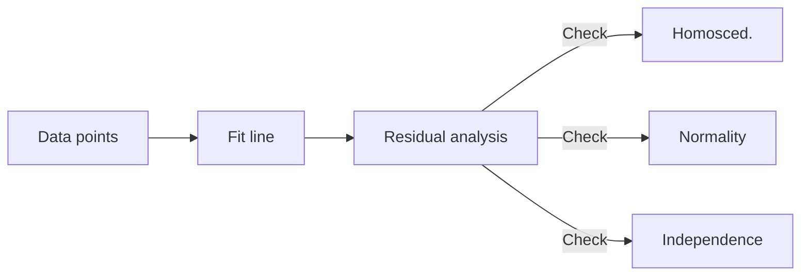
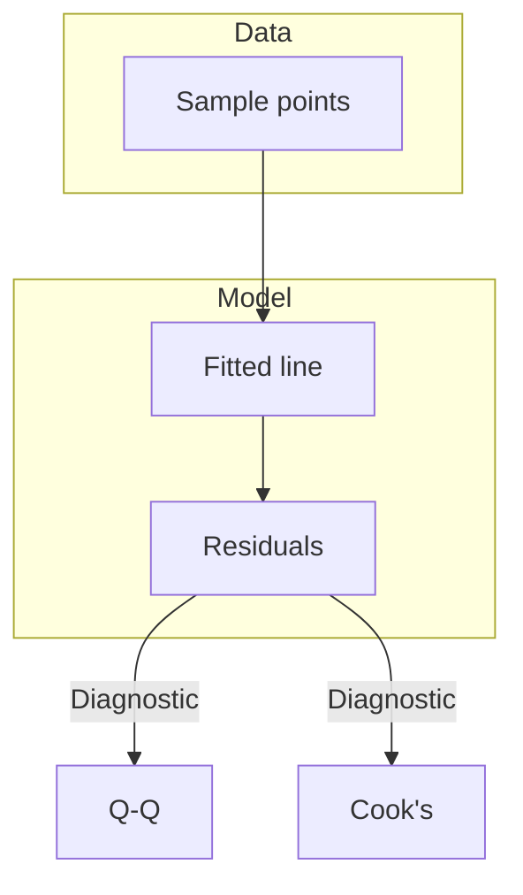
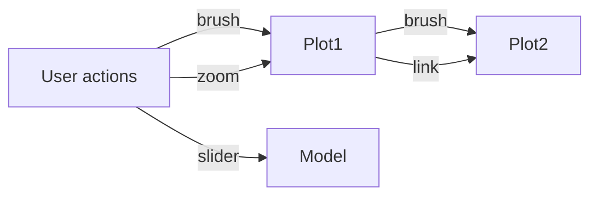

# Unit V: Predictive Analytics (English Detailed)

### Topics
1. [Predictive Analytics](#1-predictive-analytics)
2. [Simple Linear Regression](#2-simple-linear-regression)
3. [Multiple Linear Regression](#3-multiple-linear-regression)
4. [Interpretation of Regression Coefficients](#4-interpretation-of-regression-coefficients)
5. [Visualizations](#5-visualizations)
6. [Visual Data Analysis Techniques](#6-visual-data-analysis-techniques)
7. [Interaction Techniques](#7-interaction-techniques)
8. [Systems and Applications](#8-systems-and-applications)

## 1. Predictive Analytics

Predictive analytics is the branch of analytics that uses historical and current data to make informed estimates about future events or behaviours. It sits between descriptive analytics (what happened) and prescriptive analytics (what should be done) in the analytics spectrum, often acting as the bridge that converts insights into actionable forecasts.

### Why it matters
Organisations leverage predictive analytics to anticipate:

- **Customer churn** – by scoring customers based on usage patterns and support tickets.
- **Product demand** – using past sales, seasonality and trend components.
- **Fraud** – flagging transactions that deviate from normal patterns.
- **Equipment failure** – predicting when a machine will require maintenance to avoid downtime.

Converting raw data into foresight lets businesses shift from reactive firefighting to proactive planning, which can save costs, increase revenue, and improve customer satisfaction.

### Core components
1. **Data collection**: Gathering datasets from multiple sources such as CRM systems, IoT sensor feeds, transaction logs, and social media APIs. Data may be structured (tables), semi‑structured (JSON) or unstructured (text).
2. **Data preparation & feature engineering**: Cleaning (handling missing values, removing duplicates) and transforming raw inputs into features that a model can digest. Examples:
   - Lagged features in time series (e.g., sales
t−1).
   - Polynomial terms ($x^2$, $x^3$) to capture curvature.
   - One‑hot encoding of categorical variables (e.g., day of week).
   - Aggregates such as rolling averages or counts within a window.
3. **Model selection**: Choosing from a menu of algorithms based on the problem type (regression vs classification) and data scale. Options include linear regression, logistic regression, decision trees, random forests, gradient boosting, support vector machines, or deep neural networks.
4. **Training and validation**: Splitting data into training, validation and test sets. Employing techniques such as k‑fold cross‑validation to tune hyperparameters and avoid overfitting. Measuring performance with metrics appropriate to the task (e.g., RMSE for regression, ROC‑AUC for binary classification).
5. **Deployment**: Packaging the trained model for production. This may involve exporting to a model registry, providing a REST API (e.g., via Flask or FastAPI), running batch scoring jobs, or embedding the model within an application.
6. **Monitoring and retraining**: Monitoring prediction drift and data distribution changes; scheduling periodic retraining to keep the model current.

> **Detailed use case:** A national retailer uses five years of sales data, weather information, and advertising budgets to build a demand forecasting model. The model, a gradient-boosted tree, is trained weekly. Predictions feed into an automated inventory restocking system; during one holiday season it reduced out‑of‑stock events by 30 % and cut holding costs by 12 %.


## 2. Simple Linear Regression

Simple linear regression models the linear relationship between a single predictor variable $x$ and a continuous response $y$. It serves as a foundation for understanding more complex models.

### Model and assumptions
The model is written as

$$
y = \beta_0 + \beta_1 x + \varepsilon,
$$

where:

- $\beta_0$ is the intercept (the expected value of $y$ when $x=0$).
- $\beta_1$ is the slope (the expected change in $y$ for a one‑unit increase in $x$).
- $\varepsilon$ is the error term, assumed to be independently and identically distributed (i.i.d.) with mean zero and constant variance ($\sigma^2$).

Key assumptions:
1. **Linearity** – the relationship between $x$ and the expected value of $y$ is linear.
2. **Independence** – residuals are independent of one another.
3. **Homoscedasticity** – constant variance of residuals across all levels of $x$.
4. **Normality** – residuals follow a normal distribution (important for inference).
5. **No multicollinearity** – not applicable here since there is only one predictor, but serves as a reminder for later sections.

### Estimation by least squares
The ordinary least squares (OLS) estimator finds coefficients that minimize the sum of squared residuals:

$$
\hat{\beta}_1 = \frac{\sum_i (x_i - \bar{x})(y_i - \bar{y})}{\sum_i (x_i - \bar{x})^2}, \qquad
\hat{\beta}_0 = \bar{y} - \hat{\beta}_1 \bar{x}.
$$

Under the Gauss–Markov theorem, these estimators are the best linear unbiased estimators (BLUE) assuming the model assumptions hold.

### Inference and testing
- Standard error of slope: $\text{SE}(\hat{\beta}_1) = \sqrt{\frac{\sigma^2}{\sum_i (x_i - \bar{x})^2}}$.
- t‑statistic: $t = \hat{\beta}_1 / \text{SE}(\hat{\beta}_1)$ used to test $H_0: \beta_1 = 0$.
- Confidence interval for slope: $\hat{\beta}_1 \pm t_{\alpha/2, n-2} \cdot \text{SE}(\hat{\beta}_1)$.

### Goodness of fit
- **$R^2$**: proportion of variance in $y$ explained by $x$; values closer to 1 indicate a better fit.
- **Adjusted $R^2$**: same as $R^2$ for single predictor; useful when adding variables later.
- **Residual standard error (RSE)**: an estimate of the standard deviation of residuals.

### Diagnostic plots


Residual analysis may include plotting residuals against fitted values, a Q–Q plot, and looking for patterns that violate assumptions.

### Detailed example
Consider a dataset of 100 cars where $x$ is engine size (litres) and $y$ is fuel consumption (L/100 km). After fitting the model we obtain:

$$\hat{y} = 2.3 + 0.07x, \qquad R^2 = 0.68, \quad \text{RSE} = 0.5.
$$

Interpretation: each additional litre of engine capacity increases consumption by 0.07 L/100 km. The R‑squared indicates 68 % of the variability in consumption is explained by engine size; remaining variance may be due to driver behaviour, transmission type, etc.

A Python snippet to fit and visualise:

```python
import pandas as pd
import statsmodels.api as sm
import seaborn as sns
import matplotlib.pyplot as plt

data = pd.read_csv('car_data.csv')
X = sm.add_constant(data['engine_size'])
model = sm.OLS(data['fuel_consumption'], X).fit()
print(model.summary())

sns.scatterplot(x='engine_size', y='fuel_consumption', data=data)
plt.plot(data['engine_size'], model.fittedvalues, color='red')
plt.show()
```

The residuals vs fitted plot should show no systematic pattern if assumptions are met.


## 3. Multiple Linear Regression

Multiple regression generalises simple regression by allowing several predictors to jointly explain variation in the response.

$$
y = \beta_0 + \beta_1 x_1 + \beta_2 x_2 + \cdots + \beta_p x_p + \varepsilon.
$$

### Matrix formulation
Using matrix notation, the model becomes

$$
\mathbf{y} = \mathbf{X}\boldsymbol{\beta} + \boldsymbol{\varepsilon},
$$

where $\mathbf{X}$ is an $n\times(p+1)$ design matrix containing a column of ones (for the intercept) and columns for each predictor. The OLS estimator is

$$
\hat{\boldsymbol{\beta}} = (\mathbf{X}^T \mathbf{X})^{-1} \mathbf{X}^T \mathbf{y}.
$$

This closed form exists when $\mathbf{X}^T \mathbf{X}$ is invertible; otherwise, regularisation techniques (ridge, lasso) are used.

### Additional considerations
- **Multicollinearity:** When predictors are highly correlated, coefficient estimates become unstable and their variances inflate. Detect using the variance inflation factor (VIF):

$$
\text{VIF}_j = \frac{1}{1 - R_j^2},
$$

where $R_j^2$ is the $R^2$ from regressing $x_j$ on the other predictors. Values above 5–10 signal a concern.

- **Model selection:** Rather than include every available variable, choose a subset that balances explanatory power and parsimony. Criteria include adjusted $R^2$, Akaike Information Criterion (AIC), Bayesian Information Criterion (BIC) and stepwise procedures (forward, backward, or both).

- **Interactions:** Interaction terms such as $x_1 x_2$ allow the effect of one predictor to depend on the level of another. For example, the impact of marketing spend might vary with season.

- **Polynomial terms & transformations:** To capture curvature, include $x_j^2$, $\log(x_j)$, or other functions. For instance, a model predicting salary may include $	ext{experience}$ and $	ext{experience}^2$ to reflect diminishing returns.

- **Regularisation:** Techniques like ridge regression (L2 penalty) and lasso (L1 penalty) shrink coefficients to manage multicollinearity and prevent overfitting. Elastic net combines both penalties.

### Interpretation
Each coefficient $\beta_j$ represents the expected change in $y$ for a one‑unit increase in $x_j$, holding other predictors fixed. For categorical predictors encoded as dummies, coefficients measure differences relative to a reference category.

### Example
A housing price model built from a dataset of 5,000 properties uses predictors:

| Predictor         | Description                |
|------------------|----------------------------|
| $x_1$            | Size (m²)                  |
| $x_2$            | Number of bedrooms         |
| $x_3$            | Age of building (years)    |
| $x_4$            | Distance to city centre (km)|

After fitting, the model is:

$$
\hat{\text{price}} = 50{,}000 + 120 x_1 + 10{,}000 x_2 - 8{,}000 x_3 - 2{,}500 x_4.
$$

Interpretation:
- Increasing the size by 1 m² increases price by ₹120,000, holding other factors constant.
- Each additional bedroom adds ₹10,000.
- Older buildings lose ₹8,000 per year of age.
- Each kilometre farther from the city knocks off ₹2,500.

If an interaction term $x_1 x_2$ were included and had coefficient 500, it would indicate that larger homes with more bedrooms receive an additional premium.

### Diagnostics
Residual diagnostics extend directly from the single‑predictor case. Plots of residuals vs fitted values, leverage vs residuals squared (Cook’s distance), and examination of standardized residuals help identify:

- **Heteroscedasticity** – pattern in residuals vs fitted.
- **Influential points** – high leverage or large Cook’s distance.
- **Nonlinearity** – residuals show curvature.

In Python:

```python
import statsmodels.formula.api as smf
model = smf.ols('price ~ size + bedrooms + age + dist_center', data=housing).fit()
print(model.summary())

# Cook's distance
influence = model.get_influence()
(c, p) = influence.cooks_distance
plt.stem(c)
plt.xlabel('Observation')
plt.ylabel("Cook's distance")
plt.show()
```

When diagnostics reveal problems, consider transforming variables, removing outliers, or using robust regression techniques.


## 4. Interpretation of Regression Coefficients

Understanding coefficients allows practitioners to translate mathematical output into business insights that stakeholders can act upon.

### Units and scale
Coefficients are expressed in the units of $y$ per unit of the predictor. For example, if $y$ is annual revenue (₹) and $x$ is advertising spend (₹), a coefficient of 0.8 means each additional ₹1 of spend is associated with ₹0.80 in extra revenue, holding other variables constant.

Because different predictors often use different units and scales, it is common to **standardise** variables (subtract the mean and divide by the standard deviation) before fitting. The resulting coefficients (standardised betas) indicate the relative importance of features.

### Statistical significance and uncertainty
- **t‑test:** For each coefficient, compute
  $$t_j = \frac{\hat{\beta}_j}{\text{SE}(\hat{\beta}_j)}$$
  to test the null hypothesis $H_0: \beta_j = 0$ (no effect).
- **p‑value:** The probability of observing a $t$ statistic at least as extreme as the one obtained, assuming $H_0$ is true. Conventionally, $p < 0.05$ denotes statistical significance.
- **Confidence interval (CI):** A 95 % CI for $\beta_j$ is
  $$\hat{\beta}_j \pm t_{\alpha/2, n-p-1} \cdot \text{SE}(\hat{\beta}_j).$$
  If the interval excludes zero, the coefficient is significant at the chosen level.

Always report coefficients with their standard errors and CIs; a large coefficient with enormous uncertainty may be misleading.

### Dummy (indicator) variables
Categorical variables with $k$ levels are represented by $k-1$ binary dummy variables. For example, a colour variable with levels {Red, Green, Blue} can be encoded as:

| Colour | D1 (Green) | D2 (Blue) |
|--------|------------|------------|
| Red    | 0          | 0          |
| Green  | 1          | 0          |
| Blue   | 0          | 1          |

The coefficients for D1 and D2 measure the difference in the response relative to the reference category (Red).

### Interaction terms
Including a product term $x_1 x_2$ lets the effect of $x_1$ depend on the value of $x_2$:

$$y = \beta_0 + \beta_1 x_1 + \beta_2 x_2 + \beta_{12} x_1 x_2 + \varepsilon.
$$

Interpretation: for a one‑unit increase in $x_1$, $y$ changes by $\beta_1 + \beta_{12} x_2$; the slope of $x_1$ varies with $x_2$.

> **Practical tip:** Visualise interactions by plotting predicted $y$ against $x_1$ for several fixed values of $x_2$.

### Example summary table
| Coefficient | Estimate | Std. Error | t value | p value | 95 % CI               |
|-------------|----------|------------|---------|---------|-----------------------|
| Intercept   | 50,000   | 2,000      | 25.0    | <0.001  | [46,000, 54,000]      |
| Size        | 120      | 5          | 24.0    | <0.001  | [110, 130]            |
| Age         | -8,000   | 1,200      | -6.67   | <0.001  | [-10,400, -5,600]     |

Accompany tables with plots of coefficient estimates with error bars for visual clarity.

### Effect size vs significance
A small p‑value does not imply a large or important effect; conversely, a meaningful coefficient may be statistically insignificant in small samples. Evaluate both magnitude and certainty.

### Bringing it to stakeholders
- Use plain language (e.g., "an additional hour of training raises productivity by 5 %, all else equal").
- Provide concrete scenarios ("for a typical store, a $10,000 increase in advertising yields an expected $8,000 higher monthly revenue").
- Stress assumptions and limitations (linearity, omitted variables, causality vs correlation).

> **Rule of thumb:** Always accompany coefficient summaries with a reminder that regression reveals associations, not causation; domain knowledge is needed to infer causal relationships.


## 5. Visualizations

Graphical displays make model behaviour and data structure tangible, aiding both diagnostic checks and communication.

### Common plots
- **Scatter plot with fitted line:** Visualises the relationship between predictor(s) and response; useful for spotting outliers or non‑linear trends.
- **Residuals vs fitted values:** A flat, random scatter indicates homoscedasticity; a funnel or pattern suggests variance changes or missing terms.
- **Q‑Q plot of residuals:** Compares residual quantiles to a normal distribution; deviations from the 45‑degree line imply non‑normality.
- **Histogram/density of residuals:** Shows the residual distribution directly.
- **Cook’s distance plot:** Highlights observations with excessive influence on coefficient estimates.
- **Coefficient plot (forest plot):** Displays point estimates and confidence intervals for each $\beta_j$.
- **Partial regression plots:** Show the relationship between $y$ and a particular $x_j$ after removing the linear effects of other predictors.



### Tools and example code
Below is a Python example using `statsmodels` and `seaborn`.

```python
import pandas as pd
import seaborn as sns
import statsmodels.api as sm
import matplotlib.pyplot as plt

data = sns.load_dataset('mpg')
X = sm.add_constant(data[['horsepower', 'weight']])
model = sm.OLS(data['mpg'], X).fit()
print(model.summary())

# scatter with fit line
sns.scatterplot(x='horsepower', y='mpg', data=data)
plt.plot(data['horsepower'], model.predict(X), color='red')
plt.show()

# residual vs fitted
resid = model.resid
fitted = model.fittedvalues
sns.scatterplot(x=fitted, y=resid)
plt.axhline(0, color='black', linestyle='--')
plt.xlabel('Fitted values')
plt.ylabel('Residuals')
plt.show()

# Q-Q plot
sm.qqplot(resid, line='45')
plt.show()

# cook's distance
influence = model.get_influence()
(c, p) = influence.cooks_distance
plt.stem(c)
plt.xlabel('Obs')
plt.ylabel("Cook's distance")
plt.show()
```

### Interpretation examples
- **Funnel pattern** in the residuals vs fitted plot suggests using a transformation such as log($y$) or weighted least squares.
- **Q‑Q plot** bending upwards at the tails indicates heavier‑than‑normal tails; robust regression or bootstrap inference may help.
- **High Cook’s distance** points warrant investigation; they may be data entry errors or legitimately influential observations.

### Communicating with stakeholders
Visualization is not only for diagnostics but also for storytelling. A well‑labelled scatter plot with a regression line can quickly convey the nature of a relationship to a non‑technical audience. Coefficient plots with error bars are useful in presentations to show which variables have meaningful effects.

> **Example insight:** A company analysing marketing spend vs. sales may find that after $x=500$ k₹, the slope flattens; a scatter plot reveals the diminishing returns clearly, suggesting a budget cap.


## 6. Visual Data Analysis Techniques

Exploratory Data Analysis (EDA) is the process of using visual and summary statistics to understand data before building models. The goal is to spot trends, detect anomalies, and formulate hypotheses.

### Core EDA plots
- **Histograms and density plots:** Reveal the distribution of a single variable. Skewness, modality and outliers are easily spotted.
- **Box plots and violin plots:** Compare distributions across groups or categories. Outliers and median differences stand out.
- **Scatter plots and pair plots (scatter matrix):** Visualise pairwise relationships between numerical variables. In larger datasets use subsampling or alpha blending to handle overplotting.
- **Heatmap of correlation matrix:** Quickly identifies strong positive/negative correlations and potential multicollinearity issues. Colour scales encode correlation strength.
- **Bar plots and count plots:** Useful for categorical variables to show frequency counts.
- **Time series plots:** Plot metric values over time to examine trends, seasonality, and abrupt changes.
- **Lag plots and autocorrelation plots:** For time series data, these check for serial dependence.

### Interactive exploration tools
Platforms such as **Tableau**, **Power BI**, **Plotly Dash**, **Shiny**, and **Bokeh** offer drag‑and‑drop interfaces for creating dashboards. Key capabilities include:

- **Filtering** by categories or numeric ranges.
- **Brushing and linking** across multiple views.
- **Dynamic calculations** (e.g., change a time window and see all charts update).
- **Map visualisations** for geographic data.

### EDA example
Suppose you have sales data with columns *date*, *region*, *product_category*, *units_sold*, and *price*. An EDA workflow:

1. Plot histogram of *units_sold* to check for skew and outliers.
2. Use box plots to compare *price* across *product_category*.
3. Create a pair plot of *units_sold*, *price*, and *discount* to look for linear relationships.
4. Draw a heatmap of the correlation matrix to see that *price* and *discount* are strongly negatively correlated.
5. Build a time series chart of daily total sales to expose a weekly seasonality pattern.

> **Engineering example refined:** An analyst plots CPU usage (histogram) and scatter‑plots usage vs. response time. The scatter plot reveals a curved increase in response times when usage exceeds 70 %; inspired by this, they add a quadratic term and subsequently reduce residual variance by 15 %.

### Best practices
- Always label axes and provide units.
- Start with simple plots and progressively add complexity.
- Use colour judiciously to avoid misleading interpretations.
- Document observations; EDA findings often drive feature engineering and model selection.

Visual data analysis is iterative. Patterns discovered in one plot may suggest further plots or statistical tests, forming a cycle of exploration and refinement.


## 7. Interaction Techniques

Interactivity empowers users to probe datasets and model outputs intuitively, often uncovering insights that static visuals miss.

### Core interaction patterns
- **Zoom and pan:** allow users to inspect a subset of data at higher resolution (e.g., zooming into a dense region of a scatter plot).
- **Brushing and linking:** selecting a subset of data points in one chart causes the corresponding points to be highlighted in other linked charts. This is especially useful when exploring multivariate relationships across multiple views.
- **Filtering:** drop or include data based on categorical selections or numeric ranges; apply filters globally or to specific panels.
- **Tooltips and details-on-demand:** hovering over a mark reveals more information (e.g., exact values, metadata) without cluttering the plot.
- **Parameter sliders and controls:** interactive widgets that adjust model parameters or thresholds; real-time updates let users see how predictions or metrics change.
- **Zoomable timelines and range selectors:** common in time series views to select periods of interest.

### Libraries and tools
- **D3.js:** a powerful JavaScript library for creating custom, highly interactive visualisations in the browser. Requires programming but offers full control.
- **Plotly / Dash:** Python/JavaScript libraries that build interactive charts with minimal code. Dash apps can include sliders, dropdowns, and callbacks.
- **Shiny (R):** reactive web applications built in R, easily integrating ggplot2 and other plotting libraries.
- **Bokeh / HoloViz (Python):** support Python interactivity and embed in notebooks or serve via Bokeh server.
- **Power BI / Tableau:** vendor tools with drag‑and‑drop interfaces, allowing analysts to add interactions without coding.



### Interaction example
A sales dashboard comprises a map of store locations, a time series of weekly revenue, and a bar chart of product categories. The user:
1. Brushes over a cluster of points on the map to select stores in the northeast region.
2. The time series updates to show revenue only for those stores.
3. A slider lets the user choose a date range; all views refresh accordingly.
4. Hovering over a bar in the product chart reveals exact sales figures for that category.

This interaction pattern helps a regional manager quickly compare performance across areas and products without writing queries.

### Benefits and caveats
- **Benefits:** democratizes data exploration, reduces iteration time between questions and answers, aids storytelling.
- **Caveats:** too many interactions can overwhelm users; maintain simplicity. Performance can degrade on very large datasets; techniques like data aggregation or sampling may be needed.

> **Example:** A marketing analyst adjusts a slider for "email frequency" in a predictive model interface and immediately sees projected open rates change, enabling them to optimise campaign settings interactively.


## 8. Systems and Applications

Predictive analytics is supported by end‑to‑end systems that ingest, store, process and serve actionable insights. These systems must handle data reliability, scalability, model lifecycle management, and low‑latency scoring.

### Architectural components
1. **Data sources:** internal databases (CRM, ERP), IoT sensors (temperature, vibration), logs, and third‑party APIs (weather, social media).
2. **Ingestion and ETL/ELT:** Tools like **Kafka**, **NiFi**, **Airflow**, **Fivetran**, and custom scripts move raw data into storage. Real‑time systems may use Kafka or Kinesis, while batch jobs run on schedule.
3. **Storage:** A mix of technologies may be used:
   - Data lakes (Amazon S3, HDFS) for raw and semi‑structured data.
   - Data warehouses (Snowflake, Redshift, BigQuery) for structured, analytics‑ready data.
   - Feature stores (Feast, Tecton) for serving model features consistently.
4. **Computation and model training:** Batch frameworks (Spark MLlib, scikit‑learn on distributed clusters) or GPU‑based training for deep learning (TensorFlow, PyTorch). Notebooks (Jupyter, Colab) aid exploration.
5. **Model management and MLOps:** Version control of models and data, experiment tracking, automated retraining pipelines. Tools include **MLflow**, **Kubeflow**, **Seldon**, and **DVC**. Monitoring tracks input data drift and prediction quality to trigger retraining.
6. **Serving and deployment:** Models are deployed as REST/gRPC microservices, serverless functions, or embedded in applications. Low‑latency scoring may use model servers (TensorFlow Serving, TorchServe) or batch inference jobs.
7. **Visualization and dashboarding:** BI tools (Tableau, Power BI), custom dashboards (Grafana, Dash) display predictions, metrics and alerts.


### Example applications
- **Finance:** credit scoring models evaluate applicants in milliseconds by analysing credit history, income, and transaction patterns. Stock price forecasting uses time series models to make intraday trading decisions.
- **Retail:** demand forecasting models predict daily sales at the SKU‑store level; recommendation engines (collaborative filtering) personalise product suggestions.
- **Healthcare:** models predict patient readmission risk based on vitals, lab results, and prior admissions; early warning systems alert clinicians to potential sepsis.
- **Manufacturing:** predictive maintenance models forecast machine failure using vibration and temperature sensor data, enabling maintenance only when needed and reducing downtime.

### Case study (extended)
A global logistics company built a predictive delivery‑time system. Data sources included GPS logs, historical transit times, weather feeds, and traffic APIs. Engineers ingested data via Kafka and stored it in a Snowflake warehouse. A gradient‑boosted tree model was trained daily using Spark; features included distance, day of week, carrier, and live traffic speed. The model was deployed as a REST API behind a Kubernetes service. Customer-facing applications queried the API to display estimated arrival times. After implementation, the rate of late deliveries dropped 15 %, customer complaints fell, and the operations team used the same pipeline to trial new routing algorithms.

### Practical considerations
- **Data privacy & security:** ensure compliance with GDPR, HIPAA, etc., by anonymising data and controlling access.
- **Latency vs accuracy tradeoff:** real‑time scoring may require simpler models for speed.
- **Scalability:** leverage cloud infrastructure and autoscaling to handle peaks in traffic.
- **Explainability:** regulatory or business needs may demand interpretable models; techniques like SHAP or LIME can provide local explanations.

---

**Summary:** This unit covers the foundations of predictive analytics, explains regression models in depth, and emphasises the role of visualization, interactivity, and systems engineering in delivering actionable forecasts. By combining statistical rigor with practical engineering, predictive analytics enables data‑driven decision‑making across industries.