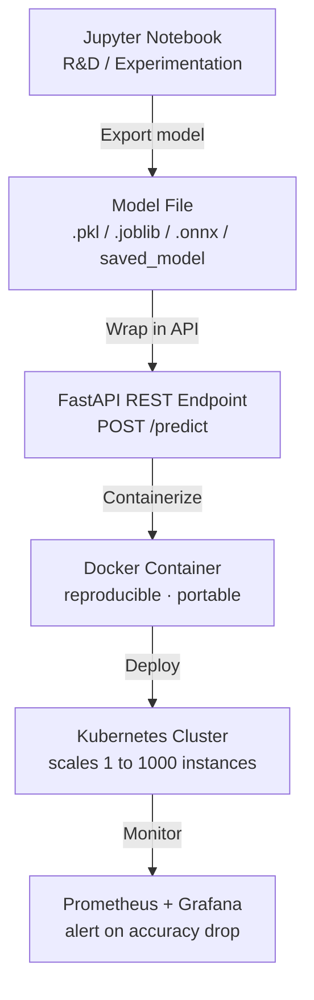
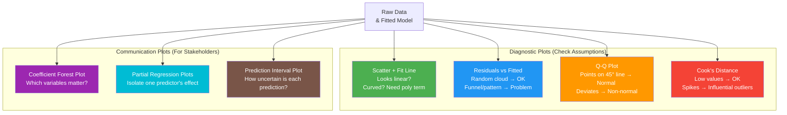
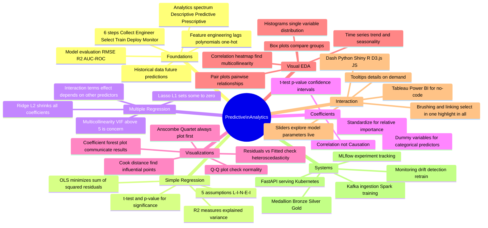

# Unit V: Predictive Analytics — The Fun Way!

> *"Descriptive analytics tells you what happened. Diagnostic analytics tells you why. Predictive analytics tells you what's GOING to happen. Prescriptive analytics tells you what to do about it. You just graduated from history class to fortune-telling — with math!"*

Welcome to **Unit V** — the unit where we stop looking at the past and start **predicting the future** using statistics, regression, and full end-to-end analytics systems! 

---

## What You'll Learn (Table of Contents)

1. [ Predictive Analytics](#1--predictive-analytics)
2. [ Simple Linear Regression](#2--simple-linear-regression)
3. [ Multiple Linear Regression](#3--multiple-linear-regression)
4. [ Interpretation of Regression Coefficients](#4--interpretation-of-regression-coefficients)
5. [ Visualizations](#5--visualizations)
6. [ Visual Data Analysis Techniques](#6--visual-data-analysis-techniques)
7. [ Interaction Techniques](#7--interaction-techniques)
8. [ Systems and Applications](#8--systems-and-applications)

---

## 1. Predictive Analytics

### What Is It, and Why Should You Care?

**Predictive analytics** is the art and science of using historical data to make educated guesses about the future. It sits right in the middle of the analytics spectrum:

```
 DESCRIPTIVE DIAGNOSTIC PREDICTIVE PRESCRIPTIVE
"What happened?" "Why did it happen?" "What will happen?" "What should we do?"
 Sales dropped Ad campaign failed Next quarter sales Increase marketing
 last quarter. in Target segment. will drop 12%. in Tier-2 cities.

 ◄─────────────── Looking backward ────────────────
 ──────────────── Looking forward ───────────────►
```

> **Crystal ball analogy:** Descriptive analytics is looking in a rearview mirror. Diagnostic is examining the engine after a crash. **Predictive is the GPS saying "traffic jam 5 km ahead — rerouting now!"** Prescriptive is the auto-pilot that takes over and reroutes your car automatically!

---

### The 6 Core Components of Predictive Analytics

#### 1⃣ Data Collection

Before predicting anything, you need data. Lots of it. From everywhere:

```
 Structured Data Semi-Structured Unstructured
 CRM databases JSON API responses Customer reviews
 Transaction logs IoT sensor telemetry Social media posts
 Sales spreadsheets XML feeds Call center recordings
 ERP system exports Web server logs Email text
```

> **Construction analogy:** Data is your raw material — bricks, cement, wood. Without quality raw materials, even the best architect (your model) can't build a good house. **Garbage in = Garbage out!**

---

#### 2⃣ Feature Engineering — Turning Raw Data into Model Food

Raw data rarely has "the right shape" for a model. Feature engineering is the craft of creating better inputs:

```python
import pandas as pd
import numpy as np

df = pd.read_csv('sales.csv')

# ── Temporal features ───────────────────────────────────────────
df['day_of_week'] = pd.to_datetime(df['date']).dt.dayofweek # 0=Mon, 6=Sun
df['is_weekend'] = df['day_of_week'].isin([5, 6]).astype(int) # Binary flag
df['month'] = pd.to_datetime(df['date']).dt.month
df['quarter'] = pd.to_datetime(df['date']).dt.quarter

# ── Lag features (what happened last week/month?) ───────────────
df['sales_lag_7'] = df['units_sold'].shift(7) # Sales from 7 days ago
df['sales_lag_30'] = df['units_sold'].shift(30) # Sales from 30 days ago

# ── Rolling window aggregates ───────────────────────────────────
df['rolling_7d_avg'] = df['units_sold'].rolling(7).mean()
df['rolling_30d_std'] = df['units_sold'].rolling(30).std() # Volatility!

# ── Polynomial terms (to capture curvature) ─────────────────────
df['price_squared'] = df['price'] ** 2
df['log_price'] = np.log(df['price'] + 1) # +1 to avoid log(0)!

# ── One-hot encoding for categorical variables ──────────────────
df = pd.get_dummies(df, columns=['product_category', 'region'], drop_first=True)
```

> **Chef analogy:** Raw data is raw ingredients — onions, tomatoes, spices. Feature engineering is chopping, marinating, and prep work. The model is the stove. **Even a great stove can't make good food if your prep work is terrible!**

---

#### 3⃣ Model Selection — The Algorithm Menu

| Problem Type | Algorithm Options | When to Use |
|-------------|-------------------|-------------|
| **Regression** (predict a number) | Linear Regression, Ridge, Lasso, Random Forest, Gradient Boosting, Neural Net | Sales forecasting, price prediction |
| **Classification** (predict a category) | Logistic Regression, SVM, Random Forest, XGBoost, Neural Net | Fraud detection, churn prediction |
| **Time Series** | ARIMA, Prophet, LSTM, Temporal Fusion Transformer | Stock prices, demand forecasting |
| **Clustering** | K-Means, DBSCAN, Hierarchical | Customer segmentation |
| **Anomaly Detection** | Isolation Forest, Autoencoder | Fraud, sensor anomalies |

> **Toolbox analogy:** You don't use a hammer to tighten a screw, and you don't use a logistic regression to predict house prices. **Know your problem type first, then pick the right tool!**

---

#### 4⃣ Training and Validation — Teaching and Testing the Model

> Your 5 years of data (1,000 rows) split into three sets:

| Split | Size | Purpose |
|---|---|---|
| **Training Set** | 70% — 700 rows | Model LEARNS: adjusts weights, finds patterns |
| **Validation Set** | 15% — 150 rows | Tune hyperparameters, avoid overfitting |
| **Test Set** | 15% — 150 rows | Final evaluation — **touch only once!** |

> **Never use the test set during development!** It's like peeking at the exam answer sheet — your score becomes meaningless.

**K-Fold Cross Validation:**
```
Instead of one fixed train/val split, rotate through K splits:

Fold 1: [VAL][TRAIN][TRAIN][TRAIN][TRAIN]
Fold 2: [TRAIN][VAL][TRAIN][TRAIN][TRAIN]
Fold 3: [TRAIN][TRAIN][VAL][TRAIN][TRAIN]
Fold 4: [TRAIN][TRAIN][TRAIN][VAL][TRAIN]
Fold 5: [TRAIN][TRAIN][TRAIN][TRAIN][VAL]

Average performance across 5 folds → more reliable estimate of real-world accuracy!
```

---

#### 5⃣ Deployment — Taking the Model to Production



---

#### 6⃣ Monitoring — Because Models Get Stale!

> **Milk analogy:** Your model is like milk. Fresh and accurate when first trained. But as the world changes (economy shifts, new products launch, user behavior changes), the model "goes bad" — it starts predicting based on outdated patterns. **Set an expiry date (retraining schedule)!**

```python
# Simple data drift detection
from scipy.stats import ks_2samp

# training data distribution
train_prices = training_df['price'].values
# current production data distribution 
live_prices = live_df['price'].values

stat, p_value = ks_2samp(train_prices, live_prices)
if p_value < 0.05:
 print(" DATA DRIFT DETECTED! Input distribution has changed significantly.")
 print("Consider retraining the model!")
```

---

### Real-World Case Study — Retail Demand Forecasting

```
PROBLEM: A national retailer wants to reduce:
 - Out-of-stock events (lose sales when popular items run out)
 - Overstock (waste money storing things nobody buys)

SOLUTION BUILT:
 Data: 5 years of sales + weather data + advertising budgets + holidays
 Model: Gradient Boosted Trees (LightGBM)
 Training frequency: Weekly retraining with latest data

RESULTS:
 ↓ 30% reduction in out-of-stock events during holiday season
 ↓ 12% reduction in inventory holding costs
 = Millions saved + happier customers!

DEPLOYMENT: Predictions feed directly into automated restocking system.
When model says "Product X will sell 500 units next week in Store Y",
the procurement system automatically places the order!
```

---

## 2. Simple Linear Regression

### The Most Powerful Idea in Statistics — A Straight Line!

Simple linear regression models one predictor ($x$) and one outcome ($y$) with the equation:

$$y = \beta_0 + \beta_1 x + \varepsilon$$

Where:
- $\beta_0$ = **intercept** — the predicted $y$ when $x = 0$
- $\beta_1$ = **slope** — how much $y$ changes for each 1-unit increase in $x$
- $\varepsilon$ = **error term** — the part of $y$ that $x$ can't explain (noise, randomness)

> **Analogy:** Imagine plotting every student's study hours ($x$) vs their exam score ($y$) on a graph. Linear regression draws the single best straight line through that cloud of points — the line that minimizes total error. **Regression finds the "best fit" line so you can predict: if a student studies 8 hours, what score will they likely get?**

---

### OLS — How We Find the Best Line

**Ordinary Least Squares (OLS)** finds the line by minimizing the sum of squared residuals (vertical distances from points to the line):

$$\text{Minimize:} \sum_{i=1}^{n} (y_i - \hat{y}_i)^2 = \sum_{i=1}^{n} (y_i - \hat{\beta}_0 - \hat{\beta}_1 x_i)^2$$

This gives the closed-form solution:

$$\hat{\beta}_1 = \frac{\sum_i (x_i - \bar{x})(y_i - \bar{y})}{\sum_i (x_i - \bar{x})^2}$$

$$\hat{\beta}_0 = \bar{y} - \hat{\beta}_1 \bar{x}$$

> **Tug-of-war analogy:** Each data point is "pulling" the line toward itself. OLS finds the equilibrium position where the total pull is minimized. Points farther from the line pull harder (squared!), so the line is especially sensitive to outliers.

---

### Why OLS Squares the Errors (Not Just Adds Them)

```
Why not minimize sum of |errors|?
 Because squaring has beautiful math properties!
 - Squaring makes all errors positive (no positive and negative canceling)
 - Squaring penalizes BIG errors more than small ones (outlier sensitivity)
 - Squared function is differentiable → can find minimum with calculus
 - Results in the BLUE (Best Linear Unbiased Estimator) under Gauss-Markov
```

---

### The 5 Assumptions of Linear Regression (L-I-N-E-I)

Remember the acronym **"LINE + I"**:

| Letter | Assumption | Violation Sign |
|--------|-----------|----------------|
| **L** | **Linearity** — $y$ and $x$ have a linear relationship | Curved pattern in scatter plot |
| **I** | **Independence** — residuals are independent of each other | Time-series data without accounting for autocorrelation |
| **N** | **Normality** — residuals follow a normal distribution | Q-Q plot deviates from the 45° line |
| **E** | **Equal variance** (Homoscedasticity) — residual spread is constant | Funnel shape in residuals vs fitted plot |
| **I** | **Independence of predictors** (No multicollinearity) | N/A for simple regression; VIF > 5 in multiple |

> **Assumption violations aren't the end of the world!** You can:
> - Apply $\log(y)$ or $\sqrt{y}$ transformations to fix non-linearity/heteroscedasticity
> - Use robust standard errors for heteroscedasticity
> - Use time series models for autocorrelation

---

### How Good Is Your Line? — Goodness of Fit

**$R^2$ — The Most Famous Statistic:**

$$R^2 = 1 - \frac{\text{SS}_\text{residual}}{\text{SS}_\text{total}} = 1 - \frac{\sum(y_i - \hat{y}_i)^2}{\sum(y_i - \bar{y})^2}$$

```
R² = 0.0 → model explains NOTHING (worse than just predicting the mean!)
R² = 0.5 → model explains 50% of variation in y
R² = 0.95 → model explains 95% of variation in y 
R² = 1.0 → perfect fit (almost certainly overfitting or a trivial relationship!)
```

> **Warning:** A high $R^2$ doesn't mean the model is correct! You could have:
> - Non-linear relationship that a line fits poorly despite high $R^2$
> - Omitted variable bias (missing an important predictor)
> - Spurious correlations (ice cream sales vs. drowning deaths both rise in summer — they're both caused by hot weather, not each other!)

---

### Statistical Significance — Is the Slope Real or Just Luck?

**Testing $H_0: \beta_1 = 0$ (the slope is zero — no relationship)**

$$t = \frac{\hat{\beta}_1}{\text{SE}(\hat{\beta}_1)}$$

```
t-statistic interpretation:
 t = 0 → slope estimate = 0, no evidence of relationship
 t = 2.0 → slope is 2 standard errors from zero → likely significant (p ≈ 0.05)
 t = 4.0 → very strong evidence of real relationship (p < 0.001)
 t = -3.5 → strong negative relationship evidence

p-value:
 p < 0.05 → Significant at 5% level (conventional threshold)
 p < 0.01 → Significant at 1% level (stronger evidence)
 p < 0.001 → Very strong evidence
```

> **Gambling analogy:** The p-value answers: "If there were truly NO relationship, how often would we see data as extreme as ours just by chance?" p = 0.05 means: even with NO true relationship, random chance would produce our result 5% of the time. So we're saying: "This would happen by luck only 1 in 20 times — probably not luck!"

---

### Full Python Implementation

```python
import pandas as pd
import numpy as np
import statsmodels.api as sm
import seaborn as sns
import matplotlib.pyplot as plt

# ── Load data ────────────────────────────────────────────────────
data = pd.read_csv('car_data.csv')
# x = engine_size (litres), y = fuel_consumption (L/100km)

# ── Fit the model ─────────────────────────────────────────────────
X = sm.add_constant(data['engine_size']) # Add β₀ intercept column
model = sm.OLS(data['fuel_consumption'], X).fit()

# ── Detailed results ─────────────────────────────────────────────
print(model.summary())
# Output: β₀=2.3, β₁=0.07, R²=0.68, p-value < 0.001

# ── Scatter plot with fitted line ────────────────────────────────
fig, axes = plt.subplots(1, 3, figsize=(15, 5))

# Plot 1: Data + regression line
axes[0].scatter(data['engine_size'], data['fuel_consumption'], alpha=0.5)
axes[0].plot(data['engine_size'], model.fittedvalues, 'r-', linewidth=2)
axes[0].set_xlabel('Engine Size (L)')
axes[0].set_ylabel('Fuel Consumption (L/100km)')
axes[0].set_title('Simple Linear Regression')
# Model: ŷ = 2.3 + 0.07x

# Plot 2: Residuals vs Fitted (check homoscedasticity)
axes[1].scatter(model.fittedvalues, model.resid, alpha=0.5)
axes[1].axhline(0, color='black', linestyle='--')
axes[1].set_xlabel('Fitted Values')
axes[1].set_ylabel('Residuals')
axes[1].set_title('Residuals vs Fitted\n(Should look like a random cloud!)')

# Plot 3: Q-Q plot (check normality of residuals)
sm.qqplot(model.resid, line='45', ax=axes[2])
axes[2].set_title('Q-Q Plot\n(Points should follow the 45° line)')

plt.tight_layout()
plt.savefig('regression_diagnostics.png', dpi=150)
plt.show()
```

---

### Interpreting the Example Output

For the car dataset: $\hat{y} = 2.3 + 0.07x$, $R^2 = 0.68$

```
β₀ = 2.3: When engine_size = 0L (theoretical baseline),
 expected fuel consumption is 2.3 L/100km.
 (Not physically meaningful here, just math!)

β₁ = 0.07: Each additional 1-litre increase in engine size
 is associated with 0.07 more L/100km consumption.
 A 3.0L engine vs 1.0L engine: 0.07 × 2 = 0.14 L/100km more.

R² = 0.68: Engine size explains 68% of the variability in fuel consumption.
 Remaining 32% is due to: driver behavior, transmission type,
 aerodynamics, load weight, tire pressure, etc.
```

---

## 3. Multiple Linear Regression

### When One Predictor Isn't Enough

The real world is complicated — house prices depend on size AND location AND age AND bedrooms AND proximity to schools AND crime rates AND... you get the idea.

**Multiple Linear Regression** includes multiple predictors:

$$y = \beta_0 + \beta_1 x_1 + \beta_2 x_2 + \cdots + \beta_p x_p + \varepsilon$$

In matrix notation (more elegant for computation):

$$\mathbf{y} = \mathbf{X}\boldsymbol{\beta} + \boldsymbol{\varepsilon}$$

And the OLS solution becomes:

$$\hat{\boldsymbol{\beta}} = (\mathbf{X}^T \mathbf{X})^{-1} \mathbf{X}^T \mathbf{y}$$

> **Astronomy analogy:** Simple regression is like using one telescope to locate a star — you get an idea, but it's limited. Multiple regression is using multiple telescopes from different angles simultaneously — you get a much more accurate 3D position of the star! Each predictor gives you a different "angle" on explaining $y$.

---

### Housing Price Example

| Predictor | Symbol | Description |
|-----------|--------|-------------|
| $x_1$ | Size | Area in m² |
| $x_2$ | Bedrooms | Number of bedrooms |
| $x_3$ | Age | Building age in years |
| $x_4$ | Distance | km from city center |

Fitted model:
$$\hat{\text{price}} = 50,000 + 120 x_1 + 10,000 x_2 - 8,000 x_3 - 2,500 x_4$$

```
Interpretation (each coefficient "holds all others fixed"):

β₁ = +120: Each extra m² adds ₹1,20,000 to price
 (holding bedrooms, age, distance constant)

β₂ = +10,000: Each extra bedroom adds ₹10,00,000
 (holding size, age, distance constant)

β₃ = -8,000: Each extra year of age REDUCES price by ₹8,00,000
 (building wear & tear effect)

β₄ = -2,500: Each extra km from city center REDUCES price by ₹25,000
 (location premium)

Intercept = 50,000: A 0 m², 0 bedroom, brand new house at distance 0...
 Not meaningful! Just the mathematical anchor.
```

---

### Multicollinearity — When Predictors Are "Too Similar"

**Problem:** If two predictors are highly correlated (e.g., house size AND number of rooms), the model can't tell which one is "responsible" for the price change. Coefficients become unstable and unreliable.

```
Example:
 Perfect scenario: size and bedrooms are independent
 Problem scenario: larger houses ALWAYS have more bedrooms

 Consequence: model might say:
 β₁ (size) = +200 and β₂ (bedrooms) = -50
 (Rooms look NEGATIVE even though more rooms = higher price!)
 The model is confused because the two predictors are intertwined.
```

**Detection: Variance Inflation Factor (VIF)**

$$\text{VIF}_j = \frac{1}{1 - R_j^2}$$

Where $R_j^2$ is the $R^2$ when you try to predict predictor $j$ using all other predictors:

```python
from statsmodels.stats.outliers_influence import variance_inflation_factor

X = housing[['size', 'bedrooms', 'age', 'dist_center']]
for i, col in enumerate(X.columns):
 vif = variance_inflation_factor(X.values, i)
 print(f"VIF for {col}: {vif:.2f}")

# Output:
# VIF for size: 1.45 → OK! No multicollinearity issue
# VIF for bedrooms: 1.82 → OK!
# VIF for age: 1.21 → OK!
# VIF for dist_center: 9.7 → CONCERN! dist_center correlates with other vars
```

| VIF Value | Interpretation |
|-----------|---------------|
| 1 | No correlation with other predictors (ideal) |
| 1–5 | Moderate, usually acceptable |
| 5–10 | High, investigate further |
| > 10 | Severe multicollinearity — take action! |

**Solutions for multicollinearity:**
1. **Remove one** of the correlated predictors
2. **Ridge Regression** (L2 regularization) — shrinks coefficients, stabilizes estimates
3. **Lasso Regression** (L1 regularization) — shrinks some coefficients exactly to zero (automatic feature selection!)
4. **Principal Component Analysis** — combine correlated features into uncorrelated components

---

### Regularization — Preventing Overfitting

When you have too many predictors (or multicollinearity), add a penalty term:

**Ridge Regression (L2):**
$$\text{Minimize: } \sum(y_i - \hat{y}_i)^2 + \lambda \sum_{j=1}^{p} \beta_j^2$$

**Lasso Regression (L1):**
$$\text{Minimize: } \sum(y_i - \hat{y}_i)^2 + \lambda \sum_{j=1}^{p} |\beta_j|$$

```python
from sklearn.linear_model import Ridge, Lasso, ElasticNet
from sklearn.preprocessing import StandardScaler
from sklearn.model_selection import cross_val_score
import numpy as np

X = housing[['size', 'bedrooms', 'age', 'dist_center']].values
y = housing['price'].values

# Always scale before regularization!
scaler = StandardScaler()
X_scaled = scaler.fit_transform(X)

# Try Ridge with different λ values
for alpha in [0.01, 0.1, 1.0, 10.0, 100.0]:
 model = Ridge(alpha=alpha)
 scores = cross_val_score(model, X_scaled, y, cv=5, scoring='r2')
 print(f"Ridge α={alpha:6.2f} | CV R²: {scores.mean():.3f} ± {scores.std():.3f}")

# Lasso for feature selection
lasso = Lasso(alpha=0.1)
lasso.fit(X_scaled, y)
feature_names = ['size', 'bedrooms', 'age', 'dist_center']
for name, coef in zip(feature_names, lasso.coef_):
 print(f"{name:15s}: {coef:.2f} {'← ELIMINATED' if coef == 0 else ''}")
```

> **Budget analogy:** Ridge is like telling all team members "everyone take a small pay cut." Lasso is like "fire the least productive people entirely." Lasso performs **automatic feature selection** — it sets useless coefficients exactly to 0!

---

### Interaction Terms — When Effects Depend on Each Other

Sometimes the effect of one predictor depends on another predictor's value:

$$y = \beta_0 + \beta_1 x_1 + \beta_2 x_2 + \beta_{12} x_1 x_2 + \varepsilon$$

**Housing example with interaction:**

If we add `size × is_luxury_area` interaction:
```
β₁₂ = +500

Interpretation:
 In non-luxury areas: effect of size = β₁ + β₁₂ × 0 = β₁ alone
 In luxury areas: effect of size = β₁ + β₁₂ × 1 = β₁ + 500

 → Every extra m² is worth ₹500 more in luxury areas than non-luxury!
 Size matters MORE in luxury neighborhoods.
```

```python
import statsmodels.formula.api as smf

# Interaction via formula syntax (much cleaner than manual calculation!)
model = smf.ols(
 'price ~ size + bedrooms + age + dist_center'
 ' + size:is_luxury_area' # interaction term
 ' + np.power(size, 2)', # quadratic term (diminishing returns for size)
 data=housing
).fit()

print(model.summary())
```

---

## 4. Interpretation of Regression Coefficients

### Turning Math into Business Insights

Raw coefficients are numbers. Your job is to translate them into **actionable business language** that a CEO, marketing manager, or product director can understand and act on.

---

### Units, Scale, and Standardization

**The problem:** Predictors have different units — size in m², bedrooms as count, age in years. How do you compare their "importance"?

```
Raw coefficients:
 β(size) = 120 (₹ per m²)
 β(bedrooms) = 10,000 (₹ per bedroom)
 β(age) = -8,000 (₹ per year)

Who matters more? You can't compare 120 and 10,000 directly
because they use completely different units!

Solution: STANDARDIZE the predictors first!
 z = (x - mean) / std

Standardized coefficients:
 β*(size) = 0.65 → 1-std increase in size → 0.65 std increase in price
 β*(bedrooms) = 0.42 → 1-std increase in bedrooms → 0.42 std increase in price
 β*(age) = -0.38 → 1-std increase in age → 0.38 std DECREASE in price

Now comparison is meaningful!
SIZE is the strongest driver of price (0.65 > 0.42 > 0.38)
```

```python
from sklearn.preprocessing import StandardScaler
import pandas as pd

scaler = StandardScaler()
X_scaled = pd.DataFrame(
 scaler.fit_transform(X),
 columns=X.columns
)
model_std = sm.OLS(y, sm.add_constant(X_scaled)).fit()
print("\nStandardized (Beta) Coefficients:")
print(model_std.params.drop('const').sort_values(key=abs, ascending=False))
```

---

### The Complete Coefficient Summary Table

This is what your model output should look like — and how to read every column:

| Coefficient | Estimate | Std. Error | t value | p-value | 95% CI |
|-------------|----------|-----------|---------|---------|--------|
| Intercept | 50,000 | 2,000 | 25.0 | < 0.001 | [46,000; 54,000] |
| Size (m²) | 120 | 5 | 24.0 | < 0.001 | [110; 130] |
| Bedrooms | 10,000 | 800 | 12.5 | < 0.001 | [8,400; 11,600] |
| Age (years) | -8,000 | 1,200 | -6.67 | < 0.001 | [-10,400; -5,600] |
| Distance (km) | -2,500 | 3,000 | -0.83 | 0.406 | [-8,500; 3,500] |

**Reading this table:**
```
Size: t=24.0, p<0.001 → Extremely significant! CI=[110,130] excludes 0 
Distance: t=-0.83, p=0.406 → NOT significant! CI=[-8500,3500] INCLUDES 0 
 → Distance to city center doesn't improve this model
 → Consider removing it (AIC/BIC will tell you for sure)
```

---

### Dummy Variables — Handling Categories

**Problem:** How do you put a categorical variable like "city" (Delhi, Mumbai, Bangalore) into a regression?

**Solution: One-Hot Encoding** — but with a reference category!

```
Original: city ∈ {Delhi, Mumbai, Bangalore}
Create 2 dummies (NOT 3 — always k-1 to avoid perfect multicollinearity!):

 D1_Mumbai D2_Bangalore
Delhi: 0 0 ← reference category
Mumbai: 1 0
Bangalore: 0 1

Model: price = β₀ + β₁(size) + β₂(D1_Mumbai) + β₃(D2_Bangalore) + ...

Interpretation:
 β₂ = +15,00,000 → Mumbai properties cost ₹15L MORE than Delhi, same size/age/etc.
 β₃ = +8,00,000 → Bangalore properties cost ₹8L MORE than Delhi, same features.

 Want Mumbai vs Bangalore comparison? β₂ - β₃ = ₹7,00,000 difference.
```

---

### Practical Coefficient Communication Tips

**Bad way to communicate (technical):**
> "The OLS estimate for the experience coefficient is 0.0523 with a standard error of 0.0071, yielding a t-statistic of 7.35 and a p-value of 2.3×10⁻¹³."

**Good way to communicate (business):**
> "Each additional year of experience is associated with a 5.2% salary increase. This finding is extremely reliable — the relationship would show up by random chance only once in 4 trillion random samples."

**Best way: Give a concrete scenario:**
> "For a typical employee with 5 years of experience at ₹8 LPA, one additional year of experience is associated with an expected salary bump of approximately ₹42,000 annually, holding education level and role constant."

---

### Correlation ≠ Causation reminder!

```
Famous spurious correlations:
 Ice cream sales → Drowning deaths (r = 0.85)
 Nicolas Cage films → Pool drownings (r = 0.92!)
 iPhone units sold → Suicide rates (r = 0.88)

Cause? NONE! All driven by confounders or randomness.
Ice cream and drowning are both caused by HOT WEATHER.

Regression gives you ASSOCIATION.
Causation requires:
 1. Temporal precedence (X happened before Y)
 2. Mechanism (how does X cause Y?)
 3. Ruling out confounders (RCT or natural experiment)
```

---

## 5. Visualizations

### Why Not Just Look at Numbers?

> **Anscombe's Quartet — the famous demonstration:**

Four datasets with IDENTICAL statistics:
- Mean of x: 9.0
- Mean of y: 7.5
- Variance of x: 11.0
- $R^2$: 0.67
- Regression line: ŷ = 3.0 + 0.5x

But when plotted, they look TOTALLY different:

```
Dataset 1: Linear relationship (regression is appropriate!)
Dataset 2: Curved relationship (need polynomial term!)
Dataset 3: Perfect linear with one massive outlier (outlier drives the line!)
Dataset 4: All x-values the same except one (terrible design!)

LESSON: Always visualize your data before and after fitting!
```

---

### The Essential Diagnostic Plot Gallery



---

### Complete Diagnostic Plotting Code

```python
import pandas as pd
import numpy as np
import statsmodels.api as sm
import seaborn as sns
import matplotlib.pyplot as plt
from statsmodels.graphics.gofplots import ProbPlot

# Fit model
data = sns.load_dataset('mpg').dropna()
X = sm.add_constant(data[['horsepower', 'weight']])
model = sm.OLS(data['mpg'], X).fit()

fitted = model.fittedvalues
residuals = model.resid
std_resid = (residuals - residuals.mean()) / residuals.std()

fig, axes = plt.subplots(2, 3, figsize=(18, 12))
fig.suptitle('Complete Regression Diagnostic Dashboard', fontsize=16, y=1.02)

# ── Plot 1: Scatter with fit line (for simple case) ──────────────
axes[0,0].scatter(data['horsepower'], data['mpg'], alpha=0.5, color='steelblue')
axes[0,0].set_xlabel('Horsepower')
axes[0,0].set_ylabel('MPG')
axes[0,0].set_title('Data + Relationship')

# ── Plot 2: Residuals vs Fitted ──────────────────────────────────
axes[0,1].scatter(fitted, residuals, alpha=0.5, color='orange')
axes[0,1].axhline(0, color='black', linestyle='--', linewidth=1)
axes[0,1].set_xlabel('Fitted Values')
axes[0,1].set_ylabel('Residuals')
axes[0,1].set_title('Residuals vs Fitted\n(Want: no pattern!)')
# Add a smoother to see trends
import statsmodels.nonparametric.smoothers_lowess as lowess
smooth = lowess.lowess(residuals, fitted, frac=0.5)
axes[0,1].plot(smooth[:,0], smooth[:,1], 'r-', linewidth=2)

# ── Plot 3: Q-Q Plot ─────────────────────────────────────────────
pp = ProbPlot(residuals)
pp.qqplot(line='45', ax=axes[0,2], alpha=0.5)
axes[0,2].set_title('Q-Q Plot of Residuals\n(Points should follow 45° line)')

# ── Plot 4: Scale-Location (check homoscedasticity) ─────────────
axes[1,0].scatter(fitted, np.sqrt(np.abs(std_resid)), alpha=0.5, color='green')
axes[1,0].set_xlabel('Fitted Values')
axes[1,0].set_ylabel('√|Standardized Residuals|')
axes[1,0].set_title('Scale-Location\n(Horizontal band = OK)')

# ── Plot 5: Cook's Distance ──────────────────────────────────────
influence = model.get_influence()
(cook_d, _) = influence.cooks_distance
axes[1,1].stem(cook_d, markerfmt=',', linefmt='grey', basefmt='black')
n = len(cook_d)
threshold = 4 / n # Common rule of thumb: 4/n
axes[1,1].axhline(threshold, color='red', linestyle='--', label=f'Threshold (4/n = {threshold:.3f})')
axes[1,1].set_xlabel('Observation Index')
axes[1,1].set_ylabel("Cook's Distance")
axes[1,1].set_title("Cook's Distance\n(Points above red line = influential!)")
axes[1,1].legend()

# ── Plot 6: Coefficient Forest Plot ─────────────────────────────
params = model.params.drop('const')
conf = model.conf_int().drop('const')
axes[1,2].errorbar(
 params.values,
 range(len(params)),
 xerr=[params.values - conf[0].values,
 conf[1].values - params.values],
 fmt='o', color='purple', capsize=5, capthick=2
)
axes[1,2].axvline(0, color='black', linestyle='--', alpha=0.5)
axes[1,2].set_yticks(range(len(params)))
axes[1,2].set_yticklabels(params.index)
axes[1,2].set_xlabel('Coefficient Value')
axes[1,2].set_title('Coefficient Plot\n(CI crossing 0 = not significant)')

plt.tight_layout()
plt.savefig('full_diagnostic_dashboard.png', dpi=150, bbox_inches='tight')
plt.show()
```

---

### Interpreting Your Diagnostic Plots

| Plot | What You See | Diagnosis | Fix |
|------|-------------|-----------|-----|
| Residuals vs Fitted | **Random cloud** | All good! | — |
| Residuals vs Fitted | **Funnel shape** | Heteroscedasticity | Log-transform y, use WLS |
| Residuals vs Fitted | **Curved pattern** | Non-linearity | Add polynomial term |
| Q-Q Plot | **Points on 45° line** | Normal residuals | — |
| Q-Q Plot | **S-shape curve** | Heavy tails | Robust regression |
| Q-Q Plot | **Top curls right** | Right skew | Log or sqrt transform |
| Cook's Distance | **All below 4/n** | No influential outliers | — |
| Cook's Distance | **Spike at obs i** | Observation i is influential | Investigate it! |

---

## 6. Visual Data Analysis Techniques

### Exploratory Data Analysis (EDA) — Look Before You Leap!

> **Medical analogy:** EDA is the doctor's examination BEFORE ordering tests or prescribing treatment. Skipping EDA is like prescribing medicine without examining the patient!

---

### The EDA Plot Toolkit

#### 1. Histogram / Density Plot — Single Variable Distribution

```python
import seaborn as sns
import matplotlib.pyplot as plt

fig, axes = plt.subplots(1, 2, figsize=(12, 4))

# Histogram with KDE overlay
sns.histplot(data['price'], bins=30, kde=True, ax=axes[0], color='steelblue')
axes[0].set_title('Price Distribution')
axes[0].set_xlabel('Price (₹)')

# Log-transformed (often better for right-skewed financial data)
sns.histplot(np.log1p(data['price']), bins=30, kde=True, ax=axes[1], color='orange')
axes[1].set_title('Log(Price) Distribution\n(More symmetric!)')
axes[1].set_xlabel('log(1 + Price)')
plt.tight_layout()
```

**What to look for:**
```
Normal (bell curve) → Good for linear regression directly
Right-skewed (long tail →) → Consider log transformation
Bimodal (two humps) → Two distinct populations! Separate them!
Uniform (flat) → Unusual, check data quality
```

#### 2. Box Plots — Compare Groups

```python
# Compare price across product categories
sns.boxplot(x='product_category', y='price', data=df,
 order=df.groupby('product_category')['price'].median().sort_values().index)
plt.xticks(rotation=45)
plt.title('Price Distribution by Category')

# Violin plot: more information than box plot!
sns.violinplot(x='region', y='units_sold', data=df, inner='box')
plt.title('Sales Distribution by Region\n(Wider = more data at that value)')
```

#### 3. Pair Plot — Pairwise Relationships (the EDA power tool!)

```python
# Check ALL pairwise relationships in one shot!
numeric_cols = ['size', 'bedrooms', 'age', 'dist_center', 'price']
pair_grid = sns.pairplot(
 housing[numeric_cols],
 diag_kind='kde', # Show distribution on diagonal
 plot_kws={'alpha': 0.5}, # Transparency for overlapping points
 corner=True # Show only lower triangle
)
pair_grid.fig.suptitle('Pairwise Relationships — Housing Data', y=1.02)
```

#### 4. Correlation Heatmap — Find Multicollinearity Early!

```python
corr_matrix = housing[numeric_cols].corr()

plt.figure(figsize=(8, 6))
mask = np.triu(np.ones_like(corr_matrix, dtype=bool)) # Hide upper triangle
sns.heatmap(
 corr_matrix,
 mask=mask,
 annot=True, # Show correlation values in cells
 fmt='.2f', # 2 decimal places
 cmap='RdYlGn', # Red=negative, Green=positive
 center=0, # Center colorscale at 0
 vmin=-1, vmax=1,
 square=True,
 linewidths=0.5
)
plt.title('Correlation Matrix\n(Red=negative, Green=positive correlation)')
```

**Reading the heatmap:**
```
(size, bedrooms) = 0.82 → High correlation! Multicollinearity risk!
(age, price) = -0.65 → Older buildings tend to be cheaper
(dist_center, size) = -0.15 → Weak relationship, no concern
```

#### 5. Time Series Plot — Trends + Seasonality

```python
# Monthly sales with trend and seasonality
plt.figure(figsize=(14, 6))

# Raw values
plt.plot(df['date'], df['monthly_sales'], alpha=0.4, label='Monthly Sales', color='steelblue')

# 12-month rolling average (smooth out seasonality)
rolling_avg = df.set_index('date')['monthly_sales'].rolling('365D').mean()
plt.plot(rolling_avg, label='12-Month Rolling Avg', color='red', linewidth=2)

# Mark significant events
for event_date, event_name in events.items():
 plt.axvline(pd.to_datetime(event_date), color='green', linestyle='--', alpha=0.7)
 plt.text(pd.to_datetime(event_date), plt.ylim()[1]*0.95, event_name,
 rotation=45, fontsize=8)

plt.legend()
plt.title('Monthly Sales — Trend + Seasonality Analysis')
plt.xlabel('Date')
plt.ylabel('Units Sold')
```

---

### The EDA Workflow


---

### EDA Best Practices Checklist

```
BEFORE modeling, ask yourself:

 Have I checked all variable distributions? (histograms)
 Are there obvious outliers? (box plots, scatter plots)
 Are there missing values? (df.isnull().sum())
 Are predictors correlated with each other? (correlation heatmap)
 Are predictors correlated with the target? (pair plot)
 Is the target variable normally distributed or skewed?
 For time series: is there seasonality or trend?
 Are there categorical variables? How many unique values?
 Are there data quality issues (impossible values, duplicates)?
 Have I documented my findings to share with the team?
```

---

## 7. Interaction Techniques

### Static Plots Are So Last Century!

Static charts are fine for presentations. But when you're **exploring** data, you need to poke it, prod it, filter it, and watch it react in real time. That's where interactive visualization becomes essential.

---

### Core Interaction Patterns

```
Interaction Type What It Does Tool
─────────────────────────────────────────────────────────────────
ZOOM & PAN Inspect dense data at detail Plotly, D3.js, Bokeh
BRUSHING Select subset in one chart → Vega-Altair, D3.js
 highlights appear in linked charts
FILTERING Dropdowns/sliders to show Dash, Shiny, Tableau
 subset of data
TOOLTIPS Hover for exact values + metadata Every major library
PARAMETER SLIDERS Change model params → live update Dash, Shiny, ipywidgets
RANGE SELECTOR Zoom into a time window Plotly, Bokeh
DRILL-DOWN Click a bar → see component details Power BI, Tableau
CROSS-FILTER Select in one chart → filters all Tableau, Dash
```

---

### Interactive Dashboard with Plotly Dash

```python
from dash import Dash, dcc, html, Input, Output, callback
import plotly.express as px
import pandas as pd

app = Dash(__name__)
df = px.data.gapminder() # World development dataset

app.layout = html.Div([
 html.H1(" Global Development Explorer", style={'textAlign': 'center'}),

 # ── Controls row ─────────────────────────────────────────────
 html.Div([
 html.Label("Select Year:"),
 dcc.Slider(
 id='year-slider',
 min=df['year'].min(), max=df['year'].max(),
 step=5,
 value=2007,
 marks={str(y): str(y) for y in df['year'].unique()}
 ),
 html.Label("Color by:"),
 dcc.Dropdown(
 id='color-dropdown',
 options=[{'label': c, 'value': c} for c in ['continent', 'gdpPercap']],
 value='continent',
 clearable=False
 ),
 ], style={'padding': '20px'}),

 # ── Charts row ────────────────────────────────────────────────
 html.Div([
 dcc.Graph(id='bubble-chart', style={'width': '50%', 'display': 'inline-block'}),
 dcc.Graph(id='bar-chart', style={'width': '50%', 'display': 'inline-block'}),
 ]),

 # ── The scatter shows what was clicked ────────────────────────
 dcc.Graph(id='time-series'),
])

@callback(
 Output('bubble-chart', 'figure'),
 Output('bar-chart', 'figure'),
 Input('year-slider', 'value'),
 Input('color-dropdown', 'value')
)
def update_charts(selected_year, color_col):
 filtered = df[df['year'] == selected_year]

 bubble = px.scatter(
 filtered,
 x='gdpPercap', y='lifeExp',
 size='pop', color=color_col,
 hover_name='country',
 log_x=True,
 size_max=60,
 title=f'GDP vs Life Expectancy ({selected_year})'
 )

 bar = px.bar(
 filtered.groupby('continent')['pop'].sum().reset_index(),
 x='continent', y='pop',
 color='continent',
 title=f'Population by Continent ({selected_year})'
 )

 return bubble, bar

@callback(
 Output('time-series', 'figure'),
 Input('bubble-chart', 'clickData')
)
def show_country_history(click_data):
 if click_data is None:
 country = 'India'
 else:
 country = click_data['points'][0]['hovertext']

 country_data = df[df['country'] == country]
 fig = px.line(country_data, x='year', y='lifeExp',
 title=f'Life Expectancy Over Time: {country}',
 markers=True)
 return fig

if __name__ == '__main__':
 app.run(debug=True, port=8050)
```

---

### Brushing and Linking — The Most Powerful Interaction

```python
import altair as alt
import pandas as pd

cars = pd.read_csv('cars.csv')

# Brush selection (interactive) — selecting in one chart highlights in both!
brush = alt.selection_interval()

# Chart 1: Horsepower vs MPG
scatter1 = alt.Chart(cars).mark_circle(size=60).encode(
 x='Horsepower:Q',
 y='Miles_per_Gallon:Q',
 color=alt.condition(brush, 'Origin:N', alt.value('lightgray')),
 tooltip=['Name:N', 'Origin:N', 'Horsepower:Q', 'Miles_per_Gallon:Q']
).add_params(brush).properties(
 title='Horsepower vs MPG',
 width=300, height=300
)

# Chart 2: Weight vs Acceleration
scatter2 = alt.Chart(cars).mark_circle(size=60).encode(
 x='Weight_in_lbs:Q',
 y='Acceleration:Q',
 color=alt.condition(brush, 'Origin:N', alt.value('lightgray')),
 tooltip=['Name:N', 'Origin:N', 'Weight_in_lbs:Q', 'Acceleration:Q']
).properties(
 title='Weight vs Acceleration\n(Highlights match your selection!)',
 width=300, height=300
)

# Side-by-side linked charts
(scatter1 | scatter2).save('linked_brushing.html')
# Open linked_brushing.html → brush a region in left chart → right chart updates!
```

---

### Library Comparison

| Library | Language | Learning Curve | Best For |
|---------|----------|---------------|---------|
| **Matplotlib** | Python | Low | Static publication plots |
| **Seaborn** | Python | Low | Statistical plots, EDA |
| **Plotly** | Python/R/JS | Medium | Interactive charts quickly |
| **Dash** | Python | Medium | Full dashboards with Python |
| **Altair** | Python | Medium | Declarative, brushing/linking |
| **Bokeh** | Python | Medium-High | Custom server-side interactivity |
| **D3.js** | JavaScript | Very High | Custom, anything imaginable |
| **Shiny** | R | Medium | R users, reactive web apps |
| **Tableau** | No-code GUI | Low (drag-drop) | Business analysts |
| **Power BI** | No-code GUI | Low (drag-drop) | Microsoft ecosystem |

---

### Real Use Case: Regional Sales Dashboard

```
A regional sales manager needs to:
 1. See overall company trends
 2. Compare regions
 3. Drill down into specific stores
 4. Monitor KPIs against targets

Without interaction (static):
 Need 10+ different reports emailed every Monday.
 By the time you've read them, the data is stale.

With interaction (Tableau dashboard):
 One dashboard. All live data.

 User story:
 1. Sees national revenue map → notices Northeast is RED (below target)
 2. Brushes over Northeast stores → all other charts filter to NE only
 3. Bar chart now shows NE product categories → Electronics is dragging
 4. Clicks Electronics bar → time series shows Electronics sales dropped sharply in Week 3
 5. Adds tooltip → Week 3 note: "Competitor sale event"

 This insight took 2 minutes. It would have taken 3 hours with static reports!
```

---

## 8. Systems and Applications

### End-to-End Architecture — From Raw Data to Real-Time Predictions

```mermaid
flowchart LR
 subgraph Sources[" Data Sources"]
 CRM["CRM\n(Salesforce)"]
 IoT["IoT Sensors\n(AWS IoT)"]
 Logs["App Logs\n(web/mobile)"]
 API["3rd Party APIs\n(weather, maps)"]
 end

 subgraph Ingestion[" Ingestion & ETL"]
 Kafka["Apache Kafka\n(Real-time streams)"]
 Airflow["Airflow\n(Batch ETL jobs)"]
 Fivetran["Fivetran\n(SaaS connectors)"]
 end

 subgraph Storage[" Storage Layer"]
 S3["Data Lake\n(AWS S3 / HDFS)"]
 DW["Data Warehouse\n(Snowflake / BigQuery)"]
 FS["Feature Store\n(Feast / Tecton)"]
 end

 subgraph Training[" Training"]
 Spark["Spark MLlib\n(Distributed)"]
 SKLearn["scikit-learn\n(Single node)"]
 GPU["GPU Training\n(TensorFlow/PyTorch)"]
 end

 subgraph MLOps[" MLOps"]
 MLflow["MLflow\n(Experiment tracking)"]
 Registry["Model Registry\n(Version control)"]
 DVC["DVC\n(Data versioning)"]
 end

 subgraph Serving[" Serving"]
 REST["REST API\n(FastAPI)"]
 k8s["Kubernetes\n(Auto-scaling)"]
 Batch["Batch Scoring\n(Spark jobs)"]
 end

 subgraph Monitoring[" Monitoring"]
 Prometheus["Prometheus\n(Metrics)"]
 Grafana["Grafana\n(Dashboards)"]
 Drift["Drift Detection\n(EvidentlyAI)"]
 end

 Sources --> Ingestion --> Storage --> Training --> MLOps --> Serving --> Monitoring
 Monitoring -->|"Alert: drift detected!"| Training

 style Sources fill:#4CAF50,color:#fff
 style Training fill:#2196F3,color:#fff
 style Serving fill:#FF9800,color:#fff
 style Monitoring fill:#F44336,color:#fff
```



---

### Each Layer in Detail

#### Layer 1: Data Sources

```
Types of data sources in real enterprise systems:

Internal:
 CRM (Salesforce/HubSpot) → customer behavior, sales pipeline
 ERP (SAP/Oracle) → inventory, orders, financials
 App databases (MySQL) → user actions, transactions
 Data warehouse snapshots → historical aggregates

External:
 REST APIs → Twitter/X sentiment, weather data, competitor prices
 IoT sensors → factory sensors, vehicle GPS, smart meters
 Web scraping → market research, product reviews
 Data vendors → demographic data, financial feeds (Bloomberg)
```

#### Layer 2: Ingestion

```
Real-time pathway (sub-second latency):
 Events → Kafka topics → Spark Streaming / Flink → Feature Store

Batch pathway (minutes-hours latency):
 Database dumps → Airflow DAG (schedule) → S3/HDFS

CDC (Change Data Capture):
 Debezium monitors database logs → streams INSERT/UPDATE/DELETE events to Kafka
 Your data warehouse is always in sync with the operational database!
```

```python
# Simple Kafka producer example (sending IoT sensor data)
from kafka import KafkaProducer
import json, time, random

producer = KafkaProducer(
 bootstrap_servers=['kafka1:9092', 'kafka2:9092'],
 value_serializer=lambda v: json.dumps(v).encode('utf-8')
)

while True:
 event = {
 'device_id': 'sensor_042',
 'temperature': 25.0 + random.gauss(0, 2),
 'humidity': 65.0 + random.gauss(0, 5),
 'timestamp': time.time()
 }
 producer.send('iot-readings', event)
 time.sleep(1) # One reading per second
```

#### Layer 3: Storage

```
THE "MEDALLION ARCHITECTURE" (modern data lake pattern):

Bronze Layer (Raw): Exact copy of source data. Never delete. Never modify.
 HDFS: /data/bronze/salesforce/2026/02/26/*.json

Silver Layer (Clean): Standardized, deduplicated, parsed, type-corrected.
 HDFS: /data/silver/customers/dt=2026-02-26/*.parquet

Gold Layer (Enriched): Business-ready aggregates and features for models.
 Snowflake table: gold.customer_features

Feature Store: Serves pre-computed features to models at low latency.
 Training: reads historical features from S3
 Serving: reads real-time features from Redis
```

#### Layer 4: Model Training

```python
# Example: Training a churn prediction model with Spark MLlib on a cluster
from pyspark.ml import Pipeline
from pyspark.ml.feature import VectorAssembler, StandardScaler
from pyspark.ml.classification import GBTClassifier
from pyspark.ml.evaluation import BinaryClassificationEvaluator
from pyspark.sql import SparkSession

spark = SparkSession.builder.appName("ChurnModel").getOrCreate()

# Load 50 million customer records from data warehouse
df = spark.read.parquet("s3://company-datalake/gold/customer_features/")

feature_cols = ['usage_30d', 'support_tickets', 'days_since_last_login',
 'monthly_spend', 'plan_tier_encoded', 'num_products']

assembler = VectorAssembler(inputCols=feature_cols, outputCol='features_raw')
scaler = StandardScaler(inputCol='features_raw', outputCol='features')
gbt = GBTClassifier(labelCol='churned', featuresCol='features',
 maxIter=100, maxDepth=5)

pipeline = Pipeline(stages=[assembler, scaler, gbt])

train_df, test_df = df.randomSplit([0.8, 0.2], seed=42)
model = pipeline.fit(train_df)

# Evaluate
evaluator = BinaryClassificationEvaluator(labelCol='churned')
auc = evaluator.evaluate(model.transform(test_df))
print(f"Test AUC: {auc:.4f}") # e.g., 0.8923

# Save model
model.write().overwrite().save("s3://company-models/churn/v3/")
```

#### Layer 5: MLOps with MLflow

```python
import mlflow
import mlflow.sklearn
from sklearn.ensemble import GradientBoostingClassifier
from sklearn.metrics import roc_auc_score, precision_score, recall_score

mlflow.set_experiment("churn-prediction")

with mlflow.start_run(run_name="GBT-v3-hypertuned"):
 # Log hyperparameters
 mlflow.log_param("n_estimators", 200)
 mlflow.log_param("max_depth", 5)
 mlflow.log_param("learning_rate", 0.05)
 mlflow.log_param("feature_set", "v3-with-support-tickets")

 # Train
 model = GradientBoostingClassifier(n_estimators=200, max_depth=5, learning_rate=0.05)
 model.fit(X_train, y_train)

 # Log metrics
 y_pred_proba = model.predict_proba(X_test)[:, 1]
 y_pred = model.predict(X_test)
 mlflow.log_metric("roc_auc", roc_auc_score(y_test, y_pred_proba))
 mlflow.log_metric("precision", precision_score(y_test, y_pred))
 mlflow.log_metric("recall", recall_score(y_test, y_pred))

 # Log the model artifact itself
 mlflow.sklearn.log_model(model, "churn_model")

 # Log feature importance plot
 plt.figure(figsize=(10, 6))
 feature_imp = pd.Series(model.feature_importances_, index=feature_cols)
 feature_imp.sort_values().plot(kind='barh', color='steelblue')
 plt.title('Feature Importances')
 plt.tight_layout()
 mlflow.log_figure(plt.gcf(), "feature_importance.png")

print(" Experiment logged! View at: http://localhost:5000")
```

#### Layer 6: Serving with FastAPI

```python
from fastapi import FastAPI
from pydantic import BaseModel
import joblib
import numpy as np
import uvicorn

app = FastAPI(title="Churn Prediction API", version="3.0")

# Load model at startup (once, not per request!)
model = joblib.load("churn_model_v3.pkl")
scaler = joblib.load("scaler_v3.pkl")

class CustomerFeatures(BaseModel):
 usage_30d: float # Total usage in last 30 days
 support_tickets: int # Open support tickets
 days_since_last_login: int # Recency
 monthly_spend: float # Monthly revenue in ₹
 plan_tier_encoded: int # 0=Free, 1=Basic, 2=Pro, 3=Enterprise
 num_products: int # Number of products subscribed to

class PredictionResponse(BaseModel):
 churn_probability: float
 risk_segment: str # Low / Medium / High
 recommended_action: str

@app.post("/predict", response_model=PredictionResponse)
async def predict_churn(features: CustomerFeatures):
 # Convert to numpy array
 X = np.array([[
 features.usage_30d, features.support_tickets,
 features.days_since_last_login, features.monthly_spend,
 features.plan_tier_encoded, features.num_products
 ]])
 X_scaled = scaler.transform(X)

 prob = model.predict_proba(X_scaled)[0, 1]

 # Business rules on top of model output
 if prob < 0.3:
 segment, action = "Low", "No action needed"
 elif prob < 0.7:
 segment, action = "Medium", "Send retention email campaign"
 else:
 segment, action = "High", "Assign to retention specialist — call within 24h"

 return PredictionResponse(
 churn_probability=round(prob, 4),
 risk_segment=segment,
 recommended_action=action
 )

@app.get("/health")
async def health_check():
 return {"status": "healthy", "model_version": "3.0"}

# uvicorn main:app --host 0.0.0.0 --port 8000
```

---

### Industry Applications — Where Predictive Analytics Shines

| Industry | Application | Data Used | Model Type | Business Impact |
|----------|------------|-----------|------------|-----------------|
| Finance | Credit scoring | Transaction history, credit bureau | Logistic Regression, GBT | Approve/reject loans in milliseconds |
| Retail | Demand forecasting | Sales history, weather, events | LightGBM, Prophet | Reduce stockouts 30% |
| Healthcare | Readmission risk | Vitals, lab results, prior admissions | Random Forest | Early intervention saves lives |
| Manufacturing | Predictive maintenance | Vibration, temperature sensors | LSTM, Isolation Forest | Fix machines before they fail |
| Insurance | Claims prediction | Driver behavior, vehicle data | XGBoost | Correct risk-based premium pricing |
| Tech | Churn prediction | Usage patterns, support tickets | GBT + Survival Analysis | Retain high-value customers proactively |
| Logistics | Delivery time prediction | GPS, traffic, weather, distance | Gradient Boosting | Reduce late deliveries 15% |

---

### Extended Case Study — Global Logistics Company

```
PROBLEM:
 Customer complaints about inaccurate delivery time estimates
 "Your website said 2 days but it took 6!"

DATA SOURCES:
 GPS logs → actual transit times (historical)
 Weather APIs → real-time and forecast weather along routes
 Traffic APIs → current and historical congestion data
 Order system → distance, carrier, package weight

PIPELINE:
 Kafka → ingests GPS and weather streams in real-time
 Snowflake → stores all historical transit + features
 Spark → daily model training (5 million deliveries/week of data)
 GBT model → features: distance, day_of_week, carrier, weather_score, traffic_index
 FastAPI + Kubernetes → prediction endpoint (50ms latency)

MODEL FEATURES:
 distance_km (obvious)
 day_of_week (weekends are slower)
 is_holiday (holidays massively slow delivery)
 carrier_id (each carrier has different SLAs)
 live_traffic_speed_on_route (real-time!)
 weather_severity_forecast (rain/snow along route)
 origin_region_load (is the warehouse currently busy?)

RESULTS:
 ↓ 15% reduction in late deliveries
 ↓ 40% reduction in "where is my package?" customer contacts
 Routing team uses same pipeline to A/B test new routes

MONITORING:
 Alert fires if model's MAE (mean absolute error) rises above 4 hours
 Weekly automated retraining keeps model fresh as traffic patterns evolve
```

---

### Practical Considerations

#### Data Privacy and Compliance

```
GDPR (Europe): Must get consent, can request deletion, must explain predictions
HIPAA (US Healthcare): PHI (Protected Health Info) cannot leave approved systems
PDP Bill (India): Similar consent and data localization requirements

Practical steps:
 Anonymize PII before sending to model training
 Audit trails for who accessed which data
 Right-to-explanation: can you explain WHY credit was denied?
 Model cards documenting fairness, limitations, use cases
```

#### Latency vs Accuracy Tradeoff

```
SCENARIO: Fraud detection at payment gateway

Real-time (< 100ms budget):
 Can't run a full neural network! Too slow!
 Use: Lightweight logistic regression or decision tree
 Sacrifice some accuracy for speed

Batch nightly:
 Run full deep learning on all day's transactions
 Flag suspicious patterns for human review

HYBRID approach (best of both worlds):
 Real-time: fast model catches 80% of obvious fraud
 Batch: deep model re-scores everything, catches remaining 15%
 Human review: handles the remaining edge cases
```

---

## Unit Summary



---

## Test Your Knowledge — Quick Quiz!

**Q1.** Your residuals-vs-fitted plot shows a clear funnel shape (variance increases as fitted values increase). What assumption is violated, and what are two ways to fix it?

<details>
<summary>Click to reveal answer </summary>

**Violated assumption: Homoscedasticity** (equal variance / no heteroscedasticity).

**Two fixes:**

1. **Transform the response variable:** Apply $\log(y)$ or $\sqrt{y}$ transformation to stabilize variance. This often works when variance grows proportionally with the mean.

 ```python
 # Instead of predicting price, predict log(price)
 model = sm.OLS(np.log(y), X).fit()
 # To get predictions on original scale: np.exp(model.predict(X_new))
 ```

2. **Use Weighted Least Squares (WLS):** Give observations with lower expected variance higher weight.

 ```python
 # If variance is proportional to fitted values
 weights = 1.0 / model.fittedvalues
 wls_model = sm.WLS(y, X, weights=weights).fit()
 ```

Alternatively, use **Heteroscedasticity-Consistent (HC) standard errors** (doesn't fix the variance, but gives valid inference despite it):
```python
model_robust = sm.OLS(y, X).fit(cov_type='HC3')
```
</details>

---

**Q2.** You have 15 predictor variables in a model. After computing VIF, you find `temperature` has VIF=12 and `feels_like_temperature` has VIF=11. What does this mean and what should you do?

<details>
<summary>Click to reveal answer </summary>

**Diagnosis:** These two predictors are highly multicollinear — likely because "temperature" and "feels_like_temperature" are almost identical measurements (correlation near 1). A VIF of 12 means: 92% of `temperature`'s variance can be explained by the other predictors.

**Consequences:**
- Coefficient estimates for both variables become unreliable and unstable
- Standard errors inflate → variables may appear insignificant even if they truly matter
- Signs can flip (positive effect appearing negative!)

**What to do:**

1. **Remove one** of the two (keep the more predictive one — compare their correlation with the target)
2. **Create a combined feature:** `avg_temperature = (temperature + feels_like) / 2`
3. **Use Ridge Regression** which handles multicollinearity by shrinking correlated coefficients
4. **Use PCA** to create uncorrelated linear combinations of the two
</details>

---

**Q3.** Explain the difference between $R^2$ and Adjusted $R^2$. When can $R^2$ mislead you?

<details>
<summary>Click to reveal answer </summary>

$$R^2 = 1 - \frac{SS_{res}}{SS_{tot}}$$

$$\text{Adjusted } R^2 = 1 - \frac{(1-R^2)(n-1)}{n-p-1}$$

**Key difference:** $R^2$ **always increases** when you add more predictors — even if they're useless noise variables! Adjusted $R^2$ penalizes for each added predictor, only improving when the new variable adds genuine explanatory power.

**When $R^2$ misleads:**

1. **Adding junk variables:** Adding a random number column to your regression increases $R^2$ slightly (the model "overfits" to noise). Adjusted $R^2$ would decrease.

2. **Overfitting:** High $R^2$ on training data ≠ good predictions on new data. Always check test-set performance!

3. **Non-linear relationships:** Can have $R^2$ = 0.9 but the model still systematically mispredicts at extreme values.

4. **Spurious correlations:** Ice cream sales and drowning deaths have high $R^2$ but no causal relationship.

**Rule:** When comparing models with different numbers of predictors, always use Adjusted $R^2$, AIC, or BIC — never raw $R^2$!
</details>

---

**Q4.** What is the difference between data drift and concept drift in a deployed model? Give an example of each.

<details>
<summary>Click to reveal answer </summary>

**Data Drift (Covariate Shift):**
The *distribution of input features* changes, but the underlying relationship between features and target stays the same.

*Example:* An e-commerce recommendation model trained on pre-COVID data. After COVID, users started buying home office equipment instead of travel accessories. The distribution of product categories in user behavior (input features) shifted dramatically.

Detection:
```python
from scipy.stats import ks_2samp
stat, p = ks_2samp(train_data['age'], live_data['age'])
if p < 0.05: print("Data drift detected in 'age' feature!")
```

**Concept Drift:**
The *relationship between features and the target* changes, even if input distributions look the same.

*Example:* A credit scoring model trained in 2020 used "employment status" = employed as a strong positive signal. During 2020-2021, "employed" people defaulted at unprecedented rates (COVID layoffs happened AFTER loans were issued). The relationship between employment and default risk (the concept) changed!

**Why both matter:**
- Data drift → retraining with new data often fixes it
- Concept drift → need to reconsider the features and model architecture

**Monitor both:** track input feature distributions (data drift) AND prediction accuracy on labeled outcomes (concept drift).
</details>

---

**Q5.** You deploy a churn prediction model via FastAPI on Kubernetes. Three months later, you notice the model's precision has dropped from 85% to 65%. Walk through your debugging process.

<details>
<summary>Click to reveal answer </summary>

**Systematic debugging process:**

**Step 1: Confirm the metrics are real**
```python
# Re-run evaluation on a fresh labeled dataset
# Make sure you're computing precision correctly
# Check for bugs in the evaluation code first!
```

**Step 2: Check data drift**
```python
# Compare training data distribution vs recent production data
for col in feature_columns:
 stat, p = ks_2samp(train_df[col], live_df[col])
 if p < 0.05:
 print(f" Drift in feature: {col}")
```

**Step 3: Investigate what changed 3 months ago**
- Did a new product launch? (alters usage patterns)
- Was there a pricing change? (alters spend features)
- Did a data pipeline change? (different feature calculation)
- Did user demographics shift? (new market expansion)

**Step 4: Analyze where mistakes occur**
```python
# Look at False Positives (predicted churn but they stayed)
fp_customers = test_df[(predictions == 1) & (actuals == 0)]
print("False Positives profile:")
print(fp_customers[features].describe())
# Compare to True Positives — what's different?
```

**Step 5: Solutions**
- **Retrain** with recent 3 months of data
- **Add recency weighting** (recent examples matter more)
- **Add new features** that capture the changed behavior
- **Consider a new model** if concept drift is severe

**Lesson:** Set up automated monitoring alerts (e.g., alert if precision drops > 5% relative in a week) so you catch problems **before** they become 3-month problems!
</details>

---

## Mnemonics to Remember

| Concept | Mnemonic |
|---------|----------|
| **5 Regression Assumptions** | **"LINE-I"** — Linearity, Independence, Normality, Equal Variance, (no) Intercorrelation |
| **Analytics Spectrum** | **"What? Why? Will? Do!"** — Descriptive → Diagnostic → Predictive → Prescriptive |
| **Regularization** | **"Ridge Rounds, Lasso Lassos"** — Ridge shrinks all, Lasso eliminates some to exactly 0 |
| **R² warning** | **"R-squared RISES, it never FALLS — adding garbage improves it at all!"** — always check Adjusted R² |
| **Predictive ML pipeline** | **"Collect Clean Choose Train Deploy Watch"** — the 6-step cycle |
| **VIF threshold** | **"Five is Fine, Ten is Trouble"** — VIF < 5 OK, VIF > 10 is severe multicollinearity |
| **Coefficient interpretation** | **"Hold everything else constant"** — β_j = change in y per 1-unit increase in x_j, all other x FIXED |

---

## Further Reading & Resources

| Resource | What It Covers |
|----------|---------------|
| *An Introduction to Statistical Learning* — James, Witten, Hastie, Tibshirani | Regression, classification, tree models — free PDF online! |
| *The Elements of Statistical Learning* — Hastie, Tibshirani, Friedman | Advanced ML theory with math depth |
| *Python for Data Analysis* — Wes McKinney | Pandas, EDA, data manipulation |
| *Storytelling with Data* — Cole Nussbaumer Knaflic | Visualization communication |
| scikit-learn Documentation (scikit-learn.org) | Complete ML algorithms reference + examples |
| Plotly Dash Documentation | Interactive dashboard development |
| *Attention Is All You Need* (2017) | Transformer architecture for time series |
| MLflow Documentation (mlflow.org) | Model tracking and registry |
| fast.ai Practical Deep Learning | Hands-on deep learning with real datasets |

---

*Made with for Big Data learners everywhere. Remember: The best model is not the most complex one — it's the one that makes it to production, keeps working, and helps real people make better decisions!*

---
*Unit V Complete — You've Completed the Big Data Survival Guide! *
