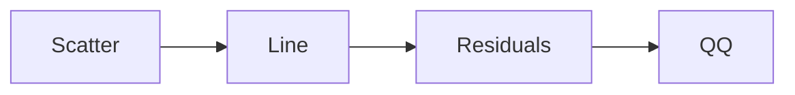

# Unit V: Predictive Analytics (Hinglish Summary)

### Topics
1. [Predictive Analytics](#1-predictive-analytics)
2. [Simple Linear Regression](#2-simple-linear-regression)
3. [Multiple Linear Regression](#3-multiple-linear-regression)
4. [Interpretation of Regression Coefficients](#4-interpretation-of-regression-coefficients)
5. [Visualizations](#5-visualizations)
6. [Visual Data Analysis Techniques](#6-visual-data-analysis-techniques)
7. [Interaction Techniques](#7-interaction-techniques)
8. [Systems and Applications](#8-systems-and-applications)

## 1. Predictive Analytics

Predictive analytics ka matlab hai past data se "future ka andaza" lagana. Problem ko history pe fit kiye hue model se solve karte hain, phir naya data daalte hi prediction milta.

> **Example:** Bank apne customers ke records dekh ke loan default ka probability nikalta.

## 2. Simple Linear Regression

Simple regression me do variables (x aur y) ke beech ek straight line fit ki jati hai. Least squares method se slope aur intercept nikalte.

- Formula: $y = \beta_0 + \beta_1 x + \varepsilon$.
- Metrics: slope, intercept, $R^2$.
- Assumptions: linearity, errors independent & constant variance, normality.

## 3. Multiple Linear Regression

Jab predictors ka number zyada ho, multiple regression use hota. Har predictor ka effect baaki sab constant rakhte hue measure hota.

- Interaction aur polynomial terms se complex sambandh model kar sakte.
- Multicollinearity se bachne ke liye VIF check karte.
- Model select karne ke liye adjusted $R^2$, AIC/BIC ya stepwise method use karte.

> **Example:** Ghar ki keemat = base + 120*size - 8*age + 10*bedrooms.

## 4. Regression Coefficients ka Interpretation

Coefficients ko samajhna important hai:

- Units pe dhyan do (e.g., ₹ per metre).
- Significance check karne ke liye t-test aur p-value dekho.
- Confidence interval uncertainty batata.
- Dummy variables categories ka farak batate.
- Interaction term batata ke ek variable doosre pe depend karta.

## 5. Visualizations

Graphs se model ko asaani se samjha sakte:

- Scatter plot + fitted line.
- Residual vs fitted (variance check).
- Q-Q plot residuals ki normality batata.
- Coefficient plot with error bars.

## 6. Visual Data Analysis Techniques

Exploratory Data Analysis (EDA) ke tools:
- Histogram/density ek variable distribution dikhaye.
- Box plot categories compare kare.
- Pair plot/heatmap se multivariate relationships dekhe.
- Time series plot se trend/seasonality samjhe.

Interactive dashboards (Tableau, Power BI, Dash) se filter aur drill-down ho sakta.

## 7. Interaction Techniques

User ko data ke saath interact karne ke liye:
- Zoom/pan details dekhne ke liye.
- Brushing se ek view me select kiye points doosre view me highlight.
- Filtering data ko dynamic rakhne ke kaam aata.
- Slider parameter adjust karne ke liye.

Libraries: D3.js, Plotly, Shiny, Dash etc.

## 8. Systems aur Applications

Predictive analytics system me yeh components hote:

- **Data ingestion:** Kafka/NiFi jaisa ETL.
- **Storage:** data lake/warehouse, feature store.
- **Training:** Spark MLlib, scikit-learn, TensorFlow.
- **Serving:** REST API, dashboard.

Use cases:
- Finance: credit scoring.
- Retail: demand forecasting.
- Healthcare: patient readmission prediction.
- Manufacturing: predictive maintenance.

> **Case study:** Ek logistics firm ne delivery time predict kiya; late deliveries 15% ghat gyi aur customers khush hue.